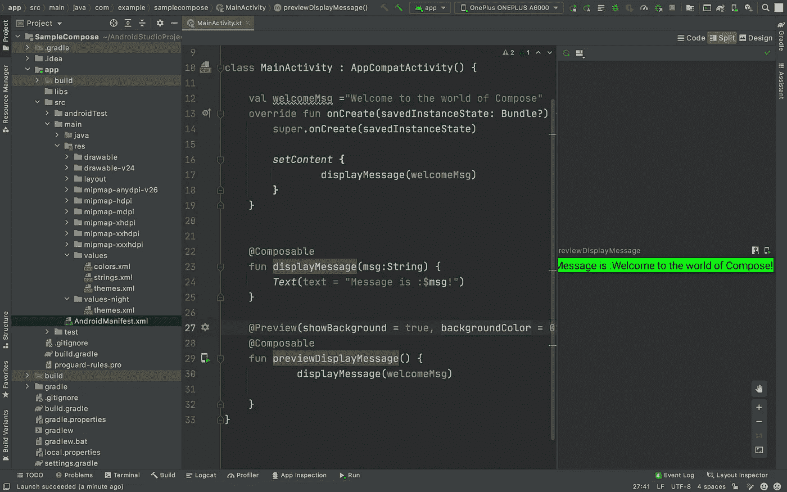
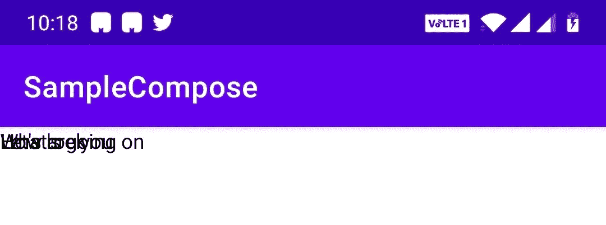
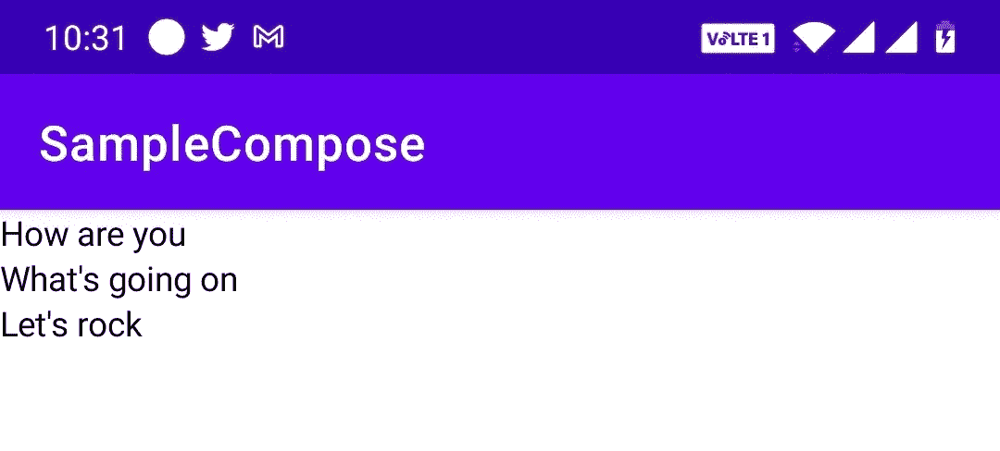
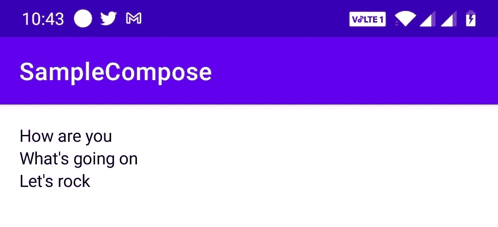

# Jetpack Compose 简介:Android 的未来 UI 工具包

> 原文：<https://betterprogramming.pub/jetpack-compose-androids-modern-toolkit-for-building-ui-82e67d384c26>

## 告别 XML 布局，采用现代技术


由 [Benjamin Sow](https://unsplash.com/@bensow?utm_source=medium&utm_medium=referral) 在 [Unsplash](https://unsplash.com?utm_source=medium&utm_medium=referral) 上拍摄的照片。

在 Android 中构建 UI 的传统和常见方式是使用基于 XML 的布局。然而，一旦稳定版本的 Jetpack Compose 发布，这将是一种老式的方式。

在本文中，我将提供 Jetpack Compose 的基本概述，以及我们如何使用它来代替 XML 布局来构建声明性 UI。

# 什么是 Jetpack Compose？

> “Jetpack Compose 是 Android 的现代声明式 UI 工具包，用于构建原生 UI。它简化并加速了 Android 上的 UI 开发。借助更少的代码、强大的工具和直观的 Kotlin APIs，快速实现您的应用。”— [安卓开发者](https://developer.android.com/jetpack/compose)

简单来说，Jetpack Compose 是一个简单的框架或组件或工具的集合，可以帮助我们在 Android 中用更少的时间构建优秀的应用程序。Jetpack Compose 使用更少的样板代码和 UI 状态与数据变化的同步使 UI 开发变得更容易。我们可以说 Jetpack Compose 是一个 UI 构建框架，它取代了基于 XML 的 UI 开发方法。它使得开发 UI 更快更容易。

谷歌在谷歌 I/O 2019 上推出了 Jetpack Compose，目前它有测试版，这意味着功能集开发已经完成，但他们仍在打磨和稳定东西。要体验使用 Jetpack Compose 进行开发，请下载 Android Studio 预览版的[最新金丝雀版本。](https://developer.android.com/studio/preview)

# 梯度构型

如果我们正在创建一个新项目，那么我们可以直接从可用的选项中选择“Empty Compose Activity”。这减少了 Gradle 设置用于合成的开销。否则，我们需要配置 Gradle 文件来支持 Jetpack Compose。让我们看看如何配置 Gradle 文件。

## 第一步

我们需要为项目配置 Kotlin。确保您在项目中使用的是 Kotlin 1.4.30 或更高版本。

在项目级`build.gradle`文件中，添加一个最低版本为 1.4.30 的 Kotlin 类路径:

```
classpath "org.jetbrains.kotlin:kotlin-gradle-plugin:1.4.30"
```

在应用级`build.gradle`文件中，添加 kotlin-android 插件:

```
plugins **{** id 'com.android.application'
    id 'kotlin-android'
**}**
```

## 第二步

在 app 级`build.gradle`文件中，将`minSdkVersion`设置为`21`或更高:

```
defaultConfig {
        ...
 **minSdkVersion 21**    }
```

接下来，在 app-level `build.gradle`文件中启用 Jetpack Compose 选项:

```
buildFeatures {
        // Enables Jetpack Compose for this module
 **compose true**    }
```

最后，在`composeOptions`中设置 Kotlin 编译器的版本:

```
composeOptions**{** kotlinCompilerExtensionVersion '1.0.0-beta01'
    kotlinCompilerVersion '1.4.30'
**}**
```

基本配置的 app 级`build.gradle`文件如下图:

## 第三步

让我们在应用程序级`build.gradle`文件中添加所需的 Jetpack 合成依赖项:

这些依赖项中的每一个都有独特的用途。请根据您的使用情况添加所需的依赖项。

既然我们已经完成了 Gradle 的设置，让我们转到代码部分。

# Jetpack 撰写基础

让我们通过构建具有声明性功能的基本 UI 组件来尝试一下 Jetpack Compose。Jetpack Compose 的主要概念是不再使用基于 XML 的 UI 创建，而是使用 Compose 函数。

## 可组合函数

可组合函数定义了应用程序的用户界面。可组合函数是将应用程序数据转换为 UI 层次结构的普通函数。用`@Composable`标注的函数被视为可组合函数。一个可组合函数只能从另一个可组合函数中调用。

```
**@Composable** fun displayMessage() {
    Text (text = "Hello World of Compose!")
}
```

## 例子

让我们用 Compose 创建一个示例活动来显示一条消息:

`setContent`将给定的可组合件组合成给定的活动。内容将成为给定活动的根视图。这或多或少相当于用`ComposeView`调用`setContentView`。

当您运行并在屏幕上看到只有一行代码的文本输出时，奇迹就发生了。

现在让我们看看如何将它分解成一个独立的可组合函数:

## 使用 Jetpack Compose 预览

在不运行应用程序的情况下，我们可以通过使用注释`@Preview`来预览 Jetpack Compose 或 composable 函数的变化。`preview`可组合函数不能带任何参数。由于存在限制，我们不能用`preview`注释来注释上面的`displayMessage`方法，因为它是参数化的。所以在这种情况下，我们可以创建一个带有`preview`注释的中间函数，并从中调用`displayMessage`方法。

当我们重新构建项目时，我们可以在右上角看到三个选项卡(类似于我们开发布局时的视图)。`preview`注释只是为了预览变化。或者，我们可以设置参数，在不运行应用程序的情况下查看更改。



## 用 Jetpack 定义保存视图的容器

我们已经看到了如何放大单一视图。现在让我们定义一个包含一组视图的可组合函数。在 Compose 中，我们可以通过从其他可组合函数调用可组合函数来构建 UI 层次结构。

让我们创建一个新的活动并检查:

输出如下所示:



这三个文本相互重叠，因为我们没有在内容视图中指定任何与它们的排列相关的内容。我们可以使用不同的概念来排列这些项目:

*   `Row` —以水平方式对齐元素。
*   `Column` —以垂直方式对齐元素。

## 圆柱

在 Jetpack Compose 中，`Column`是一个让我们垂直排列元素的函数。现在让我们给`newStory`方法添加一个`Column`并检查输出:



排列在左上方，因为我们没有指定任何其他属性。

现在让我们为该列添加样式设置。添加`Modifier.padding`，从内容视图中插入列。

在`Newstory`方法的中添加`Modifier.padding` ，从内容视图中排列填充:



## 在列中添加图像

只需添加对`Image()`的调用，将图形放入`Column`:

这将在文本上添加一个图像。我们还可以通过向调用`Image()`传递一个大小`Modifier`来设置图形的样式。

> 注意:仅支持`VectorDrawables`和栅格化资产类型(如 PNG、JPG)。如果您使用任何其他类型，应用程序将由于`IllegalArgumentException`而崩溃。

# 摘要

Jetpack Compose 取代了传统的 UI 开发方法，可以减少工作量和样板代码，并保持 UI 与数据变化的同步，等等。这是一种新的构建 UI 的声明方式。

这篇文章只是一个介绍。我们将在接下来的文章中看到更多与 Jetpack Compose 相关的概念。

感谢阅读！

*注意:Jetpack 目前处于测试版，这意味着事情几乎是稳定的。我们可以开始构建东西，但实际上并不计划发布它们，因为我们需要等待一个稳定的版本，计划在今年的某个时候发布。*