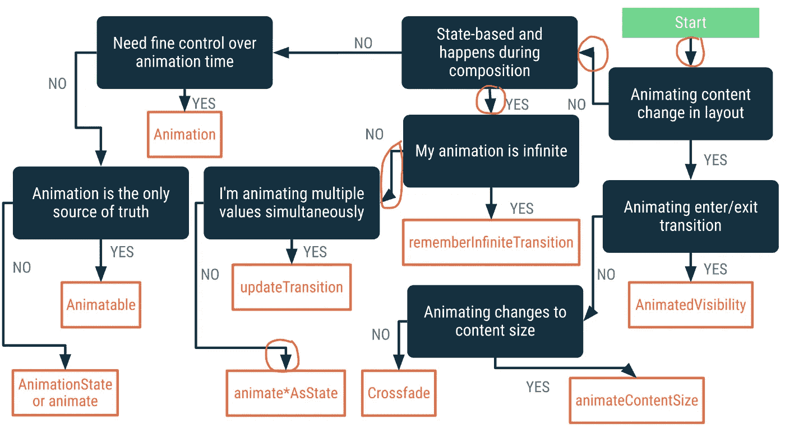
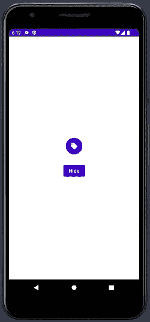
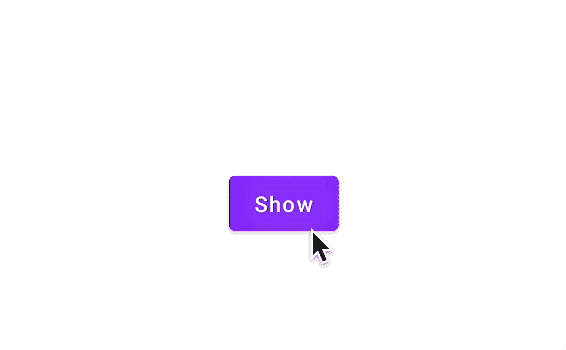
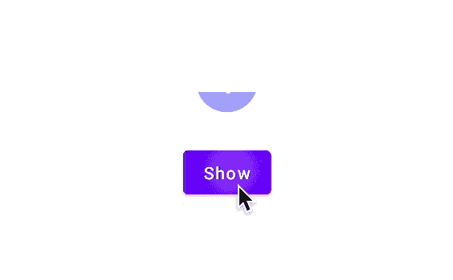
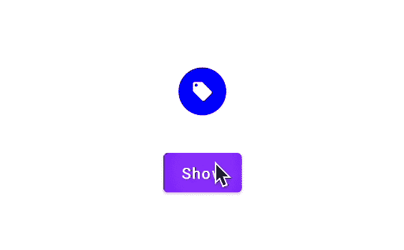
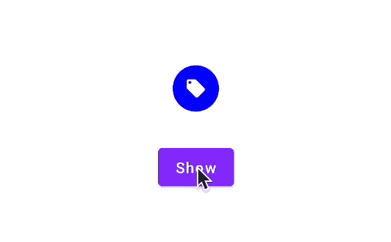

# 探索 Compose 中的动画可视性

> 原文：<https://betterprogramming.pub/jetpack-compose-animation-notes-1-30f130189159>

## 喷气背包撰写-动画说明:01


[粘土堤](https://unsplash.com/@claybanks?utm_source=medium&utm_medium=referral)在[防溅板](https://unsplash.com?utm_source=medium&utm_medium=referral)上拍照

Jetpack Compose 是构建 android 应用程序 UI 的革命性更新。它利用了声明式 UI 的概念，并带来了用 Kotlin 构建 UI 的乐趣——这是许多 Android 开发人员的梦想。如果您不熟悉 Jetpack Compose，我建议您阅读以下文章:

*   [喷气背包构成组件(第一部分)](/jetpack-compose-components-part-1-a80717dbfb59)
*   [在 JetPack Compose 中构建 Android 布局](/build-android-layouts-in-jetpack-compose-bda2e0837f5e)

话虽如此，我们还是开始吧。

# Compose 中动画介绍

作为对 Compose 中动画的介绍，android 团队提供了一个树形图来选择在哪里使用哪些 API。看一看:



来源:[https://developer.android.com/jetpack/compose/animation](https://developer.android.com/jetpack/compose/animation)

我在这篇文章中的意图是当可见性发生变化时，动画化可组合组件。

# 简单的可组合设计

让我们从创建一个简单的可组合图标开始，我们将有一个简单的圆形图标，使用`Box` & `Icon`可组合和一个简单的`Button`来设计。看一看:

看一下预览:



# 没有动画的可见性变化

为此，我们需要向`VisibilityAnimationSample` composable 添加几个参数。

1.  `show`:决定可见性的布尔值。
2.  `updateVisibility` : Kotlin 函数更新可见性。

看一看:

```
@Composable
fun VisibilityAnimationSample(
    **show : Boolean,
    updateVisibility : () -> Unit**
){

      ...}
```

看看参数的用法来显示/隐藏图标&更新按钮的显示文本并触发按钮上的`**updateVisibility**` 点击，看看:

从主可组合函数中触发`VisibilityAnimationSample`:

看一下输出:



没有动画的可见性变化

# 救援的动态可见性

AnimatedVisibility 是`ColumnScope`上的扩展函数，看看函数签名:

*   `visible`:决定内容是显示还是隐藏。
*   `modifier`:修改布局以包含创建的内容。
*   `enter`:在屏幕上呈现可组合内容时使用的动画。
*   `exit`:隐藏可组合的动画。
*   `content`:出现和消失的可组合物。

回到我们的用例，我们可以用`AnimatedVisibility`代替 if 语句来显示或隐藏图标，看看:

仅用一行改变，我们就在可见性改变上添加了渐强的垂直扩展和渐弱的垂直收缩动画。看一看:



可见性通过动画可见性随默认动画而变化

# 自定义动画

## 更改默认动画

AnimatedVisibility compose 可以灵活地使用各自的参数更改默认的`enter`和`exit`动画。例如，如果我们想将默认动画更改为放大和缩小，我们只需在函数调用中传递它们。看一看:

```
AnimatedVisibility(
    visible = show,
    **enter = *scaleIn*(),
    exit = *scaleOut*()**
){ ...}
```

看一下输出:


可见性随着放大和缩小动画而变化

## 动画持续时间

我们也可以通过`animationSpec`参数自定义动画的持续时间。这里我们用补间`animationspec`来决定时长。看一看:

看一下输出:



自定义时长的动画

## 更多定制

除了`durationMillis`之外，`***tween***` `animationSpec`还有一个参数叫做`easing`。它用于缓和将用于在起点和终点之间插值的曲线。我们可以添加一些副作用，比如现有转场的弹跳，请看:

而`toEasing`是我们添加到`TimeInterpolator`动画中的一个扩展函数，将它转换成`*Easing*` *。*看一看:

```
fun TimeInterpolator.toEasing() = *Easing* **{** x **->** getInterpolation(x) 
**}**
```

看一下输出:



带弹跳效果的动画

# 结束注释

仅此而已，我们已经在短短 10 行代码中添加了多个自定义时长和副作用的动画。[请点击此处查看完整代码](https://gist.github.com/SG-K/0e9dddb8d0e8a9afd0c794ed5dd124de)。动画是一个有趣的话题，可以在 Jetpack Compose 中探索，为 UI 带来更流畅的特性。请继续关注 Jetpack Compose 中关于动画的更多文章。

# 更新

## 2022 年 9 月 2 日

构建 Fab 菜单，具有合成动画可视性和动画效果:

[](https://sgkantamani.medium.com/jetpack-compose-animation-notes-2-aef3428af6a6) [## Jetpack 撰写-动画注释:2

### 构建 Fab 菜单，具有合成动画可视性和动画效果

sgkantamani.medium.com](https://sgkantamani.medium.com/jetpack-compose-animation-notes-2-aef3428af6a6) 

## 2022 年 9 月 21 日

[](/exploring-launchedeffect-and-infinitetransition-in-jetpack-compose-5a82ba948a15) [## 探索 Jetpack 合成中的 LaunchedEffect 和 InfiniteTransition

### Jetpack 撰写-动画注释

better 编程. pub](/exploring-launchedeffect-and-infinitetransition-in-jetpack-compose-5a82ba948a15) 

# 奖金

[](/matured-constraint-layout-in-jetpack-compose-86665a974683) [## Jetpack 合成中的成熟约束布局

### 与我一起在 Jetpack 中开发

better 编程. pub](/matured-constraint-layout-in-jetpack-compose-86665a974683) 

就这些了，希望你能学到一些有用的东西，感谢阅读。