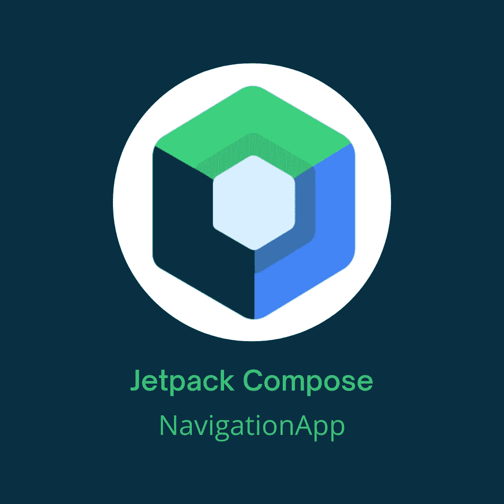

# Jetpack 撰写干净的导航

> 原文：<https://betterprogramming.pub/jetpack-compose-clean-navigation-94b386f7a076>

## 在 Jetpack Compose 中实现干净导航



本图中使用的 Jetpack Compose 徽标是由 Google 创建的官方徽标

Android 世界的每个人都知道 Jetpack Compose 中的导航并不是它最闪亮的一面。执行导航需要传递大量的`callbacks`和`navControllers`，如果在发送参数之前需要做一些业务逻辑呢？代码变得相当混乱。

关于如何实现导航有很多讨论，[一个很棒的库也有](https://github.com/raamcosta/compose-destinations)。请随意查看，为拉斐尔·科斯塔创造了这样的东西而欢呼吧。

但是如果你不想依赖别人，或者你公司的政策是不使用外部库，那该怎么办呢？导航是应用程序中最重要的事情之一。你不能依赖别人，即使那个图书馆是全天候维护的。你需要创造一个有效的解决方案。在讨论我的干净解决方案之前，让我们深入问题，这样我们就能 100%理解我们在这里做什么。

# 问题简介

当前最常见的导航实现如下:

你超过了兰姆达斯，就这样。第二个选择是你通过`navController`而不是 lambdas。这两种解决方案看起来都没那么好。如果屏幕足够复杂，它可能有太多的回调。你的代码变得混乱不堪。也许你关于路由的逻辑不是这样硬编码的，但是你得到了问题的关键。

如果你需要做一些业务逻辑，比如计算一些东西，计算的结果是下一屏的一个参数怎么办？您需要调用`ViewModel`来完成业务逻辑(`View`不应该这么做)，观察结果，然后调用回调。在`Screen`和`ViewModel`之间前后移动太多。

让我们试着解决所有这些问题，让它变得更干净一点。

# Jetpack 撰写干净的导航

我的解决方案的想法是有一个自定义导航器，将提供给每一个`ViewModel`。通过调用导航器的功能，我们可以导航到不同的屏幕。所有导航事件都收集在`MainScreen`中，这样我们就不需要向其他屏幕传递回调或`navController`。一旦我们仔细阅读代码，就会更清楚了。

首先，让我们为路由创建一个特殊的类:

`Destination`有一个带两个参数的构造函数。第一个是基本路由，第二个是该路由的参数。每个`Destination`会有`route`和`fullRoute`。`route`是没有参数的基本路线，将使用该路线创建带有参数名称的`fullRoute`或带有参数值的`fullRoute`。

调用`Destination`将返回它的路由。`appendParams`函数将只是向路线添加参数，并返回带有参数值的`fullRoute`。

接下来是添加一些我们将要使用的导航组件。

`NavHost`与`androidx.navigation.compose`中的相同，唯一不同的是`startDestination`参数属于`Destination`类型。

同样的事情，用`composable`代替`route: String`，我们有`destination: Destination`。

现在让我们实现自定义导航器。代码如下:

`AppNavigator`有`navigationChannel`将被收集在`MainScreen`中，它有四个导航功能。包含所有可能发生的导航意图。你可以在这里添加更多的链接，例如，一个深层链接或类似的东西。`navController`函数需要每个`NavigationIntent`的参数。

`AppNavigator`的实现非常简单。只是将`NavigationIntents`发送给`navigationChannel`。

这里有一个小提示，我使用`Dagger-Hilt`作为阿迪框架。随意使用任何 DI 框架。

现在让我们来实现`MainScreen`:

在`MainScreen`中，我们使用自定义的`NavHost`和`composable`。我们记得从`MainViewModel`传到`NavigationEffects`的`navController`，以及从`MainViewModel`传来的`navigationChannel`。`NavigationEffects`只需收集`navigationChannel`并导航至所需屏幕。正如你所看到的，它更干净，我们不必通过任何回调或`navController`。

`MainViewModel`简单。正在从`AppNavigator`获取`navigationChannel`。

剩下唯一要展示的是我们如何调用导航器函数。我们来看一下`HomeViewModel`的例子。

`HomeScreen`将调用相应的函数，在`HomeViewModel`中，我们只调用`AppNavigator`函数，并作为路由的参数调用`Destination`。

查看`UsersViewModel`以查看向后导航和向路线传递参数的示例。

就是这样！

# 结论

我认为仍有改进的空间，但这可能是一个好的起点。这使得我们的代码更加干净，不需要在屏幕上收集来自`ViewModel`的副作用来导航。

我们可以争论是否应该从`ViewModel`开始导航，但我认为应该这样。`View`应该是“愚蠢的”，只显示数据。我们在点击上做什么，应该由`ViewModel`负责。

你可以在我的 GitHub repo 中找到所有的源代码。

```
**Want to Connect?**[GitHub](https://github.com/Giga99)
[LinkedIn](https://www.linkedin.com/in/igor-stevanovic/) [Twitter](https://twitter.com/igor_s1999)
[Portfolio website](https://giga99.github.io/portfolio-website/)
```

如果您想了解更多关于 Jetpack Compose 的信息，请阅读以下文章:

*   [在 Jetpack Compose 中执行底板](/implement-bottom-sheet-in-jetpack-compose-d6472e8eaf2e)
*   [在 Jetpack Compose 中实现水平和垂直 view pager](/implement-horizontal-and-vertical-viewpager-in-jetpack-compose-a7a91f2ac746)
*   [使用 CameraX 在 Jetpack Compose 中构建一个相机 Android 应用](https://medium.com/better-programming/build-a-camera-android-app-in-jetpack-compose-using-camerax-4d5dfbfbe8ec)

此外，通过阅读本文，您可以了解如何使用拦截器在请求中包含访问令牌:

[](/android-access-token-logic-with-retrofit-okhttp-interceptors-740ea48547a0) [## Android 访问令牌逻辑和改进的 OkHttp 拦截器

### 使用 OkHttp 拦截器的访问令牌头逻辑

better 编程. pub](/android-access-token-logic-with-retrofit-okhttp-interceptors-740ea48547a0)