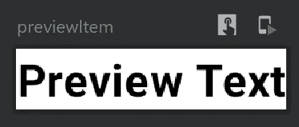
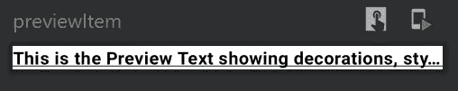
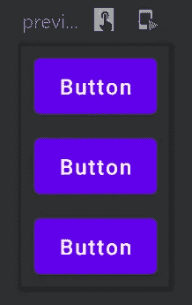
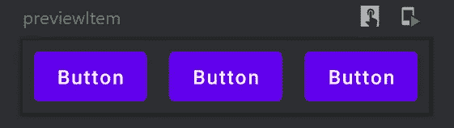
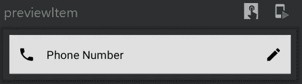
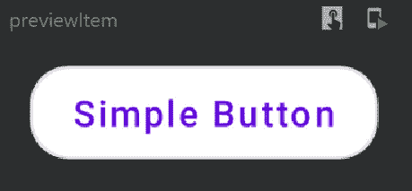
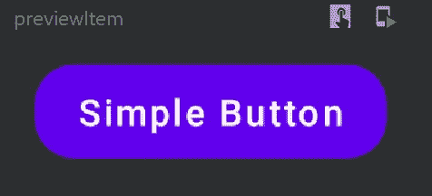
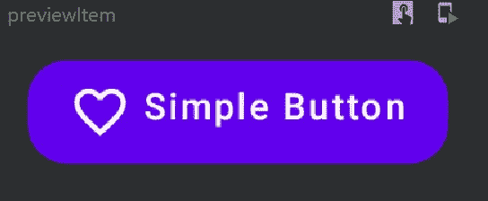

# Jetpack 合成组件(第 1 部分)

> 原文：<https://betterprogramming.pub/jetpack-compose-components-part-1-a80717dbfb59>

## 可组合功能、文本、版式、行、列、输入文本和按钮


作者照片。

这是探索 Jetpack Compose 组件系列文章的第一部分。本系列的主要目标是了解 Jetpack Compose UI 的标准构建块，从基础开始，到更高级的内容。

所以系好安全带！前面的路还很长。

# 介绍

在开始学习 Jetpack Compose 之前，了解它的起源很重要。它是 Jetpack 库的一部分。什么是 Jetpack？我认为这是开始学习 Jetpack Compose 的正确地方。

## 什么是 Jetpack？

Android Jetpack 是一套 Android 软件库和架构组件，旨在帮助我们构建具有顶级性能和最小实现的可扩展应用。

Jetpack 家族中一些最流行和最有用的库是[工作管理器](https://medium.com/swlh/workmanager-basics-how-to-use-workmanager-with-rxjava2-kotlin-coroutines-c2a317197038)、[分页 3](https://medium.com/android-dev-hacks/exploring-paging3-part-1-653dc537a69a) 、[房间](https://medium.com/mindorks/android-room-persistence-library-with-rxjava2-and-lesser-known-features-of-room-database-8b968261f9f0)、[导航](https://medium.com/better-programming/jitpack-navigation-component-in-android-944165c35f54)、 [CameraX](https://proandroiddev.com/exploring-the-new-camerax-library-in-android-ed10e64a5b3b) 、[视图绑定](https://medium.com/better-programming/everything-you-should-know-about-viewbinding-in-android-52552af9e8ba)等等。有几个有趣的处于 alpha 和 beta 状态的库，比如 [DataStore](https://medium.com/better-programming/jetpack-datastore-improved-data-storage-system-adec129b6e48) 、 [Hilt、](https://medium.com/better-programming/hilt-a-new-dependency-injection-library-for-android-e6e00e719aeb)和 [AppStartup](https://medium.com/better-programming/app-startup-new-architecture-component-d115b062a701) 。

Jetpack Compose 从 Jetpack 套件中的其他库中脱颖而出。自从开发版本以来，它已经得到了全世界 Android 开发者的大肆宣传。其成功背后的一个潜在原因是，与过去十年相比，它如何改变了我们构建 UI 的方式。现在，让我们看看什么是 Jetpack Compose。

## 什么是 Jetpack Compose？

Jetpack Compose 是谷歌最近试图让 Android 开发者轻松构建 UI 的尝试之一。最近，Google 将 Jetpack Compose 从开发阶段转移到了 alpha 阶段。尽管它仍处于早期阶段，但我看到了以一种我从未在 Android 平台上做过的方式构建高级 UI 和动画的巨大潜力。

> “Jetpack Compose 是一个用于构建原生 Android UI 的现代工具包。Jetpack Compose 以更少的代码、强大的工具和直观的 Kotlin APIs 简化并加速了 Android 上的 UI 开发。”— [安卓开发者](https://developer.android.com/jetpack/compose/tutorial)

*注意:如果想在 Android Studio 中试验 Jetpack Compose，必须安装* [*最新金丝雀版本*](https://developer.android.com/studio/preview/index.html) *。*

# 切换到声明性用户界面

到目前为止，在 Android 开发中，我们已经使用几种布局设计了 XML 文件中的 UI，如相对布局、线性布局、框架布局、约束布局和运动布局。这种方法已经被证明足以交付生产级的高质量 Android 应用程序。

然而，构建 Android 应用程序 UI 的 XML 布局方法存在一些漏洞或缺点:

1.  我们需要使用两种不同的语言和格式来构建整个屏幕(活动)——kot Lin 和 XML。
2.  不必要的复杂化，比如将视图链接到类文件，总是拖累开发人员的生产力。
3.  用现在的方法很难实现材质设计的 Android 应用。

这些是我想到的一些缺点，但是如果深入研究，每个开发人员都会发现他们目前方法的困难。如果你有，请评论，这样我们可以互相学习。

使用 Jetpack Compose 的最大优势之一是开发人员可以使用他们喜欢的语言——kot Lin 来构建 UI。开发人员不再需要在语言和格式之间切换来构建 UI 和功能。

> “JetPack Compose 将反应式编程模型与 Kotlin 编程语言的简洁性和易用性结合起来。它是完全声明性的，这意味着您通过调用一系列将数据转换为 UI 层次结构的函数来描述您的 UI。”— [安卓开发者](https://codelabs.developers.google.com/codelabs/jetpack-compose-basics/)

由于函数在 Kotlin 中是一等公民，所以使用可组合函数来构建 UI 非常有意义。这种方法将提高开发人员的生产力，因为他们不需要在语言或链接视图之间切换。

# 综合

启用 Compose，并在应用级`build.gradle`文件中将 Java 和 Kotlin 编译器的目标设置为 Java 8:

然后，我们需要在应用程序级 gradle 文件的 Android 标签中添加一些组合选项，如`kotlinCompilerExtensionVersion`和`kotlinCompilerVersion`:

```
composeOptions **{
    kotlinCompilerExtensionVersion** compose_version
    **kotlinCompilerVersion** "1.4.0"
**}**
```

`compose_version`是在应用级 gradle 文件中声明的 gradle 变量。之后，我们需要一组 Jetpack 组合库来访问组合组件，如文本、按钮、复选框等等。

现在是时候探索 Jetpack Compose 的组件了。让我们从可组合的函数开始。

# 可组合函数

可组合函数是用`@Composable`标注的普通函数。

这使得您的函数能够调用其中的其他`@Composable`函数。你可以看到`showSimpleText`功能是如何标记为`@Composable`的。这个函数将产生一个 UI 层次结构:

```
[**@Composable**](http://twitter.com/Composable)
fun showSimpleText(){
  // Design UI here
}
```

可组合函数只能从其他可组合函数中调用。

# 文本

它是一个高级 UI 组件，显示文本并提供语义。这类似于传统方法中的`TextView`。现在，让我们看看它的基本实现:

```
[@Composable](http://twitter.com/Composable)
fun showSimpleText(){
  **Text**(text = "Simple")
}
```

这与传统方法有关，因为它将创建一个`Textview`并在其中显示“简单”的文本。要指定文本大小、字体粗细、字体系列等等，我们需要在 compose-material 库中使用`Typography`。

`Typography`是一个数据类，它将帮助开发人员在 Compose 应用程序中实现材料设计指南。它有一套`TextStyle`实现来使字体在整个应用程序中看起来统一。

让我们看看`Typography`和`Text`组件的简单用法:

类似地，我们可以指定文本大小和字体系列。看一看:



输出

我们还可以使用`textDecoration`来装饰文本，以应用下划线和划线样式，以及指定溢出类型和最大行数，如下所示:



输出

# 行和列

当谈到布局视图时，我们在传统方法中有标准组件，如相对、线性和约束布局。但是切换到 Jetpack Compose 可以让我们访问`Row`和`Column`。

如果你想以垂直堆叠的方式显示子组件的集合，我们可以使用`Column`。另一方面，如果我们必须以水平排列的顺序显示子组件的集合，我们也可以使用`Row`组件:



圆柱



排

此外，我们有一个名为`arrangement`的参数，通过它我们可以定义`Row`和`Column`视图的放置或对齐。乔·伯奇解释道:

> "`Arrangement.Begin`(默认值)-将子组件放置在靠近主轴起点的位置。
> 
> `Arrangement.End` —将子组件放置在靠近主轴末端的位置。
> 
> `Arrangement.Center` —将子组件放在靠近主轴中心的位置。
> 
> `Arrangement.SpaceEvenly` —放置子组件，使其沿主轴均匀分布，包括第一个子组件之前和最后一个子组件之后的任何自由空间。
> 
> `Arrangement.SpaceAround` —放置子组件，使其沿主轴均匀分布，包括第一个子组件之前和最后一个子组件之后的任何自由空间。每个子组件之间只有一半的空间。
> 
> `Arrangement.SpaceBetween` —放置子组件，使它们沿主轴均匀分布，在第一个子组件之前和最后一个子组件之后都没有任何自由空间。"

# 输入文本

这是一个用于接受用户输入的组合 UI 组件。这类似于传统方法中的`EditText`。现在，让我们看看它的基本实现:

当用户与该字段交互时,`label`文本显示在顶部，并且在用户键入文本之前会一直显示一个`placeholder`。我们还可以显示前导和尾随图标，并指定键盘选项，如电子邮件、密码、数字等。看一看:



输出

我们使用修饰符来指定一些 UI 事物，比如填充、背景、形状等等。在本系列的下一部分中，您将详细了解这一点。我们有几个输入文本样式来利用像`OutlinedTextField` 等强大的材质设计。

# 纽扣

这是一个用来显示按钮的组合 UI 组件。它与传统方法中的`Button`相似，但具有开箱即用的材料设计能力。现在，让我们看看它的基本实现:

我们可以快速实现像仰角和圆角形按钮这样的高级功能。看一看:

我们可以使用`onClick` lambda 来触发当用户点击这个`Button`时需要发生的功能。

我们也可以使用`OutlinedButton` 组件创建轮廓按钮。我们需要做的唯一改变是用`OutlinedButton`组件替换`Button`。看一看这两者:



大纲按钮



纽扣

在按钮中显示图标已经成为移动开发中的一项常见任务。开箱即用，我们可以使用`Icon`组件在按钮中显示资源图标。现在，您可以将这个组件视为显示资源图标的助手。在本系列的下一部分中，您将了解更多这方面的内容。



输出

*注意:由于 Jetpack Compose 目前还不是一个可用于生产的框架，我在这里介绍的组件可能会在以后的版本中有所变化。*

# 奖金

要了解有关 JetPack compose 的更多信息，请查看以下文章:

*   [“使用服务器驱动的用户界面构建 JetPack”](https://medium.com/android-dev-hacks/jetpack-compose-with-server-driven-ui-396a19f0a661)
*   [“在 JetPack Compose 中探索约束布局”](https://medium.com/android-dev-hacks/exploring-constraint-layout-in-jetpack-compose-67b82123c28b)

# 更新

我将在这里更新本系列下一部分的链接，以便在它们发布后让您随时了解最新情况:

*   [喷气背包组成部件(第二部分)](https://medium.com/better-programming/jetpack-compose-components-part-2-2b3eb135d294) : `Icon`、`Image`、`remember`、`Spacer`、`radio group`、装载器、`Switch`和`Checkbox`、`Slider`
*   [Jetpack Compose Components(第 3 部分](https://medium.com/better-programming/jetpack-compose-components-part-3-ce5ae661f3d6)):关于`Modifier`你需要知道的一切

目前就这些。希望你学到了有用的东西。感谢阅读。