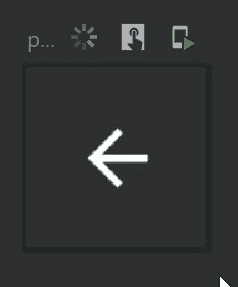
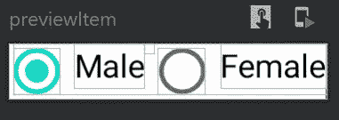
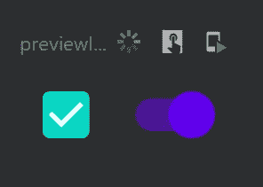
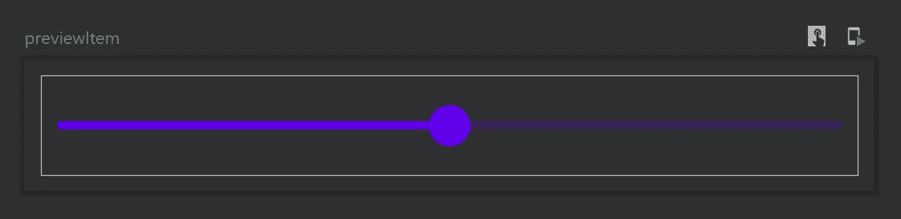
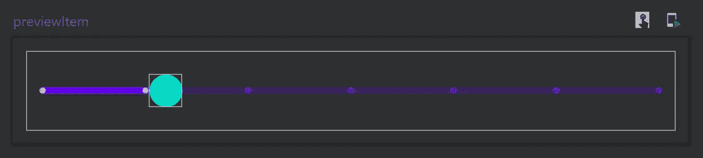

# Jetpack 合成组件(第 2 部分)

> 原文：<https://betterprogramming.pub/jetpack-compose-components-part-2-2b3eb135d294>

## 查看图标、图像、记忆、*间隔、*单选按钮、加载器、开关和复选框以及滑块


作者照片。

这是探索 Jetpack Compose 组件系列的第二部分。主要目标是了解 Jetpack Compose UI 的标准构建块，从基础开始，到更高级的组件。

*   [Jetpack Compose Components(Part 1](https://medium.com/better-programming/jetpack-compose-components-part-1-a80717dbfb59)):可组合功能、`Text`、`Typography`、`Row`、`Column`，输入文本，按钮
*   “Jetpack 合成组件(第二部分)”:**你在这里**
*   [喷气背包组件(第三部分](https://medium.com/better-programming/jetpack-compose-components-part-3-ce5ae661f3d6)):关于`Modifier`你需要知道的一切

由于我们在第 1 部分中完成了对 Jetpack Compose 的介绍和集成，所以我们将不再拖延，直接进入组件。

*注意:由于 Jetpack Compose 目前还不是一个可用于生产的框架，因此这里介绍的组件可能会在以后的版本中有所变化。*

# 核标准情报中心

我们将在本文中探索的第一个 Jetpack Compose 组件是 Icon。图标组件使用`tint`绘制资产。如果我们指定了`else`，默认应用`AmbientContentColor`。

首先，让我们看看可组合的`Icon`函数语法，以了解可用的参数。

*   `asset`是用于从 Compose UI 库中传递矢量资产的参数(也可以自定义)。
*   `modifier`是从父视图中取出修改器的参数，可选。如果没有为此参数传递值，它将创建一个新的修改器实例。
*   `tint`是另一个可选参数，用于传递图标应该出现的位置。默认情况下，它有`AmbientContentColor`。

现在我们已经熟悉了组件，让我们看看它在`IconButton`中的基本用法。看一看:



输出

# 图像

这是另一个 Jetpack Compose UI 组件，用于显示资源中的图像和图标。默认情况下，它根据给定的`imageAssset`的大小来绘制资源。我们还可以传递一个修饰符，通过它我们可以指定这个组件的大小。

首先，让我们看看可组合的`Image`函数语法，以了解可用的参数:

如果你观察清楚参数，你可以说唯一的强制参数是一个`asset`。默认情况下，每个其他参数都配置有一个材料设计主题，该主题显示了 JetPack Compose 组件和材料主题之间的互操作性。

*   `asset`:在 UI 上绘制的`ImageAsset`资源。
*   `modifier`:用于对齐图像布局和绘制装饰。
*   `alignment`:用于将`ImageAsset`对准指定的边界。
*   `contentScale`:用于确定宽高比缩放的缩放参数。
*   `alpha`:用于指定`ImageAsset`的不透明度。
*   `colorFilter`:当图像资源显示在屏幕上时，用于对图像资源应用滤镜。

现在我们已经熟悉了组件，让我们看看它的基本用法:


输出

# 纪念

在声明式 UI 系统中，代码本身描述了 UI。我们需要描述任何时间点的 UI——不仅仅是初始时间。为了更好地理解这一点，我们来看一个输入文本组件:

这个`TextField` 的问题是值不能改。这是因为我们只陈述了初始状态的值。这就是`remember`的用武之地:

```
var text by ***remember* {** *mutableStateOf*(TextFieldValue("")) **}**
```

该系列引入了一些新概念:

```
fun **<T>** **mutableStateOf**(
    value: T,
    policy: SnapshotMutationPolicy<T> = *structuralEqualityPolicy*()
): **MutableState<T>**
```

`mutableStateOf`获取一个类型，并将其转换为该类型的可变状态。当 value-property 更新时，它被重新安排来重新编译任何订阅的可组合函数。因此，当读取订阅的可组合函数时，该值将被更新。

输入字段的最终代码如下所示:

现在我们确定初始值和当`onValueChange`发生变化时要显示的值。`remember` 不是一个组件，但它有助于 Jetpack Compose 中的状态管理，这一点您将在本文后面看到。

# 逆电流器

间隔器是另一个 Jetpack Compose 组件，用于在其他组件之间创建空间。它只有一个参数:`Modifier`。我们可以指定要创建的空间量。首先，让我们看看语法:

```
@Composable
fun **Spacer**(modifier: Modifier)
```

它也很容易使用:

```
*Spacer*(**modifier** = **Modifier.*size*(4.*dp*)**)
```

# 单选按钮

与传统的`radio group`不同，在 Jetpack Compose 中没有现成的组件来显示`radio group`。我们需要使用行、文本和单选按钮的组合来创建一个。

`RadioButton`是一个用文本组件显示标签的显示单选按钮的 Jetpack Compose 组件。`RadioButton`总共有六个参数，但大多数时候我们只处理两个:

1.  `selected`是一个强制布尔参数，决定`RadioButton`的选择状态。
2.  `onClick`是一个 lambda，用于在选择和取消选择时触发功能。

现在，让我们构建一个包含男性和女性单选按钮的单选按钮组:



输出

# 装载机

开箱即用，Jetpack Compose 提供了两个加载器:`CircularProgressIndicator`和`LinearProgressIndicator` *。*

## 循环渐进指示器

这是一个不确定的循环进度指示器，表示没有确定起点或终点的连续进度。现在让我们看看`CircularProgressIndicator`的语法:

它有三个可选参数:

*   `modifier`是为了装饰和对齐的目的。
*   `color`是改变指示器的显示颜色。
*   `strokeWidth`是更新笔画宽度。

现在让我们创建一个简单的循环加载器:


输出

## 线性渐进指示器

这是一个不确定的线性进度指示器，表示没有确定起点或终点的连续进度。现在让我们看看`LinearProgressIndicator`的语法:

`modifier`和`color`参数的用途与`CircularProgressIndicator`的参数类似。`backgroundColor`表示指标的背景色，当进度尚未到达整体指标的该区域时可见。现在我们来看看`LinearProgressIndicator`的基本用法:

# 开关和复选框

开关是一种两种状态的可切换组件，它提供类似开/关的选项，而复选框组件代表两种状态(选中/未选中)。

开关和复选框都有`checked`参数来更新组件的开/关状态。在这里，我们使用带有`remember`的变量来一直动态维护状态。

现在让我们看看开关和复选框的基本用法:



输出

# 滑块

这是我们将在今天的文章中探索的最后一个 Jetpack Compose 组件。滑块反映了一条线上的一系列值，用户可以从中选择一个值。它们非常适合调整音量、亮度或应用图像滤镜等设置。它们类似于传统 UI 方法中的搜索栏。

现在让我们看看 Slider 的基本实现:



简单滑块

对于`Slider`函数，有一个名为`steps`的参数。我们可以传递一个大于`0`的整数值，指定在整个值范围内均匀分布的离散值的数量。如果是`0`，`Slider`将作为一个连续的滑块，从指定的范围内选择任意值。



带台阶的滑块

# 奖金

要了解有关 JetPack Compose 的更多信息，请查看以下文章:

*   [“Jetpack Compose——一种在 Android 中创建素材 UI 的简单新方法”](https://medium.com/better-programming/jetpack-compose-a-new-and-simple-way-to-create-material-ui-in-android-f49c6fcb448b)
*   [“使用服务器驱动的用户界面构建 JetPack”](https://medium.com/android-dev-hacks/jetpack-compose-with-server-driven-ui-396a19f0a661)
*   [“Jetpack Compose:如何构建消息应用”](https://medium.com/better-programming/jetpack-compose-how-to-build-a-messaging-app-e2cdc828c00f)

# 参考

[](https://github.com/Gurupreet/ComposeCookBook) [## guru preet/作曲烹饪书

### 所有 Jetpack 组成的 UI 元素，布局，部件和演示屏幕的集合，看看它的潜力。喷气背包…

github.com](https://github.com/Gurupreet/ComposeCookBook) 

目前就这些。希望你学到了有用的东西。感谢阅读。