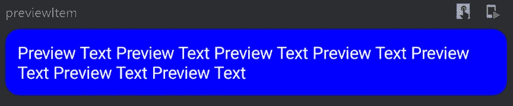
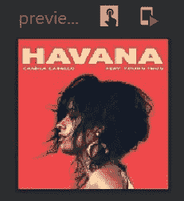
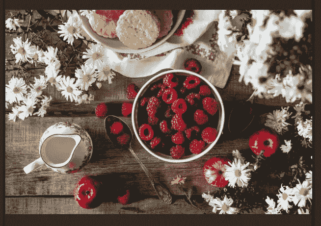

# Jetpack 组件(第 3 部分)

> 原文：<https://betterprogramming.pub/jetpack-compose-components-part-3-ce5ae661f3d6>

## 关于修改器你需要知道的一切


作者照片

这是探索 Jetpack Compose 组件系列文章的第三部分。本系列的主要目标是了解 Jetpack Compose UI 的标准构建块，从基础到高级。

*   [“Jetpack Compose Components(Part 1)](https://medium.com/better-programming/jetpack-compose-components-part-1-a80717dbfb59)”:可组合功能、`Text`、`Typography`、`Row`、`Column`、输入文本、按钮
*   [“喷气背包组成部件(第二部分)](https://medium.com/better-programming/jetpack-compose-components-part-2-2b3eb135d294)”:`Icon`、`Image`、`remember`、`Spacer`、`radio group`、装载机、`Switch`和`Checkbox`、`Slider`
*   “Jetpack 合成组件(第 3 部分)”:**你在这里**

正如我们在第 1 部分中完成了对 Jetpack Compose 的介绍和集成，在第 2 部分中完成了对基本 UI 组件的介绍和集成，今天我们将学习`Modifier`的重要性，以及如何使用它进行修饰、对齐等等。不要再拖延了，让我们开始吧。

# 修饰语

即使你对 Jetpack Compose 没有多少经验，遇到`Modifier`也是不可避免的。您可能不使用它，但是我确信您已经注意到`Modifier`是几乎每个标准 Compose 组件中的可选参数。

顾名思义，`Modifier`是一种修改组件的某些方面的方法，这些方面决定了它在屏幕上的显示方式。

`Modifier`的酷之处在于，我们可以使用一个单独的`Modifier`来装饰每个组件，或者我们可以链接一个单独的`Modifier`来应用于多个组件，这开辟了相对于其父组件对齐视图的可能性。

以下是我们在使用修改器合成组件时应用的一些调整:

*   更改可组合组件的外观和行为，如对齐、填充、背景颜色等
*   添加信息，如可访问性标签
*   处理用户输入
*   添加交互，例如使元素可点击、可滚动、可拖动或可缩放

让我们来看看添加填充的修饰符的简单用法:

```
**Column**(modifier = **Modifier.padding(100.dp)**) {
    Text("Hello")
}
```

> ”修改器的作用类似于基于视图的布局中的布局参数。但是，因为修饰符是特定于范围的，所以它们提供了类型安全，并且还帮助您发现和理解什么是可用的和适用于特定布局的。对于 XML 布局，有时很难确定特定的布局属性是否适用于给定的视图。”
> 
> —安卓开发者

在核心层，`Modifier`是一个功能有限的接口，所以它没有太多有用的特性。`Modifier`的主要优势，或者说最常用的功能，来自预定义的扩展。

几个 Compose 库包含必要的`Modifier`扩展，比如`height`、`width`、`size`、`padding`、`backgroundColor`、`fillMaxSize`等等。你可以在这里找到`Modifier` 扩展的完整列表以及相应的编译库[。对于本文的其余部分，我们将重点关注能够帮助我们实现基本功能的`Modifier`扩展函数。](https://developer.android.com/reference/kotlin/androidx/compose/ui/Modifier)

# 尺寸修改器

定义组件的大小是我们能做的最基本的任务之一；在 Jetpack Compose 中，我们可以使用几个`Modifier`函数，比如`width`、`height`、`size`、`preferredSize`、`preferredSizeIn`、`fillMaxSize`等等。

现在让我们看看它们的用法:

## 宽度、高度和大小

这是三个不同的修饰符扩展函数，用于声明组件的宽度、高度和宽度-高度组合。让我们看看这些函数的基本用法:

## 首选宽度、首选高度和首选尺寸

当您想要为组件设置一系列最小和最大大小限制时，这些扩展函数将会派上用场。

`preferredWidthIn`和`preferredHeightIn`有两个可选参数 s— `min`和`max`。这些参数的默认值是`Dp.Unspecified.`，当你传递这两个值时，它将分别约束组件的宽度和高度，在`min.dp`和`max.dp`之间。

另一方面，`preferredSizeIn`是`preferredWidthIn`和`preferredHeightIn`函数的组合。它采用高度和宽度的`min`和`max`值，并在它们之间约束组件。这将减少调用两个函数的样板代码。看一下用法:

## fillMaxWidth、fillMaxHeight 和 fillMaxSize

这些选项类似于传统方法中的`fill_parent`和`match_parent`。组件宽度、高度和两者都将被设置为可用的最大值。看一下用法:

# 背景修改器

我们可以应用组件的背景颜色和形状。后台扩展函数有两个参数— `color`和`shape`。

*   `color` —用于绘制背景的颜色
*   `shape` —所需的背景形状(`RectangleShape`、`RoundedCornerShape`等)

让我们看看基本用法:



输出

# 填充修改器

大小之后的下一个明显的任务是确定适当的填充，使它看起来有吸引力。

我们有多个填充修改器来调整`left`、`top`、`right`和`bottom`填充，以实现这一点。

或者，我们可以传递一个填充值，它将应用于组件的所有边。看看基本用法:

我们可以针对其他选项对组件应用填充，如`background` —请看:

# 长宽比修改器

基于纵横比创建组件(主要是图像)已经成为标准实践。在构建 UI 的传统方法中，只有在编程方法中才能创建长宽比视图。然后是一个具有内置纵横比的受限布局。

Jetpack Compose 继承了带有修改器的内置纵横比方法，使得创建基于纵横比的合成组件比以往任何时候都更容易。看一下用法:

```
@Composable
fun modifierAspectRatioDemo(){
    *Column* **{** *Image*(
            asset = *imageResource*(R.drawable.*camelia*),
            **modifier = Modifier.*aspectRatio*(ratio = 1f)**
        )

        *Image*(
            asset = *imageResource*(R.drawable.*food3*),
            **modifier = Modifier.*aspectRatio*(ratio = 0.56f)**
        )
    **}** }
```



# 事件修改器

关于 Jetpack Compose 最好的事情之一是，实现复杂的特性，如`clickable`、`scrollable`、`draggable`或`zoomable`，只需花费相对较少的精力。

## 可点击的

`clickable`是`Modifier`上的扩展函数，实现点击事件。但是它不仅仅实现点击功能。我们也可以只用两行代码实现`onLongClick`和`onDoubleClick`功能。看看基本用法:

```
Image(
    asset = imageResource(R.drawable.food3),
    modifier = Modifier.**clickable**(
        **onClick** = { },
        **onLongClick** = { },
        **onDoubleClick** = { }
    )
)
```

类似地，我们可以通过`scrollable`、`draggable`和`zoomable`、*、*组合功能，在组合组件上启用滚动、拖动和缩放等功能。

# 修改器上的自定义扩展

到目前为止，我们已经看到了许多有用的扩展函数，它们是在各种 Compose 库中预定义的。但是我们也可以根据我们的需求创建我们的扩展。

我开始创建`Modifier`扩展的情况之一是当我想要应用垂直和水平渐变背景时。看一看:

有了这些扩展，当我想应用渐变背景时，不用写所有代码，我只需使用`horizontalGradientBackground`和`verticalGradientBackground`，从而绕过一长串颜色。

# 奖金

要了解关于 JetPack Compose 的更多信息，请查看以下文章。

*   [“Jetpack Compose——一种在 Android 中创建素材 UI 的简单新方法”](https://medium.com/better-programming/jetpack-compose-a-new-and-simple-way-to-create-material-ui-in-android-f49c6fcb448b)
*   [“JetPack 与服务器驱动的 UI 结合”](https://medium.com/android-dev-hacks/jetpack-compose-with-server-driven-ui-396a19f0a661)
*   [“Jetpack Compose:如何构建消息应用”](https://medium.com/better-programming/jetpack-compose-how-to-build-a-messaging-app-e2cdc828c00f)

# 参考

[](https://github.com/Gurupreet/ComposeCookBook) [## guru preet/作曲烹饪书

### 所有 Jetpack 组成的 UI 元素，布局，部件和演示屏幕的集合，看看它的潜力。喷气背包…

github.com](https://github.com/Gurupreet/ComposeCookBook) 

目前就这些，希望你学到了有用的东西。感谢阅读。