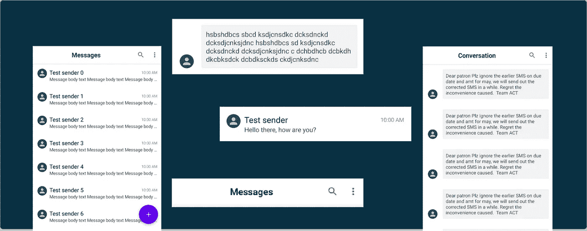
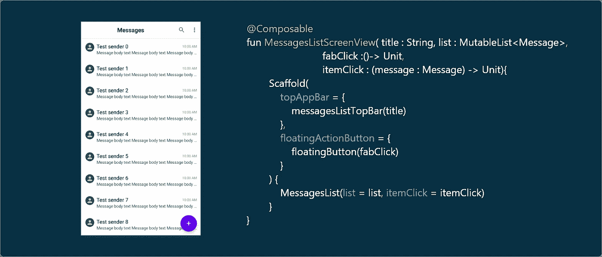
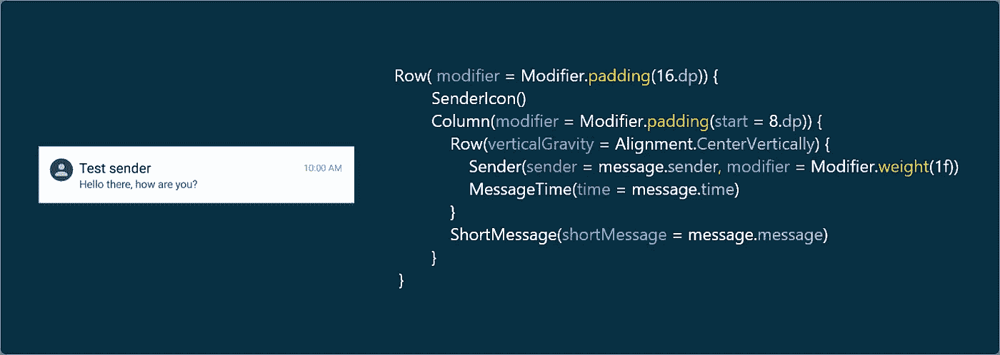
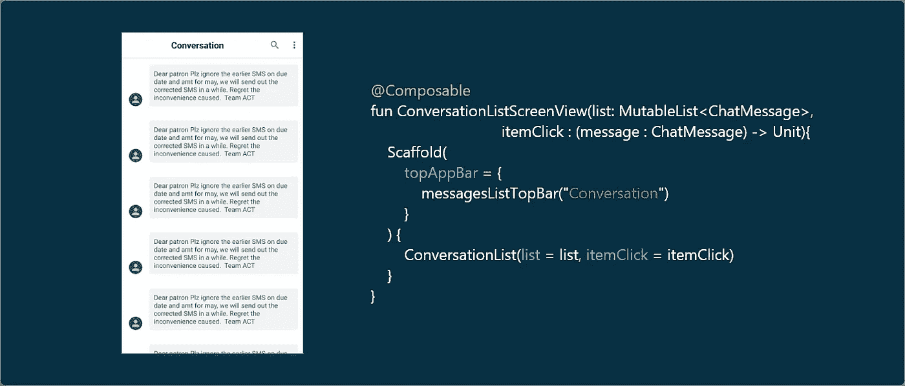

# Jetpack Compose:如何构建消息应用程序

> 原文：<https://betterprogramming.pub/jetpack-compose-how-to-build-a-messaging-app-e2cdc828c00f>

## 了解如何创建没有任何 XML 文件的用户界面

图片来源:作者

# 介绍

> “Jetpack Compose 是一个用于构建原生 Android UI 的现代工具包。Jetpack Compose 以更少的代码、强大的工具和直观的 Kotlin APIs 简化并加速了 Android 上的 UI 开发。— [安卓开发者](https://developer.android.com/jetpack/compose/tutorial)

自从我们上次讨论 Jetpack Compose 以来，已经有了一些有趣的发展。4 月 29 日发布了 Compose 0.1.0-dev010 和 Compose UI 0.1.0-dev10。由于它们仍处于开发阶段，很难理解错误，所以请确保您使用的是最新版本，以获得流畅的体验。

在我过去的两篇关于 Compose 的文章中，我主要关注基础知识和 Compose 是如何发展的。在本文中，我们将使用 Kotlin 和 Compose 构建一个消息应用程序，通过它我们将学习如何使用像`adapterview`、`image`、`Modifiers`等组件。

接下来，我假设您熟悉 Jetpack Compose 的基础知识。如果没有，参考[这篇文章](https://medium.com/better-programming/jetpack-compose-a-new-and-simple-way-to-create-material-ui-in-android-f49c6fcb448b)。

# 我们想要建立什么？

作为 Android 用户和开发者，我们非常熟悉原生消息应用。在本文中，我们将探讨如何使用 Jetpack Compose 构建聊天列表屏幕和对话屏幕。为了清楚起见，请看以下内容。

# 应用模型

在我们开始构建 ui 之前，让我们先来看看消息和对话列表的模型类:分别是 `Message`和`ChatMessage`。两者都是数据类。看一看:

应用模型

# 主屏幕

在主屏幕上，我们有一个带有标题的顶栏和两个可操作的菜单项:搜索和更多选项。然后我们有消息列表，最后是 FAB 图标。请参见下图，鸟瞰一下设计主屏幕的 Compose UI。

在顶层为主屏幕编写用户界面

现在，我们来看一下每一部分。

# 顶栏和 FAB 设计

## 脚手架

脚手架实现了基本的材料设计视觉布局结构。该组件提供了 API，通过确保适当的布局策略将 UI 组件结合在一起。

## TopAppBar

`topAppBar`是脚手架中的一个参数，用来显示屏幕的一个顶栏。对于这个参数，我们必须传递一个可组合的函数`messagesListTopBar`，它具有实际的 topbar 设计。

消息列表顶部栏撰写功能

`TopAppBar`是一个 UI 组件，显示与当前屏幕相关的信息，比如标题、动作、搜索和更多选项。它被放置在屏幕的顶部。

在这里，我们使用了`tex` t 组件来显示`TopAppBar`的标题，然后使用它的组件来样式化它。`actions`是`TopAppBar`中的另一个参数，用于显示可操作的项目。最后我们为`TopAppBar`设置背景色。

## 修饰语

`Modifier`默认为空伴随对象。我们可以使用`Modifier`为视图设置动画、填充和其他样式相关的东西。

## 浮动操作按钮

使用`FloatingActionButton` UI 组件，我们可以很容易地在 UI 中实现 FAB 按钮。使用`onclick`和`icon`参数，我们可以为 FAB 按钮设置点击监听器和可绘制资产。看一看:

这里我们使用了高阶函数来调用 FAB 和 messages 项目点击。要了解更多关于 Kotlin 中高阶函数的特性，请参考本文。

# 邮件列表项目

在消息项中，我们有三个文本，分别表示发送者姓名、消息截图描述和接收时间。所有这三个视图都是使用`Text UI`组件设计的。然后我们有发送者图标，它是使用`Icon` UI 组件设计的。将这些部分集合在一起，我们将有一个可组合的函数，如下所示:

撰写邮件列表项的用户界面

让我们从发件人图标开始，一个一个地研究它们。

邮件列表项中发件人图标的代码

发送者图标是使用`Icon`组件设计的，该组件使用`tint`绘制`asset`。它有三个参数:

*   `asset`:我们可以使用这个属性给图标分配一个矢量资产。
*   `modifier`:用于填充等装饰目的
*   `tint`:图标颜色代码

发件人姓名代码

为了显示发送者姓名，我们使用了`Text` UI 组件。`style`是`text`中用来修饰它的属性，类似于 XML 设计中的`style`属性。然后我们有典型的属性，像`overflow`、`maxlines`，还有更多处理 UI 的东西。

消息列表项的时间和简短描述也是使用具有相同属性的`Text` UI 组件实现的。更多细节参见 [GitHub 样本](https://github.com/SG-K/JetPackComposeMessagesApp)(主分支)。

# 消息列表

现在，是时候设计列表了。`AdapterList`是 Compose 中用于设计列表的新 UI 组件。它有三个参数:

*   `data`:要显示的项目列表。
*   `modifier`:造型配套对象
*   `ItemCallback`:点击列表项实现。

设计消息列表的适配器列表

至此，我们已经使用 Jetpack Compose 构建了整个 messages 应用程序主屏幕。下一步是设计对话屏幕。

# 对话屏幕

构建对话屏幕类似于构建主屏幕。我们可以通过改变标题来重用消息列表中的组件，如`TopAppBar`。来到对话列表，我们必须使用相同的`adapterlist`。唯一的变化是对话列表项的设计。

撰写对话屏幕的用户界面

# 聊天消息列表项目

在聊天消息列表项中，我们有一个类似于消息列表项的发送者图标，因此我们可以重用`SenderIcon`可组合函数。我们可以从聊天消息项目中学到的新东西是如何创建一个自定义颜色和圆角半径的背景。

在顶层，我们有一个可点击的组件来调用列表项上的点击。然后我们有`Row`来水平对齐视图。我们使用了一个新的属性`verticalGravity`，将用户图标与消息的底部对齐。

使用`Modifier`，我们创建了 16dp 的填充和带有圆角半径和自定义颜色的背景——这是`Modifier`的众多强大功能之一。然后再来聊天消息，没什么新东西可学；它只是一个带有一些填充和文本属性的`Text`组件。

# 结论

今天，我们已经学习了许多与 Jetpack Compose 相关的东西，如修饰符、重力、`Icon`、可操作项、`Adapterlists`、如何重用编写函数等等。您可以在上面提到的 GitHub 链接上随意使用这个示例。在我下一篇关于 Compose 的文章中，我们将学习如何使用 Compose 构建服务器驱动的 UI。

希望你学到有用的东西，感谢阅读。

# 资源

要了解关于 JetPack Compose 和服务器驱动 UI 的更多信息，请查看以下文章。

*   [“探索服务器驱动的用户界面”](https://medium.com/better-programming/exploring-server-driven-ui-cf67b3da919)
*   [“Jetpack Compose——一种在 Android 中创建素材 UI 的简单新方法”](https://medium.com/better-programming/jetpack-compose-a-new-and-simple-way-to-create-material-ui-in-android-f49c6fcb448b)
*   [“深入研究 Jetpack Compose”](https://medium.com/better-programming/deep-dive-into-jetpack-compose-b09713760019)
*   [“来自 Jetpack Compose 的有趣更新”](https://medium.com/better-programming/interesting-updates-from-jetpack-compose-48b79e7d2d8a)