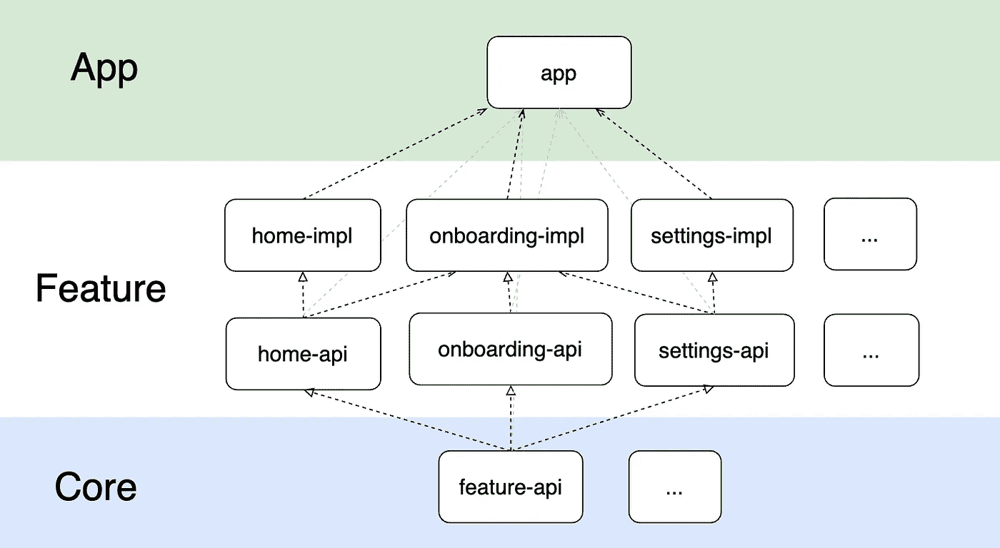

# Jetpack 在多模块项目中组合导航

> 原文：<https://betterprogramming.pub/jetpack-compose-navigation-in-a-multi-module-project-8d3947e6e2a4>

## 使用撰写导航组织您的 Android 代码库

照片由[威廉·布特](https://unsplash.com/@williambout?utm_source=medium&utm_medium=referral)在 [Unsplash](https://unsplash.com?utm_source=medium&utm_medium=referral) 拍摄

当我开始开发一个新的应用程序时，我利用这个机会在 Jetpack Compose 上制作 UI。和往常一样，我必须解决选择多模块架构和导航机制的问题。一方面，解决方案应该非常简洁，对于新开发人员来说容易理解。另一方面，它应该是可伸缩的，以便模块大小和数量的增长不会带来麻烦，比如烦人的构建时间或频繁的合并冲突。

在研究了 Google Compose 的文档、[示例并在网上搜索解决方案后，决定使用](https://github.com/android/compose-samples)[Jetpack Compose Navigation](https://developer.android.com/jetpack/compose/navigation)库，因为，首先，它是由 Google 开发的。其次，它是一个相当灵活的工具，满足现代需求:灵活的工作与后台堆栈，简单的集成与底部导航条，过渡动画，一个机制，集成与深层链接。再次，在我们看来，图书馆直观，入门门槛低。

在这里，我想用一个简单的例子来分享如何开始用 Jetpack 编写导航的多模块应用程序。

让我们考虑这个库中的主要实体。这里将会复述文档，所以那些已经使用过这个工具的人可以转到下一节。

`**Destination**`是导航屏幕的一般名称(在我们的例子中，是可组合功能)。

`**Route**`字符串是指向屏幕的链接。这里，与片段的 Jetpack 导航不同，导航只通过链接进行。与 web 类似，传递的参数也写在同一个字符串中(另一种方法是将包保存在后台堆栈中)。将进一步讨论该示例。

`**NavController**`是一个类，导航通过它进行。在“根”可组合组件中创建一个实例，该实例必须传递给所有“子”目的地。

`**NavHost**`是一个可组合函数，将路线与目的地或嵌套图绑定在一起。这是对片段的 Jetpack 导航中 xml 图形描述的替换。

**NavOptions** 是在`NavController.navigate(..)`方法的参数中找到的。它允许您设置过渡动画，在后台堆栈中保存和读取束类型状态屏幕，选择要清除后台堆栈的屏幕，或将导航行为设置为已经在后台堆栈中的屏幕。您可以在文档中找到更多详细信息。在我们的例子中，不会使用这个参数。

`**Navigator.Extras**`也见于`NavController.navigate(..)`方法的参数中。这是一个[有三个继承人](https://developer.android.com/reference/androidx/navigation/Navigator.Extras)的界面，例如，允许您配置活动选项或动态功能导航。这里我们也不考虑这个。

这就足够开始了！所以让我们来看看代码。

# **第一步。创建项目**

要使用 Compose，您需要安装 Android Studio 北极狐和更高版本。创建一个模板项目“空合成活动”。

很可能，IDE 会提示您更新库版本；这最初可能会导致合并冲突。在示例 [Github repository](https://github.com/mmarashan/JetComposeNavMultimodule) 中，您可以检查构建中使用的源代码和库版本。

继续前进…

# **第二步。底部导航条**

让我们考虑一下创建 Scaffold (Material design layout)的代码，其中我们声明了一个 Bottom Bar——带有底部导航栏渲染的可组合函数，以及一个`AppNavGraph` —带有导航图的屏幕渲染的可组合函数。

应用程序内容的根目录

总的来说，一切都和 Google 示例中的一样，我们不需要添加任何新的东西。让我们分开来看每件事。BottomTabs 是一个包含底部导航栏内容的枚举类。注意 route 参数——选项卡将通过它连接到可组合屏幕:

底部导航栏的组织数据结构示例

我们来考虑一下`BottomBar`。

第一行是最有趣的——多亏了它，在改变后台堆栈时发生了重组。

接下来是`BottomNavigation`的渲染，但前提是当前目的地与底部标签中描述的路线相关联。

底部导航条代码

现在是与导航相关的主要代码——`NavHost`声明。

对于初始化，它需要上面创建的`NavController`和起始目的地。

这是导航图初始化的地方——将路线链接到屏幕。为路线“home”和“settings”声明了可组合的函数，这些函数将在导航期间被调用。

NavHost 声明

然而，多模块化怎么办？无休止地在一个文件中注册每一个新屏幕是荒谬的，会使它膨胀到无穷大。因此，一个统一的添加功能的方法将对我们有很大的帮助。下一步我们会考虑。

# **第三步。功能-API**

这里我们就不争论特性语句了，哪里是一个特性的结束，哪里是另一个特性的开始。在这个例子中，我们将一个特性称为带屏幕的独立模块，它与它的 API 模块成对出现。

让我们创建一个核心模块，并将其命名为`feature-api`。

下面的接口是主要的 API 特性契约。所有的 API 特性也是接口，必须从它们继承。

考虑到导航参数，API 特性补充了将路线返回到屏幕的方法。

`register Graph(…)`功能通过`navGraphBuilder.composable(…)`将特征导航图注册为单独的屏幕，或通过`navGraphBuilder.navigation(..)`注册为嵌套图。

`NavController`用于在功能中调用的导航。修饰符包含底部导航栏的缩进边距。

功能 API 的接口

每个功能由两个模块组成:`feature-name-api`和`feature-name-impl`。

`api`模块应尽可能轻便，因为它可以被其他功能导入以导航到`feature-name`屏幕。

`impl`模块包含特性的整个实现，只有 app 模块知道它，并通过 DI 将实现提供给其他特性。

为了清楚起见，我们将在图中显示模块的层次结构:

为什么我们允许特性知道彼此的 API？为什么我们把它们分成两个模块？

Jetpack 组合导航中的导航基于链接。其 API 中的每个特性都回答了哪些链接打开其屏幕的问题。可能存在这样的情况，当特征 A 导航到特征 B 的屏幕时，反之亦然。在“单模”特征的情况下，会出现循环依赖的情况。

我们还特意决定放弃“功能是孤立的，所有导航都在应用程序或一些核心导航模块中”的方法，我们在类似主题的帖子中遇到过这种方法。我们正在制作一个可能包含大量模块的大型应用程序。这种方法会导致这样一个事实，即会有某个神级/对象/模块负责导航。这可能会导致单独模块的膨胀，并对构建时间产生负面影响，以及随着开发人员数量的增加而导致频繁的合并冲突。

让我们考虑一个实现`home-api`特性的例子。这里增加了一个返回路线到单一功能屏幕的方法。一般来说，在路由包含可以通过方法参数传递的参数的情况下，接口提供方法，而不是常数。

我们来考虑一下`home-impl`。在本例中，只有一个屏幕被“注册”,但是随着模块的增长，可能会有许多屏幕。同时，添加新屏幕只会导致一个隔离模块内的变化。

使用`NavGraphBuilder.register`扩展在`NavHost` lambda 主体的 app 模块中注册该功能:

这里你可以注意到另一个新的实体——`DependencyProvider`。它是一个对象，像`service-locator`一样，在我们简化的例子中模拟目标 DI。假设 API 特性可以从 DI 图中访问。

请注意，这种方法没有在库导航机制上提供自己的附加组件，因此开发人员不必研究内部的“自行车”。添加了一个有助于跨模块扩展功能屏幕的接口和一个为简明起见的可选扩展。

# **第四步。导航至其他功能屏幕**

现在让我们看一下从一个特性到另一个特性导航的例子。我们以 onboarding 功能为例，它允许您导航到主页功能屏幕。

这里 OnboardingScreen 是通过 route = "onboarding "打开的功能屏幕。在按钮单击处理程序中，使用 NavController 从后台堆栈中移除当前屏幕，并通过伪 DI DependencyProvider 获得所需功能的 API，该 API 提供了到其屏幕的路径。

# **第五步。功能内部导航**

在上一步中，我们执行了从 onboarding 功能到主页的导航。

实际上，在一个特性中会有许多屏幕，逻辑上只在模块中可用，而不在特性的 API 中公开它们的存在。让我们看看如何组织特性内部的导航，同时与嵌套图和传递参数主题相关。

由于特性的“公共”和“私有”API 之间的区别仅在于范围，我们可以在特性内部重用 FeatureApi 方法。

在我们的例子中，home 特性的“私人”屏幕是`ScreenA`和 ScreenB。导航到第二个需要一个参数。这里我们将使私有 API 成为简化的对象。

在实践中，您可以观察依赖反转的原理，并通过 DI 交付它的实现。

请注意，在`registerGraph()`方法中，注册了一个嵌套图— `navGraphBuilder.navigation(..)`。嵌套图是根据某种原则将屏幕组合到一个单独的组中的方法，例如，一个单独的用户脚本。

它们允许您运行脚本-知道路线，但不知道将打开哪个屏幕-这是通过`startDestination`参数配置的。同时，图表不是孤立的，因此如果您知道它的路线，就可以导航到任何嵌套的屏幕。

我们还可以看到如何导航到带有参数的屏幕。`screenB(parameter: String)`方法返回正确的路线，将参数考虑在内。下面注册了带有参数的相同路线。

让我们在外部 API 的实现中注册内部 API 的图形:

现在让我们给`ScreenB`添加到`ScreenA`的导航。通过点击按钮，我们开始沿着在`InternalHomeFeatureApi.screenB(…)`中收集的路线导航，文本通过`OutlinedTextField`作为参数传递给它。

因此，我们开发了一种统一的方法来构建功能之间以及同一功能内的私人屏幕之间的导航。

# **结论**

在这里，我分享了我用 Compose Navigation 组织多模块项目的愿景。我知道这个解决方案和其他方案一样有缺点。在我们的例子中，是特性的相对连接性(通过 API)和创建额外 API 模块的必要性。

我期望，从长远来看，一个添加功能和新屏幕的“框架”将会积极地影响项目的开发速度——并且还可以防止突然的代码崩溃。

我将很高兴听到您在使用 Compose 构建应用程序的架构和导航方面的经验！