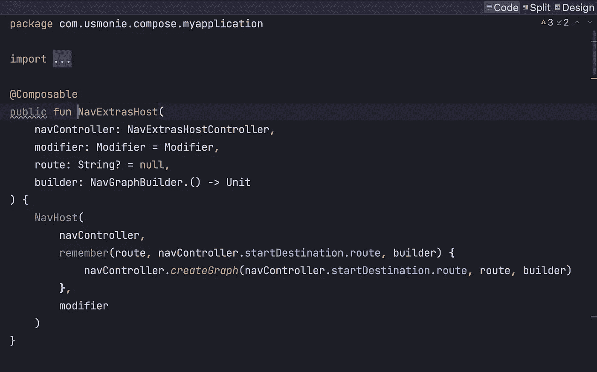

# 在 Jetpack Compose 中使用可打包参数导航

> 原文：<https://betterprogramming.pub/jetpack-compose-navigation-with-parcelable-arguments-5be907551848>

## 在您的 Android 应用中使用导航合成



作者图片

Android 团队宣布使用`Parcelable`在屏幕之间传递参数是一种反模式。但是许多人还不准备放弃…而且在另一个屏幕上显示之前保存所有数据也不方便。

今天，您将学习一种使用 Jetpack Compose 导航库传递参数的简单方法。

首先，让我们看看谷歌为我们导航争论提供了什么。一个有足够样板代码的解决方案，但是我们必须将它与我的解决方案进行比较。

首先，您需要将[导航库](https://developer.android.com/jetpack/compose/navigation)添加到项目中:

```
dependencies {
    def nav_version = "2.5.3"

    implementation("androidx.navigation:navigation-compose:$nav_version")
}
```

在这之后，我们应该创建导航图，其中`[NavController](https://developer.android.com/reference/androidx/navigation/NavController)`是控制导航栈的核心 API。

```
val navController = rememberNavController()

NavHost(navController = navController, startDestination = "profile") {
    composable("profile") { Profile(/*...*/) }
    composable("friendslist") { FriendsList(/*...*/) }
    /*...*/
}
```

`NavHost`将`NavController`与一个导航图链接起来，该导航图指定了您应该能够在其中导航的组件。当你运行这个`NavHost`时，它会从`startDestination` ( `profile`)开始。要进入下一个屏幕，您需要调用以下命令:

```
navController.navigate("friendslist")
```

看起来很简单，但这里有两个主要问题:

1.  我们有`String`作为一条在编写代码时可能导致错误的路径
2.  没有样板文件，我们无法在屏幕间发送`parcelable`，如这里的[所示](https://stackoverflow.com/a/65619560/7205194)。

所以，现在我给你看我自己对这个问题的决定。

# P **为 Parcelables 提供 Jetpack 组合导航**

首先，我们需要创建一个描述屏幕的抽象类。看起来是这样的:

```
abstract class Screen(
    open val route: String,
    open val arguments: Bundle? = null
) {
    constructor(route: String, extra: Extra) : this(route, Bundle().apply { putParcelable(extra.key, extra.parcelable) })

    data class Extra(val key: String, val parcelable: Parcelable)
}
```

之后，我们需要创建自己的`ComposeNavigator`实现:

```
@Navigator.Name("composable")
public class ComposeNavigator : Navigator<Destination>()
```

其中`Destination`是我们自己的类，它与原来的类不同，它接受带有参数的内容 lambda:

```
@NavDestination.ClassType(Composable::class)
public class Destination(
   navigator: ComposeNavigator,
   internal val content: @Composable (backStackEntry: NavBackStackEntry, arguments: Bundle?) -> Unit
) : NavDestination(navigator)
```

下一步是创建一个`NavController`来控制我们的屏幕:

```
 public class NavExtrasHostController(context: Context, public val startDestination: Screen) :
    NavHostController(context) {

    private val _currentScreensBackStack: MutableStateFlow<MutableMap<String, Screen>> =
        MutableStateFlow(mutableMapOf(startDestination.route to startDestination))

    public val currentScreensBackStack: StateFlow<Map<String, Screen>> =
        _currentScreensBackStack.asStateFlow()

    override fun popBackStack(): Boolean {
        _currentScreensBackStack.update { screensMap ->
            screensMap.apply { remove(currentDestination?.route) }
        }
        return super.popBackStack()
    }

    public fun navigate(screen: Screen, navOptions: NavOptions? = null) {
        _currentScreensBackStack.update { it.apply { put(screen.route, screen) } }
        navigate(route = screen.route, navOptions = navOptions)
    }
}
```

这里你可以看到`currentScreensBackStack`是一个地图，它在一个路线屏幕中存储了屏幕，允许我们在保持后退的同时沿着图表移动。当用户按 back 时，我们从后台堆栈中移除最后一个屏幕。

你可以看到，一个新的功能导航，你可以添加下一个屏幕到`currentScreensBackStack`。

现在，我们将创建一个 func，它允许我们创建自己的`NavExtrasHostController`，但是在此之前，我们应该创建一个 saver 类，它可以在配置更改和进程死亡时保存和恢复`NavExtrasHostController`:

```
private fun NavExtrasControllerSaver(
    context: Context,
    startDestination: Screen
): Saver<NavExtrasHostController, *> = Saver<NavExtrasHostController, Bundle>(
    save = { it.saveState() },
    restore = { createNavExtrasController(context, startDestination).apply { restoreState(it) } }
)
```

和`createNavExtrasController()`功能:

```
 private fun createNavExtrasController(context: Context, startDestination: Screen) =
    NavExtrasHostController(context, startDestination = startDestination).apply {
        navigatorProvider.addNavigator(ComposeNavigator())
        navigatorProvider.addNavigator(DialogNavigator())
    }
```

在这些步骤之后，我们可以创建记忆功能，它将创建出`NavExtrasHostController`添加我们的`ComposeNavigator`并使用`NavExtrasControllerSaver`保存和恢复它:

```
@Composable
public fun rememberNavExtrasController(
    startDestination: Screen,
    vararg navigators: Navigator<out NavDestination>
): NavExtrasHostController {
    val context = LocalContext.current
    return rememberSaveable(
        inputs = navigators,
        saver = NavExtrasControllerSaver(context, startDestination)
    ) {
        createNavExtrasController(context, startDestination)
    }.apply {
        for (navigator in navigators) {
            navigatorProvider.addNavigator(navigator)
        }
    }
}
```

下一步是创建我们自己的`NavHost`:

```
@Composable
public fun NavHost(
    navController: NavExtrasHostController,
    graph: NavGraph,
    modifier: Modifier = Modifier
) {
    val lifecycleOwner = LocalLifecycleOwner.current
    val viewModelStoreOwner = checkNotNull(LocalViewModelStoreOwner.current) {
        "NavHost requires a ViewModelStoreOwner to be provided via LocalViewModelStoreOwner"
    }
    val onBackPressedDispatcherOwner = LocalOnBackPressedDispatcherOwner.current
    val onBackPressedDispatcher = onBackPressedDispatcherOwner?.onBackPressedDispatcher

    // Setup the navController with proper owners
    navController.setLifecycleOwner(lifecycleOwner)
    navController.setViewModelStore(viewModelStoreOwner.viewModelStore)
    if (onBackPressedDispatcher != null) {
        navController.setOnBackPressedDispatcher(onBackPressedDispatcher)
    }
    // Ensure that the NavController only receives back events while
    // the NavHost is in composition
    DisposableEffect(navController) {
        navController.enableOnBackPressed(true)
        onDispose {
            navController.enableOnBackPressed(false)
        }
    }

    // Then set the graph
    navController.graph = graph

    val saveableStateHolder = rememberSaveableStateHolder()

    // Find the ComposeNavigator, returning early if it isn't found
    // (such as is the case when using TestNavHostController)
    val composeNavigator = navController.navigatorProvider.get<Navigator<out NavDestination>>(
        ComposeNavigator.NAME
    ) as? ComposeNavigator ?: return
    val visibleEntries by remember(navController.visibleEntries) {
        navController.visibleEntries.map {
            it.filter { entry ->
                entry.destination.navigatorName == ComposeNavigator.NAME
            }
        }
    }.collectAsState(emptyList())
    val screensBackStack by navController.currentScreensBackStack.collectAsState()

    val backStackEntry = visibleEntries.lastOrNull()

    var initialCrossfade by remember { mutableStateOf(true) }
    if (backStackEntry != null) {
        // while in the scope of the composable, we provide the navBackStackEntry as the
        // ViewModelStoreOwner and LifecycleOwner
        Crossfade(backStackEntry.id, modifier) {
            val lastEntry = visibleEntries.last { entry ->
                it == entry.id
            }
            // We are disposing on a Unit as we only want to dispose when the CrossFade completes
            DisposableEffect(Unit) {
                if (initialCrossfade) {
                    // There's no animation for the initial crossfade,
                    // so we can instantly mark the transition as complete
                    visibleEntries.forEach { entry ->
                        composeNavigator.onTransitionComplete(entry)
                    }
                    initialCrossfade = false
                }
                onDispose {
                    visibleEntries.forEach { entry ->
                        composeNavigator.onTransitionComplete(entry)
                    }
                }
            }

            lastEntry.LocalOwnersProvider(saveableStateHolder) {
                val previousScreenExtras = screensBackStack[lastEntry.destination.route]?.arguments

                val newLastEntryArguments = (lastEntry.arguments ?: Bundle()).apply {
                    if (previousScreenExtras != null) {
                        putAll(previousScreenExtras)
                    }
                }

                (lastEntry.destination as Destination).content(lastEntry, newLastEntryArguments)
            }
        }
    }

    val dialogNavigator = navController.navigatorProvider.get<Navigator<out NavDestination>>(
        Companion.NAME
    ) as? DialogNavigator ?: return

    // Show any dialog destinations
    DialogHost(dialogNavigator)
}
```

带有路由的重载函数:

```
@Composable
public fun NavExtrasHost(
    navController: NavExtrasHostController,
    modifier: Modifier = Modifier,
    route: String? = null,
    builder: NavGraphBuilder.() -> Unit
) {
    NavHost(
        navController,
        remember(route, navController.startDestination.route, builder) {
            navController.createGraph(navController.startDestination.route, route, builder)
        },
        modifier
    )
}
```

在这些步骤之后，我们需要创建一个`composable` 函数来发送参数给内容:

```
public fun NavGraphBuilder.composable(
    route: String,
    arguments: List<NamedNavArgument> = emptyList(),
    deepLinks: List<NavDeepLink> = emptyList(),
    content: @Composable (backStackEntry: NavBackStackEntry, arguments: Bundle?) -> Unit
) {
    addDestination(
        Destination(provider[ComposeNavigator::class], content).apply {
            this.route = route
            arguments.forEach { (argumentName, argument) ->
                addArgument(argumentName, argument)
            }
            deepLinks.forEach { deepLink ->
                addDeepLink(deepLink)
            }
        }
    )
}
```

因此，我们已经更新了`composable`函数，并将我们的参数添加到导航中。

# H如何使用

在开始使用我们的导航库实现之前，我们应该描述一下我们的屏幕。代码如下:

```
data class ProfilePage(val id: String) : Screen(PROFILE_ROUTE, Screen.Extra(PROFILE_EXTRAS_KEY, Profile(id))) {

    @Parcelize
    data class Profile(val id: String) : Parcelable

    companion object {
        const val PROFILE_ROUTE = "profile"

        const val PROFILE_EXTRAS_KEY = "profile_extras_key"

        @Composable
        fun Page(profile: Profile) {
            Text(profile.id)
        }
    }
}

const val FRIENDS_LIST_ROUTE: String = "friendsList"

object FriendsList : Screen(FRIENDS_LIST_ROUTE) {

    @Composable
    fun Page(navigateNextScreen: (String) -> Unit) {
        LazyColumn {
            items(10) {
                Text(it.toString(), modifier = Modifier
                    .fillParentMaxWidth()
                    .clickable { navigateNextScreen(it.toString()) })
            }

        }
    }
}
```

在这之后，我们应该实现`NavExtrasHost`，仅此而已:

```
val navController = rememberNavExtrasController(startDestination = FriendsList)
NavExtrasHost(navController = navController) {
    composable(ProfilePage.PROFILE_ROUTE) { _, arguments ->
        val profile: Profile = arguments?.getParcelable(PROFILE_EXTRAS_KEY) ?: return@composable
            ProfilePage.Page(profile)
        }

    composable(FriendsList.route) { _, _ ->
        FriendsList.Page(navigateNextScreen = { navController.navigate(ProfilePage(it)) })
    }
}
```

因此，现在您可以使用`parcelable`参数进行导航。

仅此而已。感谢阅读。