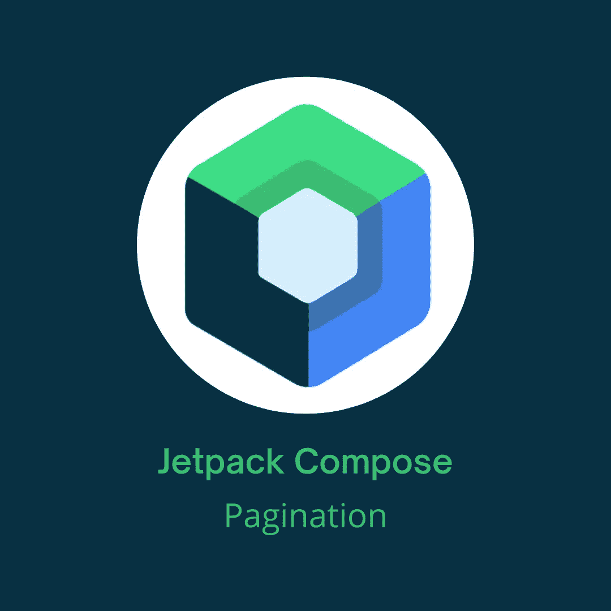

# Jetpack 撰写分页

> 原文：<https://betterprogramming.pub/jetpack-compose-pagination-287ea6e782e3>

## 使用 Jetpack Compose 中的 Paging 3 库实现分页



本图中使用的 Jetpack Compose 徽标是由谷歌创建的官方徽标

从服务器获取一长串数据是一项非常昂贵的操作。需要的时间太长，内存太大。在这些情况下，后端会将列表分成页面。这就是所谓的分页。

我们都熟悉`androidx.paging`图书馆。最新版本是`Paging 3`。我将向你展示如何使用 Jetpack Compose 中的`Paging 3`库。

> "分页库帮助您从本地存储或通过网络加载和显示较大数据集中的数据页。这种方法允许您的应用程序更有效地使用网络带宽和系统资源。
> 
> 分页库的组件旨在适应推荐的 Android 应用程序架构，与其他 Jetpack 组件干净地集成，并提供一流的 Kotlin 支持。“根据[分页官方文档](https://developer.android.com/topic/libraries/architecture/paging/v3-overview)

让我们从添加依赖项开始:

```
implementation "androidx.paging:paging-compose:1.0.0-alpha16"
```

**注意:**检查是否有此依赖关系的更新版本。

我们需要一些数据来展示分页。为此，我们将使用美味的 API。在[这个链接](https://rapidapi.com/apidojo/api/tasty/)，你可以找到我们将要使用的 API。

除了分页库之外，我正在使用 Hilt、retrieve、OkHttp、Moshi、Coil 和伴奏者的占位符。确保添加所有这些库。我的 GitHub repo 的链接会在文章末尾。

这里我们需要实现的第一件事是一个组件，它将成为我们的数据源。根据我们加载数据的位置，我们可以在这里扩展两种类型的数据源:

*   `RemoteMediator<Key : Any, Value : Any>` —用于将数据从远程数据源增量加载到本地数据源。
*   `PagingSource<Key: Any, Value: Any>` —它定义了数据源以及如何从该数据源中检索数据。它可以从任何单一来源加载数据，包括网络和本地数据库。

基本上，为了获取你想在 UI 中显示的数据，你将使用`PagingSource`，如果你想从网络上增量加载数据到本地数据库，你将使用`RemoteMediator`。

在本文中，我们将使用`PagingSource`。如果你想了解更多关于`RemoteMediator`的信息，看看这个上的[。下面是我们实现的`PagingSource`:](https://developer.android.com/reference/kotlin/androidx/paging/RemoteMediator)

我们通过将`Int`作为`key`的一种类型，将`RecipeModel`作为`value`的一种类型来扩展`PagingSource`。`RecipeModel`就是我们从这个来源载入的东西。

我们需要实现两个函数，`getRefreshKey`和`load`。以下是需要它们的原因:

*   `getRefreshKey` —由于此`PagingSource`失效，为下一个`PagingSource`提供一个用于初始加载的密钥。密钥通过`LoadParams.key`提供给负载。函数的参数`state: PagingState<Key, Value>`是获取数据的当前状态，它包括加载的数据页(`pages: List<Page<Key, Value>>`)、列表中最近访问的索引(`anchorPosition: Int?`)和初始化`PagingData`流时给出的范围(`config: PagingConfig`，我们将在后面详细讨论)。
*   `load` —从数据库或网络触发数据的异步加载。函数的参数`params: LoadParams<Key>`是加载请求的参数，它包含请求加载的项目数量(`loadSize: Int`)，如果占位符被启用(`placeholdersEnabled: Boolean`)，以及要加载页面的键(`key: Int`，在`getRefreshKey`函数中解释)。这个函数的结果是一个密封的类`LoadResult<Key, Value>`。

`LoadParams`是一个密封类，它有三个子类:

*   `Refresh` —代表初始加载请求
*   `Append` —将附加到列表末尾的加载请求
*   `Prepend` —加载请求，该请求将被添加到列表的开头

通过检查参数的实际类型，我们可以确定请求的类型。

也有三个子类。它们是这样的:

*   `Error` —表示错误结果
*   `Invalid` —代表无效结果
*   `Page` —代表成功的结果

请注意我们是如何实现这些功能的。在`getRefreshKey`中，我们只是返回列表中最近访问的索引。在`load`中，我们调用存储库函数从 API 获取数据，并根据占位符是否启用返回结果。

当占位符被启用时，我们将在加载的数据之后有空元素的`itemsAfter`计数，在加载的数据之前有空元素的`itemsBefore`计数。稍后，我们可以使用这些元素来显示占位符。如果没有启用，我们就不会有任何空元素。

在这里，我们将有一个最大的`loadedSize`的占位符后，最小数量的项目留下来加载。API 中的元素总数，所以对于一些不同的 API，这个逻辑可能会有所不同。

接下来，我们实现我们的`MainViewModel`。下面是代码的样子:

在我们的`ViewModel`中，我们创建了一个`PagingData`流。`Pager`是`PagingData`的反应流的构造器。构造函数接受三个参数:

*   `config: PagingConfig`—`Paging`的配置。接受一个强制参数和几个可选参数。一个强制参数是`pageSize: Int`，它是从`PagingSource`一次加载的项目数量。一些有趣的可选参数是`enablePlaceholders: Boolean`和`jumpThreshold: Int`
*   `initialKey: Key`—`PagingSource`的初始密钥
*   `pagingSourceFactory: () -> PagingSource<Key, Value>` —应该创建并返回`PagingSource`实例的 lambda 工厂。

`Pager`多了一个有四个参数的构造函数。前三个是一样的，第四个参数是`remoteMediator: RemoteMediator<Key, Value>?`，我们前面解释过了。

使用`.flow`，我们创建一个`PagingData`流，使用`.cachedIn`，我们缓存`PagingData`，这样来自这个流的任何下游集合将共享同一个`PagingData`。

接下来就是打造一个`MainScreen`。代码如下:

首先，我们使用`collectAsLazyPagingItems`从`PagingData`的流中收集值，并创建一个`LazyPagingItems`的实例。`LazyPagingItems`负责从`PagingData`的流程中访问数据。有了这个实例，我们可以访问加载状态、触发刷新、获取项目计数、重试会导致`LoadState.Error`的失败加载请求，等等。

在`LazyPagingItems`实例中，我们可以访问`loadState: CombinedLoadStates`，它代表`refresh`、`prepend`和`append`的负载状态。`LoadState`是一个`PagedList`负载的状态；可以是`NotLoading`、`Loading`、`Error`。`NotLoading`有一个字段`endOfPaginationReached: Boolean`，而`Error`有`error: Throwable`。

检查这些状态，我们可以选择是否应该显示一个加载微调，一个错误消息，或者什么都不做。

对于`items` composable，我们传递`LazyPagingItems`，对于每一行，我们调用`RecipesRow` composable。

`RecipesRow`是一张包含图片、姓名和评分的卡片。如果当前的`recipeModel`为空，这意味着它是一个占位符，将是我们传递给`placeholder`修改器的检查。如果你对`Accompanist’s placeholder`不熟悉，或者你想提醒自己，看一看[我以前的一篇文章](/jetpack-compose-swipe-to-refresh-1d93775970e8)因为我在这里不会解释那个。

本文到此为止。我希望你学到了新的东西，而且很有趣。如果你有任何疑问，请随时提问。

源代码可以在[我的 GitHub repo](https://github.com/Giga99/MediumRepos) 中找到。

```
**Want to Connect?**[GitHub](https://github.com/Giga99)
[LinkedIn](https://www.linkedin.com/in/igor-stevanovic/) [Twitter](https://twitter.com/igor_s1999)
[Portfolio website](https://giga99.github.io/portfolio-website/)
```

如果您想了解更多关于 Jetpack Compose 的信息，请阅读以下文章:

*   [在 Jetpack Compose 中实现水平和垂直 view pager](/implement-horizontal-and-vertical-viewpager-in-jetpack-compose-a7a91f2ac746)
*   [使用 CameraX 在 Jetpack Compose 中构建一个相机安卓应用](https://medium.com/better-programming/build-a-camera-android-app-in-jetpack-compose-using-camerax-4d5dfbfbe8ec)
*   [Jetpack 撰写刷卡刷新](/jetpack-compose-swipe-to-refresh-1d93775970e8)

# 资源

[https://developer . Android . com/topic/libraries/architecture/paging/v3-概述](https://developer.android.com/topic/libraries/architecture/paging/v3-overview)

[https://developer . Android . com/reference/kot Lin/Android x/paging/Pager](https://developer.android.com/reference/kotlin/androidx/paging/Pager)

[https://developer . Android . com/reference/kot Lin/Android x/paging/paging source](https://developer.android.com/reference/kotlin/androidx/paging/PagingSource)

[https://developer . Android . com/reference/kot Lin/Android x/paging/remote mediator](https://developer.android.com/reference/kotlin/androidx/paging/RemoteMediator)