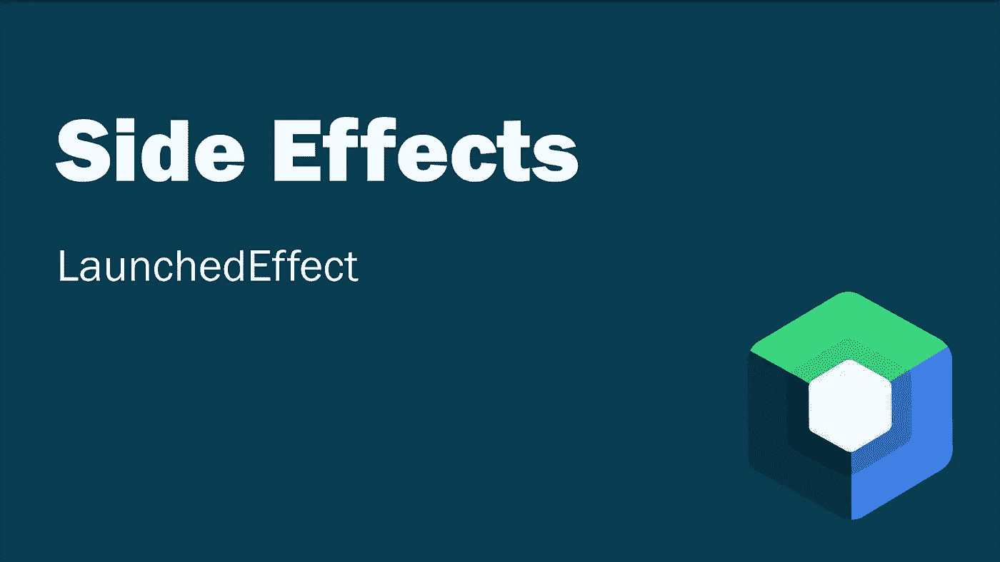
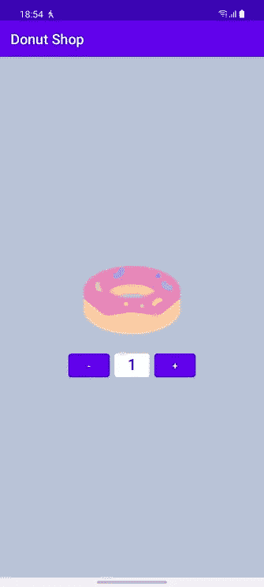
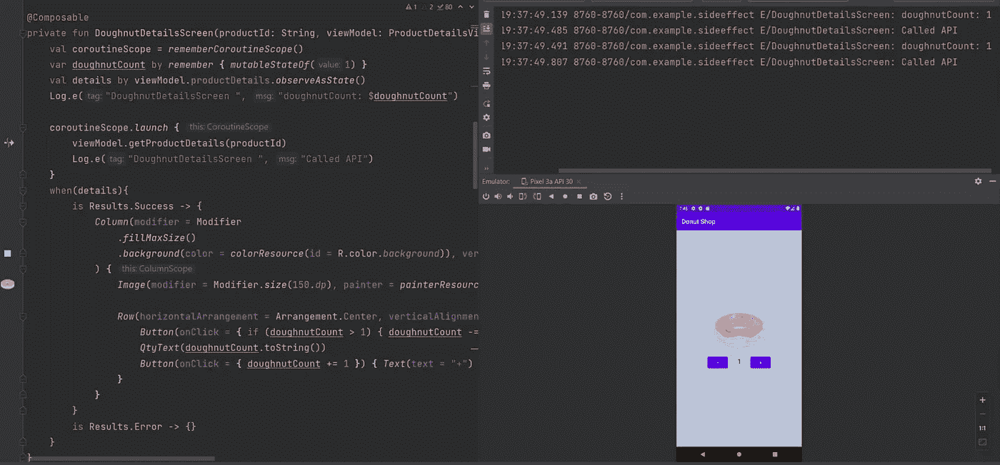
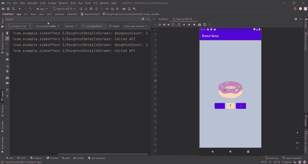
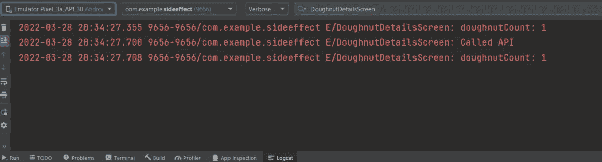
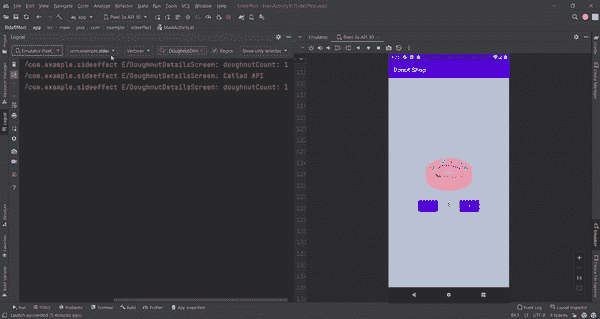

# Jetpack 合成副作用 LaunchedEffect 示例

> 原文：<https://betterprogramming.pub/jetpack-compose-side-effects-launchedeffect-with-example-99c2f51ff463>

## 构建响应迅速的 Android 应用



如果你准备好了，我就通过一个例子来解释一下`LaunchedEffect`。然而，在我们谈论发射效应之前，让我们简单地谈谈副作用。

# 什么是副作用？

> 在编程方面；副作用是当函数在其作用域之外改变变量、值或对象时。

比如我们看下面这个函数，可以看到没有副作用。

```
fun sum(number1: Int, number2: Int) = number1 + number2
```

然而，如果我们最终创建了一个类似 below 的函数，那么每次调用`sum`函数时，它都会改变`result`变量的值，从而产生副作用。

```
var result = 0
fun sum(number1: Int, number2: Int) = *result* = number1 + number2
```

或者，它有一个副作用，因为它会将求和结果打印为日志。

```
fun sum(number1: Int, number2: Int) = Log.e("Tag", (number1 + number2).toString())
```

简而言之，副作用是一个概念，它表达了操作过程中另一个状态、变量、对象或值的变化。

# Jetpack Compose 中的 LaunchedEffect 是什么？

> LaunchedEffect:在可组合的范围内运行挂起函数

*   `LaunchedEffect`在组合内输入时执行一次。而且离开作文的时候就取消了。
*   `**Keys**` 状态变化时`LaunchedEffect`取消/重启
*   `LaunchedEffect`必须至少有一个`**key**`
*   `LaunchedEffect` Scope 的调度程序是 Main。

这是足够的技术信息了！我们通过一个例子来检验一下。

在这个例子中，我会试着给你主要的想法，而不太重视设计、场景和干净的代码。

假设我们有一家甜甜圈店，我们的客户通过我们的应用程序订购。

下面是我们的应用程序是如何工作的。

1.  假设我们在主页上列出了`doughnut` ( `Chocolate`、`Strawberry`、`Blueberry`和其他)的类型，每个`doughnut`都有一个 id。
2.  让我们在主页上点击一个选中的甜甜圈时启动`DetailsScreen`,并向用户显示他所选择的甜甜圈的信息..(`isAvailable`、`price`等……)
3.  我们有一个 api 来获取关于甜甜圈的信息，我们将在`DetailsScreen`中调用这个 API。
4.  在详细信息页面上，我们还需要获得产品数量等。



甜甜圈详细信息屏幕

让我们考虑这样一个场景，已经从主页上选择了一个产品，调用了`DetailsScreen`，我们有了产品的 id，看看当我们一开始不使用`LaunchedEffect`时会发生什么。

# 没有启动效果的甜甜圈详细信息屏幕

`val coroutineScope` - >是我们可以运行暂停功能的作用域。我们将在这个范围内进行 API 调用。
`val doughnutCount` ->*变量我们保存用户将订购多少甜甜圈。
`val details` - >变量我们把 API 响应放在哪里。*

*让我们来看看运行项目时出现的日志消息:*

**

*使用协程作用域时的日志*

*Compose 在`DoughnutDetailsScreen` 刚打开的时候创建过一次。
然后我们进行了一次 API 调用，当响应到来时，`details` 变量被触发，compose 再次被创建。但是等一下。那是什么！*

**

*使用协程作用域并增加数量时的日志*

*我们看日志记录的时候看到 api 又被调用了…
我们也按一下按钮增加甜甜圈的数量。每当我更新甜甜圈计数时，就会进行 API 调用。*

*如你所见，每次`doughnutCount` 发生变化，compose 就被重新构建，api 被反复调用。我不认为我们想要这样的局面。*

*让我们对代码做一些修改，然后再看一遍。*

*我去掉了`coroutineScope`。我们不再需要它，因为我们将使用`LaunchedEffect`和`LaunchedEffect` 已经为我们提供了一个协程作用域。*

# *具有启动效果的甜甜圈详细信息屏幕*

*我添加了`LaunchedEffect`并为我请求的`key1`参数传递了`productId`。这意味着:当`key1`参数值改变时，通知`LaunchedEffect`协程是否应该重启。*

*现在我们打开 Logcat，看看我们在使用`LaunchedEffect`的时候，是否存在重复 api 调用的情况。*

**

*使用启动效果时的日志*

*首次打开`DoughnutDetailsScreen` 时，曾创建过一次 Compose。
然后我们进行一个 api 调用，当响应到来时，`*details*`被触发，compose 再次被创建。但是正如您所注意到的，没有再进行 API 调用..*

*让我们继续更新甜甜圈的数量。*

**

*日志时，我们使用发射效果，并增加数量*

*我们还更新了甜甜圈的数量，正如你所看到的，并不是每次更新都进行 API 调用。*

*我将在下一篇博文中解释`DisposableEffect` 。在那之前，保重。*