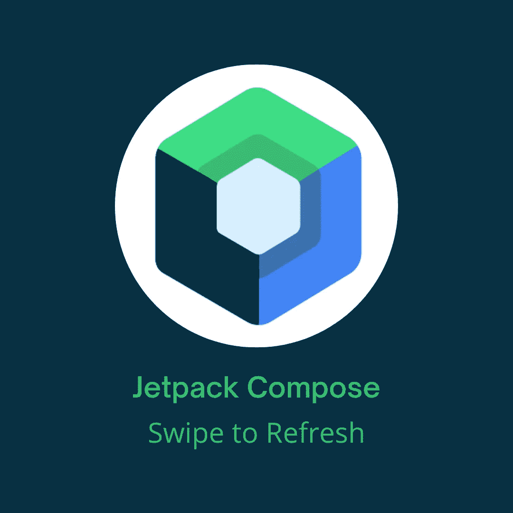

# Jetpack 撰写轻扫刷新

> 原文：<https://betterprogramming.pub/jetpack-compose-swipe-to-refresh-1d93775970e8>

## 加载项目时如何实现滑动刷新功能以及占位符的简短指南



本图中使用的 Jetpack Compose 徽标是由 Google 创建的官方徽标

如今，很多应用程序都有需要在某个时候刷新的数据。您可以在一段时间后刷新数据，或者使用套接字来获得最新的数据，但是如果您想要允许用户开始刷新数据的功能，该怎么办呢？

这可以通过一个按钮来完成，但在某些情况下，更好的 UX 应该是滑动刷新。今天，我们将使用`Accompanist` 库来实现它。

# 刷卡刷新

首先，让我们添加一个依赖项:

```
implementation "com.google.accompanist:accompanist-swiperefresh:0.25.1"
```

**注意:**检查这个依赖项是否有更新的版本。

下一步是创建一个简单的`ViewModel`,它将保存我们的数据和刷新逻辑。在这里，项目将包含随机图像和数字。看起来是这样的:

`isRefreshing`是一个布尔值，我们将在我们的`swipeRefreshState`中使用，我们将在后面解释。`items`是一个包含 20 个随机图片和数字的列表。

现在，让我们创建我们的屏幕:

我们正在收集我们的状态，并用值`isRefreshing`创建`swipeRefreshState`。我们将这个状态传递给`SwipeRefresh`，但是如果需要的话，我们也可以访问它的属性`isRefreshing`和`isSwipeInProgress` 。在`SwipeRefresh`中，我们有标题、当前时间和项目列表。每一行项目只是显示一个图像和数字。

`SwipeRefresh`有三个强制参数:

*   `state: SwipeRefreshState` —一种状态对象，可以被提升以控制和观察 SwipeRefresh 的变化
*   `onRefresh: () -> Unit` —当完成滑动刷新手势时调用的 Lambda
*   `content: @Composable () -> Unit` —包含可组合卷轴的内容

一些有趣的可选参数是:

*   `swipeEnabled: Boolean` —布局是否应对滑动手势做出反应
*   `refreshTriggerDistance: Dp` —触发刷新的最小刷卡距离
*   `indicatorAlignment: Alignment` —指示器的校准。默认为`Alignment.TopCenter`
*   `indicatorPadding: PaddingValues` —指示器的内容填充，如果需要，可插入指示器
*   `indicator: @Composable (state: SwipeRefreshState, refreshTrigger: Dp)` —表示当前状态的指示器。默认情况下，这将使用一个`SwipeRefreshIndicator`

对于`indicator`参数，您可以创建自己的可组合组件，但是库为我们提供了`SwipeRefreshIndicator`，这是一个我们可以使用的非常好的可组合组件。

它需要两个参数:

*   `state: SwipeRefreshState` —传入 SwipeRefresh 指示块的 SwipeRefresh 状态
*   `refreshTriggerDistance: Dp` —触发刷新的最小刷卡距离

一些可选参数是:

*   `fade: Boolean` —箭头滚动时是否应该淡入/淡出，默认为 true
*   `scale: Boolean` —指示器滚动时是否应放大/缩小，默认为 false
*   `arrowEnabled: Boolean` —是否在指示器上画箭头，默认为真
*   `backgroundColor: Color` —指示器背景表面的颜色

还有更多的参数，但不需要遍历所有的参数。如果您想了解更多信息，请务必查看官方文档。

这就是`SwipeRefresh`的全部内容，现在让我们实现占位符，这是伴奏者提供的另一个不错的库。

# 占位符

通常，项目的装载由某种装载微调器显示。显示项目正在加载的另一种方式是使用占位符。

`Accompanist`创建了一个库，为我们提供了一个显示占位符的修改器。实际上有两个占位符库。一个是`Foundation`，另一个是`Material`。建议我们使用`Material`，但是您可以随意使用您需要的任何东西。区别不大，API 大多相当。在这篇博客中，我们使用的是`Material`。所以，让我们用这个命令导入它:

```
implementation "com.google.accompanist:accompanist-placeholder-material:0.25.1"
```

**注意:**检查是否有此依赖关系的更新版本。

在继续处理`MainScreen`之前，让我们快速编辑一下`MainViewModel`。添加`init` 和`isLoading` `StateFlow`。同样，用 20 个默认`RowItems`初始化`items`。

我们的`ViewModel`现在长这样:

下一步是在我们的屏幕中收集`isLoading`，然后用它作为我们的占位符。我们正在向可组合的`Item`、`childModifier: Modifier`添加一个新参数。

正如你所看到的，这个库提供了一个修饰符。必需的参数是`visible: Boolean`，它决定是否应该显示占位符或内容。如果`visible`为真，将会有一个占位符来填充它所应用的可组合组件的大小，而不是内容。

可选参数包括:

*   `color: Color` —用于绘制占位符 UI 的颜色。如果提供了`Color.Unspecified`，占位符将使用`PlaceholderDefaults.color`
*   `shape: Shape` —占位符的所需形状。如果为空，占位符将使用`MaterialTheme.shapes`中设置的小形状
*   `highlight: PlaceholderHighlight` —可选的高亮动画。占位符有两个预先创建的动画，`fade`和`shimmer`
*   `placeholderFadeTransitionSpec: @Composable Transition.Segment<Boolean>.() -> FiniteAnimationSpec<Float>` —将占位符淡入/淡出屏幕时使用的过渡规范。为过渡定义的布尔参数是可见的
*   `contentFadeTransitionSpec: @Composable Transition.Segment<Boolean>.() -> FiniteAnimationSpec<Float>` —将内容淡出屏幕时使用的过渡规范。为过渡定义的布尔参数是可见的

我们的`MainScreen`现在看起来是这样的:

仅此而已。我希望你喜欢它。

你可以在我的 GitHub repo 中找到所有的源代码。

```
**Want to Connect?**[GitHub](https://github.com/Giga99)
[LinkedIn](https://www.linkedin.com/in/igor-stevanovic/) [Twitter](https://twitter.com/igor_s1999)
[Portfolio website](https://giga99.github.io/portfolio-website/)
```

如果您想了解更多关于 Jetpack Compose 的信息，请阅读以下文章:

*   [在 Jetpack Compose 中实现水平和垂直 view pager](/implement-horizontal-and-vertical-viewpager-in-jetpack-compose-a7a91f2ac746)
*   [使用 CameraX 在 Jetpack Compose 中构建一个相机 Android 应用](https://medium.com/better-programming/build-a-camera-android-app-in-jetpack-compose-using-camerax-4d5dfbfbe8ec)
*   [Jetpack 缀洁导航](/jetpack-compose-clean-navigation-94b386f7a076)

# 资源

 [## 向导—伴奏者

### 一个库，它提供了一个提供滑动刷新 UX 模式的布局，类似于 Android 的…

google.github.io](https://google.github.io/accompanist/swiperefresh/)