# Jetpack 合成主题:颜色

> 原文：<https://betterprogramming.pub/jetpack-compose-theming-colors-1cf86754d5b9>

## 探索 Android 应用程序中的颜色


照片由[罗伯特·卡茨基](https://unsplash.com/@ro_ka?utm_source=medium&utm_medium=referral)在 [Unsplash](https://unsplash.com?utm_source=medium&utm_medium=referral) 上拍摄

使用 Jetpack compose 创建屏幕要容易得多，但是它有自己的工作方式，有时可能很有挑战性。

我纠结的一个话题是颜色。

根据 Jetpack 的例子，我们应该使用`MaterialTheme`而不是老派的 XML 主题。我也不是 XML 主题的专家，这就是为什么我决定挖掘素材主题。因为这是一个很大的话题，所以在这篇文章中我将只讨论颜色。

你可能知道，每当我们创建一个应用程序 Jetpack 撰写功能，该项目会自动添加主题，让我们看看。

```
@Composable
fun MaterialTheme(
    colors: Colors = MaterialTheme.colors, // WILL BE FOCUSED
    typography: Typography = MaterialTheme.typography, // WILL BE COVERED LATER
    shapes: Shapes = MaterialTheme.shapes, // WILL BE COVERED LATER
    content: @Composable () -> Unit
)
```

`MaterialTheme`带有以下默认颜色:

但是这些颜色是什么意思，它们在 app 中的用法是什么，我们应该如何使用？我们来看看材料设计[网站](https://material.io/design/color/the-color-system.html#color-theme-creation):

> 一个**原色**是在你的应用程序的屏幕和组件上最常显示的颜色。
> 
> 第二种颜色**为强调和区分你的产品提供了更多的方法。**
> 
> 您的原色可用于为您的应用程序制作颜色主题，包括深色和浅色**原色变体**。
> 
> 就像原色一样，你的**副色**可以有深色和浅色的**变体**。
> 
> **表面颜色**影响部件的表面。
> 
> ****背景色**出现在可滚动内容的后面。**
> 
> ****错误颜色**表示组件错误。**

**总而言之:**

> **原色和次色(可选)代表品牌。**
> 
> **表面、背景和错误颜色通常不代表品牌。**

**这意味着原色/二次色必须是显著的，代表你的品牌，其余的颜色必须更不显眼。**

**非品牌颜色的材料主题默认颜色通常为白色和黑色，但是，为了更好地理解，我们将为每个变量赋予不同的颜色:**

**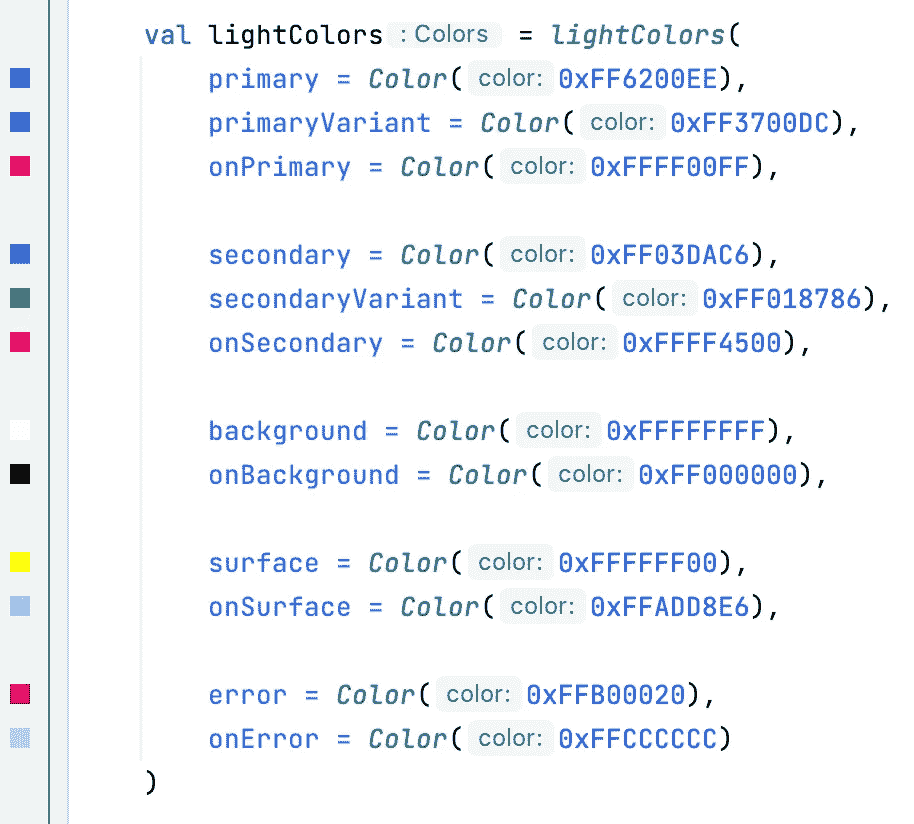**

**在本文中，我们将使用`backgroundColor`,因为在大多数情况下，内容颜色是由背景决定的。**

# **为用户界面元素设置颜色**

**我添加了带有`Text`(没有特定颜色)的卡片布局，并将我们主题的颜色作为背景色。**

**代码:**

**结果是:**

**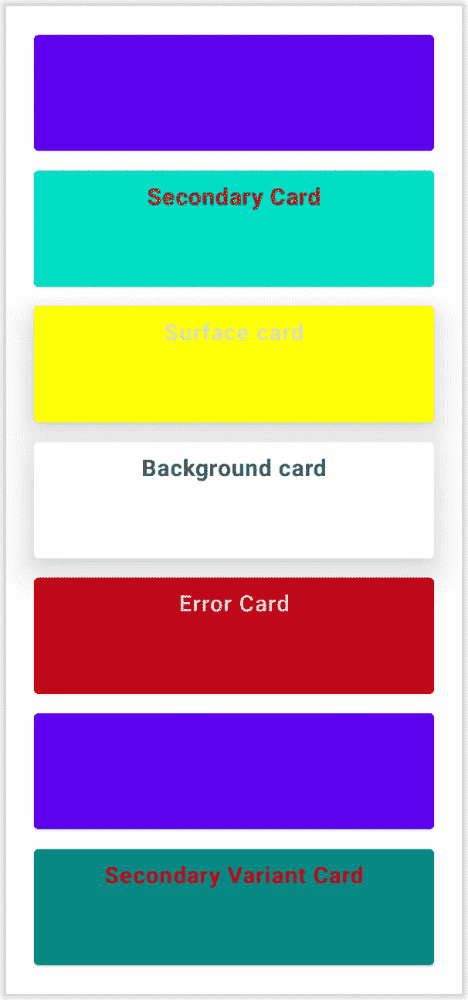**

**那么，它是如何工作的呢？我们的视图组件如何读取颜色并将颜色变化应用到内部组件？在我们的案例中，这是一个`Text`视图。**

**如果我们浏览卡片布局(或任何布局)，我们会看到这个扩展功能。它告诉我们在大多数情况下是如何为内容选择颜色的。在这里阅读更多**

```
fun Colors.contentColorFor(backgroundColor: Color): Color {
    return when (backgroundColor) {
        primary -> onPrimary
        primaryVariant -> onPrimary
        secondary -> onSecondary
        secondaryVariant -> onSecondary
        background -> onBackground
        surface -> onSurface
        error -> onError
        else -> Color.Unspecified
    }
}
```

**正如我们从屏幕和我们的主题观察到的，颜色是匹配的。**

# **UI 组件的默认主题**

**理想情况下，我们不需要为每个 UI 设置颜色。默认情况下，一些 ui 从不同的颜色部分读取，提到其中一些是有好处的。**

**为了更好地理解它，我分别添加了这些 UI 组件，所有颜色都是从主题中读取的。没有手动添加颜色。**

**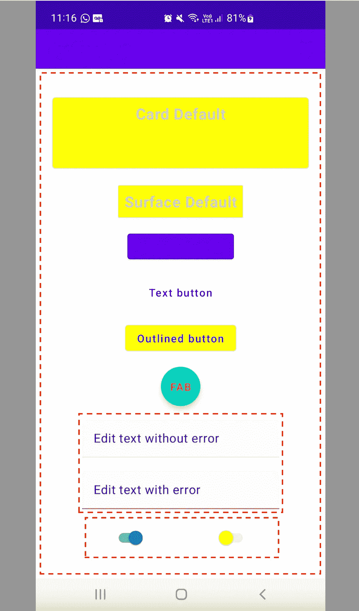**

**让我们一个一个来看看。**

## **状态栏**

*   **默认颜色:`primaryVariant`**

**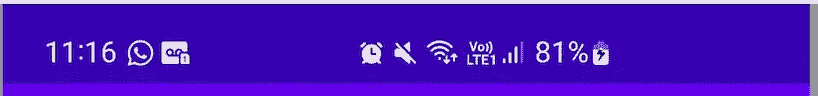**

## **脚手架**

**用于在屏幕上显示不同的布局，例如底部表单或浮动操作按钮。**

*   **默认颜色:`background`**
*   **内容颜色:`onBackground`**

```
*Scaffold*(
    topBar = **{
        /****/**
    **}** )
```

## **TopAppBar**

**用于显示当前屏幕的信息，包括操作。它根据应用主题使用不同的颜色。**

*   **默认颜色:`primarySurface`(浅色主题:原色/深色主题:表面)**
*   **内容颜色:`onPrimary(L)` / `onSurface(D)`**

```
*TopAppBar*(title = **{** Text(text = "Toolbar text")
    **}**,
    actions = **{** IconButton(onClick = **{ }**) **{** Icon(Icons.Filled.*Favorite*, contentDescription = null)
        **}
    }** )
```

**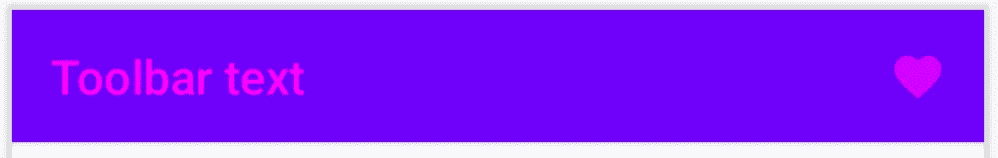****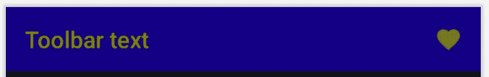**

## **卡片**

**用于单个主题的内容和操作。**

*   **默认颜色:`surface`**
*   **内容颜色:`onSurface`**

```
Card(
    modifier = Modifier
        .*padding*(8.*dp*)
        .*fillMaxWidth*()
        .*height*(100.*dp*)
) **{** *Text*(text = "Card Default")
**}**
```

**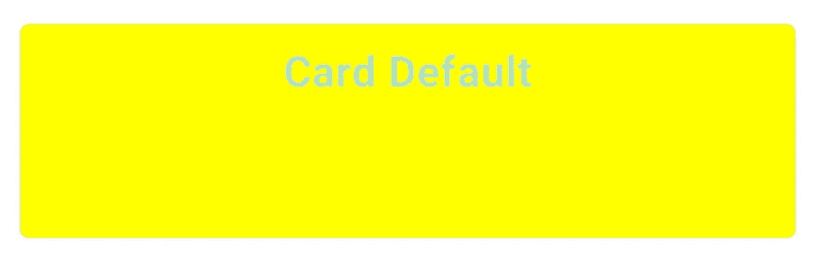**

## **表面**

**每个曲面都存在于给定的高程，这将影响该曲面在视觉上与其他曲面的关系以及该曲面投射阴影的方式。**

*   **默认颜色:`surface`**
*   **内容颜色:`onSurface`**

****

## **浮动操作按钮**

**用于定义屏幕的主要操作。**

*   **默认颜色:`secondary`**
*   **内容颜色:`onSecondary`**

```
FloatingActionButton(onClick = **{ }**) **{**Text(text = "FAB", textAlign = TextAlign.Center)
**}**
```

**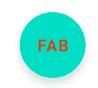**

## **纽扣**

**用于用户操作。**

*   **背景颜色:`primary`**
*   **内容颜色:`onPrimary`**

```
Button(onClick = **{ }**) **{**Text(text = "Regular button")
**}**
```

**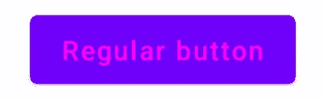**

## **文本按钮**

*   **背景颜色:`transparent`**
*   **内容颜色:`primary`**

```
*TextButton*(onClick = **{ }**) **{**Text(text = "Text button")
**}**
```

**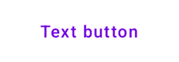**

## **大纲按钮**

*   **背景颜色:`surface`**
*   **内容颜色:`primary`**

```
OutlinedButton(onClick = **{ }**) **{**Text(text = "Outlined button")
**}**
```

**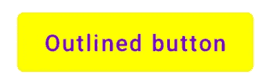**

## **转换**

**打开或关闭单个项目的状态。**

*   **默认颜色(选中):`secondaryVariant` / `secondaryVariantAlpha`**
*   **默认颜色(未选中):`surface` / `onSurface`**

```
Switch(checked = true, onCheckedChange = **{}**)
 *Switch*(checked = false, onCheckedChange = **{}**)
```

****

## **文本字段**

**用于用户输入。**

*   **背景色:`onSurface.copy(alpha = BackgroundOpacity)`**
*   **文字颜色:`onBackground`**
*   **底线(常规):`onSurface.copy(alpha =
    TextFieldDefaults.UnfocusedIndicatorLineOpacity)`**
*   **底线(错误):`onError`**

****

**最初的`onSurface`颜色是浅蓝色，因此在截图上看不到这种颜色——尤其是不透明的颜色。因此，我只在这张截图中使用了`onSecondary`颜色。**

**总而言之:**

*   **不是每个 UI 都遵循`color` / `<onColor>`模式。**
*   **如果我们完成一个 UI 元素的实现，默认颜色被设置。我们不必死记硬背。然而，了解基础知识是有用的。**

# **如果我将内容颜色作为背景颜色会怎么样？**

*   **让我们分别设置`onPrimary`、`onSecondary`、`onError`、`onSurface`、`onBackground`为背景色。**

**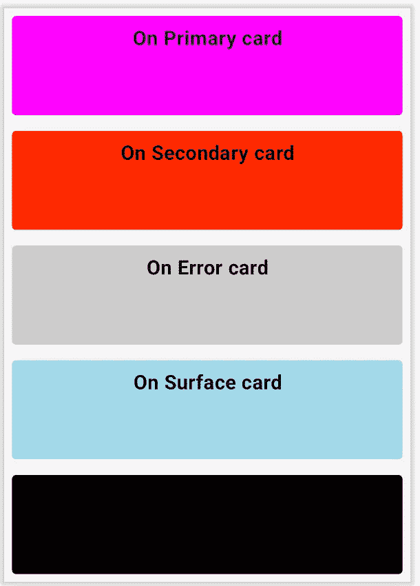**

**背景颜色取自内容颜色，内容颜色从`contentColorFor`扩展 else case 中读取，在本例中为`Color.Unspecified`。如果我们检查代码，`Color.Unspecified`是黑色的。**

```
val Unspecified = *Color*(0f, 0f, 0f, 0f, ColorSpaces.Unspecified)
```

**正如我们观察到的，最后一个没有显示文本，因为`onBackground`颜色和选择的内容颜色是相同的。**

```
onBackground = *Color*(0xFF000000)
```

**这肯定会引起一些问题:**

*   **UI 测试会通过，因为文本确实在那里，我们不会意识到它。**
*   **花点时间找出问题，因为颜色实际上设置得很好，谁会首先想到`Color.Unspecified`颜色呢？**
*   **用户改变主题(亮->暗)，我们可能会得到一个次优的用户体验。**

**因此，我们需要非常小心的主题颜色。**

# ****黑暗题材呢？****

**我们也应该考虑深色主题的调色板，否则，用户会对我们的应用程序有不好的体验，甚至沮丧！最常被忽视的部分之一是应用黑暗主题——至少对我来说是这样。使用材质合成，很容易实现。**

**首先，我们需要决定调色板。我遵循同样的，给所有人不同的颜色。**

**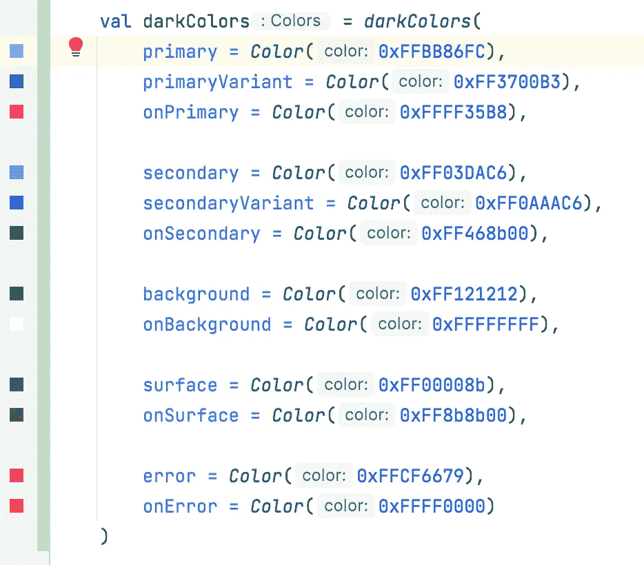**

**现在，让我们进入我们的主题调色板，并运行应用程序。**

```
MaterialTheme(
    colors = if (isSystemInDarkTheme()) darkColors else lightColors,
    */***/*
)
```

**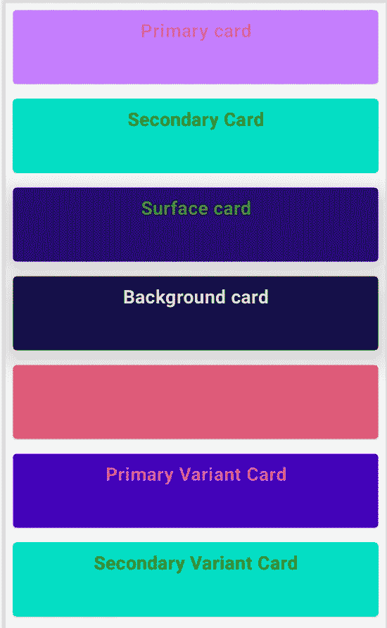**

**正如我们看到的，我们的应用程序适应颜色的变化。**

**但是什么分钟，为什么我们的主要背景保持为白色？这不是我们想要的。原因如下:**

*   **所有的 UI 组件都被添加到`Column`元素中，它不遵循任何主题，这就是为什么我们的背景实际上没有任何颜色。**

```
@Composable
fun Surfaces() {*Column*(modifier = Modifier.*filllMaxSize*()) **{** *Cards*()
    }
}
```

*   **为了拥有合适的 ui，我们总是需要使用实际应用颜色主题的组件。让我们在可组合函数的顶部添加`Surface`。**

```
@Composable
fun Surfaces() {
    Surface **{** *Column*(modifier = Modifier.*fillMaxSize*()) **{** *Cards*()    
        }
    }
}
```

**瞧，问题解决了。**

**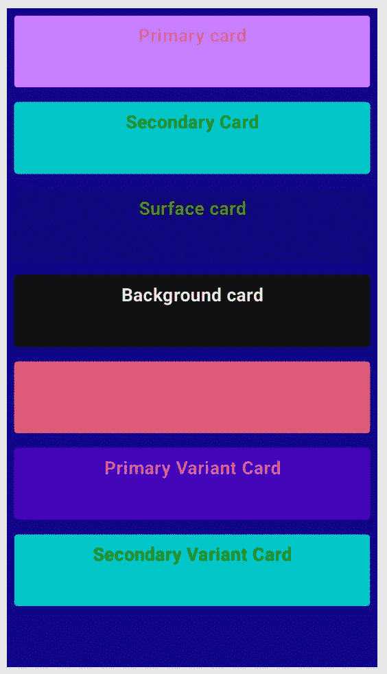**

# **我需要一个不同的 UI 组件，但不想改变主题，我该怎么办？**

**我的一个 UI 元素必须与其他应用程序不同——我的主题颜色都不合适。但是，我不想面对问题。**

**我们可以覆盖 UI 元素的颜色。所有 UI 元素的类表示是不同的，但是实现是相同的。让我们看看`Button`和`TextField`。**

**对于按钮，我们将使用`ButtonDefaults.buttonColors()`扩展和覆盖。**

**类似于`TextField`，`TextFieldDefaults.textFieldColors()`将被覆盖。**

*   **记住这一点很重要，我们应该考虑为亮/暗模式提供不同的调色板。否则，我们可能会以前面提到的问题告终。(背景/文字颜色相同的问题)**

**让我们来看看我们最新的应用程序，它包含常规和定制的亮暗主题组件。**

**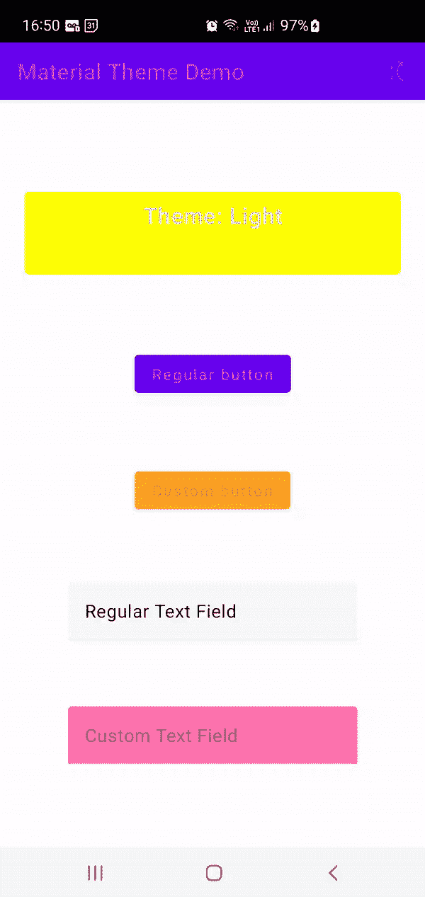**

**我们讨论了以下主题:**

*   **色彩在材质主题中的应用，明暗都有**
*   **用户界面元素的默认颜色**
*   **常见错误**
*   **UI 元素的重写调色板**

**我希望这篇文章是有用的。在接下来的文章中，我将研究形状和排版。**