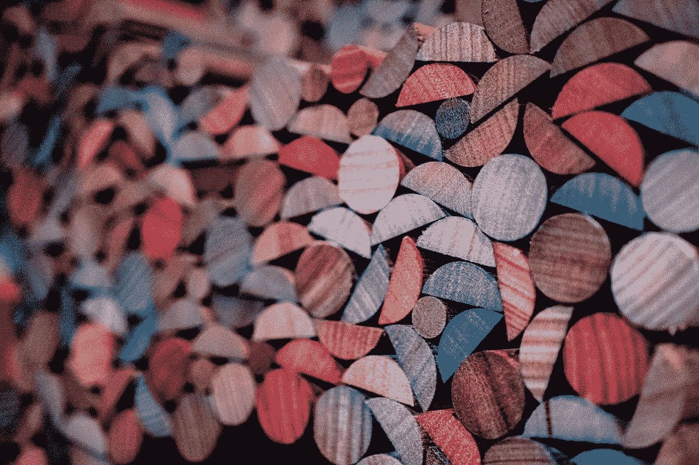
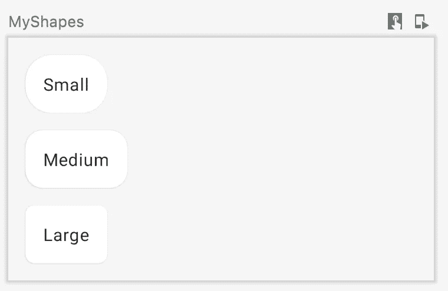
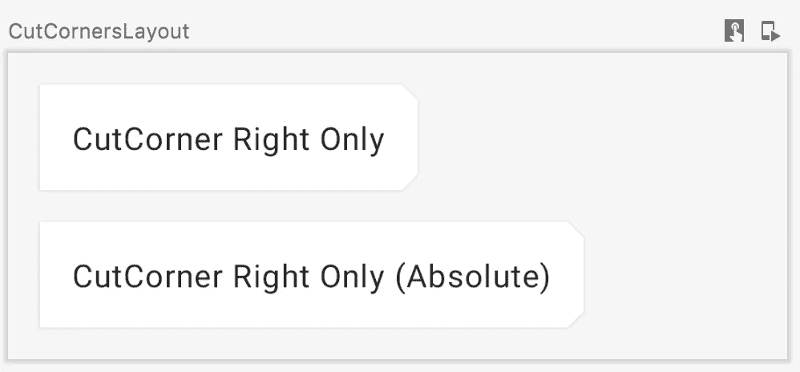
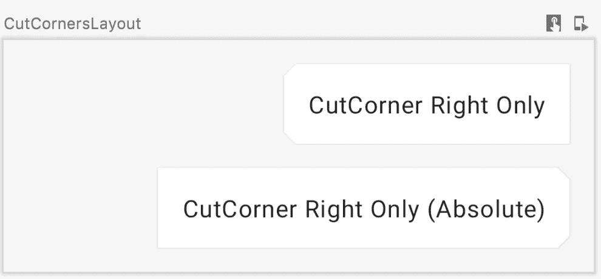
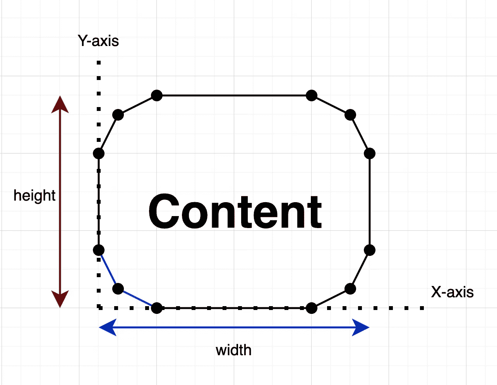
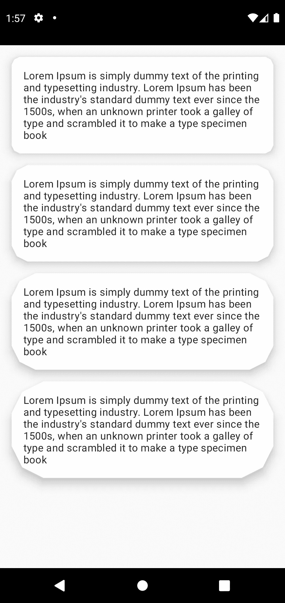

# Jetpack 合成主题:形状

> 原文：<https://betterprogramming.pub/jetpack-compose-theming-shapes-3f3cc8df7e5c>

## 我们心脏的形状



Robert Euro Djojoseputro 在 [Unsplash](https://unsplash.com/s/photos/shapes-and-patterns?utm_source=unsplash&utm_medium=referral&utm_content=creditCopyText) 上拍摄的照片

在这篇文章中，我将解释材料主题的形状。

## 实现和默认值

根据组件的大小，材质主题提供了 3 种默认形状。

```
class Shapes(
    */**
     * Shape used by small components like [Button] or [Snackbar]. Components like
     * [FloatingActionButton], [ExtendedFloatingActionButton] use this shape, but override
     * the corner size to be 50%. [TextField] uses this shape with overriding the bottom corners
     * to zero.
     */* **val small: CornerBasedShape = *RoundedCornerShape*(4.*dp*),**
    */**
     * Shape used by medium components like [Card] or [AlertDialog].
     */* **val medium: CornerBasedShape = *RoundedCornerShape*(4.*dp*),**
    */**
     * Shape used by large components like [ModalDrawer] or [ModalBottomSheetLayout].
     */* **val large: CornerBasedShape = *RoundedCornerShape*(0.*dp*)**
)
```

如果组件很小(按钮)，默认形状为`Shapes.small`，如果是中型(卡片)，形状为`Shapes.medium`，对于最大的组件(底板)，形状为`Shapes.large`。


不同组件的默认形状

正如我们在代码中看到的，`small`和`medium`形状用`4.dp`大小圆整，`large`形状用`0.dp`圆整——意思是直的。

## 用户化

当然，我们可以定制形状！我们需要做的是，创建我们自己的形状，并将它们传递给应用程序的主题。

我们需要使用`CornerBasedShape`的形状。有一些通用的我们可以使用，如`RoundedCornerShape` 或`CutCornerShape`。让我们试试不同圆形尺寸的 RoundedCorner。

```
val shapes = Shapes(
    small = *RoundedCornerShape*(24.*dp*),
    medium = *RoundedCornerShape*(16.*dp*),
    large = *RoundedCornerShape*(8.*dp*)
)

MaterialTheme(
    colors = colors, *// Covered already* typography = typography, *// Covered already* shapes = **shapes**,
    content = content
)
```

为了便于比较，我将对所有组件使用`Card`并覆盖形状。

```
Card(**shape = MaterialTheme.shapes.small**) **{** Text(
        text = "Small",
        modifier = Modifier.*padding*(16.*dp*)
    )
**}**
```

让我们看看它是什么样子的:



不同形状的卡片

我们还可以使用更多定制的预制转角形状:

```
val cutCorner = *CutCornerShape*(8.dp)
val straigtCorner = *RoundedCornerShape*(0)
val circle = *CircleShape*
```


预制形状

## 绝对角落

当我搜索预制形状时，我遇到了前缀为`*absolute*`的相同预制形状。

```
AbsoluteRoundedCornerShape()
AbsoluteCutCornerShape()
```

如果我们实现它们，我们看到它们和非绝对的是一样的。有什么区别？让我们检查一下文档:

> 描述带有切角的矩形的形状。角尺寸代表切割长度，即切割直角三角形的两条边的尺寸。
> 该形状不会自动反映 LayoutDirection 中的角尺寸。Rtl，对该形状的布局方向感知版本使用 CutCornerShape。

好了，我们来比较一个不同布局方向的原始和绝对形状。我创建了两个切角的形状(原始的和绝对的),它们只在末端切割，开始是直的，这样我们可以根据布局方向观察镜像。

```
val cutCorner = *CutCornerShape*(0.*dp*, 8.dp, 8.dp, 0.*dp*)
val absCutCorner = *AbsoluteCutCornerShape*(0.*dp*, 8.dp, 8.dp, 0.*dp*)
```

布局方向为:LTR



LTR 方向

布局方向是:RTL



RTL 方向

正如我们所观察到的，原始形状会调整布局方向，并将切角方向从右向左更改，但是绝对形状保持不变。

## 我们自己定制的形状:DiamondCornerShape

由于材料主题是关于品牌的应用程序，我们也可以创建自己的自定义形状。

我创建了一个类，从`CornerBasedShape`派生并覆盖了两个方法:`copy()`和`createOutline()`。

*   `copy()` - >创建当前类的新实例
*   `createOutline()` - >根据参数创建轮廓。有很多方法可以做。我们可以提供一些预制的轮廓，如`Outline.Rectangle`、`Outline.Rounded`或者我们可以创建自己的路径并提供一个`Outline.Generic`

我想创建一个菱形，因此我使用路径和它的方法。`createOutline`提供了我们需要的所有形状和边距的大小，所以我们需要做的基本上是根据 x-y 轴绘制线条。



所有的点代表一个坐标。`line(x,y)`方法从我们开始的点画线。`move(x,y)`方法移动起点到给定坐标。同样，一个白色的方框宽度(或高度)表示切割尺寸值，我们将该值作为切割尺寸参数提供给 Diamond 类。

如果你沿着给定坐标的线走，我们会得到这个形状。(我建议使用方形纸来遵循协调——是的，老派)

最后，创建一个新变量`DiamondCornerShape`并用作组件的形状。

```
Card(
    **shape = *DiamondCornerShape*(cutSize = 10.dp)**,
    elevation = 10.*dp* ) **{** Text(
        text = text,
        modifier = Modifier.*padding*(16.*dp*)
    )
**}**
```



不同切割尺寸的菱形

请随意在您自己的项目中使用它！请注意，我没有根据布局方向修改它——即使它在我们的例子中是多余的。

这是我的 Jetpack 撰写主题系列的结束。我希望你喜欢阅读！

我以前的系列文章:

*   colors:[https://better programming . pub/jetpack-compose-theming-colors-1 cf 86754 d5b 9](/jetpack-compose-theming-colors-1cf86754d5b9)
*   排版 I:[https://medium . com/@ gozde . kaval/jetpack-compose-theming-排版-part-i-ac1796020ab](https://medium.com/@gozde.kaval/jetpack-compose-theming-typography-part-i-ac1796020ab)
*   排版二:[https://medium . com/@ gozde . kaval/jetpack-compose-theming-排版-part-ii-cb9527e8f110](https://medium.com/@gozde.kaval/jetpack-compose-theming-typography-part-ii-cb9527e8f110)