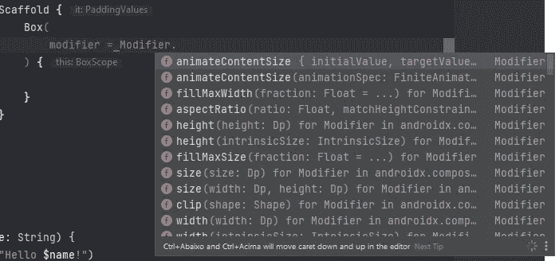
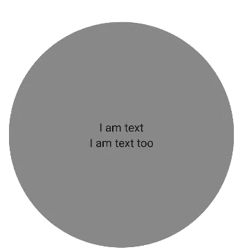
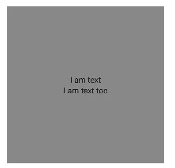
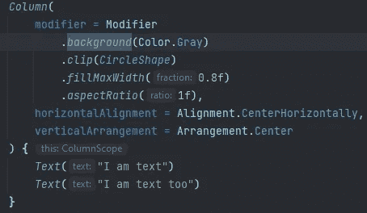
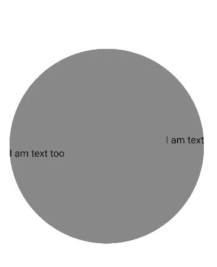
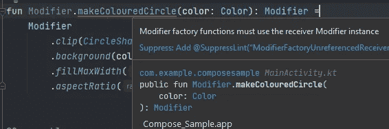
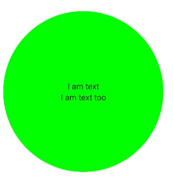
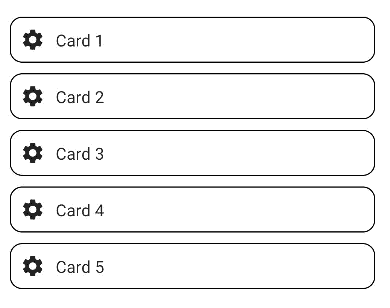
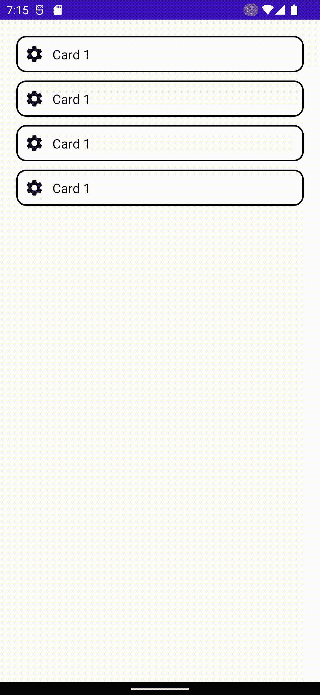

# Jetpack 合成修改器简介

> 原文：<https://betterprogramming.pub/jetpack-compose-understanding-modifiers-part-1-introduction-831582dc067d>

## 范围包含修饰语、重组修饰语、交互修饰语等等

照片由[克里斯托弗·奥特](https://unsplash.com/@notso?utm_source=unsplash&utm_medium=referral&utm_content=creditCopyText)在 [Unsplash](https://unsplash.com/s/photos/chameleon?utm_source=unsplash&utm_medium=referral&utm_content=creditCopyText) 拍摄

本文假设读者对 Jetpack Compose 如何工作有基本的了解，如果你不熟悉`@Composable`带注释的函数，我建议你在阅读本文之前学习这些主题。

Jetpack Compose 是一个旨在为 Android 开发带来声明性 UI 模式的库。

这是一个改变游戏规则的特性，它完全改变了开发人员思考和设计 UI 的方式，因为(旧的)XML 视图系统几乎没有什么用处。

默认情况下，默认组件(基于材质 UI 规范)是高度可定制的，但是修饰符的存在将可定制性的可能性增加到了九千多种。

# 自定义常规组件

大多数组件都可以通过它们的参数进行定制，例如，我们可以改变`CircularProgressBar()`的颜色和当前进度，或者为`TextField()`组件设置前导/尾随图标。

但在大多数情况下，这可能还不够。例如，盒子没有太多的参数定制选项。

要点 1:框可组合的可用参数

考虑到我们没有显式的参数来修改颜色、形状、边框、高度、宽度和许多其他有用的属性来实现 UI 目标，Composable 看起来不像是一个非常灵活的组件。

但事实是:我们不需要所有这些参数，仅仅是因为修饰符的存在。

# 什么是修饰语？

根据 Android 的文档，修饰符是一组可以分配给可组合组件的连锁属性，能够改变布局、添加事件监听器等等。

图 1:一些可用于框架内可组合框的修饰符。

修改器使用工厂模式链接，所以如果我们想要设置盒子背景颜色为黄色，并设置其高度和宽度，我们可以这样做:

要点 2:给一个盒子着色并设置它的尺寸

图 Gist 2 中设计的代码的结果。

## 有时候这是秩序问题

当对一个可组合的组件进行小的修改时，修饰符的顺序可能没有什么不同，但是当需要一个更复杂的布局时，我们必须注意链接修饰符的顺序。为了举例说明这种用法，我们将对下面的布局进行编码:

首先，我们将创建布局的基础结构，用一个脚手架作为屏幕“骨架”，用一个盒子来包装我们的内容。注意，我们已经在这里使用了一个修饰符`Modifier.fillMaxSize()`来使盒子可组合以适应脚手架的整体尺寸。

现在让我们添加我们的组件、修饰符，并理解这里发生了什么:

为了实现这个布局，我决定使用一个盒子作为屏幕包装器，并使用修饰符`fillMaxSize()`，所以这个相同的可组合组件将填充其父组件的整个大小。作为盒子的补充，我使用了一个列作为我们的圆圈，里面有文本组件。

在这个精确的`Modifier`顺序中，我们可以很容易地实现两个文本的灰色圆圈(一个在另一个之上)，现在让我们了解每个列的修饰符是做什么的，然后改变它们的顺序，有目的地导致布局中断。

*   `clip`:剪辑修改器用来剪辑可组合对象，这样我们就可以很容易地改变它的形状。使用这个修改器，我们可以将一个矩形框(可组合框的默认形状)转换成圆角矩形或圆形。
*   `fillMaxWidth`:该修饰符用于通知可组合组件适应父组件的最大宽度(这类似于使用约束布局时，0dp 宽度视图被约束到其父组件的开始和结束)。fraction 参数用来定义这个自动填充的“权重”，例如，当使用 *0.1f* 时，我们将填充父级宽度的 10%，而 *1.0f* 将填充整个可用宽度。
*   `aspectRatio`:这个修改器会根据 ratio 参数来均衡可组合组件的高度和宽度。通过使用`clip` ,我们将我们的可组合体定义为一个圆，并且`fillMaxWidth` 声明我们的圆的直径将填充父元素的最大宽度的 80%,但是这个解决方案不会产生一个完美的圆，通过移除`aspectRatio` ,我们可以看到这个列的形状像一个圆角矩形，而不是一个圆。这是因为圆需要高度和宽度来保留相同的值，所以通过使用 `aspectRatio(1)`我们可以确保我们的圆具有相同的宽度和高度。

*   `backgroundColor`:将可组合的背景颜色设置为给定值。背景色是顺序很重要的修改器之一，如果我们将`backgroundColor`移到`clip`修改器之前，我们可以看到这种行为。发生这种情况是因为本质上我们是在裁剪可组合对象的边界之前绘制它，实际上，我们的列被裁剪为一个圆。但是因为我们是在剪辑之前绘制的，所以看起来`clip`修改器不起作用，但是它确实起作用了，这只是一个顺序问题。

## 范围包含修饰符

Compose Standard library 提供了大量的公共范围修饰符，换句话说，这些修饰符是默认可用的，因此独立于当前范围。

但是每当使用像列、行和框这样的组合时，你可能会注意到`content`λ被包装在一个作用域内，例如，在我们的列中有`ColumnScope`:

`ColumnScope`是一个接口，负责设置一个可组合组件相对于其内容大小的高度(默认为 wrap-content)，还提供了一组有限的修饰符，只在这个范围内可用:`weight`、`align`和`alignBy`，这些是我所说的范围保留修饰符。

> 通过 IDE 访问源代码或阅读官方文档，您可以了解关于作用域及其各自保留的修饰符的更多信息。

如果我们回到圆形的列布局，将`align`修饰符添加到`Text`组件中，我们可以在列中水平对齐它们

> 这些对齐修饰符在 Row Composable 中也是可用的，但是在这种情况下，它们负责在行内垂直对齐内容。对于 BoxScope 来说也是如此，但在这种情况下，我们有可以控制水平和垂直位置的修饰符。

上面的更改将产生下面的布局，通过向我们的`Text`组件添加`align`修饰符，我们可以直接控制它们在列中的水平位置。

## 重组修饰符

修改器也可以通过创建应用其他修改器的单个修改器来重新组合，在我们的例子中，我们可以创建一个接收颜色参数的`makeColouredCircle`。

由于修饰符是一个接一个链接起来的，我们必须保证在应用我们定制的修饰符时，先前添加的修饰符不会丢失，这就是为什么我们必须使用`this.then`语句。`then`函数用于将更多的修改器添加到一个预先存在的修改器实例中。

> 在这个例子中，我们在我们的自定义修饰符中添加了度量修饰符，但是请记住这不是一个好的做法，通常`fillMaxWidth` 和`aspectRatio` 应该直接在我们的`Column` 组合中使用

您不必担心每次创建新的自定义修饰符时都要记住这条规则，如果您只是尝试返回一个全新的修饰符实例，IDE 将会显示一个错误:

现在，我们可以在我们的专栏中使用自定义修饰符，并获得与之前相同的结果。请注意，现在我们可以动态地改变我们的圆的颜色:

## 交互修饰符

修饰符也可以用来给我们的组件添加交互，比如使组件可点击、可拖动等等。为了举例说明这种可能性，我们将使用一个非常常见的用例:一个可点击的卡片列表，它指向一个细节页面。

> 好的实践提示:每当你创建一个可组合的时候，用一个默认的空修饰符定义一个修饰符参数。这样我们可以使我们的组件更加灵活。

这是我们的基地布局:

现在，我们将向我们的 Card Composable 添加一个回调，这样我们就可以定义当我们单击它时会发生什么。

要使我们的可组合的可点击组件，我们必须使用`clickable`修饰符，这使得组件能够接收点击或可访问性点击事件。

请注意，我们只是将`onClick`参数附加到了我们的 composable 的修饰符上，那么为什么不删除这个参数，直接在修饰符参数中添加 clickable 属性呢？这是可读性和良好实践的问题。通过显式定义`onClick` 参数，我们可以断言这个给定的可组合函数应该是可点击的，如果没有这个参数，其他开发人员就没有办法知道 Card Composable 中的这个预期的点击事件，因为理论上，如果您将`clickable`修饰符附加到它的修饰符链上，每个具有修饰符参数的可组合函数都是可点击的。

现在让我们为我们的卡组件添加一些行为。

完成，现在卡片可以点击了！

## 参考

[https://developer.android.com/jetpack/compose/modifiers](https://developer.android.com/jetpack/compose/modifiers)

[https://developer . Android . com/jetpack/compose/modifiers-list](https://developer.android.com/jetpack/compose/modifiers-list)