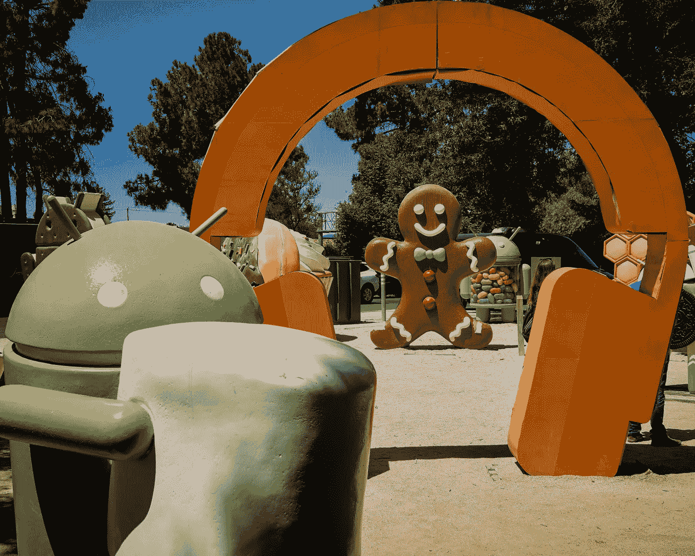
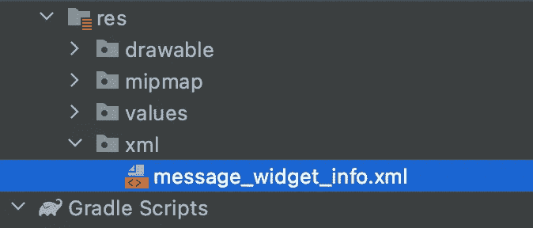
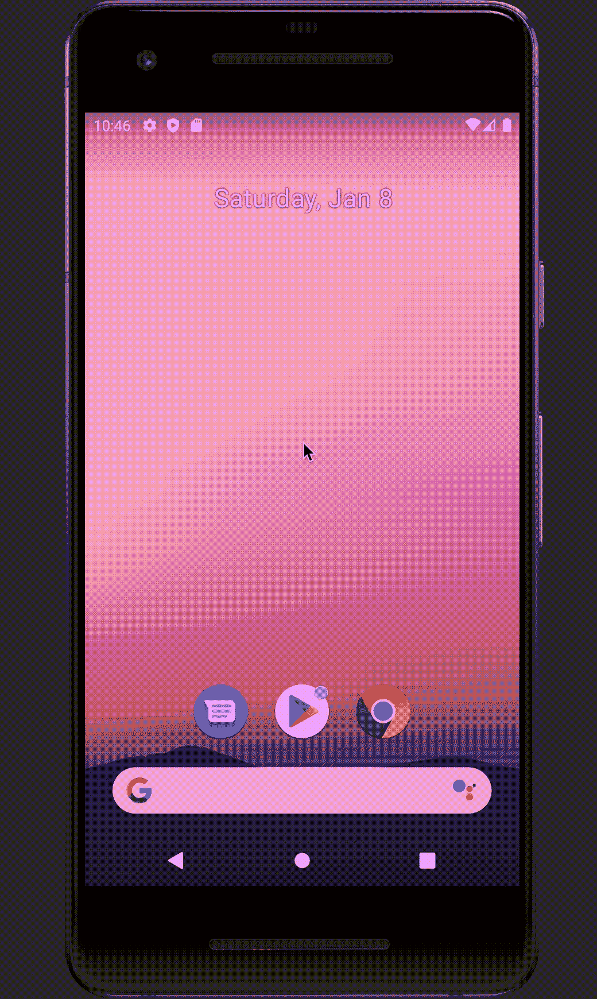

# 用于编写应用程序小部件的 Jetpack Glance

> 原文：<https://betterprogramming.pub/jetpack-glance-for-compose-app-widgets-5beb4d30ec51>

## 在 Android 中创建漂亮的部件

图为[在](https://unsplash.com/@vork?utm_source=unsplash&utm_medium=referral&utm_content=creditCopyText)[凸起](https://unsplash.com/s/photos/android?utm_source=unsplash&utm_medium=referral&utm_content=creditCopyText)上标记凸台

我将谈论一个叫做 Jetpack Glance 的新框架，它刚刚在 Alpha 中发布。

基本上，它是一个框架，您可以使用 Jetpack Compose 来构建应用程序小部件。那真的很实用！为了便于识别，微件是可以添加到设备主屏幕上的小形状。有了 Jetpack Glance，您现在就可以使用 Jetpack Compose 来创建它们。

但是，它不能与 Jetpack Compose 完全互操作。我的意思是，如果你的项目中有一些组件，你就不能在你的项目中使用它们。Jetpack Glance 的工作方式有一点不同，它有自己的一种组合，我们称之为“Glanceables”。

您仍然可以使用相同的可组合函数，但是它们有一些特殊的修饰符。您不能将现有的可组合组件放到应用程序小部件中，但是您可以使用普通类型的组合设计来创建您的应用程序小部件。

让我们来看看它是如何工作的:

首先，您需要实现如下两个依赖项:

您还希望确保您拥有这个 maven 存储库:

现在我们可以开始创建我们自己的`MessageWidget`:

这是我们的主屏幕部件。它只是显示一个“窗口小部件消息试用”文本，但是正如你所看到的，它继承了需要实现的`Content`功能的`GlanceAppWidget`。

还需要用 Composable 来注释`Content`函数。所以在那之后，你可以在`Content()`中使用你的可组合函数。

然而，正如我所说的，它不能与 Jetpack Compose 互操作，您不能使用您现有的组件。需要用特殊的`GlanceModifier`。

我们还创建了继承自`GlanceAppWidgetReceiver`的`MessageWidgetReceiver`。实际上它相当于`broadcastReceiver`，它只是服务于这样的目的，如果用户与你的小工具交互，这个接收器将被触发。显然，你的应用程序并不是一直都是活跃的，但是用户可以随时与你的小部件交互。

因此，您需要覆盖`glanceAppWidget`，并返回您创建的小部件— >和`MessageWidget`。

接下来，您需要在`res`下创建一个 XML 文件夹，并为您的小部件创建一个 XML 文件。如果您想使用 XML 创建小部件，也需要做同样的事情

在这个 XML 中，您需要定义`appwidget-provider`:

你可以定义一个`previewImage`——我的是一个安卓机器人图标。我们应该为初始布局创建一个 XML:

我们不会看到这一点，因为在我们的情况下没有延迟。之后，我们需要去声明和登记广播接收器。

现在让我们看看它在我的设备上是什么样子:

当我们停留在主屏幕上时，我们进入 widgets，看到所有支持 widgets 的应用程序。

如果我们抓住应用程序的图标，我们可以把它拖到主屏幕上。

还有我们的“小部件消息试用”文本！

我们可以调整它的大小，但它只会填满它真正需要的空间。

这个例子显示了 Jetpack Glance 的基本规则。

我希望这篇文章能帮助你理解 Jetpack Glance 的基本功能，它只是一个初级版本，但是随着版本的稳定，我们会做进一步的研究。

编码快乐！