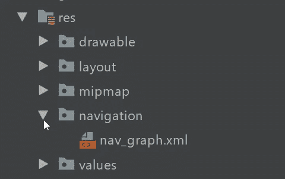
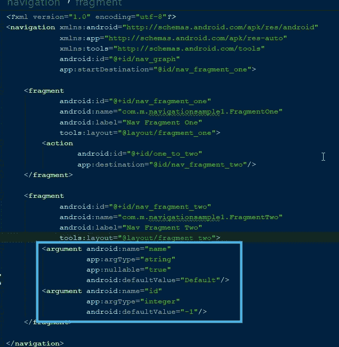

# Android 中的 JetPack 导航组件

> 原文：<https://betterprogramming.pub/jitpack-navigation-component-in-android-944165c35f54>

## 近十年后，Android 团队为开发者引入了一个新的导航系统


照片由[克里斯·劳顿](https://unsplash.com/@chrislawton?utm_source=medium&utm_medium=referral)在 [Unsplash](https://unsplash.com?utm_source=medium&utm_medium=referral) 拍摄

1.  概观
2.  综合
3.  术语
4.  导航图
5.  导航类型
6.  安全的论点
7.  带参数的导航
8.  带有导航组件的 DeepLink
9.  Google I/O 2019 中导航控制器的增强功能
10.  有用的链接
11.  GitHub 示例

# 概观

在屏幕之间导航是 android 应用程序的基本功能之一。我们通常通过**意图**来做到这一点，但是像导航抽屉或底部导航这样的复杂情况呢，我们必须保持高亮项目与当前屏幕同步，更不用说后台管理了——这很复杂，不是吗？

导航组件是 android 应用*中任何类型导航的所有问题的一站式解决方案。*JetPack 导航组件是一套库、工具和指南，为应用内导航提供了一个健壮的导航框架

导航组件在 android 开发中提供了一种新的导航类型，我们有一个导航图来查看所有屏幕以及它们之间的导航。这很像 IOS 中的**故事板。**

导航组件可以帮助你管理导航、片段事务、backstack、动画，最重要的是深度链接(深度链接不再需要意图过滤器)等等。

# 综合

**注意:**如果要使用 Android Studio 导航，必须使用 [Android Studio 3.3 或更高版本](https://developer.android.com/studio)。

在您的`build.gradle`中包含以下代码，您就可以开始了:

```
dependencies {
  def nav_version = "2.1.0"

  // Java
  implementation "androidx.navigation:navigation-fragment:$nav_version"
  implementation "androidx.navigation:navigation-ui:$nav_version"

  // Kotlin
  implementation "androidx.navigation:navigation-fragment-ktx:$nav_version"
  implementation "androidx.navigation:navigation-ui-ktx:$nav_version"

}
```

`navigation-fragment` **:** 片段是每个开发人员都使用的一个通用架构组件，所以`navigation-fragment` 是一个开箱即用的库，用于片段导航。

`navigation-ui` **:** 这有助于您使用 Nav Controller 设置应用栏、工具栏和其他材质设计组件配置。

# 术语

## 导航主机碎片

显示导航图中目的地的空容器。导航组件包含一个默认的`NavHost`实现`[NavHostFragment](https://developer.android.com/reference/androidx/navigation/fragment/NavHostFragment.html)`，它显示片段目的地。

## 导航控制器

在`NavHost`中管理应用导航的对象。当用户在你的应用中移动时，`NavController`协调`NavHost`中目标内容的交换。

## 目的地

目的地是你的应用程序中的所有内容区域，比如活动、片段、对话框等等。

## 行动

Action 用于创建一个导航，该导航具有一个名为`destination`的属性，我们可以在这里提到结束屏幕 id。

# 导航图

导航图是一个包含所有目的地和操作的资源文件。基本上，导航图代表了应用程序的导航。

## 如何创建导航图

正如我所说，导航图只不过是一个资源文件，所以我们在 **res** 目录下创建一个资源文件，资源类型为 navigation。看一看:


导航图的创建

创建导航图的步骤:

1.  在项目窗口中，右击`res`目录，选择**新建> Android 资源文件**。出现**新资源文件**对话框。
2.  在**文件名**字段中输入一个名称，如“nav_graph”。
3.  从**资源类型**下拉列表中选择**导航**，然后点击**确定**。



项目面板中的导航图

让我用两个片段的示例应用程序向您展示导航图预览。


导航图预览

由于每个 XML 资源文件 nav_graph 也有 design 和 text 选项卡，现在让我们看看 text 选项卡中的 XML 代码，以创建一个类似上面的图表

这里的根标签是`navigation` ，带有`startDestination`属性，我们必须提到最初要加载的片段的 id。接下来是目的地，比如片段、对话框等等，有一个属性`name`，它的值就是目的地的名称。

现在我们来看导航。我们在一个特定的目的地下使用一个标签动作——我们希望在那里开始导航。还有一个我们提到目的地 ID 的属性。

让我们把所有的碎片放在一起:

```
<?xml version="1.0" encoding="utf-8"?>
<navigation xmlns:android="http://schemas.android.com/apk/res/android"
            xmlns:app="http://schemas.android.com/apk/res-auto"
            xmlns:tools="http://schemas.android.com/tools"
            android:id="@+id/nav_graph"
            app:startDestination="@id/nav_fragment_one">

    <fragment
            android:id="@+id/nav_fragment_one"
            android:name="com.m.navigationsample1.FragmentOne"
            android:label="Nav Fragment One"
            tools:layout="@layout/fragment_one">
        <action
                android:id="@+id/one_to_two"
                app:destination="@id/nav_fragment_two"
                app:enterAnim="@anim/nav_default_enter_anim"
                app:exitAnim="@anim/nav_default_exit_anim"
                app:popEnterAnim="@anim/nav_default_pop_enter_anim"
                app:popExitAnim="@anim/nav_default_pop_exit_anim"
/>
    </fragment>

    <fragment
            android:id="@+id/nav_fragment_two"
            android:name="com.m.navigationsample1.FragmentTwo"
            android:label="Nav Fragment Two"
            tools:layout="@layout/fragment_two"/>

</navigation>
```

# 导航类型

为了通过导航组件在应用程序中导航，我们告诉`NavController`要么跟随一条路径，要么提到一个特定的目的地 ID。然后`NavController`在`NavHost`中显示合适的目的地。

有了导航组件，我们有多种导航方式。

## 使用 ID 导航

这里我们使用`nav_graph`中提到的目的地 ID 来到达目的地:

```
viewTransactionsButton.setOnClickListener { view ->
   view.findNavController().navigate(R.id.viewTransactionsAction)
}
```

## 单击监听器

对于视图，你也可以使用`[Navigation](https://developer.android.com/reference/androidx/navigation/Navigation.html)`类的`[createNavigateOnClickListener()](https://developer.android.com/reference/androidx/navigation/Navigation.html#createNavigateOnClickListener(int))`。这是导航到目的地的便捷方法，如下所示:

```
button.setOnClickListener(Navigation.createNavigateOnClickListener(R.id.next_fragment, null))
```

## 使用动作导航

在上面的 nav_graph 中，我们有专门用于导航的动作，这样我们就可以在导航中使用像动画一样的高级功能。

```
findNavController().navigate(R.id.one_to_two)
```

# 安全的论点

安全参数是一个 Gradle 插件，用于在目的地之间传递数据。

## 综合

在顶级 Gradle 文件中添加以下代码:

```
ext.nav_version = '1.0.0'
classpath "android.arch.navigation:navigation-safe-args-gradle-plugin:$nav_version"
```

现在将插件导入模块级 Gradle 文件:

```
apply plugin: 'androidx.navigation.safeargs'
```

就这样——安全参数插件在您的项目中处于活动状态。

安全参数帮助您安全地传递参数。使用安全参数的主要优点是，运行时发生的一些检查现在将在编译时完成。

safe args 所做的是为带有函数参数的目的地生成代码。这些函数具有基于您在 nav_graph 中为目的地提到的参数的参数。

# 带参数的导航

现在，安全参数插件在我们的项目中是活跃的，让我们看看如何使用它。

## 第一步

首先，我们需要提到 nav_graph 中目的地所需的参数，如下所示:



nav_graph 中的安全参数

这里我们提到了两个参数:类型 string 和片段二的整数。正如我已经说过的，安全参数为目的地生成代码，其名称与附加了 directions 关键字的源类名相同。比如这里它生成`FragmentOneDirections`。

## 从源传递参数

现在我们知道了如何在`nav_graph`中引用参数，下一步是传递来自源的参数。

这里我们使用`FragmentOneDirections` 类来传递参数。看一看:

```
btn_fragment_two_argument?.setOnClickListener {
    val direction = FragmentOneDirections.oneToTwo()
    direction.name = "Samule"
    direction.id = 113
    Navigation.findNavController(btn_fragment_two_argument).navigate(direction)
}
```

正如我提到的，nullable 属性为 true —没有一个参数是强制的。如果您将 nullable 称为 false，那么您应该在构造函数中传递非空值。您需要提到可空参数的默认值，否则您的应用程序可能会在运行时崩溃。

## 在目标中接收参数

通常我们在活动中使用 bundle，在片段中使用参数，但是这里我们使用生成的类来获取这些参数:

```
val args : FragmentTwoArgs? = arguments?.let{
    FragmentTwoArgs.fromBundle(it)
}
args?.let {
    var text_to_show = tv_fragment_two.text
    text_to_show = "$text_to_show \nname : ${it.name} \nid : ${it.id}"
    tv_fragment_two?.text = text_to_show
}
```

如果你仔细观察，我们得到的名字是字符串，ID 是整型。这是因为我们在`nav_graph`中提到的类型。

# 带有导航组件的 DeepLink

我们都熟悉通过意图过滤器在应用程序中实现深度链接。现在是改变的时候了:为深度链接使用导航组件。

首先，让我们看看如何在`nav_graph`中提到目的地的深度链接:

```
<fragment
        android:id="@+id/nav_fragment_two"
        android:name="com.m.navigationsample1.FragmentTwo"
        android:label="Nav Fragment Two"
        tools:layout="@layout/fragment_two">
    <argument android:name="name"
              app:argType="string"
              app:nullable="true"
              android:defaultValue="Default"/>
    <argument android:name="id"
              app:argType="integer"
              android:defaultValue="-1"/>
    <deepLink app:uri="http://mysitesampleapp.com/{name}/{id}"/>
</fragment>
```

您还需要在清单文件中的 activity 标记下实现以下代码行:

```
<activity android:name=".MainActivity">
    <nav-graph android:value="@navigation/nav_graph" />
    <intent-filter>
        <action android:name="android.intent.action.MAIN"/>
        <category android:name="android.intent.category.LAUNCHER"/>
    </intent-filter>
</activity>
```

就是这样——deep link 在你的 app 里实现了！

使用导航组件，我们可以通过应用程序中的 deeplink 调用片段或活动:

```
btn_fragment_two_depplink?.setOnClickListener {
    val name :String = "sam"
    val id : Int = 123
    val deeplink_uri = "http://mysitesampleapp.com/$name/$id".toUri()
    Navigation.findNavController(btn_fragment_two_argument).navigate(deeplink_uri)
}
```

# Google I/O 2019 中导航控制器的增强功能

谷歌 I/O 2019 上宣布了一些增强功能和新功能——维护嵌套图、支持视图模型、动态模块导航等等。如果您感兴趣，请观看下面的视频:

# 有用的链接

导航组件介绍

[](https://developer.android.com/guide/navigation#get-started) [## 导航|安卓开发者

### 导航指的是允许用户在不同部分之间来回导航的交互…

developer.android.com](https://developer.android.com/guide/navigation#get-started) 

# GitHub 示例

下面是一个样例项目的 GitHub 资源库的链接。本文中包含的所有代码片段都来自该存储库，您可以随意克隆并享受其中的乐趣:

 [## SG-K/androidnavcontroller 示例

### 此时您不能执行该操作。您已使用另一个标签页或窗口登录。您已在另一个选项卡中注销，或者…

github.com](https://github.com/SG-K/AndroidNavControllerSample) 

如果可能的话，我将写这篇文章的第二部分，介绍导航组件的高级特性。

感谢您的阅读。