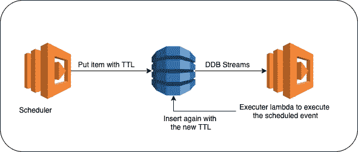

# 基于 DDB 流的 AWS 作业调度

> 原文：<https://betterprogramming.pub/job-scheduling-in-aws-using-ddb-streams-52252d4ba4fa>

## 保持冷静，让 AWS 为您安排时间

柯蒂斯·麦克牛顿在 [Unsplash](https://unsplash.com?utm_source=medium&utm_medium=referral) 上拍摄的照片。

本文是关于使用 AWS 服务来定期调度您的作业。需要这种类型的调度的一些用例包括及时向用户发送通知、检查任务的状态等。

不同的 AWS 服务，如 DynamoDB 流、云观察事件和 SQS，可以用来在 AWS 中实现作业调度。本文重点介绍如何使用 [DynamoDB TTL](https://docs.aws.amazon.com/amazondynamodb/latest/developerguide/TTL.html) 和[流](https://docs.aws.amazon.com/amazondynamodb/latest/developerguide/Streams.html)来调度作业。

# **高级方法**

用 [draw.io](https://www.draw.io/) 制作的照片。

1.  调度器将把要调度的项目放在 DynamoDB 中。该项将被存储，其 TTL 值等于它需要被执行的时间。
2.  为 DynamoDB 启用 DynamoDB 流，以捕获所有数据修改事件并将其发送到 executer lambda。
3.  TTL 过期后，DynamoDB 将删除该项目，并使用 DynamoDB 流向 executer lambda 发送删除事件。
4.  执行器可以对调度的项目执行动作。
5.  如果需要再次调度该项目，可以使用新的 TTL 值将其再次添加到 DynamoDB 中。

# 用 DynamoDB 流和 Executer Lambda 处理错误

DynamoDB 流将重新发送记录，直到它们被 lambda 成功处理(即执行器 lambda 没有抛出异常)或者它们超过了事件源映射上配置的最大期限。在此之前，lambda 不会执行流中的下一个事件。

如果出现由于错误而需要单独处理消息的情况，您可以使用[死信队列](https://docs.aws.amazon.com/AWSSimpleQueueService/latest/SQSDeveloperGuide/sqs-dead-letter-queues.html)(对于亚马逊 SQS)来推送消息，并继续处理流中的剩余项目。

## 该解决方案的优点

1.  使用 Dynamo TTL 允许为调度间隔设置动态值。可以按项目配置调度间隔。
2.  AWS 自动调整流中碎片的数量，因此随着吞吐量的增加，碎片的数量也会相应增加。所以你只需要担心规模。

## 这种解决方案的局限性

1.  根据 DynamoDB TTL 的[官方文档](https://docs.aws.amazon.com/amazondynamodb/latest/developerguide/howitworks-ttl.html)显示，TTL 过期后，一个项目可能需要长达 48 小时才能实际删除。实际时间取决于工作量的性质和表的大小。DynamoDB 流删除事件只有在项目被实际删除后才会被触发。因此，当调度间隔太慢时(如一分钟、五分钟等)，不推荐这种解决方案。)或者当事件调度间隔需要精确时。
2.  DynamoDB 流将交付所有的数据修改事件(例如，插入、更新等。)到执行器 lambda。执行器 lambda 必须过滤删除事件。
3.  如果需要再次安排，将涉及再次插入项目的成本。插入中的任何失败都可能导致该物品的丢失。上述解决方案的概率可以通过配置重试来降低。
4.  DynamoDB 支持 24 小时的保持期。超过 24 小时的数据随时都可能被删除。因此，如果您的用例可能涉及这样的场景，那么 DynamoDB Streams 就不是正确的解决方案。

# 结论

感谢阅读。我希望你喜欢这篇文章！