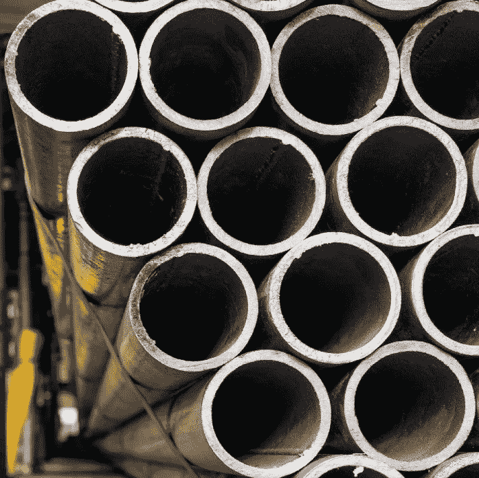
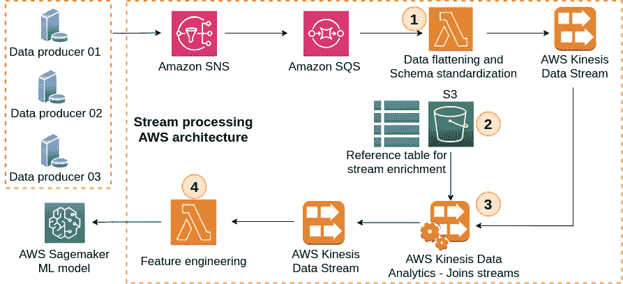
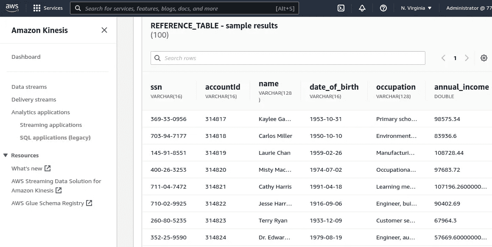
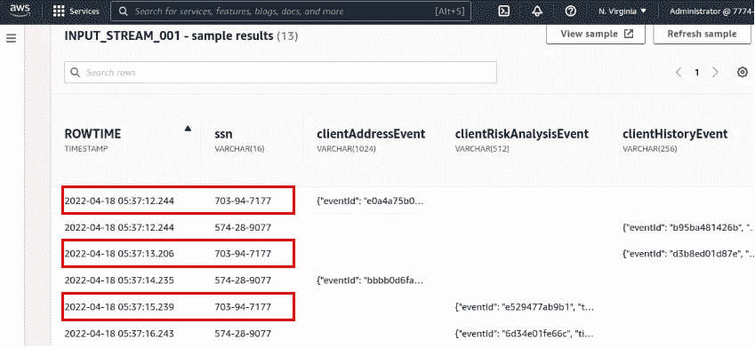
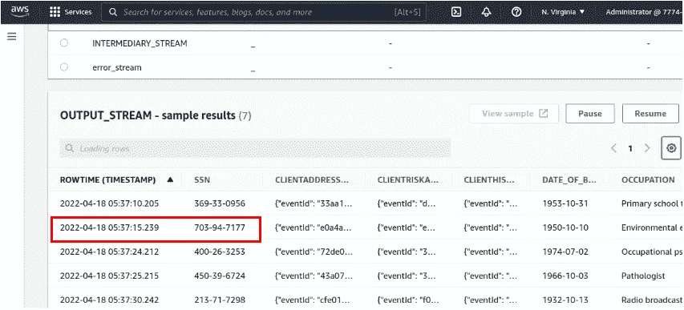
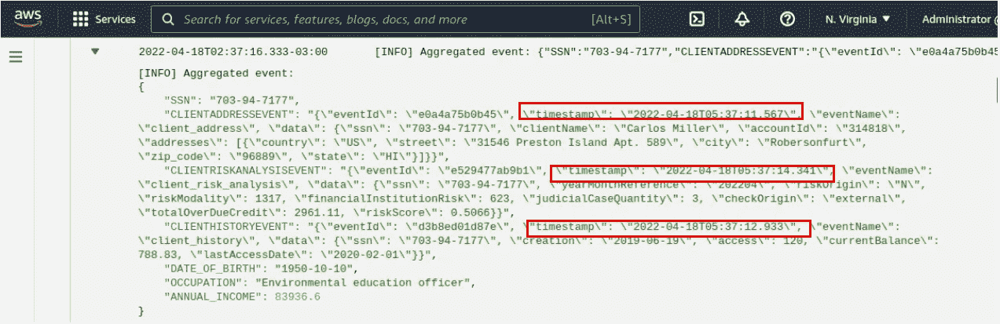

# 通过亚马逊 Kinesis 数据分析(KDA)连接和丰富多组流数据

> 原文：<https://betterprogramming.pub/joining-and-enriching-multiple-sets-of-streaming-data-with-kinesis-data-analytics-24b4088b5846>

## 演示数据管道，展示亚马逊 Kinesis 数据分析服务在实时数据处理方面的强大功能

斯科特·韦伯在 [Unsplash](https://unsplash.com/) 上拍摄的照片

对于当今的企业来说，立即处理和分析从多个设备或微服务流出的数据的能力已经变得非常重要。

在金融、零售和交通工程等领域，实时数据处理可能有助于在线信用分析、基于需求的定价和交通拥堵期间的交通流量改善等任务。

为了进一步探索这个主题，本文展示了一个演示管道，它能够连接来自不同来源的数据流，并将它们的聚合发送到机器学习模型。

此外，应该指出的是，即使这些数据流具有共同的标识符字段，它们也是以从毫秒到一分钟范围内的间隔独立生成的；所以在持久存储中加入它们是复杂且耗时的。

也就是说，让我们看看亚马逊 Kinesis 数据分析(KDA)服务如何用于实时连接和丰富多组流数据。

# 流处理体系结构

下图显示了一个 AWS 架构，它解决了实时连接事件流的问题。值得注意的是，该演示解决方案完全无需服务器，可扩展，并且足够强大，可以支持繁重的工作负载。

图 1:流处理 AWS 架构

让我们一步一步地了解数据之旅的每个阶段，以便弄清楚上图中发生了什么。

## 阶段 01—数据扁平化和模式标准化

如前所述，该解决方案旨在组合在不同时刻生成的给定实体的三个数据事件。然而，KDA 对事件的模式提出了另一个挑战。

根据 Kinesis 数据分析开发者指南，KDA[DiscoverInputSchema](https://docs.amazonaws.cn/en_us/kinesisanalytics/latest/dev/API_DiscoverInputSchema.html)API 不支持嵌套超过两层的 JSON 数据。

换句话说，处理包含两层或更多层嵌套字段的流源数据是开发人员的责任。此外，KDA 应用程序仅将一个流作为输入数据源；因此，当您处理多组流时，这个需求使得流入 KDA 的数据的模式标准化成为必要。

为了解决这些问题，可以在 lambda 内部使用 python 片段代码，通过将事件的整个有效负载转换为 JSON 编码的字符串，来扁平化和标准化任何事件。下图说明了这一过程。

图 2:数据扁平化和模式标准化过程的可视化说明

请注意，在这个阶段之后，两个 JSON 事件具有相同的模式，并且没有嵌套字段。然而，所有信息都被保留了下来。此外，`ssn`字段被放置在标题上，以便稍后用作`join`键。

图 3:扁平化和标准化任何流数据的 Python 代码片段

## 阶段 02 —将存储在亚马逊 S3 中的静态引用表添加到 KDA 应用程序中，以进行流丰富

Kinesis 数据分析的一个很酷的功能是它能够在静态数据集和流动流之间执行 SQL 连接操作。事实上，KDA 将存储在 S3 的 CSV 或 JSON 文件作为参考表，并将其与数据流来源发送的每一条消息相结合。

在这个演示中，静态引用表用于丰富流数据，使其包含更多相关信息，如用户的当前职业、出生日期和年均收入。为了使用 AWS 控制台向 KDA 应用程序添加静态数据源，需要执行以下步骤:

1.  创建一个 **S3 桶**，并将包含参考数据集的 CSV 或 JSON 文件上传到其中。
2.  创建一个 IAM 角色，并将名为`**AmazonS3ReadOnlyAccess**` 的 Amazon 管理的策略附加到它上面。
3.  创建一个 Kinesis 数据分析 SQL 应用程序(遗留)。
4.  在应用程序的主页面中，选择**连接参考数据。**
5.  在**连接引用数据源**页面中，选择包含您的引用数据对象的亚马逊 S3 存储桶，并输入对象的键名称。
6.  输入将在SQL 应用程序中使用的**引用表**的名称。
7.  在**访问所选资源**部分，选择您在第二步中创建的 IAM 角色。
8.  选择**发现模式**。执行此步骤后，AWS 控制台检测引用表中的列名和数据类型。
9.  选择**保存并关闭**。

图 4:在 AWS 控制台中检测到的引用表模式示例

在这个演示解决方案[代码库](https://github.com/gpass0s/streaming-processing-on-aws)中，您可以找到创建整个流处理架构的基础设施，该架构用[*terra form*](https://www.terraform.io/)*编码。*

## 阶段 03 —探索 Kenesis 数据分析应用程序

老实说，在 Kenesis Data Analytics 中编写应用程序并不困难，因为它使用 SQL 概念来执行流数据的实时分析和转换。

虽然，有两个核心概念只存在于亚马逊 Kinesis 数据分析应用程序的上下文中，需要理解；它们是:**在用流**和**在用泵。**

一个**应用内流**基本上是一个连续数据流的表格表示，可以使用 SQL 进行查询。由于有可能在单个 Kinesis 数据分析应用程序中创建许多应用程序内流，应用程序内泵基本上是插入的查询，可将数据从一个应用程序内流持续移动到另一个应用程序内流。

让我们深入研究这个演示解决方案中编写的查询，看看这些概念是如何协同工作的。

图 5: Kinesis 数据分析 SQL 应用程序

从上面的代码中需要指出的要点:

1.  声明了两个流和两个泵。
2.  第 18 行的第一个**应用内泵**将数据从`INPUT_STREAM_001`移动到被称为`INTERMEDIARY_STREAM`的**应用内流**，并对输入数据执行 SQL 连接操作。
3.  `INPUT_STEAM_001`被映射到 Kinesis 数据流，这是 KDA 应用程序的主要流源。
4.  第 18 行陈述的 SQL join 操作使用基于时间的 60 秒滑动窗口，通过 SSN 数组合三个事件。根据 [AWS 文档](https://docs.aws.amazon.com/kinesisanalytics/latest/sqlref/sql-reference-join-clause.html)，基于时间的窗口将窗口定义为行时间列落在查询当前时间的特定时间间隔内的一组行。窗口查询的详细解释可以在[这里](https://docs.aws.amazon.com/kinesisanalytics/latest/dev/windowed-sql.html)找到。
5.  第 34 行中的应用程序泵将`INTERMEDIARY_STREAM`与`REFERENCE_TABLE`相结合，并将查询结果移动到名为`OUTPUT_STEAM`的应用程序流中。第二个泵是必要的，因为 Kinesis 数据分析不直接在流和静态表之间执行窗口查询。
6.  `SELECT`流语句中的列位置必须与应用程序流中声明的位置完全一致。
7.  泵总是将列名中的字母改为大写。这就是为什么第 38、39 和 40 行中列名的字母是大写的。
8.  名为`OUTPUT_STEAM`的应用程序流被映射到一个 Kinesis 数据流，该数据流是 KDA 应用程序的输出。尽管如此，给定的 Kinesis 数据分析应用程序最多可以配置三个目的地。 [AWS 文档](https://docs.aws.amazon.com/kinesisanalytics/latest/dev/limits.html)推荐使用其中一个目的地来保存应用程序中的错误流数据。

## 阶段 04 — Kinesis 数据分析应用程序的输出样本

本节展示了部署在 AWS 环境中的[图 1](https://cdn-images-1.medium.com/max/800/1*R0hwhtSWhp5LmbFsWy1R_g.png) 所示架构的结果。同样，这里给出的整个解决方案可以在这个 [**代码库**](https://github.com/gpass0s/streaming-processing-on-aws) 中获得。

下面的屏幕截图以红色突出显示了给定人员的数据在 Kinesis 数据分析应用程序中的到达时间戳。请注意，这三个事件中的每一个都出现在不同的时间，并且`clientRiskAnalysisEvent`在`clientAddressEvent`之后大约 3 秒到达。

图 6:kine sis 数据分析应用程序输入流示例的屏幕截图

下面的图 7 显示了图 6 中标记的人的聚合信息在 KDA 应用程序的输出中可用的确切时间戳。

因此，我们可以看到连接操作正好发生在第三个事件到达之后；即，即使幻灯片时间窗口被设置为 60 秒，在三个事件获得 Kinesis 数据分析应用程序之后，也立即触发加入查询。

图 7:kine sis 数据分析应用程序输出流示例的屏幕截图

图 8:由 Kinesis 数据分析加入的事件的屏幕截图

上面的截图来自 cloudwatch 日志，该日志通过 Kinesis 数据分析显示了图 6 中同一个人的信息。记住列`date_of_birth`、`occupation`和`annual_income`来自阶段 03 中的参考表。

# 最后的想法

很好，这篇文章展示了亚马逊 Kinesis 数据分析服务对于实时数据处理来说非常强大。

此外，KDA 非常易于使用，无需服务器，可自动扩展，功能强大，适合立即从您的数据中获取商业价值。此外，Kinesis Data Analytic 的定价方法非常简单，在这里[有详细解释](https://aws.amazon.com/kinesis/data-analytics/pricing)。

再一次，在这个[代码库](https://github.com/gpass0s/streaming-processing-on-aws)中，您会发现本文中介绍的整个解决方案已经准备好部署到您的 AWS 环境中。最后，我希望这些信息在必须从多个流数据源生成实时洞察的情况下会有所帮助。