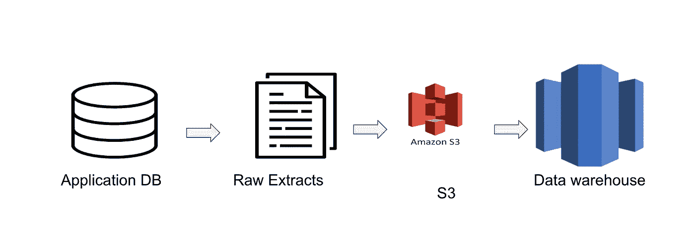
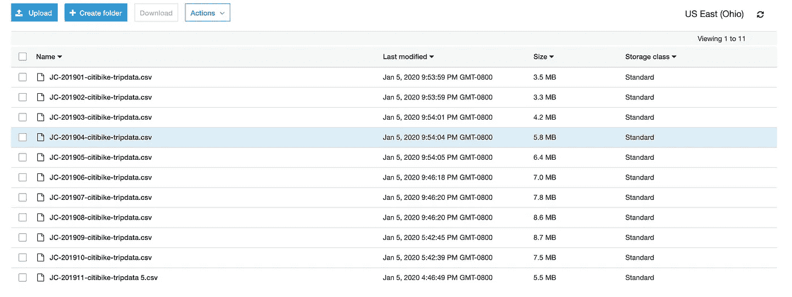
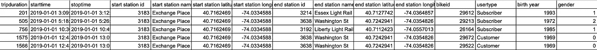
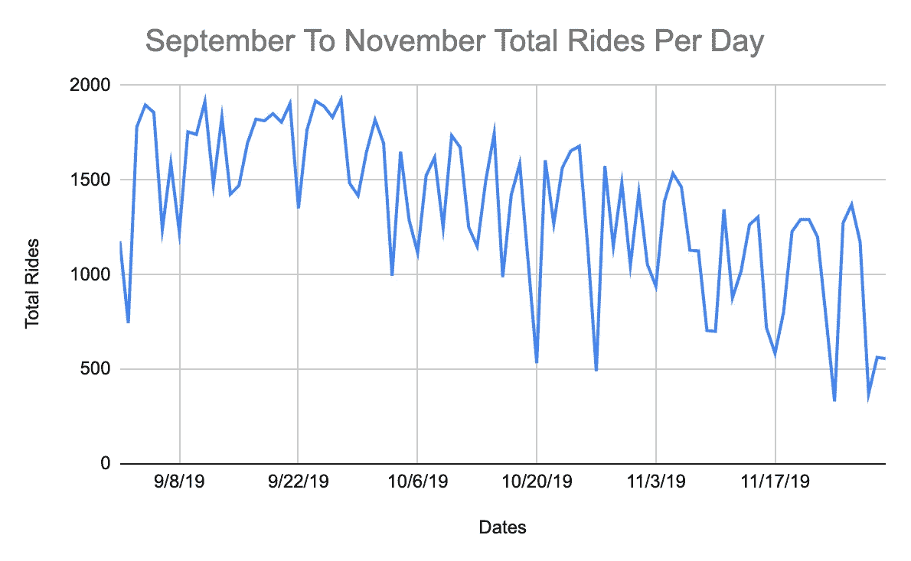
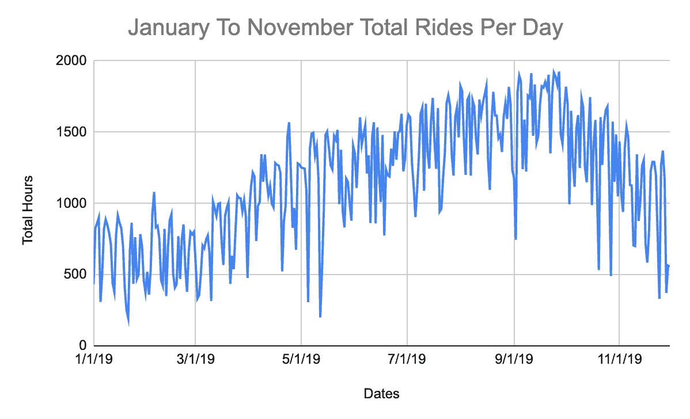
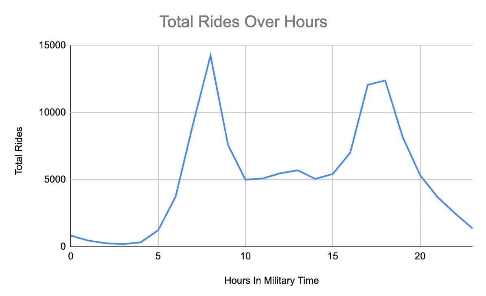
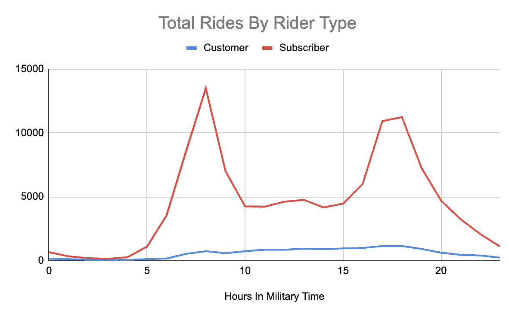
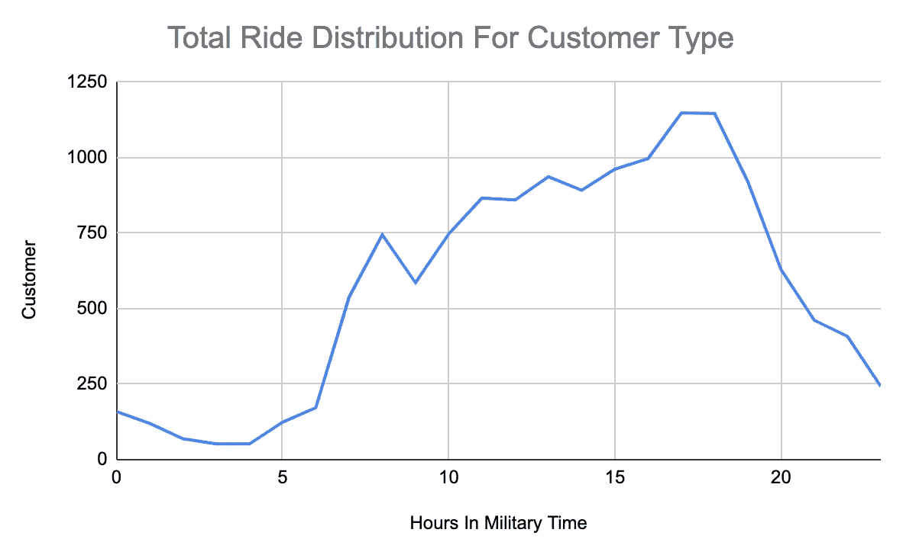
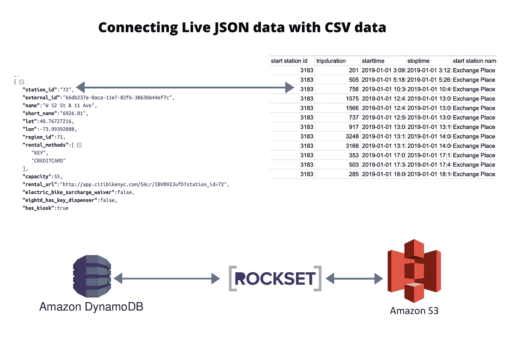
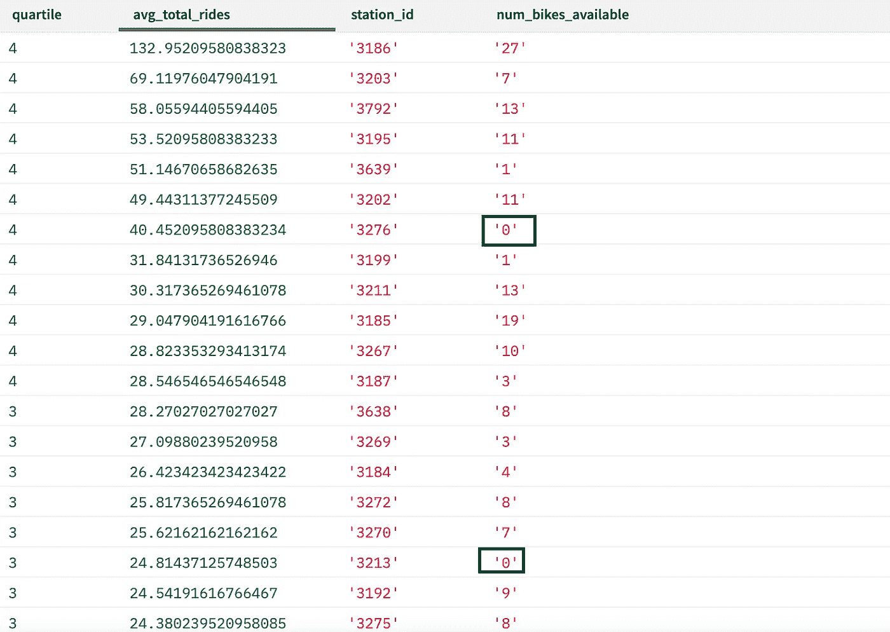

# 连接 DynamoDB 和 S3 中的数据以进行实时特别分析

> 原文：<https://betterprogramming.pub/joining-data-in-dynamodb-and-s3-for-live-ad-hoc-analysis-c4cdd24da082>

## 跨多个云系统使用 SQL

卢克·切瑟在 [Unsplash](https://unsplash.com/s/photos/data?utm_source=unsplash&utm_medium=referral&utm_content=creditCopyText) 上的照片

对于运营团队中的大多数数据科学家和分析师来说，执行即席分析是日常生活的一部分。

他们经常因为无法直接访问数据而受到阻碍，因为数据可能不在数据仓库中，或者可能以不同的格式存储在多个系统中。

这通常意味着数据工程师需要帮助开发可以被访问的管道和表格，以便分析师完成他们的工作。

然而，即使在这里仍然有一个问题。

数据工程师通常需要完成大量的工作，而用于特别分析的数据通常不是优先考虑的。这导致分析师和数据科学家要么什么都不做，要么欺骗他们自己的数据管道。这让他们的时间偏离了他们应该关注的事情。

即使数据工程师可以帮助开发管道，新数据通过管道所需的时间可能会阻止运营分析师在数据发生时进行分析。

老实说，获取数据过去是，现在仍然是大公司的一个主要问题。

幸运的是，现在有很多很好的工具来解决这个问题。为了演示，我们将使用来自纽约市[花旗自行车](https://www.citibikenyc.com/)以及 [S3](https://aws.amazon.com/s3/) 、 [DynamoDB](https://aws.amazon.com/dynamodb/) 和 [Rockset](https://rockset.com/) 的免费在线数据集，这是一个实时云数据存储库。

# 花旗自行车数据、S3 和 DynamoDB

为了设置这些数据，我们将使用来自[花旗自行车骑行数据](https://s3.amazonaws.com/tripdata/index.html)以及[车站数据](https://gbfs.citibikenyc.com/gbfs/en/station_information.json)的 CSV 数据。

我们将把这些数据集加载到两个不同的 AWS 服务中。具体来说，我们将使用 DynamoDB 和 S3。

这将允许我们证明这样一个事实，即有时很难在同一个查询引擎中分析来自这两个系统的数据。此外，DynamoDB 的台站数据以 JSON 格式存储，这种格式可以很好地与 DynamoDB 配合使用。这也是因为车站数据更接近实况，似乎每 30 秒到 1 分钟更新一次，而实际自行车骑行的 CSV 数据每月更新一次。我们将了解如何在不构建复杂数据基础设施的情况下，将这种近乎实时的台站数据纳入我们的分析中。

将这些数据集放在两个不同的系统中也将展示工具可以派上用场的地方。[例如，Rockset 能够轻松连接不同的数据源，如 DynamoDB 和 S3](https://docs.rockset.com/amazon-s3/) 。

对于数据科学家或分析师来说，这可以更容易地执行即席分析，而不需要首先转换数据并将其放入数据仓库。

话虽如此，让我们开始研究花旗自行车的数据。

# 在没有数据管道的情况下加载数据

游乐设备数据以 CSV 格式存储在每月文件中，这意味着我们需要提取每个文件以获得全年的数据。

对于那些习惯于典型的数据工程过程的人来说，你将需要建立一个管道来自动检查新数据的 S3 桶，然后将它加载到像[红移](https://aws.amazon.com/redshift/)这样的数据仓库中。

数据将遵循与下图相似的路径。

图片来源:SeattleDataGuy

这意味着你需要一个数据工程师来建立一个管道。

然而，在这种情况下，我不需要建立任何类型的数据仓库。相反，我只是将文件加载到 S3 中，然后 Rockset 将它们作为一个表来处理。

即使有三个不同的文件，Rockset 也将每个文件夹视为自己的表。有点类似于其他一些数据存储系统，它们将数据存储在分区中，而分区本质上就是文件夹。

不仅如此，当你在末尾增加一个新的栏目时，它也没有崩溃。相反，它只是清空了没有所述列的行。这很好，因为它允许添加新列，而不需要数据工程师更新管道。

# 分析花旗自行车数据

一般来说，一个好的开始方式是简单地绘制数据，以确保它有点意义(以防你有坏数据)。

我们将从储存在 S3 的 CSV 开始，我们将绘制出每月自行车的使用情况。

## 游乐设备数据示例

首先，我们将绘制 2019 年 9 月至 2019 年 11 月的乘坐数据。以下是这个查询所需的全部内容。

你会注意到的一件事是，我把`datetime`变回了一个字符串。这是因为 Rockset 存储的`datetime`日期更像一个对象。

根据这些数据，我绘制了图表。可以看到合理的使用模式。如果我们真的想深入研究这个问题，我们可能会研究是什么推动了下跌，看看是否有某种模式，但现在。我们只是想看到总的趋势。

假设您想要加载更多的历史数据，因为这些数据看起来非常一致。

同样，不需要将更多数据加载到数据仓库中。你只需把数据上传到 S3，它就会被自动提取。

你可以看看下面的图表，了解更久远的历史。

从分析师或数据科学家的角度来看，这很好，因为我不需要数据工程师来创建一个管道来回答我关于数据趋势的问题。

看上面的图表，我们可以看到一种趋势，在冬天、春天和秋天，骑自行车的人似乎越来越少，但在夏天，这种趋势有所抬头。这是有道理的，因为我不认为纽约下雨时会有很多人想出门。

总而言之，这个数据通过了 gut 检查，所以在加入数据之前，我们将从更多的角度来看它。

## 按小时计算的乘车分布是怎样的？

我们的下一个问题是每小时的乘车分布情况。

要回答这个问题，我们需要从开始时间中提取小时。这就需要 SQL 中的`EXTRACT`函数。无论具体日期是什么，您都可以使用该小时进行平均。我们的目标是看到骑自行车的分布。

我们不打算从查询的角度来看我们采取的每一个步骤，但是你可以看看下面的查询和图表。

正如你所看到的，人们骑自行车显然是一种趋势。具体来说，早上有浪涌，晚上又有浪涌。当需要知道什么时候是进行维护的好时机，或者自行车架什么时候可能会用完时，这是很有用的。

但是也许在这种特殊的分布背后还有其他的模式。

## 不同的骑车人什么时候骑自行车？

继续这个想法，我们也想看看是否有每个骑手类型的特定趋势。这个数据集有两种附加类型:三天客户通行证和年度订阅。

我们保留了小时提取并添加到乘坐类型字段中。

看下面的图表，我们可以看到小时数的趋势似乎是由订户客户类型驱动的。

然而，如果我们检查客户附加条款类型，我们实际上有一个非常不同的附加条款类型。不是有两个主峰，而是全天有一个缓慢上升的峰值，大约在 17:00 到 18:00(下午 5-6 点)达到峰值。

在这里探究为什么会很有趣。是因为购买三日通票的人在最后一刻才使用它吗？或者他们可能在某个特定的地方使用它。这种趋势看起来每天都是不变的吗？

# 连接 S3 和 DynamoDB 的数据集

最后，让我们加入来自 DynamoDB 的数据，以获得关于自行车站的更新。

我们想这样做的一个原因是，找出哪些站点经常没有自行车，并且流量很大。这可能会限制骑车人获得自行车，因为当他们去买自行车时，自行车不在那里。这将对可能希望自行车存在的订户产生负面影响。

下面是一个查询，查看每个起点站每天的平均乘车次数。我们还添加了一个四分位数，这样我们就可以查看平均乘坐次数的上四分位数，看看是否有空站。

我们在下面列出了输出，正如您所看到的，与其他站点相比，有两个站点目前是空的，自行车使用率很高。我们建议在几周的时间里跟踪这种情况，看看这是否是一种常见现象。如果是这样，那么花旗自行车可能会考虑增加更多的站点，或者想办法重新定位自行车，以确保客户始终有骑行。

作为运营分析师，能够实时跟踪哪些使用率高的站点自行车使用率低，可以更好地协调可能有助于在城镇周围重新分配自行车的团队。

rockset[从 DynamoDB](https://medium.com/better-programming/5-real-life-use-cases-for-dynamodb-a152a9d152e2) live 等应用程序数据库读取数据的能力可以提供对数据的直接访问，而无需任何形式的数据仓库。这避免了等待每日管道来填充数据。相反，你可以直接读取这些数据。

# 实时即席分析有助于改善运营

无论您是数据科学家还是数据分析师，等待数据工程师和软件开发人员创建数据管道的需求都会降低即席分析的速度。尤其是随着越来越多的数据存储系统被创建，这只会使管理数据的每个人的工作变得更加复杂。

因此，能够轻松地访问、连接和分析不在传统数据仓库中的数据可以证明是非常有帮助的，并且可以导致像关于空自行车站那样的快速洞察。