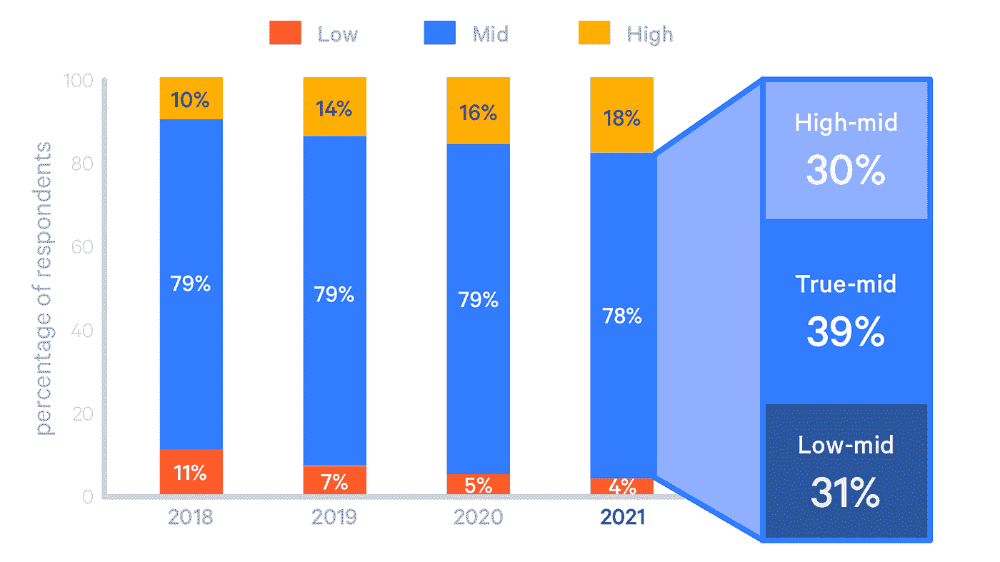
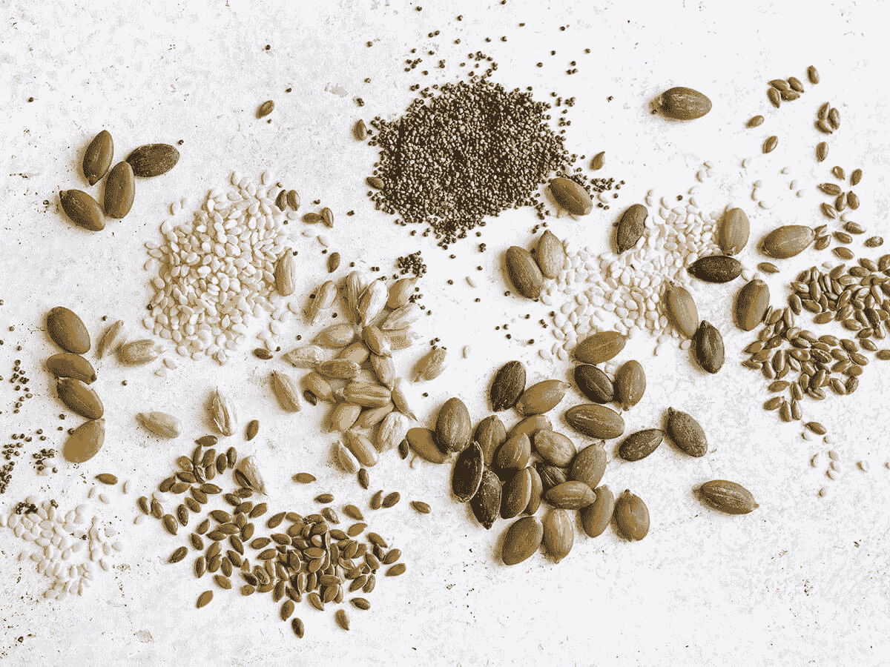

# DevOps 领域之旅:从早期采用到复杂架构

> 原文：<https://betterprogramming.pub/journey-into-the-realm-of-devops-from-early-stage-adoption-to-complex-architecture-d18ba4c4c4f0>

## 公司什么时候开始承认“DevOps”是一种文化？

从傀儡的 DevOps 2021 年的状态

你可以在 LinkedIn 上看到 DevOps 工程师的职位空缺。虽然这只鞋可能合适，但是维护基于 DevOps 的文化的责任落在了整个工程部门的肩上:包括 QE 工程师、软件开发人员和安全团队。CICD 的自动化测试需要质量工程师的大力支持；包裹扫描/许可证扫描/ SAST / DAST 扫描可能需要安全团队的建议。提醒:DevOps 的目标是为软件开发者赋能。这是通过协作完成的。

**DevOps 领养**

基于 DevOps 概念，贵公司的采用等级不同。例如，部署可能比瀑布更频繁，但是您还没有在云中。

**第一阶段**

第一阶段的公司通常要么隶属于政府，要么是老牌公司。由于不需要根除现有的技术债务，新公司通常在较晚的阶段开始。在第一阶段，公司:

*   瀑布式部署:每隔几个月左右就会进行一次包含许多票证的大型部署。解决 bug 的平均时间更长，出错的几率也更高
*   内部架构:云托管架构允许公司按照自己的节奏进行扩展，而无需咨询提供商、产品可用性和安装时间。机器可以立即运行。法规遵从性可能要求政府或政府附属公司在自己的场所或数据中心托管服务器
*   整体存储库——代码库是巨大的。这增加了服务本身的规模，增加了构建所需的时间，并且也不必要地消耗了资源
*   安全——这只是一个遥远的梦想…
*   监控和警报—不设置警报；警报通常由客户报告，客户通常会将热修复周期排队等待完成

# **从阶段 1 过渡到阶段 2**

大趋势是从内部或数据中心托管基础架构转向云托管。这涉及到清点我们所有的基础设施，并记录所有的生活垃圾。这包括防火墙、程序、用户、组、文件和作品。从那里，我们开始从开发者环境开始构建。开发人员慢慢融入了云平台的使用。创建了 QA、暂存和 UAT。生产中不面向客户端的服务器被转移。我们捕获了服务器的映像，并在 EC2 实例上进行安装

主要举措是迁移到云平台以提高可扩展性。我们聘请了 QE 的工程师来测试和确认每项服务是否正常运行。

# **第二阶段**

在第二阶段，公司开始理解并游说 DevOps 原则。

*   云计算——如果没有云，实现 DevOps 原则可能不是不可能的，但这将非常困难。迁移到云将加快贵公司获得更多资源的速度，同时也为 DevOps 团队提供了云平台内的多种服务。在第 2 阶段，您的部门可能正在云中创建较低的环境，供开发人员进行测试。然后，可以创建一个与现有环境相一致的生产环境。首先在生产中将低风险、低影响的服务转移到云(例如:面向内部的服务)
*   部署是手动的，但发生得更频繁——有一个额外的角色和责任专门负责发布管理。部署由该人员维护。
*   警报是合成的——基本正常运行时间和停机时间通过 Pingdom 等工具进行跟踪。当停机发生时，状态页可以通知客户。
*   新的服务正在以微服务的形式创建—随着工程部门认识到创建微服务的好处，从添加到整体式存储库到创建新的微服务出现了转变。在这个阶段，有计划打破铁板一块的服务，但它还没有完全发生。
*   清点安全—安全部门清点了基础架构，并开始评估需要保护的内容。正在根据需求创建积压。

# **从阶段 2 到阶段 3 的过渡**

从第 2 阶段到第 3 阶段的过渡涉及整个部门的计划，以将 DevOps 作为一种文化，而不是一个孤立的团队。在开发方面，我们的团队开始认可整体架构，并开始创建微服务，以实现更高的水平可伸缩性和更快的速度

一些小推:

*   创建合成警报
*   记录和盘点可用的测试

# **第三阶段**

*   云服务—内部可能还有一两项服务。大多数情况下，所有服务都在云中。
*   部署—到第 3 阶段，部署可能每周进行一次。有一个从需要有人管理发布到自助发布的转变:由开发团队来维护。授权开发人员维护版本允许向 CICD 转移。
*   过渡到微服务—工程团队正在分解整体式存储库。工程师们正在使用一个专用的软件架构来创建大型微服务。
*   手动任务清单—开发运维团队正在创建手动完成的任务的积压单，并根据影响程度分配优先级。从管理的角度来看，公司开始经历一个待办事项细化过程，围绕优先级进行对话。
*   手动测试——QE 团队正在进行手动测试和记录。这既费力又耗时。QE 工程师可能有兴趣进入开发角色，这为潜在的 SDETs 铺平了道路。

# **从阶段 3 过渡到阶段 4**

我们的团队开始实施 CI/CD——创建管道并教育开发人员维护管道

我们唯一的 DevOps 计划是可观察性:围绕服务创建警报和监控。

*   开始开发应用程序入职流程
*   利用可用的安全资源。例如，在仓库中对漏洞进行包扫描

# **第四阶段**

*   容器化— DevOps 团队正在转向容器化，并集成 Kubernetes 来执行容器编排。使用容器允许水平扩展自动化，特别是利用 Kubernetes 中的部署和水平 pod 自动缩放器。容器是轻量级的，并且只执行一项任务，这使得它们可以快速而容易地构建。
*   微服务架构—服务是轻量级的。为了引用当前的代码库，公司可能已经开始集成一个工件库，比如 JFrog。
*   站点可靠性原则——基于 Google 手册，正在与站点可靠性工程师和开发团队讨论 SLA、SLO 和 SLIs。sre 正在开发操作手册或行动手册，拥有完善的事件响应计划，并与开发团队一起运行行动手册。
*   出现一致的发布——发布周期已经成为自助服务，允许开发团队管理他们自己的发布和潜在的热修复，而无需 DevOps 工程师或发布经理的帮助。每个团队都有一名 QE 工程师负责沟通，以确保发布通过基本检查。
*   可观察性— DevOps 团队已经创建了用于监控微服务和进行日志管理的仪表板。他们已经为指标创建了一个标准的标记约定，可以很容易地从平台上获取。为容器监控和日志创建初始仪表板，并建立标记约定，为应用程序上线过程铺平了道路。
*   安全左移—流程审核、集装箱图像审核和扫描、SAST / DAST 扫描正在部署管道中进行。仍然有大量的软件包漏洞需要修复。

# **从阶段 4 过渡到阶段 5**

我还不确定…

我认为这将包括将服务目录整合到组合中。应用程序启动将被标准化，以拥有自助式部署管道、警报、监控、日志记录、SLIs、SLO 和 SLA。

**第五阶段**

手里拿着玛格丽塔酒在沙滩上度假。

一些提醒让你知道你还活着，有工作。

开玩笑的。

我没有在采用第 5 阶段 DevOps 实践的公司工作过，但是我积极地在一个高级团队中工作。我想象第 5 阶段的 DevOps 团队可以充分地辨别他们的需求，并挑选新出现的产品，以找到有效的产品。这些团队已经完全实现了持续集成和持续部署。

单元测试、负载测试、包扫描、许可证扫描以及 SAST 和 DAST 已经被引入到部署中。这将涉及质量工程师、安全团队和软件开发人员的工作。向产品发布节奏可能会很快。

站点可靠性工程师和 DevOps 工程师联手实施定期的混沌工程(灾难恢复的行话)演习。我还可以想象团队已经开发了“紫色团队”，这是开发、DevOps 工程师和安全团队之间的合作成果，以更早地转移安全实践。

由于突破性的改变被发布，很可能不可能自动化所有的事情，但是你可以梦想。