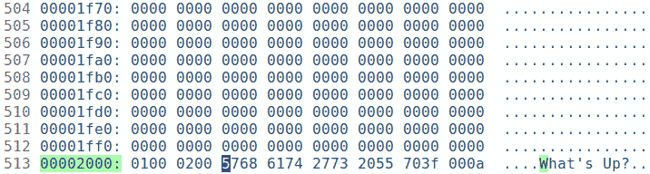
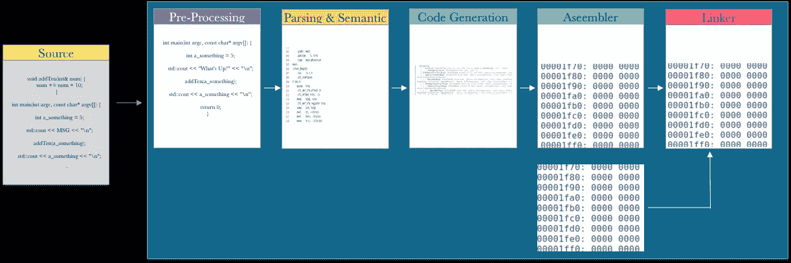
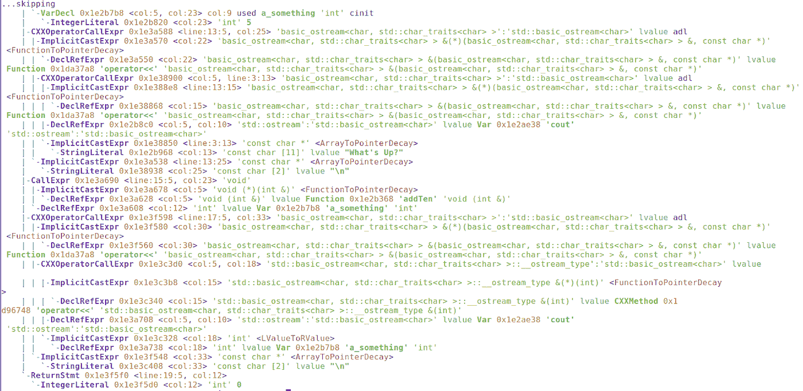
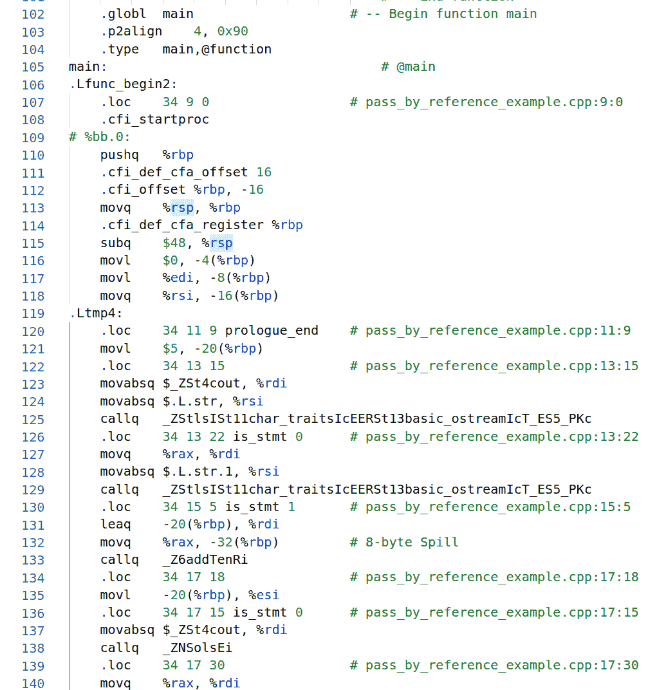
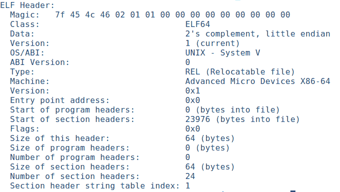
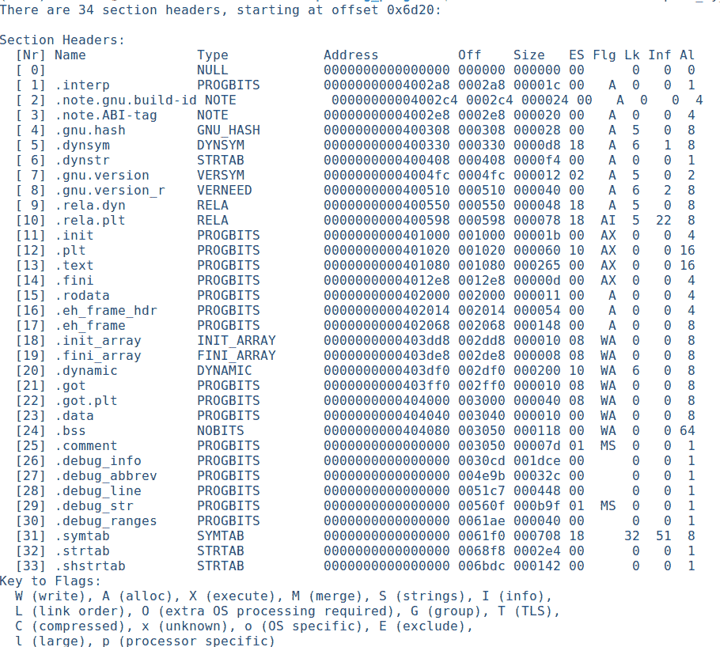
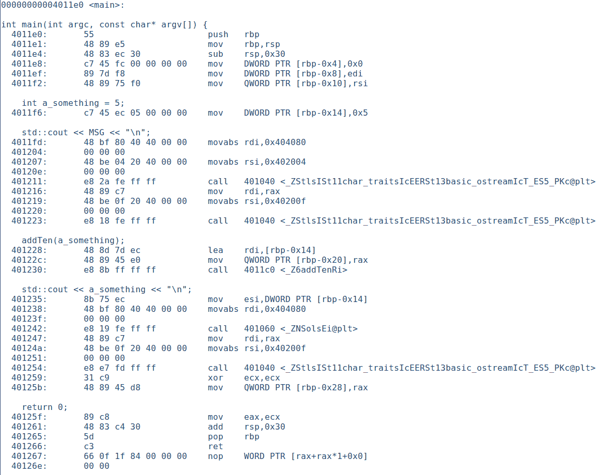
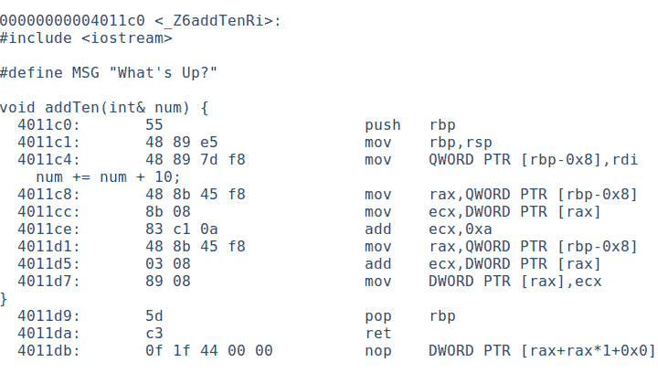
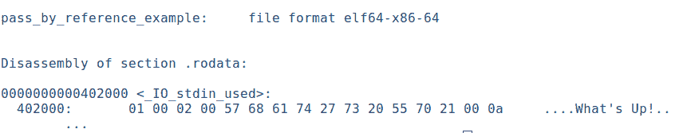
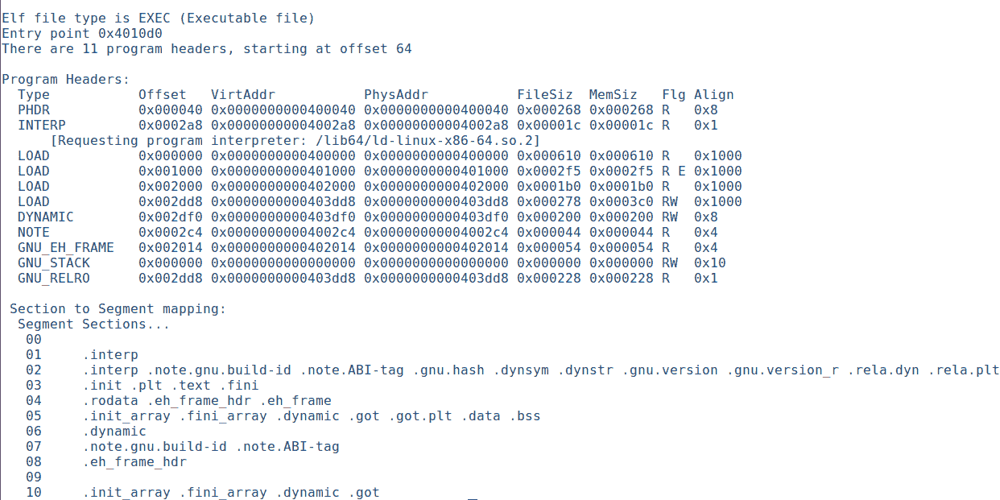

# 单行编译代码的旅程是什么样的？

> 原文：<https://betterprogramming.pub/journey-of-a-line-of-complied-code-b37c4a8deb0>

## 看看将源代码转换成可执行格式的完整过程


照片由[Max b ttinger](https://unsplash.com/@maxboettinger?utm_source=medium&utm_medium=referral)在 [Unsplash](https://unsplash.com?utm_source=medium&utm_medium=referral) 上拍摄

在高层次上，我将看到使用 Clang 编译一个简单 C++程序的每个阶段的输出。我还将更仔细地研究反汇编输出中的简单代码，并讨论 ELF 文件的各个部分。

当你完全编译你的程序时，它会产生一个可执行的二进制文件。例如，这个简单的程序…

…产生二进制代码。类似这样的内容(在十六进制编辑器中查看):



可执行二进制

如果您运行这个程序，输出如下:

```
What’s Up?
20
```

此时，所有的代码和数据都被转换成计算机可以执行的适当格式的二进制文件。这对我们来说不是那么容易理解，但是为了得到更好的理解，你可以改变这个程序的静态字符串部分，在执行时输出不同的东西。

例如，在这个二进制文件中，我将代表字符串`What’s Up?`的代码`5768 6174 2773 2055 703f 000a`更改为`576f 6e64 6572 6675 6c21 000a`，运行修改后的二进制文件将产生输出:

```
Wonderful!
20
```

是啊！太棒了，不是吗？

我不知道——我应该担心吗？这只是交换一些 ASCII 码而已。改变行为会困难得多，所以没什么好担心的。

不管怎样，我们讨论了获取源文件并将其编译成二进制文件的过程。不过，我会保持高度警惕。

将源代码转换成可执行格式需要几个阶段。您可以从 Clang 文档中看到，所涉及的步骤是:

```
1\. [Pre-Processing](#4f9b)
2\. [Parsing and Semantic Analysis](#ad85)
3\. [Code Generation and Optimization](#0b95)
4\. [Assembly](#3f63)
5\. [Linking](#b8ff)
```



编译阶段

让我们看看上面每个阶段的输出。

# 预处理

Clang 文档对此的描述是:

> 此阶段处理输入源文件的标记化、宏扩展、#include 扩展以及其他预处理程序指令的处理

这个阶段结束时我们程序的输出显示宏被扩展了。注意我们有`std::cout << “What’s Up?” << “\n”;`，而原始代码是`std::cout << MSG << “\n”;`。

```
…..namespace std __attribute__ ((__visibility__ (“default”))){# 60 “/usr/bin/../lib/gcc/x86_64-linux-gnu/9/../../../../include/c++/9/iostream” 3extern istream cin;
extern ostream cout;
extern ostream cerr;
extern ostream clog;
extern wistream wcin;
extern wostream wcout;
extern wostream wcerr;
extern wostream wclog;
static ios_base::Init __ioinit;
}# 2 “pass_by_reference_example.cpp” 2void addTen(int& num) {num += num + 10;}int main(int argc, const char* argv[]) {int a_something = 5;std::cout << “What’s Up?” << “\n”;addTen(a_something);std::cout << a_something << “\n”;return 0;}
…
```

**注:**我不得不剪辑了很多上衣的线条。这是 C++模板的东西。

# 解析和语义分析

Clang 文档对此的描述是:

> 该阶段解析输入文件，将预处理标记翻译成解析树。一旦采用解析树的形式，它就应用语义分析来计算表达式的类型，并确定代码是否格式良好。这个阶段负责生成大多数编译器警告和解析错误。这个阶段的输出是一个‘抽象语法树’(AST)。”

这个阶段产生了 AST。您可以看到像`a_something`这样的变量是如何在层次结构中表示的。我们代码的其余部分也是如此。同样，我删除了许多行，这样输出就保持在熟悉和简单的范围内。



大西洋时间

# 代码生成和优化

Clang 文档对此的描述是:

> “这个阶段将 AST 翻译成低级中间代码(称为‘LLVM IR’)，并最终翻译成机器代码。这个阶段负责优化生成的代码，并处理特定于目标的代码生成。这一级的输出通常称为“a”。s”文件或“程序集”文件。

这个阶段最终产生特定于目标的汇编代码。我将插入输出的截屏，但是，在本文的后面，我们可以从`objdump`遍历汇编代码，因为它将代码与汇编交错。这就是我们要遵循的一些代码。



装配输出

# 装配

Clang 文档对此的描述是:

> 这个阶段运行目标汇编程序，将编译器的输出翻译成目标目标文件。这一级的输出通常称为“a”。“o”文件或“对象”文件。

汇编程序产生一个目标文件。我们的平台是 Ubuntu——因此，为这个平台生成的目标文件的类型是 ELF。具体来说，就是:

```
ELF 64-bit LSB relocatable, x86–64, version 1 (SYSV), with debug_info, not stripped
```

这是一个可重定位的文件，因此并不是所有的内存地址都能被解析。下面的截图是 ELF 文件的头信息:



目标文件的 ELF 头

正如你在上面看到的，`Entry point address`是`0x0`，因为它还不是一个可执行文件，不知道它的虚拟地址空间的入口点。

# 连接物

Clang 文档对此的描述是:

> 此阶段运行目标链接器，将多个目标文件合并到可执行文件或动态库中。这一阶段的输出通常称为“a.out”。dylib 或。所以“文件”

最后，链接器获取目标文件并创建一个可执行文件，解析可解析的地址。

ELF 二进制文件由一个可执行文件头、零个或多个程序头以及零个或多个节头组成。让我们简单看一下组件。

## 可执行文件头

下面的截图显示了我们的可执行文件的 ELF 头输出。它为我们提供了关于文件类型的信息，在哪里可以找到文件中的其他内容，等等。

`Magic`字段是一个 16 字节的数组，有一个 4 字节的幻值，表示这是一个 ELF 文件。


可执行文件的 ELF 头文件

正如您现在从上面的头输出中看到的，它现在有了一个入口点:`0x4010d0` **，**虚拟内存地址，执行应该从这里开始。其类型是可执行的。

## 部分

区段以逻辑方式组织数据和代码。它们为链接器提供了一个有组织的视图。让我们使用 readelf 来研究二进制文件中的各个部分。



部分

我想我们可以看看一些比较有名的部分:

`**.text**`

`.text`包含主要的可执行代码。有很多输出，所以我只展示我们可以识别的几个截图。让我们从 ELF 头中找到的入口点地址开始。以下是对此的反汇编:


开始方法

所以这并不是我们的主要功能——这是一些`_start`，可能是设置和/或初始化程序。

寄存器`rdi`用于传递第一个参数，这是我们主函数的地址，如下图所示。

```
4010f1: 48 c7 c7 e0 11 40 00 mov rdi,0x4011e0
```



主方法的分解

我们可以看到`a_something`是在`[rbp-0x14]`创建的，它的值被设置为`0x5`。

```
int a_something = 5;4011f6: c7 45 ec 05 00 00 00 mov DWORD PTR [rbp-0x14],0x5
```

在我们的代码中，我们调用`addTen`并将`**a_something**`的引用传递给它。它的拆卸是:

```
addTen(a_something);401228: 48 8d 7d ec    lea rdi,[rbp-0x14]
40122c: 48 89 45 e0    mov QWORD PTR [rbp-0x20],rax
401230: e8 8b ff ff ff call 4011c0 <_Z6addTenRi>
```

不确定`40122c`行通过将 temp `rax`移动到`[rbp-0x20]`完成了什么，但是我们知道`lea`正在加载`[rbp-0x14]`的有效地址——即`a_something`的地址到`rdi`，它用于传递第一个参数并调用`addTen`方法:



addTen 方法的反汇编

这里正在进行指针记账:`rbp`是基指针，`rsp`是始终指向栈顶的栈指针。

```
4011c0: 55       push rbp
4011c1: 48 89 e5 mov rbp,rsp
```

`rdi`保存着`a_something`的地址。该地址现在被复制到`[rbp-0x8]`，然后进一步复制到`rax`寄存器。

```
4011c4: 48 89 7d f8 mov QWORD PTR [rbp-0x8],rdi
4011c8: 48 8b 45 f8 mov rax,QWORD PTR [rbp-0x8]
```

现在，`a_something`地址的内容被复制到`ecx`寄存器。

```
4011cc: 8b 08 mov ecx,DWORD PTR [rax]
```

`0xa`是十进制的 10，它被加到`ecx`的内容中，其中保存了`a_something`的值。

```
4011ce: 83 c1 0a add ecx,0xa
```

现在结果被放置在`rax`寄存器中的地址:

```
4011d7: 89 08 mov DWORD PTR [rax],ecx
```

有趣的是，Clang 输出的汇编扩展了 msg 宏，但是`objdump`汇编输出保持了它的完整性。

`**.rodata**`

此部分包含只读数据。所以，对我们来说，它有我们的味精字符串。



。罗达塔

`**.bss**`

它保存未初始化的数据。

## 片段

段提供了操作系统和动态链接器用来设置和加载进程以供执行的信息。我们的流程看起来是这样的:



片段

`LOAD`类型是要加载到存储器中的段。我们可以看到包含我们的主代码的段在段`03`中，由段`.init`、`.plt`、`.text`和. fini 组成。

我们的`.rodata`在段`04` — `.rodata`、`.eh_frame_hdr`、`.eh_frame` —设置为 read (R)。

# 结论

暂时就这样了。显然，有很多东西需要理解和深入，但获得一个整体的看法本身也很有趣。如果有机会，我会写下这个小过程在记忆中的样子。

# 参考

 [## Clang 12 文档

### clang 是一个 C，C++和 Objective-C 编译器，它包含预处理，解析，优化，代码生成…

clang.llvm.or](https://clang.llvm.org/docs/CommandGuide/clang.html)