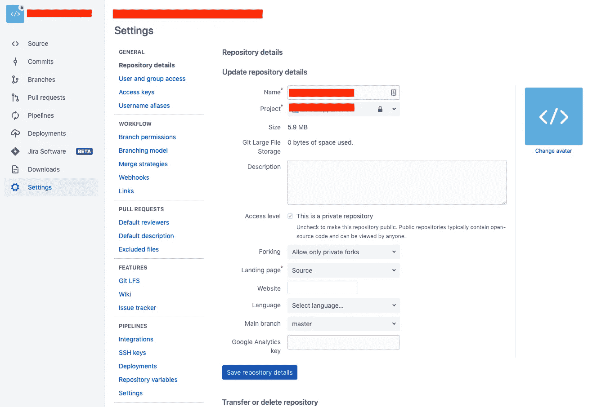
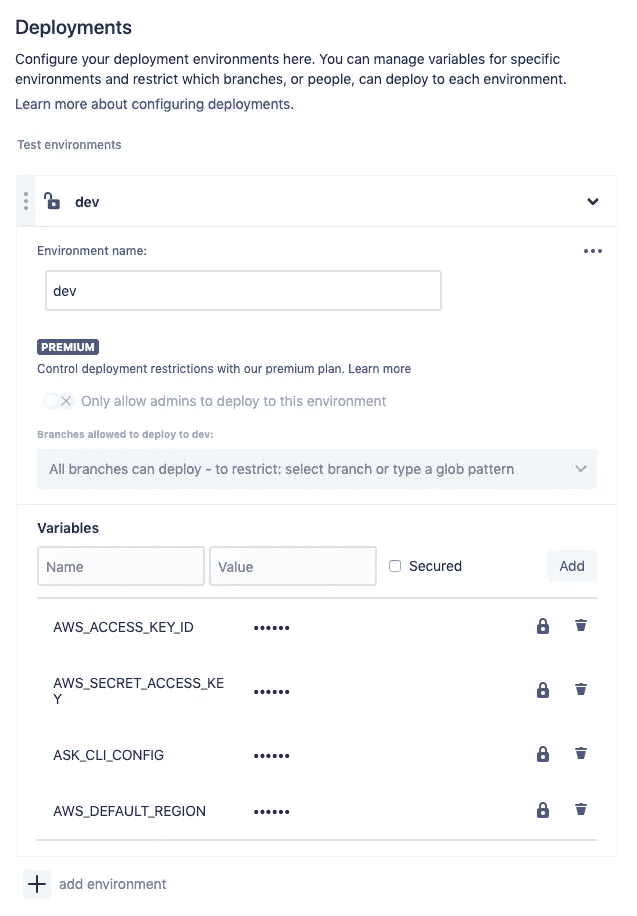
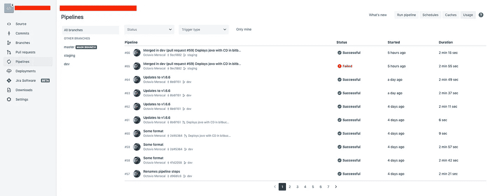
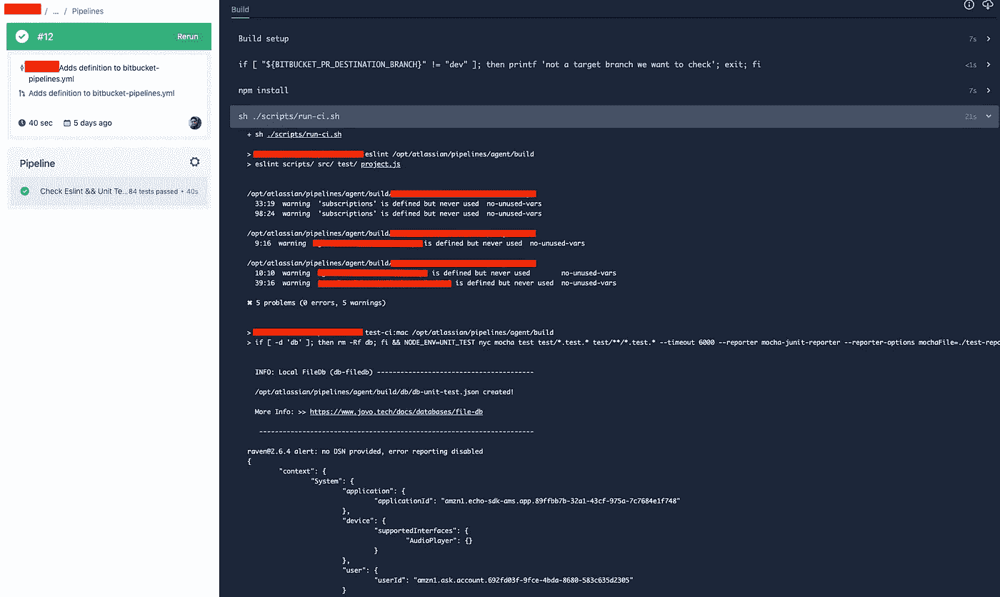
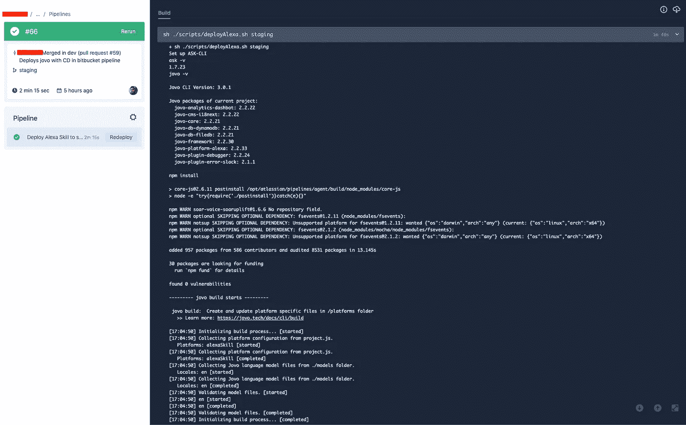

# 带位桶管道 CI/CD 的 Jovo CLI

> 原文：<https://betterprogramming.pub/jovo-cli-with-bitbucket-pipelines-ci-cd-a0420b810031>

## 设置您的 Bitbucket 存储库以部署您的 Jovo voice 应用程序

泰勒·拉斯托维奇在 [Unsplash](https://unsplash.com/photos/xmJ1sOzftdI) 上拍摄的照片

在本文中，我将向您展示如何使用 [Jovo](https://www.jovo.tech/) 设置 Bitbucket 管道来进行持续集成/持续部署(CI/CD)。

几个 Git 存储库包括运行 CI/CD 任务的工具:

*   GitHub 有[动作](https://github.com/features/actions)
*   Bitbucket 有[管道和部署](https://bitbucket.org/product/features/pipelines)
*   GitLab 有 [CI/CD](https://about.gitlab.com/stages-devops-lifecycle/continuous-integration/)

我正在学习 Alexa 技能，并将我的项目保存在 Bitbucket 中。在使用 CI/CD 进行自动部署之前，在将代码推送到我的存储库中的`dev` / `staging` / `master`分支之后，我在控制台中运行了以下 Jovo 命令:

*   `jovo deploy — stage dev`
*   `jovo deploy -p alexaSkill — stage dev -t info`
*   `jovo deploy -p alexaSkill — stage dev -t model`
*   `jovo deploy -p alexaSkill — stage dev -t lambda`

每次推送代码时，我都是以相同的顺序运行这些命令。因此，这一过程通过 CI/CD 管道实现自动化非常好。下面解释了我为配置 Bitbucket 管道所做的工作。

# 1.配置 bitbucket-pipelines.yml 文件

当您使用 Bitbucket 时，您可以在根文件夹中添加一个名为`bitbucket-pipelines.yml` 的文件来保存 CI/CD 指令。这是我存储库中的文件:

该文件有两个特殊部分:

*   **Pull requests:** 每当您打开一个针对`dev`分支的 Pull 请求时，就会运行一个脚本来安装 npm 包并运行`run-ci.sh`文件。

我的`run-ci.sh`文件只有这五行:

*   **分支:**每次您合并一个拉请求或者发送一个直接提交到这些分支中的任何一个，一系列的任务将会以它们各自的配置运行。这些配置是我们在 Bitbucket、要使用的 Docker 映像和`deployAlexa.sh`脚本中创建的部署。

此外，在每个部署步骤中，您将看到所使用的 Docker 映像:`omenocal/jovo-deploy`。你可以在这个[链接](https://hub.docker.com/r/omenocal/jovo-deploy)找到。此 Docker 映像是使用以下存储库构建的:

 [## 实施/jovo-部署-容器

### 基于 node:alpine 的 docker 映像，用于以 AWS 为目标的 CI/CD 管道。包括 AWS cli、node、python、git…

github.com](https://github.com/theBenForce/jovo-deploy-container) 

大声呼喊 [Ben Force](https://medium.com/u/10d9716ff658?source=post_page-----a0420b810031--------------------------------) 创造了这个 Jovo Docker 形象！

我克隆了存储库并创建了自己的 Docker 映像，没有做任何更改。如果你想在自己的 Docker 账户中拥有自己的形象，你可以这样做。在这个[链接](https://community.atlassian.com/t5/Bitbucket-questions/How-do-I-create-a-docker-image-for-Bitbucket-Pipelines/qaq-p/334724)中，您可以找到创建 Docker 映像的说明。

由于这个映像安装在 CD 进程中，我们可以使用 ASK CLI 和 Jovo CLI，因为它们是预先安装的。

我的`deployAlexa.sh`文件在这里:

您会注意到环境变量`$ASK_CLI_CONFIG`。您可以在 Bitbucket 中设置[环境变量，](https://confluence.atlassian.com/bitbucket/variables-in-pipelines-794502608.html)这是下一节要讲的内容。

# 2.位桶管道配置

要设置 Bitbucket 管道，您需要对存储库拥有管理员权限。转到“设置”菜单，在“管道”部分，单击“部署”标签。

您的位存储库的设置页面的屏幕截图

您将看到的下一个屏幕允许您设置管道中的环境以及可以添加到环境中的变量。在我的例子中，我有开发、试运行和生产环境。每个阶段的 Alexa 技能和 Lambda 函数在不同的帐户中。所以变量的值会随着环境的变化而变化。

位桶管道上部署的屏幕截图

要使用 Jovo CLI 自动部署到 AWS Lambda 函数和 Alexa 开发人员门户上的交互模型，您需要四个环境变量:

*   `AWS_ACCESS_KEY_ID && AWS_SECRET_ACCESS_KEY`:您可以在 AWS 帐户的 AWS IAM 仪表板中创建访问密钥。你只需要在 Lambda 函数上附加一个带有`lambda:UpdateFunctionCode`权限的策略给一个 IAM 用户，就可以上传你项目的代码了。
*   `AWS_DEFAULT_REGION`:为其创建 Lambda 函数的地区，例如 us-east-1
*   `ASK_CLI_CONFIG`:这是 ASK CLI 用来将技能元数据和交互模型部署到 Alexa 开发者控制台的 JSON 字符串。这个字符串看起来像这样:

要在您的计算机中构建包含此字符串的文件，您需要在您的计算机中使用 ASK CLI 设置一个配置文件。当您设置配置文件时，该文件将被创建在您计算机的`home`路径中。在 Linux 和 Mac 电脑上，你可以在这里找到它:`~/.ask/cli_config`。

获取`access_token`和`refresh_token`值，并将它们放入这个 JSON 字符串中。然后，将其粘贴到部署配置中的环境变量中。

# 3.发送配置项的拉请求

Bitbucket 管道的屏幕截图

当您打开一个拉请求时，管道将执行 Bitbucket 存储库中管道配置文件的拉请求部分，以运行 ESLint 和测试。它看起来是这样的:

运行 CI 任务的管道的屏幕截图

# 4.合并 CD 的拉取请求

当您将这个拉请求合并到任何分支中时，合并提交将被推送到分支，并且部署过程将被触发。

Alexa 开发人员门户和 AWS Lambda 函数的管道运行 CD 任务的屏幕截图

# 最后的话

此时，您应该能够看到您的 AWS Lambda 功能，以及您的 Alexa 技能元数据和交互模型更新。

Jovo CLI 有一套有用的命令来创建新的语音应用程序，为 Alexa Skills 和 Google actions 的 Dialogflow 代理建立交互模型，还可以将源代码部署到 Lambda 函数中。您可以通过利用存储库中的 CI/CD 自动化工具来自动化这一过程。

关于 Jovo CLI 的更多信息，请查看官方文档。

感谢阅读！