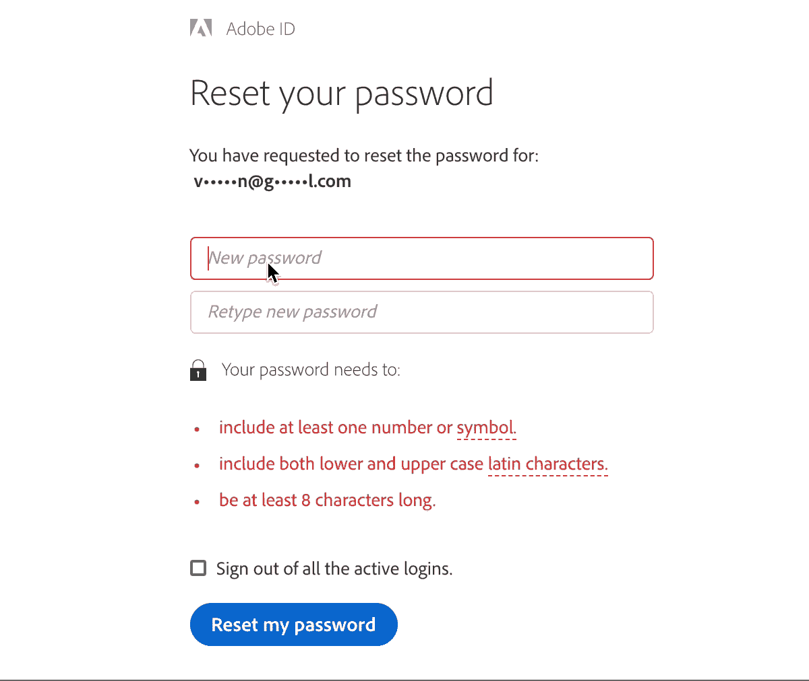
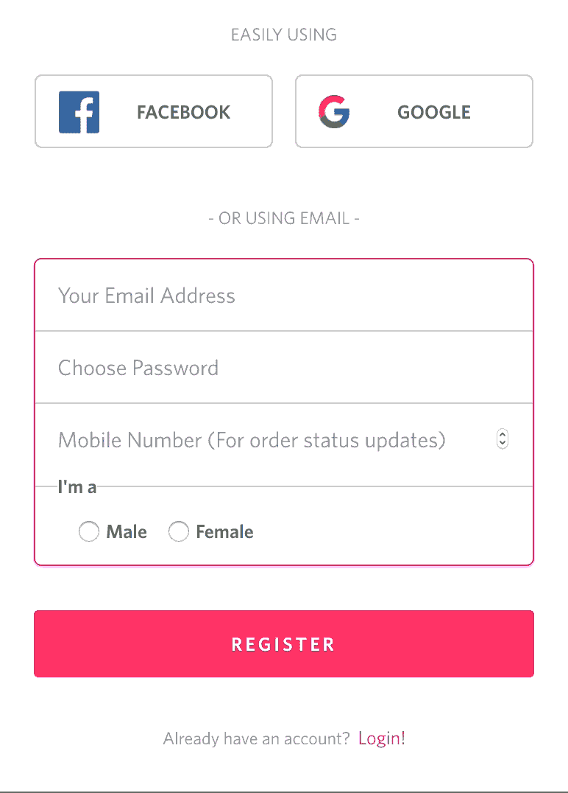

# JavaScript 表单验证对用户来说可能是一场噩梦

> 原文：<https://betterprogramming.pub/js-form-validations-can-be-nightmares-to-users-what-not-to-do-while-validating-forms-1601e162b6fa>

## 验证表单时不要做什么

# 1.当用户输入时停止抛出错误

尊重用户输入的内容很重要。在 90%的情况下，用户都在愉快的自动驾驶仪上运行(他们肯定会输入正确的东西)。

图 1:关于按键验证的电子邮件

考虑上面的场景(图 1)——用户正在键入正确的电子邮件地址，但是表单试图在按键时进行验证。为什么当用户输入正确的地址时，表单会抛出错误信息？

1.  避免对电子邮件、姓名和联系号码进行按键验证。相反，在模糊或变化上验证它们。
2.  对于像密码这样的字段，验证按键的约束。示例:您的密码约束可能包括小写、大写、数字和符号。在这种情况下，突出显示用户按键的进度。这将帮助他们。

图 2:密码焦点验证

键入时抛出错误消息通常会将用户的注意力从输入转移到错误块。在显示错误消息之前要小心。

# 2.避免在表单的顶部或底部显示合并的错误消息

偏好突出显示靠近输入字段的错误消息，而不是显示在表单的顶部或底部。

如果您的表单太长，那么用户可能很难滚动并找出哪里出错了。

在设计的时候，考虑不同年龄段的人。老年人和第一次使用您的应用程序的人可能会发现很难猜出哪里出错了。

对于少于三个的字段，如果情况需要，可以在一个地方显示合并的消息。确保错误消息在用户的可见范围内。

# 3.显示错误信息

不要等到用户完成整个表单后才强调哪里出错了。一旦用户移出某个字段，验证它，并在必要时显示警告或错误。

图 3:提交时显示错误消息的表单

为什么最后要给用户惊喜？

图 3 展示了当用户单击 Register 时表单如何验证的例子。直到最后一次点击，用户可能没有意识到他们所犯的错误。如果表单验证了输入的模糊性，那就更好了。

当您在用户提交表单之前保存验证错误时，用户重新访问并重新填写表单可能会很耗时。此外，根据一个字段中的值，用户也可能倾向于更改其他字段。通过延迟验证，您只是延长了表单完成时间。

# 4.当用户再次开始键入时，删除现有的错误消息

当用户再次输入以纠正他之前的错误时，引导他。不要让错误一直存在，直到用户键入正确的输入。

如果不清除，用户会对自己输入的内容是对是错感到困惑。

# 5.不要责怪你的用户，引导他们

用户永远是正确的。提供温和的信息，而不是强烈的信息。

图标更有利于突出对错。同样，使用柔和的图标来突出显示。在十字图标上选择警告图标以突出显示错误。(有关警告图标的示例，请参见图 3。)

通过使用适当的输入类型来避免用户犯错误。

**示例:**如果您希望用户在特定字段中只输入数字，请使用`<input type = “number”>`。不要在上述情况下使用`<input type = “text”>`然后等待用户进入错误区。明智地选择你的输入类型。

# 6.提供清除或重置表单错误的选项

最后，一定要有按钮来清除、重置和/或关闭表单。用户自由很重要，它不应该耗费时间。