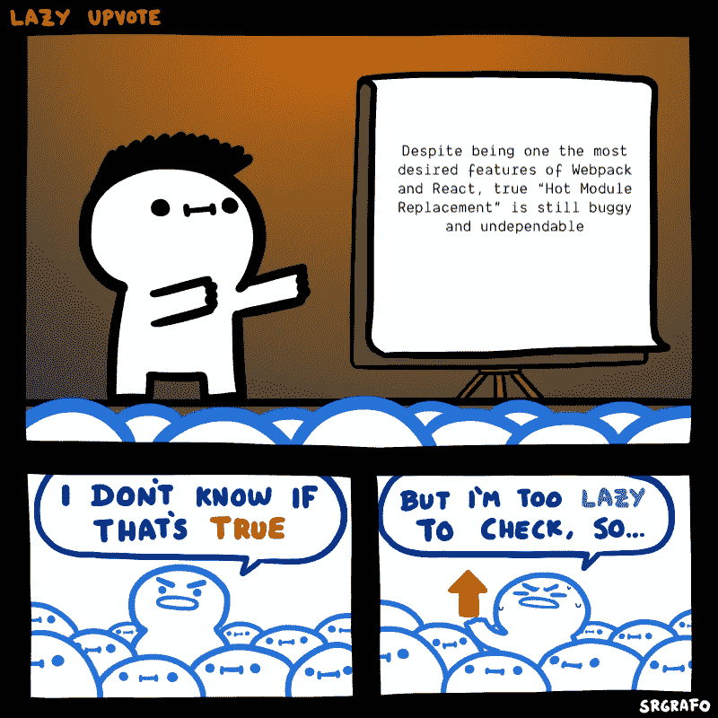

# 为了更好的开发和测试而交换 JS 模块

> 原文：<https://betterprogramming.pub/js-module-swapping-for-better-development-and-testing-5c79612e09f0>

## 使用正常模块更换来解决问题

由[万花筒](https://unsplash.com/@kaleidico?utm_source=medium&utm_medium=referral)在 [Unsplash](https://unsplash.com?utm_source=medium&utm_medium=referral) 上拍摄的照片

# 一些动态魔法

让我们回顾一下我最近在使用 markdown 解析器时遇到的一些事情。这个 markdown 解析器允许代码语法高亮显示，重要的是它匹配(甚至超过)了 Github 上可用语言的数量。考虑到我们可用的选项，我们决定使用[低光](https://github.com/wooorm/lowlight)。

使用 Lowlight，我们可以导入我们喜欢的任何语言语法——有 150 到 200 种可用的语法。更好的是，我们可以假设该语言将位于代码格式的头部。

太好了——我们所要做的就是提取该语言，并从我们可用的编程语言之一中读取它。但是每个文件有多大呢？嗯，每一个都不大，但是把它们加在一起就没必要那么大了。

所以，如果我们知道他们用的是什么语言，为什么我们不偷懒加载呢？每种语言都将分裂成一个独立的包，我们可以在需要的时候把它们拉进来。一次需要一个以上的几率很低，所以我们想尝试一下。

# 环境问题

快进到总结该功能。我们对它的工作方式非常满意，自从语言被分块以来，我们的索引包的大小几乎没有增加。太好了——结局好就一切都好！

但是后来其他团队成员试图使用我们的新包，他们开始抱怨开发环境在改变后重建所花费的时间。值得注意的是，HMR 现在有点棘手，有几个 bug 或插件需要更新。正因为如此，我们无法将我们的 HMR 分成多个步骤，这意味着每次有人做出更改时，所有 150–200 个包都需要重新编译，然后才能用更改更新浏览器。

这些巨大的加载时间不行。他们有效地加倍了重新编译的时间。我们决定在两个选项中选择一个:要么将语言数量限制在十种以下，要么尝试捆绑更少的语言进行开发。

这时候我们遇到了`[NormalModuleReplacementPlugin.](https://webpack.js.org/plugins/normal-module-replacement-plugin/)`听起来很无聊，可能有点太直截了当，但是模块替换是一个非常方便的技巧——尤其是当它涉及到不同的环境时！

# 正常模块更换

顾名思义，当你看下面的代码时，它会更有意义。不管怎样，还是来看看它的网上描述吧。

> *NormalModuleReplacementPlugin 允许您用 newResource 替换与 resourceRegExp 匹配的资源。如果 newResource 是相对的，则相对于前一个资源进行解析。如果 newResource 是一个函数，它应该覆盖所提供资源的请求属性。*

我们告诉它要留意的模块，比如说`Child.js,`，如果它注意到有东西在使用它，它应该换一个模块，比如说`Toddler.js.`

让我们更仔细地看看这个，并谈谈我们的最终目标。首先，代码看起来像这样:

**loadLangauge.js**

正如您在上面看到的，任何`language`都可以被传入。所以当我们用 Webpack 静态分析这个代码 laster 时，200 种语言中的任何一种都可以被导入。Webpack 将自动转到该文件夹并收集所有可能被导入的文件，系统将自动分块它找到的每个文件。

我们的目标是在开发模式下限制动态导入可以加载的语言数量；这样， [Webpack](https://webpack.js.org/) 就会知道它只能加载有限数量的文件。

很简单，这让我们回到了我们的模块替换插件。该插件允许我们选择一个模块(如上图所示)，并告诉 Webpack 加载一个不同的模块。让我们创建一个只加载 javascript 的模块。

**loadLanguage.dev.js**

现在在我们的`webpack.config.js,`中，我们可以将`NormalModuleReplacementPlugin`添加到插件部分。我添加了一个`isDev`变量来表示这个插件应该只在开发模式下执行。请注意，这需要在您的代码库中进行相应的处理(可能使用`NODE_ENV`)。

**webpack.config.js**

请注意，我们不必指向文件存在的位置，如果文件名出现，只需一些正则表达式。第二个电话是更换模块。现在，当我们构建开发环境时，只有 Javascript 是我们构建的一部分！

# Jest 模块交换

模块替换的另一个优秀用例是 [Jest](https://jestjs.io/) 。Jest 仍然有几个关于 ESM 的问题，因此经常需要回到 CJS。通常建议您在开发/生产版本中使用 ESM 文件，然后在测试期间将模块交换到 CJS。

在撰写本文时，使用这个交换进行测试的一个库是 [React-dnd](https://github.com/react-dnd/react-dnd) 。他们是一个很好的例子，因为他们需要交换你可以使用的任何或所有模块。我们会把它们都做好，但对你的案子来说可能没必要。要在 jest 测试环境中交换文件，在`module.exports`中打开`jest.config.js.`添加:

**jest.config.js**

这段代码类似于上面的`NormalModuleReplacementPlugin`。每当它注意到左边的模块名，它就会用右边的模块替换它。

# 结束语

这些只是模块交换的几个例子。这可能不是你每天都需要的东西，但在你的后口袋里有一张方便的“出狱卡”。我希望它能让您对 Webpack 如何工作以及如何最终控制您的构建环境有更多的了解。

在我从事模块交换的时候，我见过它最常用于基于环境的问题。请注意，尽管如此，当你用它来解决环境问题时，还是应该非常小心。任何时候，当您使环境的行为不同于生产时，您将对您的生产构建缺乏信心。这意味着当事情开始运行时，可能会有不可预见的差异，因为您不是在同一个系统中工作。所以，首先要问是否有不同的方法可以给你的团队更多的信心！

# 参考资料和进一步阅读

 [## 蠕虫/微光

### 虚拟 DOM 和非 HTML 事物的虚拟语法高亮显示，带有语言自动检测。非常适合反应…

github.com](https://github.com/wooorm/lowlight)  [## normalmoduleplacementplugin | web pack

### NormalModuleReplacementPlugin 允许您用 newResource 替换与 resourceRegExp 匹配的资源。如果…

webpack.js.org](https://webpack.js.org/plugins/normal-module-replacement-plugin/)  [## 网络包

### webpack 是一个模块捆绑器。它的主要目的是捆绑 JavaScript 文件以便在浏览器中使用，但它也…

webpack.js.org](https://webpack.js.org/)  [## 笑话🃏愉快的 JavaScript 测试

### Jest 是一个 JavaScript 测试框架，旨在确保任何 JavaScript 代码库的正确性。它允许您…

jet js . io](https://jestjs.io/)  [## ES 模块:卡通深潜- Mozilla 黑客-网络开发者博客

### ES 模块为 JavaScript 带来了一个官方的、标准化的模块系统。随着 5 月份 Firefox 60 的发布，所有…

hacks.mozilla.org](https://hacks.mozilla.org/2018/03/es-modules-a-cartoon-deep-dive/)  [## CommonJS

### CommonJS 项目的目标是为 web 之外的 JavaScript 建立模块生态系统的约定…

en.wikipedia.org](https://en.wikipedia.org/wiki/CommonJS)  [## 反应-拒绝/反应-拒绝

### 拖放以作出反应。参见网站上的文档、教程和示例:http://react-dnd.github.io/react-dnd/参见…

github.com](https://github.com/react-dnd/react-dnd)