# JavaScript:变异观察器

> 原文：<https://betterprogramming.pub/js-mutationobserver-1d7aed479da2>

## 用代码示例解释变异观测器

您可能已经在代码的很多地方用 JavaScript 操作了 DOM。

如果是的话，那么很可能在某个时候，您必须处理 DOM 中的动态变化，例如，添加或删除元素或者属性值的变化。就在那时，`MutationObserver`出现了。

`MutationObserver`接口允许监听 DOM 中的变化。

在本文中，我们将用简单明了的方法来解释这个接口。为了帮助实现这一目标，所有内容都将通过代码示例进行演示。

首先，让我们谈谈你应该知道的几件重要的事情。

# 浏览器支持

`MutationObserver`并非所有浏览器版本都支持。如果我们在[中检查*我可以用*](https://caniuse.com/#feat=mutationobserver)*我们得到这个结果:*

*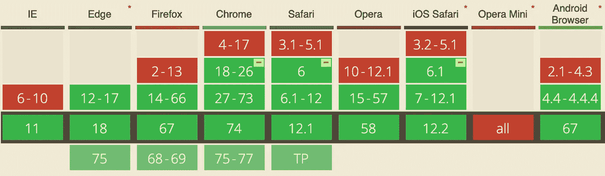*

*如果你的目标是 IE 10 或更低版本，或者 Opera mini(以及其他不支持`MutationObserver`的浏览器)，这是一个问题。*

*如果你的目标浏览器不支持`MutationObserver`，并不意味着你不能在你的实现中使用它。*

*您可以实现一个简单的验证来检查浏览器是否支持它。如果有，你就用，如果没有，你就用老办法:[突变事件](https://developer.mozilla.org/en-US/docs/Web/Guide/Events/Mutation_events)。这种方法实际上是不赞成的，但是如果你需要支持旧的浏览器，你需要添加它。*

*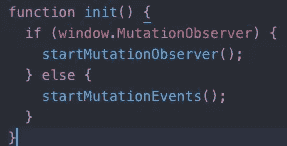*

*在本文中，我们不打算讨论如何实现不推荐的方法(突变事件)，但是我认为，如果浏览器支持对您来说是个问题，那么知道如何解决兼容性问题是很重要的。*

# *当心性能*

*不言而喻，操作 DOM 是一件需要小心的事情。此外，通过使用`MutationObserver`，您将在每次您正在监听的更改被触发时执行代码。*

*   *确保在操作 DOM 时遵循良好的实践。*
*   *避免任何不必要的代码执行。以这样一种方式构建您的代码，即任何操作只在需要运行时才运行。*
*   *在好看的代码上执行代码。有时候，对某些人来说，执行代码有点难看，没关系，就这样吧，我们希望我们的代码尽可能具有高性能！*

*我认为在进入我们的主要活动之前提及这些事情是很重要的。*

# *使用变异观测器*

*现在来说说`MutationObserver`。以下是我们将要讨论的内容:*

*   *我们能听出什么变化？*
*   *初始配置。*
*   *监听属性变化的代码示例( [GitHub 链接](https://github.com/SantiagoGdaR/mutation-observer))。*
*   *监听`childList`变化的代码示例( [GitHub 链接](https://github.com/SantiagoGdaR/mutation-observer))。*

## *我们能听出什么变化？*

*为了初始化`MutationObserver`，我们需要创建一个构造函数期望的配置对象。*

*该对象设置我们将要收听的更改类型:*

*   *`attributes`:如果为真，我们就要听元素属性的变化。*
*   *`childList` :*
*   ***`subtree` : 如果为真，我们不仅要观察我们的目标节点，还要观察它的所有后代。***

***这三个是我们将在示例中看到的，但是配置对象还可以处理其他属性:***

*   ***`attributeFilter`:监听变化的属性名数组。***
*   ***`characterData`:监听文本变化。***
*   ***`attributeOldValue`:如果您想在回调函数中接收属性的旧值，您需要将这个属性设置为 true。***
*   ***`characterDataOldValue`:如果想在回调函数中接收文本的旧值，需要将这个属性设置为 true。***

## ***初始配置***

***当您创建`MutationObserver`对象时，您需要提供一个回调函数作为参数，当您正在监听的更改被触发时，该函数将被执行。***

***我们将在下面的代码示例中看到这一点，但它看起来会像这样:***

******

***`callback` param 表示当一个改变被触发时要执行的函数。***

***一旦创建了`mutationObserver`对象，就需要通过执行 observe 函数来初始化它。***

***这个函数接收两个参数，第一个是目标节点(这个节点将扮演根节点的角色来侦听更改)，第二个是包含前面提到的侦听器配置的配置对象。***

***例如:***

***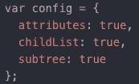***

***在上面的例子中，您正在配置观察者来监听我们将要处理的三种类型的变更(`attributes`、`childList`和`subtree`)。有关这方面的更多信息，请参阅章节*我们能听到哪些变化？*本条。***

***作为目标，让我们在所有的例子中使用 body，最后，让我们使用 observe 函数初始化观察者。在我们的每个示例中，这段代码都会有一点点变化，但结构看起来总是类似于:***

***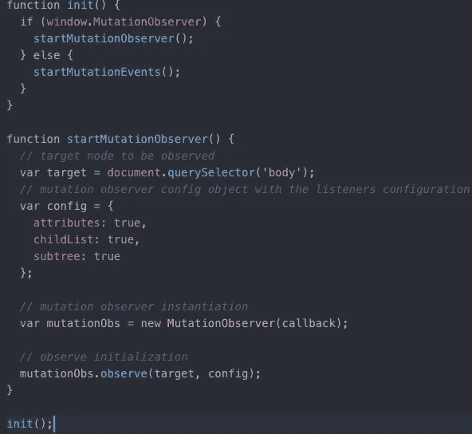***

***我们已经讨论了这个 JavaScript 文件中的所有内容。***

***`init`函数首先检查浏览器是否支持突变观察器，如果支持，它就启动突变观察器。如果没有，它将启动突变事件(正如我们之前提到的，本文没有涉及)。***

***`startMutationObserver` 功能有以下步骤:***

*   ***获取作为目标节点的正文。***
*   ***在这种情况下，设置配置对象来监听所有的更改类型。***
*   ***它实例化了提供回调函数的`MutationObserver`(尚未实现)。***
*   ***它通过向`MutationObserver`对象的 observe 函数提供目标节点和配置对象来初始化监听器。***

***`callback`函数接收两个参数，第一个是突变记录列表，第二个是观察者对象。***

***让我们命名所有的突变记录属性:***

*   ***`target`:发生变化的元素。***
*   ***`type`:它所代表的变异类型(属性、字符数据或子列表)***
*   ***`oldValue`:之前的值(只有当变异配置对象的`oldValue`属性被设置为真时，我们之前在*中讨论过这个问题，我们可以监听哪些变化？*一节。).***

***值得一提的是，您可以通过使用`disconnect`功能随时断开界面监听变化:***

***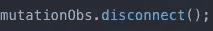***

## ***监听属性更改***

***为了只监听属性的变化，我们需要将上面的 config 对象改为只监听属性的变化，到现在为止，您可能已经知道如何去做了。***

***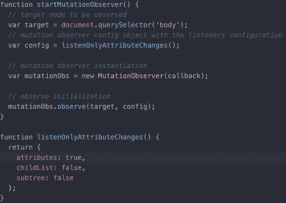***

***代码和以前一样，不同之处在于我创建了一个函数，它返回 config 对象，只监听属性的变化。***

***值得一提的是，使用这种配置，您只能听到目标节点属性的变化。如果您还想监听子节点属性的变化，您需要将属性`subtree` 设置为 true。***

***让我们更改配置来监听`subtree`属性的变化:***

***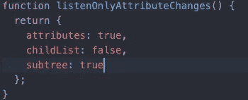***

***现在，我们正在监听目标节点及其所有子节点树的属性变化。***

***很好，让我们看看 HTML:***

***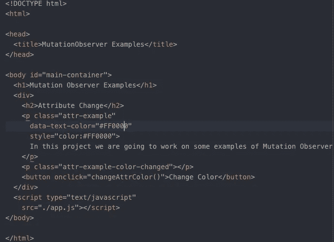***

***这个 HTML 非常简单，其思想是通过按下一个按钮来执行一个功能，这个按钮将改变标签`p`的属性文本颜色。这是函数:***

***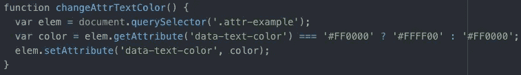***

***同样，这个函数很简单。它获取元素，检查颜色属性，并更改它。***

***让我们这样做，我们的回调函数对这个属性文本颜色的变化作出反应，并将新的颜色应用于实际的文本:***

***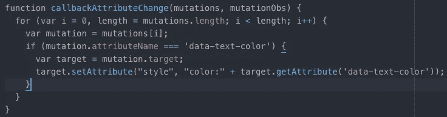***

***正如我们提到的，我们的`callback`函数接收两个 prams:突变记录列表和我们的突变观察者。***

***我们要做的第一件事是迭代突变列表。***

***在`for`内部，我们要做的第一件事是生成一个过滤代码，以避免执行我们的逻辑，除非它是我们想要做出反应的实际变化。***

***在这种情况下，我们使用一个`if`语句检查改变的突变属性的名称是否是我们关心的属性(`data-text-color`)。***

***如果是这样的话，我们取突变目标，也就是发生变化的节点，将该节点的样式颜色设置为`data-text-color` 属性中设置的颜色。***

***不要忘记更改观察器初始化的代码，以便将该函数用作回调函数:***

***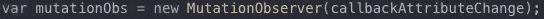***

***太好了！所以，这是一个如何处理属性变化的好例子。***

## ***监听子列表更改***

***假设我们还想添加一个侦听器，用于子列表发生变化时，这意味着我们的目标节点的一个子节点已经被添加或删除。***

***再次考虑，如果您还想监听我们的目标节点的子节点何时被添加或删除，我们需要将`subtree`属性设置为`true`。***

***这样，我们将侦听何时从目标节点添加或删除子节点，以及何时从目标节点的子节点添加或删除节点。***

***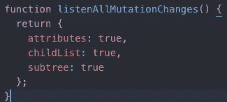***

***通过设置如上图所示的配置对象，现在您不仅可以监听属性更改，还可以监听子列表更改。***

***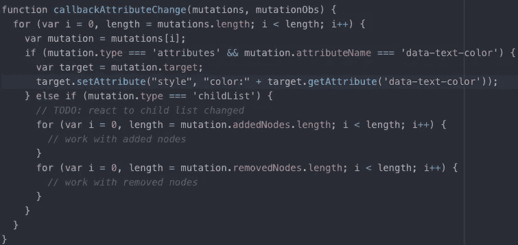***

***现在我们可以使用突变的`type`属性来区分我们想要对哪种类型的突变做出反应。***

***在这个代码示例中，我们对前面示例中的`attribute` 类型变化做出反应，也对`childList`类型变化做出反应。***

***对于`childList` 类型的部分，我们循环遍历`removedNodes`和`addedNodes`，以展示如何实际迭代触发变更的节点。***

***让我们添加一点代码:***

***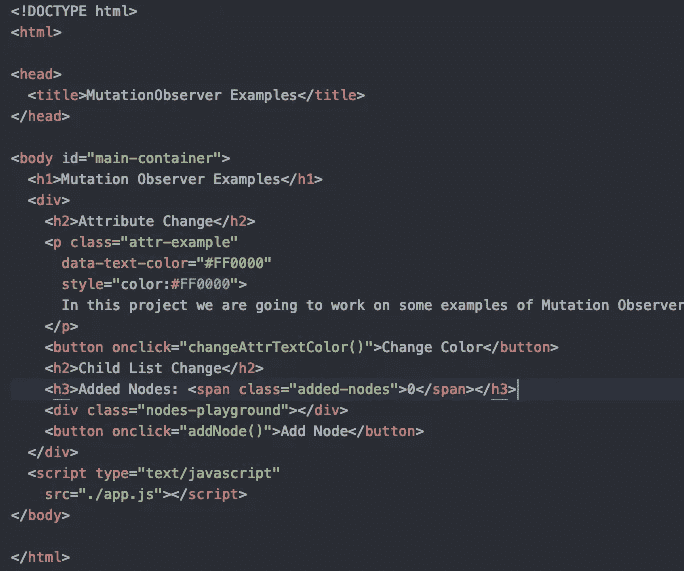***

***我们对 HTML 进行了一些修改，以计算添加的节点数，并添加了一个按钮来执行添加节点的功能。***

***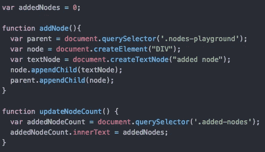***

***在我们的 JS 中，我们添加了一个向 DOM 添加节点的函数，这个函数在单击 add node 按钮时执行。***

***我们还添加了一个函数来更新 HTML 中的节点数。第二个函数将在突变观察器`callback`函数中执行。***

***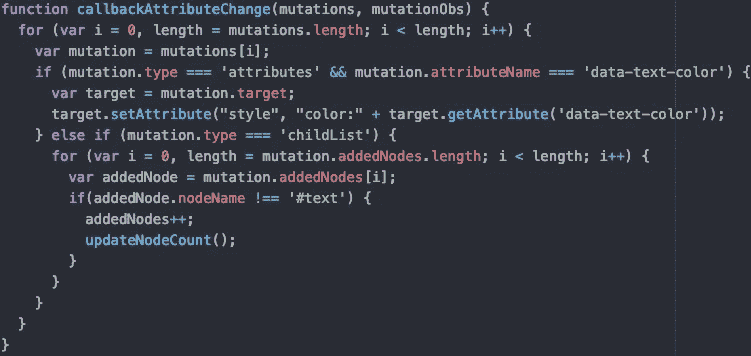***

***现在，在我们的`callback`函数的`childList` 部分中，我们将在每次添加一个节点(名称不是 test)时增加 added nodes 变量。***

***如果在执行函数`updateNodeCount` 时，我们不把执行代码的条件只放在所添加的节点不是名字`#text` 的情况下，我们将进入一个无限循环。***

***这是因为该函数将替换文本，这将触发一个`childList` 变化，这将再次调用`updateNodeCount`，以此类推。所以我们需要那个条件。***

***原来如此！我们通过一些很好的例子展示了如何使用`MutationObserver`接口。***

***这里是 [GitHub repo](https://github.com/SantiagoGdaR/mutation-observer) ，继续玩代码。***

# ***结论***

***即使看起来有点难，理解`MutationObserver`接口还是很简单的。另一方面，如果你对实际发生的事情没有很好的理解，正确地使用它会非常复杂。***

***我希望这篇文章能让你对这个问题有所了解。***

***干杯！***