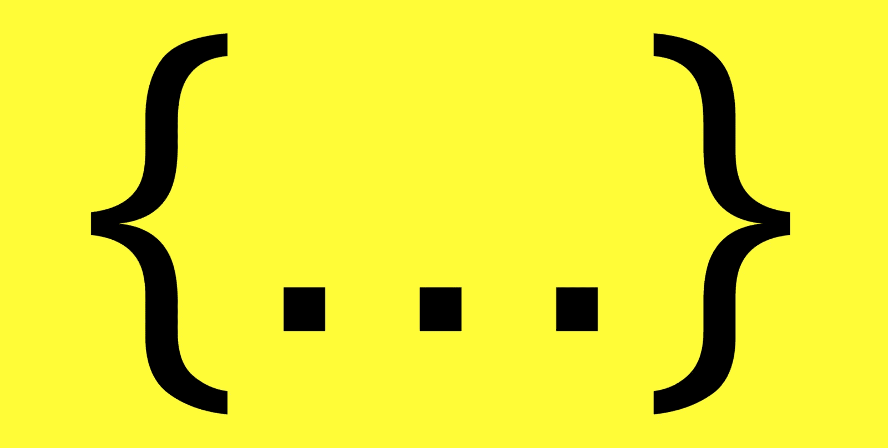

# 7 JavaScript 模式第 2 部分:扩展语法

> 原文：<https://betterprogramming.pub/js-patterns-part-2-the-spread-syntax-9f7e66038c86>

## 这是包含所有初级开发人员都应该知道的 JavaScript 模式的系列文章的第二篇



** * * ES6 及更高版本支持，浏览器支持* [*文档*](https://developer.mozilla.org/en-US/docs/Web/JavaScript/Reference/Operators/Spread_syntax) *****

今天的文章涵盖了可能是最流行的 ES6 特性，spread 语法。由于它的受欢迎程度，它已经被盖死了。所以我不打算深入细节，而是深入讨论不变性和继承。

# 传播算子是什么样子的？

顾名思义，spread 操作符扩展它嵌入的对象的所有属性和值。如果你的对象是一个数组，它会分散它的元素。你可以看到下面的例子:

# 怎么解码？

你可能已经注意到了，你不能在任何地方传播任何东西。它只在用逗号分隔项目时有效。如果您尝试在其他地方做，可能会出现这种情况:

```
var arr1 = [1, 2, 3]
...arr1// Expects: Uncaught SyntaxError: Unexpected token ...
```

**扩展数组**在几乎任何支持逗号的地方都是允许的。例如，在对象文字、数组文字和参数内部。你可以这样解码:

**扩展对象**只能在对象文字中使用，因为数组文字和参数不支持它们内部的属性名。查看下面的示例:

通过在文字中散布对象或数组，实际上是从散布属性中创建新的对象或数组。这就是我们所说的制作**浅拷贝**(稍后会有更多内容……)。最重要的是，当你用 spread 操作符创建一个对象的浅层副本时，你可以像上面的例子那样添加属性。我们已经将 *foo* 属性添加到 *obj2* 中。而且，通过简单地覆盖它们来修改由 spread 对象给出的属性，如下例所示。

```
console.log(obj2)
// expects: {0: 1, 1: 2, 2: 3, foo: "bar"}obj3 = {...obj2, foo: "lmao"}
// expects: {0: 1, 1: 2, 2: 3, foo: "lmao"}
```

# 有什么好处？

> 旁注:我们将再次讨论按值/按引用。如果你想成为一名优秀的 JS 开发者，这是非常重要的。这是一些文档。

## 保持你的代码干燥

如果你需要在一个参数中使用一个数组的所有元素，你可以只引用它一次。像这样:

## 不变

不变性是一个编程原则，它认为一个对象永远不应该被添加属性修改。要更新一个对象，必须从原始对象创建一个新对象，并进行预期的更改。[这里有些文档](https://en.wikipedia.org/wiki/Immutable_object)。不变性是区块链科技的关键概念之一，也是现代前端商店经理(如 [Vuex](https://vuex.vuejs.org) 和 Redux)非常重要的一部分。

JS 传统上处理得很差。一方面**，**因为通过引用将对象分配给变量或属性是 JavaScript 的事情，这意味着 JS 不会复制一个它自己已经在内存中的对象，而是在任何可能需要这个对象的地方引用它，所以它可以在内存中只拥有一次。另一方面，在 ES6 之前，没有直观或一致的方法来实现不变性。

多亏了 spread 语法，它变得更好了。您可以复制对象，向其添加属性，并轻松覆盖现有属性。即使使用我们直观和一致的方法来实现不变性，JS 仍然不是它的理想选择，因为 spread 语法只帮助创建对象的浅层副本(很快会有更多的介绍)。

我打赌你在想，*“好吧，这很好，但是这有什么用呢？”如果你曾经在 React 项目中使用过 Redux，你可能会用到不变性。这就是 reducers 的全部工作:**处理存储的不变性。**对于 reducers，我们经常使用 spread 语法来更新先前状态的浅层副本。阅读下面示例中的注释，看看发生了什么:*

## 仿真陈述和观点

如果你在 Vue 中使用了 Vuex，setters 的工作就是在幕后为你处理不变性。所以，如果你对 React + Redux 需要的不变性技巧不太适应，我建议你在 Vue + Vuex 中开始你的项目。它会帮你省去一大堆挫折。

# 有什么你应该知道的怪癖吗？

我能想到的只有两个:肤浅的复制和缺乏继承。

## 浅册(终于！)

***TLDR；*** *注意嵌套对象，当你使用 spread 语法时它们保持相同的引用。*

如果你在想，*“这又是关于价值和参考的，对吗？”我为你感到骄傲。你终于接受了你的信仰。在 JS 中，在某种程度上，它总是关于价值和参考。*

进行浅层复制意味着您只是简单地复制值，还复制对对象的引用。换句话说，如果您的属性是对特定对象的引用，则该属性的副本将指向完全相同的对象。让我给你一个例子，它可能会导致错误:

```
var life_form1 = {kind: "human"}
var person1 = {name: "Patrick Cyiza", life_form: life_form1}console.log(person1)
// expects {name: "Patrick Cyiza", life_form:{kind: "human"}}var dog1 = {...person1, name: "Rex"}
console.log(dog1)
// expects {name: "Rex", life_form:{kind: "human"}}// well, Rex is not a human, he is a dog, lets change that
dog1.life_form.kind = "dog"
```

你认为***person 1 . life _ form . kind***现在的价值是多少？好吧，既然引用是从 ***person1*** 复制到 **dog1** 的，那么它们的 ***life_form*** 属性引用的是同一个对象:从第一行开始的***life _ form 1****变量。如果我们修改 ***dog1.life_form.kind，*** 我们实际上改变了它的引用，影响了它的所有裁判。所以现在***person 1 . life _ form . kind***就是**。***

**如果你想避免这种情况，你应该使用**深度复制模式**、**、**，比如 **JSON.parse** 和 **JSON。Stringify** ，而不是 spread 语法。**

```
**Obj1_copy = JSON.parse(JSON.stringify(Obj1))**
```

**[更多详情请点击此处](https://medium.freecodecamp.org/copying-stuff-in-javascript-how-to-differentiate-between-deep-and-shallow-copies-b6d8c1ef09cd)**

## **继承，或缺乏继承**

*****TLDR；*** *用 spread 语法复制一个对象只是复制该对象直接拥有的属性。继承的属性不会被复制，被复制对象的原型也不会被复制。***

**你可能听说过 ES6 的课程。让我直截了当地告诉你，这些课程是不真实的。正如 [MDN 文档](https://developer.mozilla.org/en-US/docs/Web/JavaScript/Reference/Classes)所说，它是“【JavaScript 现有的基于原型的继承之上的语法糖衣。”换句话说，这只是一个为了适应继承系统是经典的其他语言的开发者而添加的特性。[更多关于古典的传承在这里。](https://medium.com/javascript-scene/master-the-javascript-interview-what-s-the-difference-between-class-prototypal-inheritance-e4cd0a7562e9)**

**实际上，JavaScript 中没有现成的类，因为在 JS **中，所有不是原语的东西都是对象。**是的！甚至数组和函数。**

****

**就像我们之前说的，JS 有一个[基于原型的继承系统](https://developer.mozilla.org/en-US/docs/Learn/JavaScript/Objects/Inheritance)。这只是意味着，既然一切都是对象，对象只是简单地相互继承。**

**有几种方法可以做到这一点，但由于这篇文章已经够长了，我们将只探讨一个简单的例子:**

**如您所见，我没有显式地将***wheel _ count****属性或 ***rapAboutIt*** 方法赋给 ***my_car*** 对象。既然 ***my_car*** 的原型是 ***Car*** 的对象，而 ***Car*** 具有那些属性， ***my_car*** 就可以间接访问那些。换句话说，它继承了它们。***

***"* 为什么这与扩展语法相关？"因为这不相关。说真的！我的意思是，spread 语法不关心 spread 对象的原型。因此，它也不关心继承的属性。它只关心直接拥有的财产。让我们用一个例子来分解它:**

**如果你会***console . log(my _ car)***你会有下面的结果:**

```
**{model: "Civic Type R", brand: {name: "Honda", fonded: 1948}}**
```

**那些是**直接拥有的属性**，但是我仍然可以访问 ***wheel_count*** ，因为他从 ***Car 继承了它们。*** 照这样，你可以这样做:**

```
**my_car.wheel_count
// expects: 4**
```

**但是如果我将复制的 ***my_car*** 对象的展开语法如下:**

```
**my_other_car = {...my_car, model: "S200"}
// expects: {model: "S200", brand: {name: "Honda", fonded: 1948}}**
```

*****my_other_car*** 只能访问车型和品牌属性。不是遗传的，因为它不在乎。**

```
**my_other_car.wheel_count
// expects: undefinedmy_other_car.rapAboutYourCar()
// expects: TypeError: rapAboutYourCar is not a function**
```

**所有那些深入的解释都是为了说一件事，而且只有一件事。如果你遇到需要复制一个对象并保持它的原型**的时候，SPREAD 语法是不够的！****

**没有明显或常规的方法来克隆从其原型继承的对象。要实现这一点，您必须创建一个自定义函数，如下所示:**

**第一个进行浅层复制，第二个进行深层复制。如果需要，不要犹豫使用这个代码。如果你遇到任何问题，请在下面的评论中告诉我。**

# **我们到此为止**

**下一个系列:[括号符号](https://medium.com/@patick.cyiza/7-js-pattern-part-3-the-bracket-notation-f571c2548c0a)**

**[点击此处查看完整系列](https://medium.com/@patick.cyiza/7-js-patterns-junior-developers-should-know-well-1a0ad075338f)**