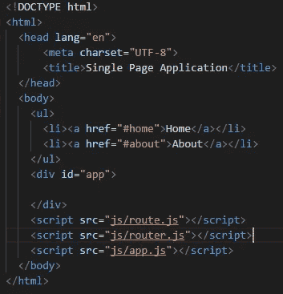
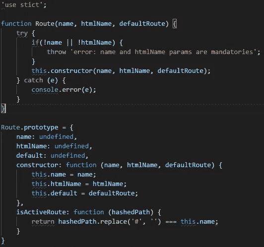
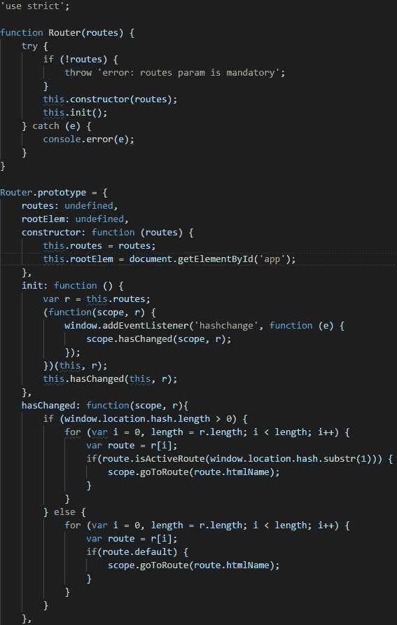
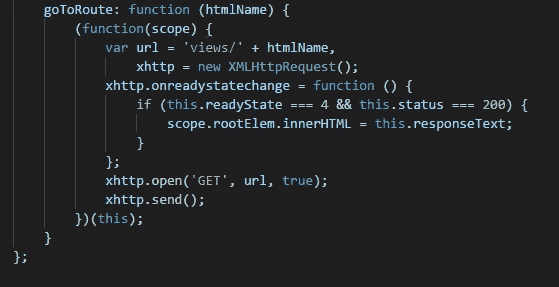
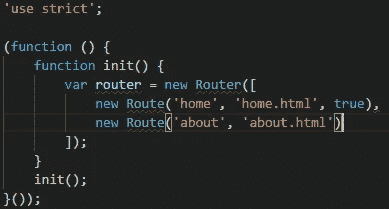

# JavaScript:普通的单页应用程序(SPA)

> 原文：<https://betterprogramming.pub/js-vanilla-script-spa-1b29b43ea475>

## 建造一个没有任何框架、铃铛或哨子的水疗中心

这篇博客是我开始撰写的一系列文章的继续，我试图解释 JavaScript 如何在较低的层次上处理我们现有的多个框架和库的一些特性。

之前，我们用普通的脚本创建了一个[双向绑定，现在我们要用普通的 JavaScript 实现一个 SPA 功能，但是，当然，在进行实际的实现之前，让我们稍微谈一谈 SPA…](https://medium.com/frontend-fun/js-vanilla-two-way-binding-5a29bc86c787)

# 什么是 SPA(单页应用程序)？

SPA 背后的主要思想是将内容动态加载到当前页面，而不是从服务器加载整个页面。您会有一种桌面应用程序的感觉。

第一次加载应用程序时，所有的 HTML、JavaScript 和 CSS 都可以从服务器中检索到，而不是像非 SPA 那样每次加载都一遍又一遍地获取所有内容。

另一个要点是，主页或内容永远不会重新加载，但通过使用位置哈希或 HTML5 历史 API，您仍然有不同的 URL 和浏览器历史。

在示例中，我们将使用并解释位置散列，但这两者都非常容易使用和理解。

# 为什么是 SPA？

让我们提一下使用水疗的一些好处:

*   性能**。SPA 减少了浏览器对服务器执行请求的必要性，这影响了我们应用程序的速度和用户体验。**
*   更好的 UX。由于应用的速度提高，用户迭代流畅，感觉更好。

当然也有缺点，下面就提一些:

*   第一次负载重。由于应用程序的第一次加载可能会加载一堆资源，它可能会感觉很慢。
*   必须启用 JS。这听起来可能很愚蠢，因为每个人的浏览器都启用了 JavaScript，但是如果有人关闭了它，那么 SPA 就一文不值了。
*   安全。SPAs 不太安全，因为它使黑客能够执行跨站脚本。

没必要补充，反正我是要做的。如果您以错误的方式实现 SPA，所有的优势都将丧失。

让我们找点乐子，看一个例子…

# 创建一个简单的水疗中心

这个想法是使用带有位置散列方法的普通脚本实现一个简单的单页应用程序。

## 文件夹结构

*   `js`。这是 JavaScript 实现所在的位置。
*   `views`。这是路线的 HTML 所在的位置。
*   `index.html.`这是我们应用程序的主 HTML。它将加载脚本并设置容器来呈现路线的 HTML。

## 索引 HTML

正如我们之前提到的，这是我们的应用程序的主 HTML，它将加载我们需要的 JS，添加菜单链接，并设置容器元素来呈现路线的 HTML。

*   我们正在创建链接到`#home`和`#about`的两个菜单选项(因为我们将使用位置散列，所以需要散列)。
*   将`id`设置为`app`的`div`是我们将要呈现与活动路线相关联的 HTML 的地方。
*   最后，我们加载将要使用的脚本。

## 关于和主页 HTML

我们并不真正关心这些文件的内容，所以一个只包含一个带有`Home`文本的`div`，另一个包含一个带有`About`文本的`div`。

这个想法是默认加载一个(作为默认路由)，如果需要的话加载另一个。正如我们之前提到的，它们位于`views`文件夹中。

## 路线 JS

这个 JavaScript 将为我们的`Route`提供一个构造器和一些功能。

我们有三个参数:

*   `name`。是我们路由的名称，我们将使用它来检查该路由是否是活动路由。
*   `htmlName`。与路线一起加载的 HTML 的名称。
*   `default`。`True`如果路线是我们 app 的默认路线。

它有两个功能:

*   `constructor`。这只是一个构造函数。
*   `isActiveRoute`。每个路由提供的功能，用于检查它是否是活动路由。它接收实际的窗口位置。

## 路由器 JS

这个朋友包含了大部分的魔力。让我们看一下代码，然后我们将解释它。

所以，让我们开始挖掘这个 JS。

它只接收一个参数:

*   `routes`。这是一个数组，包含我们的应用程序的路线。

它还有另一个属性:

*   `rootElem`。它是我们应用程序的根元素。其他 HTML 被渲染的地方。

最后，它有四个功能:

*   `constructor`。这只是一个构造函数。在创建`Router`时只执行一次。
*   `init`。该函数为窗口的`hashchange`事件创建一个监听器。首先，它给那个监听器设置一个回调来执行函数`hasChanged`，最后，它第一次执行它(这将允许我们执行一个默认路由)。现在，每当位置散列发生变化时，我们刚刚创建的侦听器就会被执行。该功能在创建`Router`时只执行一次。
*   `hasChanged`。该功能有两个主要职责，都与执行正确的`Route`负载相关。如果窗口位置改变，它将加载正确的活动`Route`并调用另一个函数来加载它的 HTML，如果窗口位置为空，它将加载默认的`Route`。这个函数接收两个参数，一个是`Router`实例的范围，另一个是路由。
*   `goToRoute`。该函数负责获取并加载活动路线的正确 HTML。它接收必须加载的 HTML 名称，最后执行一个请求来获取它。

这就是我们让一个简单的 SPA 实现工作所需的全部内容。

## 路由和路由器初始化

最后，让我们看看如何在 app.js 文件中启动路由器。

这个脚本正在执行一个`init`函数，该函数实例化了`Router`并提供了两个`Route`，将`home`设置为缺省值。

实现: [GitHub](https://github.com/SantiagoGdaR/vanilla-spa) 。

# 结论

正如我们在开始时提到的，这篇文章的目的是展示一种实现 SPA 路由器的方法，目的是了解一个库或框架如何处理这个特性。

我希望你喜欢它！