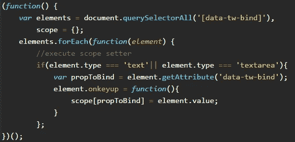

# JavaScript 中的普通双向绑定

> 原文：<https://betterprogramming.pub/js-vanilla-two-way-binding-5a29bc86c787>

## 你不需要外部库来绑定数据

[Artem Sapegin](https://unsplash.com/@sapegin?utm_source=medium&utm_medium=referral) 在 [Unsplash](https://unsplash.com?utm_source=medium&utm_medium=referral) 上拍照。

如今，我们在前端有大量的工具来解决我们可能面临的不同问题。这在很多方面都很棒，主要是因为你不必每次都重新发明轮子。

但它也有一些非常糟糕的后果。其中一种情况是，开发人员知道如何使用这些工具，但不知道 JavaScript 在幕后实际上在做什么。作为前端开发人员，我们有义务尽可能多的了解 JS。这些知识将让你很容易理解任何库或框架是如何工作的，并且将帮助你解决你可能遇到的任何复杂问题。

使用工具是可以的，但是你要问问自己，“我能从头开始实现这个吗？”

如果答案是肯定的，那么继续使用任何已经实现的功能。但是如果答案是否定的，那么你至少应该试着去理解到底发生了什么。

在思考所有这些问题的同时，我决定开始实现所有这些新的(并不太新的)框架和库所具有的一些最常见的特性，并把它们写在博客上。

# 目标

我们将使用普通脚本(ES5)创建一个简单的双向绑定实现。

# 第 1 部分:HTML 方法

在 HTML 中，我们将使用一个名为`data-tw-bind`的自定义属性，它将接收要绑定的属性的名称。

这将允许我们从 DOM 中选择我们需要的元素，以及它们将绑定到哪个属性。

# 第 2 部分:JS 实现

从 HTML 中，我们将选择:

*   哪些元素将与双向绑定一起工作。
*   哪些道具要加入我们 app 的范围。

代码对这些属性的任何更改都将更新绑定到该属性的 DOM 中的元素，对 DOM 中这些属性的任何更改都将更改范围中的绑定属性。

## 获取元素并设置初始范围

因此，我们的应用程序要做的第一件事就是获取设置了自定义属性`data-tw-bind`的所有元素。

接下来，我们将迭代这些元素，获取属性名，对于类型为`text`和`textarea`的元素，我们的实现将只处理这两个元素，但是添加其他元素应该很简单——我们将向`onkeyup`事件添加一个侦听器。在侦听器中，我们将把范围属性的值设置为元素值。

到目前为止，我们还没有任何工作。当范围属性改变时，我们需要找到一种方法来改变 DOM。

## 使用 set 和 get 函数向范围添加属性

这是我决定采取的方法。当设置一个 scope 属性时，将执行一个 set 函数，该函数还会在适当的位置更新 DOM。

等等……什么？让我们看看代码:

我们有以前所有的东西，还有一堆新东西。在设置`onkeyup`事件的监听器之前，我们调用了一个名为`addScopeProp`的函数，它可以做很多事情。让我们浏览一下:

*   它接收属性名作为参数。
*   它检查作用域是否已经设置了属性。
*   它声明了一个变量值，这个变量值将在 set 回调中用新值填充。
*   然后，它调用 Object 的函数`defineProperty`,这个函数有作用域、要添加的新属性以及将要设置一些东西的定义。
*   在 set 回调中，我们有一个函数，它接收新值，填充 value 变量，然后遍历元素，查看哪些元素绑定到该属性。对于那些绑定的对象，它将它们的值设置为属性的新值。
*   在 get 回调中，它返回 value 变量的内容。
*   最后，为了允许遍历它们，我们需要将 enumerable 设置为`true`。

仅此而已。这就是使用普通脚本创建一个简单的双向绑定所需要的全部内容。当然，这是我采取的方法。有其他方法可以解决这个问题，但我真的很喜欢做这个。

完整的代码可以在 GitHub 上看到[。](https://github.com/SantiagoGdaR/js-two-way-binding)

# 结论

正如您所看到的，实现双向绑定并不困难，能够自己完成就很棒了。

使用工具，但不要忘记，神奇之处不在于知道它们，而在于知道它们实际上是如何工作的！