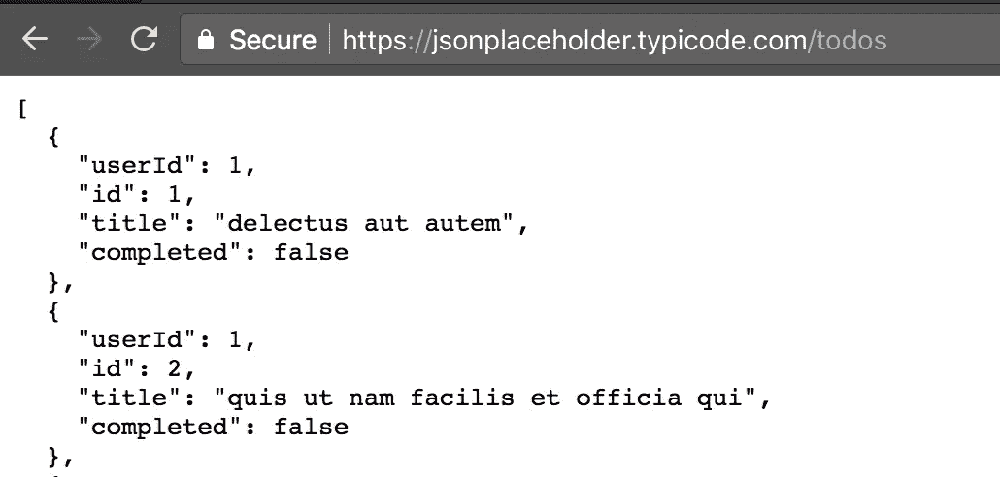
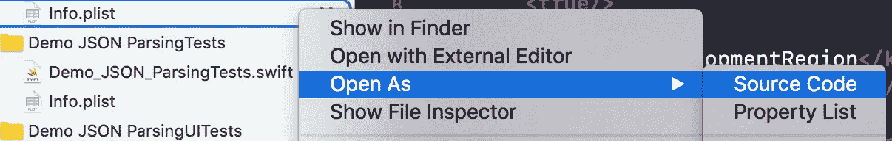
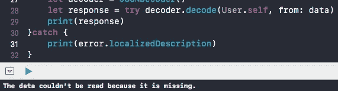

# Swift 中的 JSON 解析

> 原文：<https://betterprogramming.pub/json-parsing-in-swift-2498099b78f>

## 用 Swift 5.1 中的可编码协议处理 JSON 响应


([根奇壁纸](http://genchi.info/image/best-wallpaper-18.jpg))

我们经常使用 JSON 来发送和接收来自 web 服务的数据。借助 Swift，我们可以轻松做到这一点。

大多数应用程序都完全基于 JSON。如果您的应用程序与一个 web 服务 API 通信，它将向`Dictionary(Object)`、`Array`、`String`、`Bool`或`Number`返回一个响应。

在创建模型类之前，我们需要记住来自 web 服务的响应类型。我们将根据响应创建`Model`类。本主题将涵盖从初级到高级的大部分与零件相关的解析。

最初，我很难理解 JSON 解析。但随着时间的推移，我意识到它实际上非常容易使用。你只需要了解响应类型。

# 网络请求入门，URLSession

在开始我们的代码之前，我们需要通过在浏览器中键入以下内容来检查我们的 web API:



JSON 响应

现在我们已经在 web 浏览器中获得了响应，让我们用 Xcode 进行一些编码。为 JSON 解析创建一个新项目。

*   在项目的`plist`中，导航到 Open As，然后导航到 Source Code。



打开您的项目列表

*   将 [App 传输安全](https://stackoverflow.com/a/30732693)代码粘贴到项目的`plist`中。

```
<key>**NSAppTransportSecurity**</key>
<**dict**>
  <key>**NSAllowsArbitraryLoads**</key>
  <true/>
</**dict**>
```

*   现在用 URLSession 向您的 web API 发出一个网络请求。

我们请求 web API 处理数据和错误，这是我们将在它的响应中看到的。在这里，我使用 JSONSerialization 内置的基础框架。它将把 JSON 数据转换成一个基础对象。

在这一部分，我使用了来自 [JSONPlaceholder](https://jsonplaceholder.typicode.com/) 的测试 API:

```
**guard** let **url** = **URL**(string: "[https://jsonplaceholder.typicode.com/todos](https://jsonplaceholder.typicode.com/todos)") **else** {**return**}
let **task** = **URLSession**.shared.**dataTask**(with: **url**) **{** (**data**, response, **error**) in
**guard** let dataResponse = **data**,
          **error** == nil **else** **{**
          **print**(**error**?.localizedDescription ?? "Response Error")
          **return }**  
    **do{** //*here* ***dataResponse*** *received from a network request* 
        **let** jsonResponse = try **JSONSerialization**.jsonObject(with:
                               **dataResponse**, options: **[]**) 
        **print**(jsonResponse) **//***Response result* 
     **}** **catch** let **parsingError** **{**
        **print**("Error", **parsingError**) 
   **}**
**}**
**task**.resume**()**
```

*   JSON 格式的 web API 的响应如下所示。现在我们需要从响应中获取值。这里我们的响应来自我们的 JSON 数组。

```
**[**
  {
    "userId": 1,
    "id": 1,
    "title": "delectus aut autem",
    "completed": false
  },
  {
    "userId": 1,
    "id": 2,
    "title": "quis ut nam facilis et officia qui",
    "completed": false
  }
**]**
```

*   现在，我们来处理 JSON 响应的对象:

```
guard **let** jsonArray = **jsonResponse** as? [[String: Any]] **else** {
      return 
}
**print**(jsonArray)//*Now get title value* 
guard let **title** = **jsonArray**[**0**]["title"] as? String **else** { return } print(**title**) //*compiler outout* -  delectus aut autem
```

让我们试着打印出所有的标题键值。

目前，我们的 JSON 响应是一个字典数组(`[[String: Any]]`)。所以我们在`for` `loop`的帮助下从数组的每个索引中获取字典(我们在让`Dictionary`用键访问值之后这样做)。

```
for **dic** in **jsonArray{**
    guard let **title** = **dic**["title"] as? String **else** { return }  
    print(**title**) //Output
**}**
```

现在，我们可以为数据处理创建一个`User`结构。作为响应，基于我在响应管理的模型结构中选择的值，我们将得到不同类型的值，例如`Int`、`String`和`Boolean`。

```
struct **User** **{**
      var **userId**: Int
      var **id**: Int
      var **title**: String
      var **completed**: Bool**init**(_ dictionary: **[**String: Any**]**) {
      self.**userId** = dictionary["userId"] as? **Int** ?? 0
      self.**id** = dictionary["id"] as? **Int** ?? 0
      self.**title** = dictionary["title"] as? **String** ?? ""
      self.**completed** = dictionary["completed"] as? **Bool** ?? false
    }
**}**
```

使用`model`来处理 JSON 响应:

```
var **model** = [**User**]() //Initialising Model Array
**for** dic in **jsonArray**{
    **model**.append(**User**(dic)) // adding now value in **Model** array
}
//Printing first value for the output
print(**model**[0].**userId**) // 1211
```

酷毙了。现在您对 JSON 解析有所了解了，对吗？

让我们用 [FlatMap](https://developer.apple.com/documentation/swift/array/2903427-flatmap) 使同样的代码更加快速地互补:

```
var **model** = [**User**]()
**model** = jsonArray.**flatMap**{ (dictionary) **in**
            return **User**(dictionary)
        }
print(**model**[0].**userId**)//make more simple
**model** = jsonArray.**flatMap**{ return **User**($0)}//One more time 
**model** = jsonArray.**flatMap**{**User**($0)}//Or 
**model** = jsonArray.**flatMap**(**User**.init)//Output
print(**model**[0].**userId**) // 1211
```

看起来不错，但是让我们做更多的事情。

# 可编码协议

苹果在 Swift 4 中引入的新协议提供了内置的`Encodable`和`Decodable`功能。这使得 JSON 解析更加容易。它可以把自己转换成外部的表现。

可编码模型如下所示。这很容易理解，我们可以用很少的代码来管理它。

这是示例可编码模型。你需要根据你的 JSON 响应制作自己的结构模型。

```
**struct** User: **Codable**{
       var **userId**: Int
       var **id**: Int
       var **title**: String
       var **completed**: Bool
}
```

# 用 JSONDecoder 解析 JSON

发出网络请求后，将 web 应用程序响应原始数据转换成您的阵列模型。

对于这个过程，JSON 网络请求的其余部分将是相同的。然而，我们需要为 JSONDecoder 处理网络响应数据。该协议不需要重大改变。

```
**do** **{**
    //*here* ***dataResponse*** *received from a network request* let **decoder** = **JSONDecoder**()
    let **model** = try **decoder**.decode([**User**].**self**, from:
                 **dataResponse**) //Decode JSON Response Data 
    print(**model**)
**}** **catch** let **parsingError** **{**
    print("Error", **parsingError**)
**}**
```

我使用了模型`[User].self`,因为我们得到了数组格式的响应。如果您的响应将进入`Dictionary`，那么网络请求的输出将如下所示:

```
**{**
    "userId": 1,
    "id": 1,
    "title": "delectus aut autem",
    "completed": false
 **}**
```

对于`Dictionary`响应，我们需要将模型类设置为`User.self`:

```
**do** **{**
    //*here* ***dataResponse*** *received from a network request* let **decoder** = **JSONDecoder**()
    //Decode JSON Response Data
    let **model** = try **decoder**.decode(**User**.**self**, 
                                   from: **dataResponse**) 
    print(**model.userId**) //**Output** - 1221
**}** **catch** let **parsingError** **{**
    print("Error", **parsingError**)
**}**
```

## 自定义键名

我们可以用定制的字符串键来修改我们的可编码键，但是它们应该与您的 JSON 响应键相匹配。否则，您会得到一条错误消息:



底部的错误消息

以下是如何为`Codable`型号添加自定义键:

```
**struct** User: **Codable**{
       var **userId**: Int
       var **id**: Int
       var **title**: String
       var **completed**: Bool**//*Custom Keys* 
       enum** CodingKeys: **String**, **CodingKey** {
           case **userId** 
           case **id** = "serviceId"  //Custom keys
           case **title** = "titleKey" //Custom keys
           case **completed**
       }
}
```

让我们让代码更加快捷友好。我在这里通过模型的扩展做了一个初始化的过程。`CodingKeys` enum 将使用`CodingKey`协议进行确认。

```
**struct** User: **Codable** {
       var **userId**: Int
       var **id**: Int
       var **title**: String
       var **completed**: Bool
}**extension** User{
   **enum** CodingKeys: **String**, **CodingKey** {
           case **userId**
           case **id**
           case **title**
           case **completed**
   }
}
```

## 使用可编码协议进行复杂的 JSON 解析

现在我们有一个复杂的 JSON 文件**，**，它有一个`Dictionary`数组:

```
{
  "branch": {
    "subject": 5,
    "total_students": 110,
    "total_books": 150
  },
  "Subject": [
    {
      "subject_id": 301,
      "name": "EMT",
      "pratical": false,
      "pratical_days": **[**
        "Monday",
        "Friday"
      **]
**    },
    {
      "subject_id": 302,
      "name": "Network Analysis",
      "pratical": true,
      "pratical_days": **[**
        "Tuesday",
        "Thursday"
      **]**
    }
  ]
}
```

我为 JSON 响应编写了如下的`Struct`模型:

```
struct **Students** : Codable **{**
       struct **Branch** : Codable **{**
              let **subject**: Int
              let **totalStudents**: Int
              let **totalBooks**: Int
           private enum **CodingKeys** : String, CodingKey **{**
              case **subject**
              case **totalStudents** = "total_students"
              case **totalBooks** = "total_books"
          ** }**
       **}**
     struct **Subject** : Codable **{**
             let **subject_id**: Int
             let **name**: String
             let **pratical**: Bool
             let **pratical_days**: [**String**]
      **}**
   let branch: **Branch**
   let subject: [**Subject**]
**}**
```

我不想让上面的`model`更复杂。为了便于理解，我把一切都简化了。

## 解析来自 JSON 响应的数据

我们这里的`struct`型号是`Student`。

下面是向 web API 发出网络请求后的样子。我们通过可编码模型直接处理网络响应数据。这里没有什么大的区别。

```
do **{
   // *data*** *we are getting from network request*   let decoder = **JSONDecoder**()
   let response = **try** decoder.**decode**(**Students**.self, from: **data**)
   print(**response.subject**[**0**].**name**) //**Output** - EMT
**}** catch **{** print(error) **}**
```

最后，我们已经完成了 JSON 解析。对于在代码中处理任何网络响应数据或 JSON 对象数据来说，这是一个非常简单的过程。它将允许您基于响应数据来处理您的 UI。我们需要根据需求从响应中映射所有需要的值。

# 结论

我们现在理解了 JSON 解析——从 web 服务网络请求到基于响应的数据处理。

在这里，我介绍了如何为 JSON 响应创建模型，以便在您的 iOS 应用程序中正确管理 JSON 响应。

我认为使用普通模型`Struct`和`Codable`协议是管理任何 JSON 响应的最简单的方法。您可以根据自己的需求自行管理。可编码协议是基础库中的一个强大特性。

我个人建议您设置 SDK，在 Swift 中提出网络请求。这将有助于在您的应用程序中启动一个令人敬畏的网络请求。

您可以使用 [Alamofire](https://github.com/Alamofire/Alamofire) 在您的应用程序中发出网络请求。这是一个非常有用的 HTTP 网络库，并且很容易使用。如果您想在项目中实现更高级的功能，这完全取决于您。

现在，您可以在 [quicktype](https://quicktype.io/) 的帮助下轻松创建您的模型类。您将能够轻松地生成您的 Swift 代码。

我希望你喜欢这个。感谢阅读！