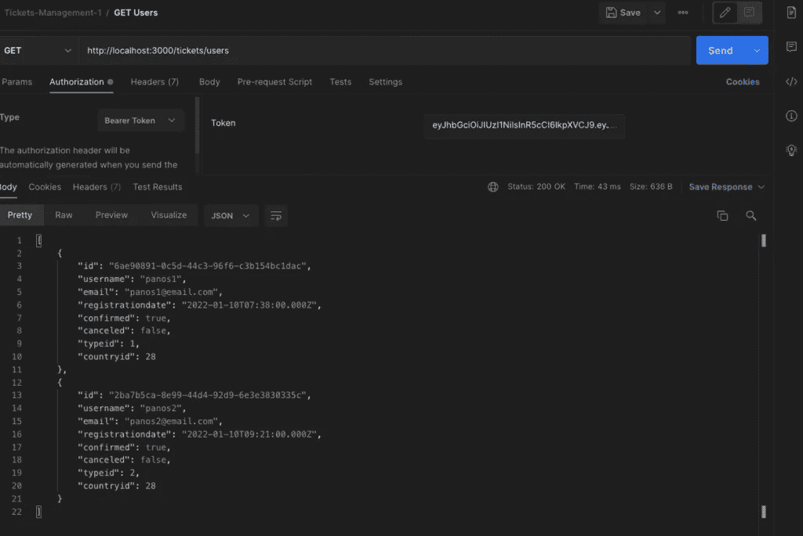
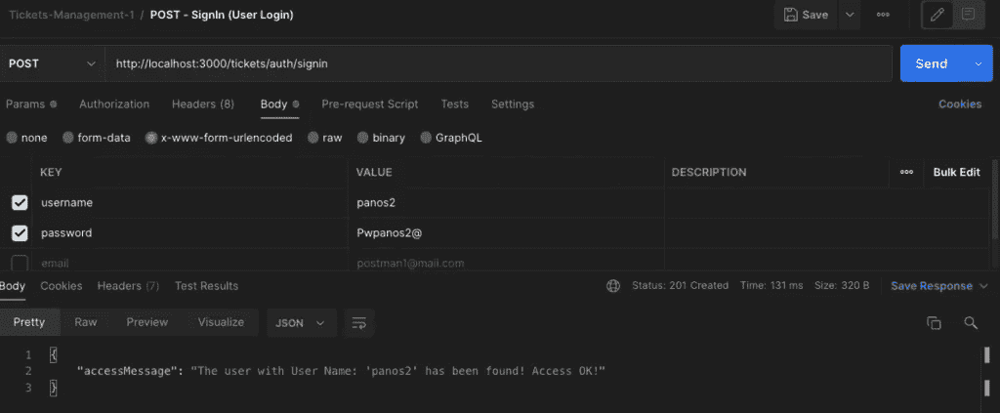
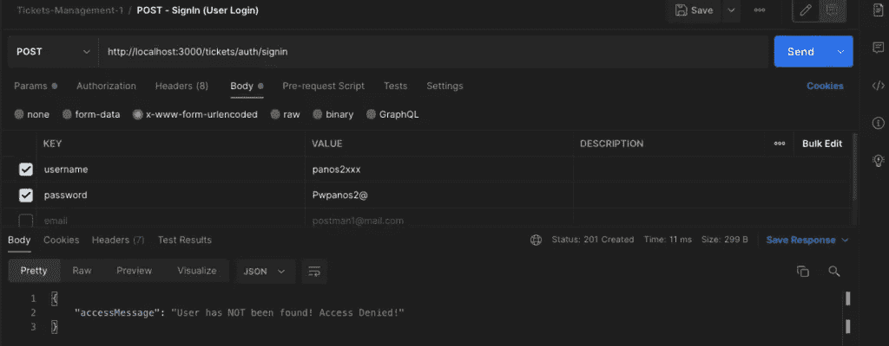
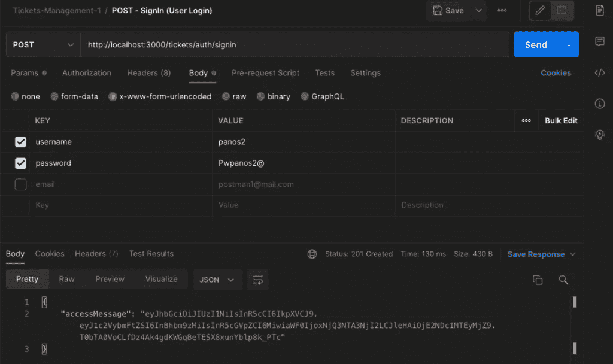
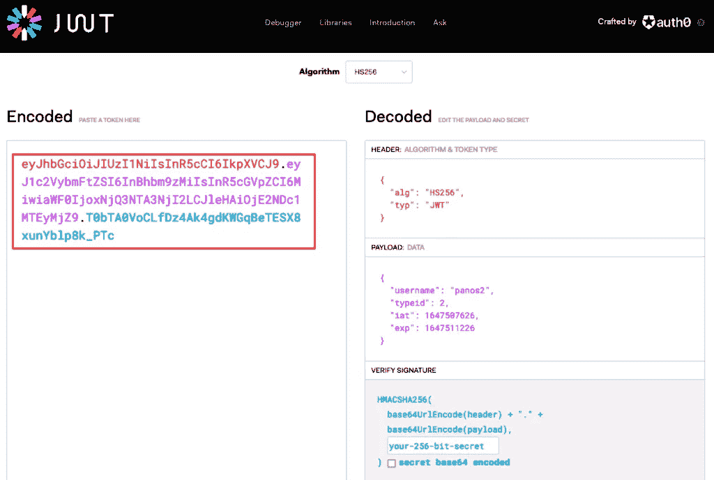
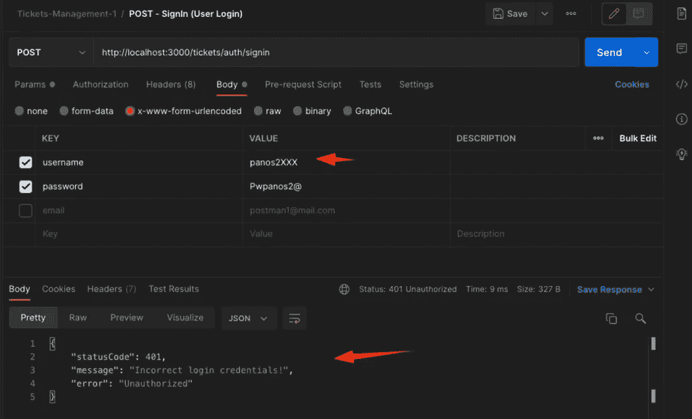
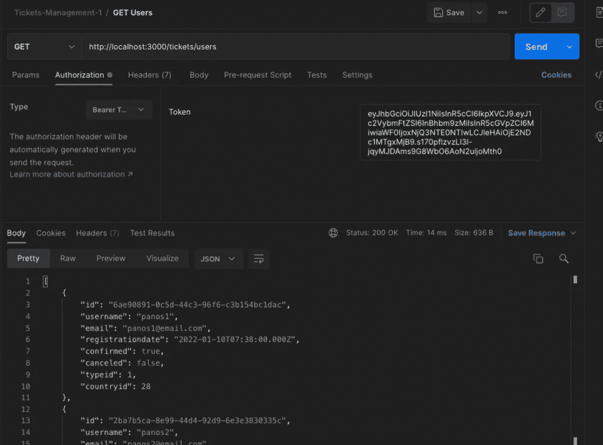
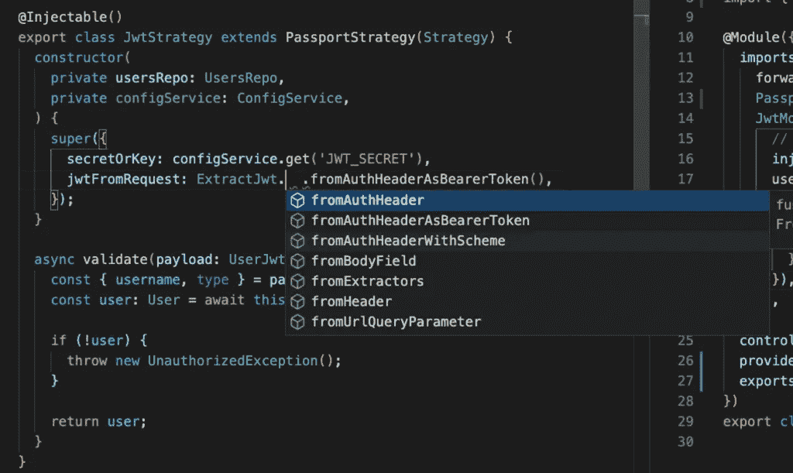
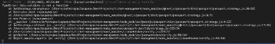
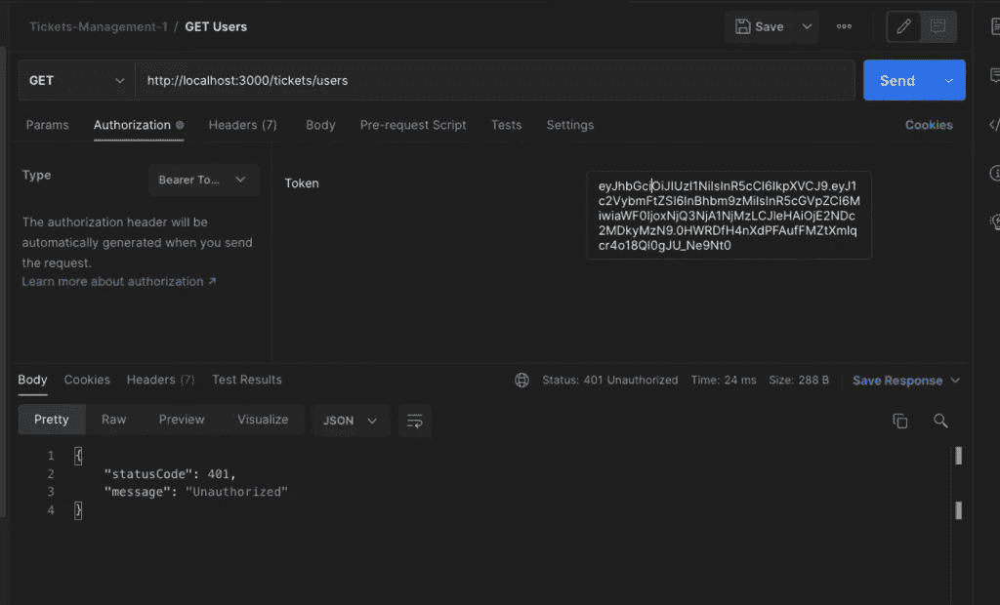

# 您的 NestJS REST API 项目的 JWT 和护照 JWT 策略

> 原文：<https://betterprogramming.pub/jwt-and-passport-jwt-strategy-for-your-nestjs-rest-api-project-cafa9dd59890>

## 一步一步详细实施


由[布莱克·古德瑞](https://unsplash.com/@blakeguidry?utm_source=medium&utm_medium=referral)在 [Unsplash](https://unsplash.com?utm_source=medium&utm_medium=referral) 上拍摄的照片

# 构建模块—简短介绍

当涉及到应用程序身份验证(例如用户身份验证)时，基于 [JSON](https://www.json.org/json-en.html) Web 令牌(JWT)的身份验证是最广泛的选择之一，其他选择包括浏览器 Cookies 和会话身份验证、 [OAuth](https://oauth.net/) / [OAuth2](https://oauth.net/2/) 和 [OpenID Connect](https://openid.net/connect/) 。

任何人都可以在任何项目中采用和实现 JWT。例如， [NestJS](https://nestjs.com/) 为我们提供了 solo `[@nestjs/jwt](https://www.npmjs.com/package/@nestjs/jwt)`模块，允许我们将 JWT 集成到我们的项目中。然而，它需要大量的样板文件。因此，使用专门用于身份验证的外部工具/包可能是首选的解决方案。

[Passport](https://www.passportjs.org/) 包是一个被广泛使用的 [NodeJS](https://nodejs.org/en/) 库，其“唯一的目的是认证请求，这是通过一组可扩展的插件来实现的，这些插件被称为策略。直到写这篇文章的时候，护照库由大约 537 个[策略](https://www.passportjs.org/packages/)组成！特别是，对于基于 JWT 的认证，Passport 当然为我们提供了各自的 [JWT 策略](https://www.passportjs.org/packages/passport-jwt/)。

由于 [Passport 是最受欢迎的 NodeJS 认证库](https://docs.nestjs.com/security/authentication)，NestJS 提供了自己的`[@nestjs/passport](https://www.npmjs.com/package)`模块，该模块允许将 Passport 直接集成到任何 NestJS 应用程序中。

这篇文章旨在帮助你如何实现它。实际上，我们将看到如何使用 JWT 和 Passport 的 JWT 策略轻松保护我们的一些路由(端点)。使用 Passport 包提供的 AuthGuard()函数保护路由(端点甚至整个控制器路由)非常简单。

NestJS 文档提供了一个非常相似的例子，并且假设您已经采取了其中描述的一些步骤。然而，这里我们将经历 2 个步骤。

*   首先，我们将使用 JSON Web 令牌进行用户认证
*   然后将继续使用 Passport 包保护我们的路由(基本端点),并应用 JWT 策略。

# 基本储存库

为了您的方便(考虑到您的时间)，您可以使用我的示例[GitHub repo](https://github.com/zzpzaf/nest-external-config-env.git)。回购的要点总结如下:

*   repo(如在 [NestJS 文档](https://docs.nestjs.com/security/authentication#implementing-passport-strategies)中)已经分别包括了 AuthModule 和 UsersModule，以及它们的控制器和服务类。
*   repo 使用单独的 solo @ injectable 类 DbRepo，而不是使用 UsersService 进行基本的 CRUD 操作。它同时服务于`AuthService`和`UsersService`。[ [你可以在我的另一篇文章](https://blog.devgenius.io/nestjs-use-a-solo-injectable-class-as-a-singleton-provider-884911eff279)中阅读如何使用 solo @ injectable 类作为单例提供者
*   `DbRepo`从一个数组中获取一些预先设置在`UserDB`类中的用户。
*   [class-validator](https://www.npmjs.com/package/class-validator) 和 [class-transformer](https://www.npmjs.com/package/class-transformer) 包安装完毕。dto 和实体是在`src/dataObjects`文件夹中定义的，它们被相应地修饰。[ [详见](https://medium.com/@zzpzaf.se/nestjs-rest-api-class-validator-class-transformer-bf7a0e6b311a)中的帖子
*   repo 使用外部定义的变量，所以已经安装了`[@nestjs/config](https://www.npmjs.com/package/@nestjs/config)`包，并且在 AppModule 中对其进行了全局声明。外部变量在 src/config/.env.dev 文件中定义。【[详见我的帖子](/step-ahead-fast-with-nestjs-environment-configuration-406701b3379f)
*   此外，repo 使用 [Joi](https://joi.dev/) 模式验证工具(该工具也在 [NestJS 文档](https://docs.nestjs.com/pipes#object-schema-validation)中用于对象模式验证)。此外，已经在`src/config/config.schema.ts`文件中定义并修饰了一个 JSON 对象模式验证器(使用适当的 Joi 属性修饰器)。它正被用于`src/config/.env.dev`文件中的外部定义变量。
*   回购协议已定义并使用(通过`AuthController`和`UsersController`)以下端点
*   `auth/signup
    auth/signin
    users/
    users?
    users/:id/`

它还使用了`/tickets`全局前缀，因此对于访问用户，您必须使用:`http://localhost:3000/tickets/users`。

# 把回购放在你的机器里

在您的计算机中，将当前工作目录更改为您要克隆存储库的位置/文件夹。
例如，在终端窗口中使用以下命令:

```
git clone https://github.com/zzpzaf/nest-external-config-env.git
```

这将创建一个名为`nest-external-config-env`的新文件夹，其中包含所有回购的文件夹和文件。跳进去，获得项目所需的所有节点包:

```
cd nest-external-config-env
npm i
```

现在，您已经准备好获取代码编辑器/IDE 了。(我用 [VS 代码](https://code.visualstudio.com/))打开`nest-external-config-env`文件夹。如果您愿意，您可以在终端窗口中运行应用程序:

```
npm run start:dev
```

此外，您可以使用 [Postman](https://www.postman.com/) 工具检查一些端点。例如:[http://localhost:3000/tickets/users](http://localhost:3000/tickets/users)



等等。就是这样！现在，我们准备开始了。所以，我们走吧！

# [@nestjs/jwt](https://www.npmjs.com/package/@nestjs/jwt) 包

[@nestjs/jwt](https://www.npmjs.com/package/@nestjs/jwt) 是 nestjs 的 [JWT](https://jwt.io/) 实用程序模块(基于 [jsonwebtoken](https://github.com/auth0/node-jsonwebtoken) 包)。它允许我们使用 [JSON Web 令牌— JWT](https://jwt.io/introduction/) 来认证用户。

# 装置

```
npm i @nestjs/jwt
```

# 履行

这个包实际上为我们提供了一个模块`[JwtModule](https://github.com/nestjs/jwt/blob/master/README.md)`，它又公开了一个服务`[JwtService](https://github.com/nestjs/jwt/blob/master/README.md)`。

## **JwtModule**

第一步是在任何项目模块的导入数组部分导入`JwtModule`。因此，既然我们想使用它进行用户令牌认证，在我们的例子中，我们必须将它导入到我们的`AuthModule`中。

此外，我们还必须使用它的`register()`方法来配置它。基本配置可以仅包括对称秘密(代码)和生成的令牌的到期时间，例如以秒为单位。例如，我们可以这样使用它:

当然，该软件包还提供了一些其他配置选项，例如，使用非对称算法对令牌进行加密/解密。如果你想浏览它们，那么,[官方文件](https://github.com/nestjs/jwt/blob/master/README.md)是一个很好的来源。

然而，由于在我们的源代码中使用密码或秘密代码作为字符串不是一个好主意，一个更好的解决方案是在外部定义它们，在一个安全保存的. env 配置文件中。注意，我们已经完成了，在我们的克隆回购提供的`.env.dev`中。实际上，这是回购提供的`.env.dev`文件:

还要注意，你不应该公开暴露你的密码或秘密代码。更重要的是，你必须在你的`.gitignore`文件中包含任何敏感信息。然而，为了本文的演示目的，在这种情况下这是不正确的。

因此，我们可以通过`ConfigService`使用外部提供的参数注册`JwtModule`，如下所示:

编码风格由你决定。[您可以一直阅读官方文档，了解更多关于:[动态模块](https://docs.nestjs.com/fundamentals/dynamic-modules#introduction)和`[useFactory()](https://docs.nestjs.com/fundamentals/custom-providers#factory-providers-usefactory)` ]

## **JwtService**

接下来，从`JwtModule`暴露出来的`JwtService`应该被注入到`AuthService`(通过`AuthService`构造函数)，就像这样:

我们实际上想要做的是接受“登录”过程的请求主体中提供的用户凭证(用户名和明文密码)，然后只验证一次。在成功验证之后，我们可以请求`JwtService`为我们提供一个令牌，这个令牌应该作为响应返回给用户。如果验证失败(错误的用户名或用户不存在或错误的密码)，我们可以相应地通知用户。

## **JWT 有效载荷**

还有一件事，我们必须停留一下，就是定义一个有效载荷。这通常是一个 JSON 对象，是创建 JWT 所需要的。[阅读更多:[https://jwt.io/introduction/](https://jwt.io/introduction/)

定义有效负载取决于您自己的业务逻辑和您的特定需求。但是在任何情况下，避免使用过于简单的有效载荷。示例:仅由用户名组成。

这里我们将使用一个 2 properties JSON 对象作为我们的示例负载。它应该由用户名和`typeid`组成。因此，除了用户名和密码的有效性之外，用户必须拥有适当的`typeid`才能访问 API 端点。

此外，一个好的实践是为我们的有效负载对象定义我们自己的接口，不管它是否简单。这主要是为了一致性和可扩展性，可以帮助我们避免一些相关的错误。

注意，在我们克隆的 repo 中，我们使用了一个单独的子文件夹(`datObjects`文件夹),它保存了我们项目的所有数据类型对象。因此，创建一个新的 TypeScript 文件，将其命名为`user-jwt-payload.interface.ts`，并将以下示例代码放入其中:

## **创建并返回一个 JWT**

现在，我们准备验证(或不验证)用户，如果验证通过，我们可以向他/她返回令牌。我们可以很容易地做到这一点，通过在`AuthService`中使用`signin()`方法中的`JwtService`，就像这样:

正如你所看到的，我们已经使用了内置的 JwtService 函数`sign()`，向它传递了有效载荷对象。该函数将令牌返回给我们，然后将令牌作为响应对象发送回用户。就是这么简单！不是吗？可以用 Postman 测试一下。例如:



此外，您还可以在[https://jwt.io/](https://jwt.io/)在线检查生成的令牌。示例:



您还可以测试无效的凭据:



注意:为了明确返回对象是一个令牌(一个 JWT)而不仅仅是一个消息(一个字符串)，请将`AutService`和`AuthController`中的`accessMessage`重命名为`accessToken`。

## **通过 JWT 的验证**

现在，每当我们想要检查来自端点中的用户的请求时，我们将只检查所提供的令牌的有效性(在请求的授权报头中作为承载令牌提供的 JWT)。再也没有用户名和密码了！

JwtService 将通过其内置函数`verifyAsync()`来完成这项工作！让我们看看如何为特定的端点做到这一点，例如:为用户/端点。然而，首先，我们必须提取授权头中提供的`Bearer`令牌(如果有的话)。

我们可以这样做，例如，对于`UsersController`中的`@Get() getUsers()`处理程序方法。我们将使用`@Headers`装饰器来获取所有传入的头，然后我们将从`authorization`头属性中提取`Bearer`标记。我们可以这样做:

接下来，我们可以定义并调用一个私有方法，使用上面提到的`verifyAsync()`来检查所获得的承载令牌的有效性。

由于我们将需要`JwtService`和`ConfigService`(用于获取密钥，该密钥也应在`**verifyAsync()**`函数中提供)我们必须在继续之前处理 2-3 次代码调整。

在克隆的回购协议的`UsersModule`中，您可以看到我们已经注意到导入了`AuthModule`，但是，为了能够使用/注入`JwtService`，我们必须从`AuthModule`中导出`JwtModule`。因此，在其中添加 exports 属性数组并添加`JwtModule`。`AuthModule`应该是这样的:

现在，我们准备在我们的`UsersController`中注入`JwtService`。

正如我们已经说过的，我们也需要注入`ConfigService`。但既然是在`AppModule` ( `isGlobal: true`)全局启用，那就没什么可多做的了。我们也准备将它注入到用户控制器中。

所以，我们给他们两个都注射。`UsersController`构造函数将类似于:

最后，我们可以创建一个私有方法来检查所获得的载体的有效性。我们可以将其命名为`isTokenValid`:

正如你很容易理解的，我们传递给函数 2 个参数:不记名令牌和 JWT 秘密。

如果承载令牌无效，该方法抛出一个`HttpException`，否则它返回一个解密了全部有效载荷的对象。有效负载对象包括:用户名、`typeid`(在创建令牌时由我们定义)以及由`JwtService`自动添加的`iat`和`exp`属性。`iat`代表令牌的创建和`exp`、到期时间(预计相差 3600 秒)。

我们实际上需要从返回的有效载荷对象中得到的只是`username`和`typeid`。

`username`需要检查带有`username`的用户是否仍然存在。因为在生成令牌后，用户总是有可能被删除。所以，我们必须检查用户的存在，然后决定令牌是否有效。因此，我们使用“用户名”来检查用户是否存在于我们的`DbRepo`中。

之后，我们检查`typeid`。在我们的例子中，一个令牌被认为是有效的，只对拥有`typeid` 1 和 2 的用户有效。如果这是真的，那么`IsTokenValid()`返回真。

请注意，我们使用从有效负载获得的`typeid`值来保持`stuck`(而不是从找到的用户的`user.typeid`属性)，因此任何`typeid`值的更改都将被忽略。

所以，让我们从`getUsers()`处理程序调用它。

该处理程序类似于:

就是这样。我们现在可以使用邮递员，并对其进行一点测试。这是带有有效不记名令牌的响应:



这是一个无效令牌示例(时间已过期):


好像还行。那么，我们下一步能做什么？我们可以为其他端点和 CRUD 操作重复调用`isTokenValid()`。但是你可以理解，这是“不符合 [D](https://en.wikipedia.org/wiki/Don%27t_repeat_yourself) RY 原则”的。它需要大量样板代码，因此不容易维护。你能想象如果以后我们决定添加更多的端点并使用许多其他模块意味着什么吗？

不，这不是我们要做的。我们将使用**护照**包代替。

在继续之前，如果您愿意，可以提交。或者，您可以下载或克隆一个干净的 repo，其中包含我们到目前为止所描述的@nestjs/jwt 实现，供您自己参考。这里是[https://github.com/zzpzaf/nest-external-config-env-jwt](https://github.com/zzpzaf/nest-external-config-env-jwt)注意，我们将删除上面使用的部分代码。

请注意，我们将删除上面使用的部分代码。

# [护照](https://www.passportjs.org/)包

## 装置

```
npm i passport @nestjs/passport passport-jwt
npm i --save-dev @types/passport-jwt
```

## 履行

在`AuthModule` 中导入它——我们开始，在`AuthModule`的导入数组部分中导入`PassportModule`,与我们之前为`JwtModule`所做的类似。这里，我们再次使用`Passport`提供的`register()`内置方法，注册一个策略作为我们项目的默认策略。正如你可能猜到的，默认策略是 [JWT 策略](https://www.passportjs.org/packages/passport-jwt/)。所以，我们的`AuthModule`就变成了:

正如您所看到的，我们只添加了一行代码:

```
PassportModule.register**({** defaultStrategy: 'jwt' **})**,
```

下一步是以我们自己的方式实施这样一个 JWT 战略。实际上，我们自己的“策略”应该通过一个`@injectable`修饰类来实现，该类反过来应该扩展 Passport package `PassportStrategy(Strategy)`类。

我们将为该类使用一个单独的文件。我们将文件命名为`jwt.strategy.ts`，类命名为`JwtStrategy`。我们可以将这个文件放在我们项目的`src/auth`文件夹中:

## **构造函数——调用父函数:super()**

为了使用它，我们必须在构造函数中传递一个至少有两个参数的对象。更准确地说，由于这是一个派生类(来自`PassportStrategy(Strategy)`类),我们还必须从父类的`Constructor`中调用`super (parent)`类——所以我们必须在这个类的`super({})`中这样做。`super()`方法需要两个参数:

```
**constructor(){**super**({**param1: value1, param2: value2**})}**
```

第一个参数— `**jwtFromRequest**`(必需)—该参数是必需的，因为我们必须从请求的报头中提取 JWT 承载令牌(有效载荷)，类似于我们之前“手动”所做的。它实际上是一个函数，接受一个请求作为唯一的参数，并返回字符串形式的 JWT 或空值。更多细节见[从请求中提取 JWT](https://github.com/mikenicholson/passport-jwt#extracting-the-jwt-from-the-request)。我们可以使用通过 ExtractJwt 枚举提供的选项。在我们的例子中，我们必须选择`fromAuthHeaderAsBearerToken()`:



第二个参数(对于第一个参数是必需的)。— `secretOrKey` —这是一个字符串或缓冲区，包含用于验证令牌签名的机密(对称)或 PEM 编码的公钥(非对称)。这里我们将使用我们以前用过的秘密。当然，在我们的情况下，我们必须从`ConfigService`获取它。，所以我们还必须在类构造函数中注入`ConfigService`。因此，调用超级构造函数应该如下所示:

**`**validate()**`**方法—** 应该是`PassportStrategy`实现类的一部分。对于每个策略，Passport 默认调用 jwt verify 函数。在 NestJS 中，这个函数是用一个`validate()`方法实现的。**

**如果省略这个方法，我们会得到一个异常错误:
`ERROR [ExceptionsHandler] this.**validate** is not a function`**

****

**我们使用一个`validate()`函数，它应该是一个承诺，只是在我们实现了自己的验证逻辑之后返回一些东西。例如，我们可以返回 always true(用于验证所有内容):**

**在 Passport 验证并发现令牌有效(有效签名、未过期等)后，调用`validate()`函数。).如果令牌有效，那么它将有效负载解码并提取为一个 JSON 对象，并使其可用，因此我们可以在`validate()`函数中使用它。**

**在我们的例子中，我们使用`validate()`函数返回一个用户对象。为了取回用户对象，我们必须访问`DbRepo`及其方法。所以，我们必须在`JwTStrategy`构造函数中注入`DbRepo`。我们的`JwtStrategy`应该类似于:**

**在我们定义了我们的`JwtStrategy`之后，下一步是将这个策略添加到`AuthModule`中的`providers`属性数组中。然后，我们还将它与 passport 模块一起添加到 exports 属性数组中。因此，我们将它们提供给其他地方和其他模块:**

**就是这样！现在，我们已经为最后一步做好了准备，并使用 Passport 来验证 JWT 令牌，而不是像我们已经完成的那样“手动”进行验证(在`UsersController`中)。**

**下一步是保护我们的路线——使用 Passport 内置方法的端点:`AuthGuard()`。**

## **Nest.js 中[护板](https://docs.nestjs.com/guards#binding-guards)机构简介**

**在继续之前，我们必须提到，NestJS 框架提供了[守卫](https://docs.nestjs.com/guards#binding-guards)的“本地”功能。一般我们可以定义/实现自己的`AuthGuard`类(实现了 NestJS `CanActivate`接口)，并为其定制`canActivate()`函数。然后，我们可以使用`@UseGuards`装饰器来应用(绑定)它。在 NestJS 中，可以通过两种方式绑定守卫:**

1.  **保护整个控制器路由。**
2.  **保护特定的处理程序(在控制器中)**

**例如，我们可以创建并保护一个特定的`@Post`处理程序。例如，在我们的 auth.controller.ts 中，我们可以添加以下内容:**

**然而，Passport 为我们提供了现成的内置`AuthGuard()`功能。因此，我们可以轻松地将其绑定到我们的路由和端点。**

**上面，我们已经使用了 NestJS `@UseGuards` decorator，并且我们刚刚将自定义的 AuthGuard 类传递给它，以保护/test 端点 POST 处理程序。**

**但是我们也可以在控制器级别保护整个路由。而这用护照的`Authguard()`简直易如反掌。这是我们的案子。我们可以通过添加以下命令来保护整个`UsersController`路线:**

```
@UseGuards**(**AuthGuard**())**
```

**示例:**

**现在，如果没有认证，即没有有效的 JWT 令牌，就无法处理对/users 路由的请求。`AuthGuard()`通过我们的 define `JwtStrategy`自动检查 JWT 令牌的有效性，接受对任何一个`UsersController` HTTP 方法处理程序的请求，或者拒绝它。**

**最后一步是从我们之前为`manual` JWT 令牌验证创建的代码中清除`UsersController getUsers()`方法处理程序。下面，我们刚刚推荐了它，所以以后您可以完全删除它:**

**这是邮差的测试结果:**

****

**正如您所理解的，这也可以用于您以后想在项目中添加的任何控制器。**

**您可以在:[https://github . com/zzpzaf/nest-external-config-env-jwt-passport . git](https://github.com/zzpzaf/nest-external-config-env-jwt-passport.git)访问 ready clean repo。**

**就是这样！我希望你喜欢它，即使它有点长！编码快乐！…敬请关注！**