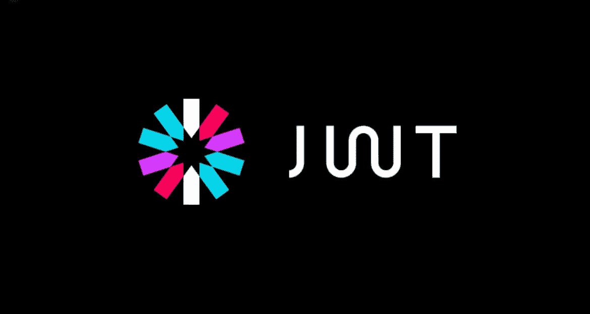
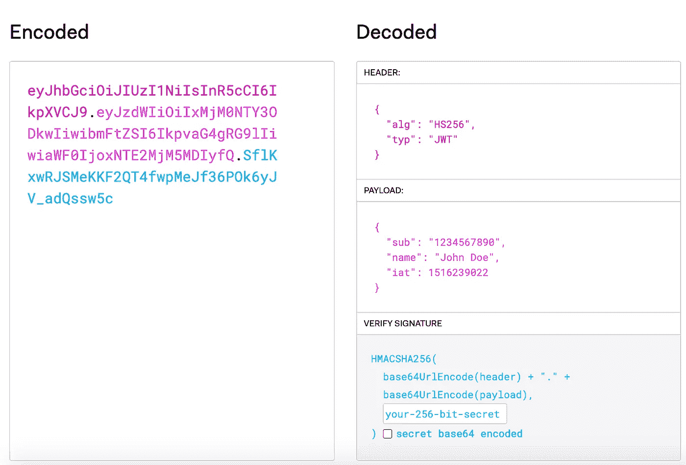
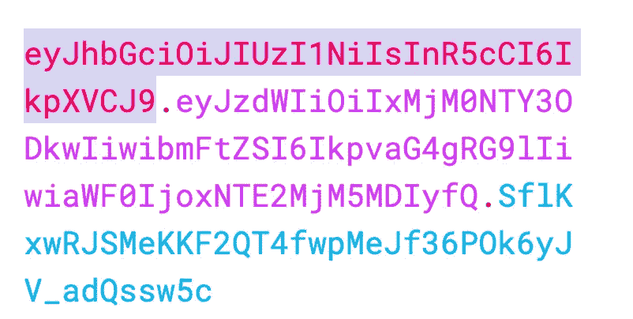
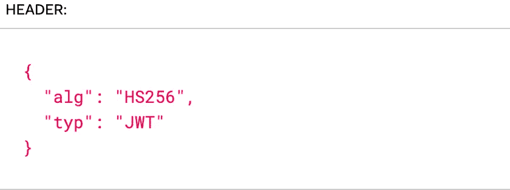
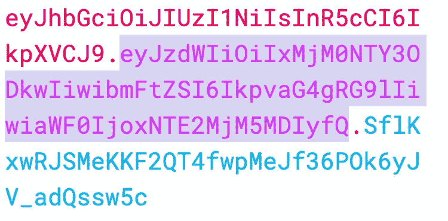
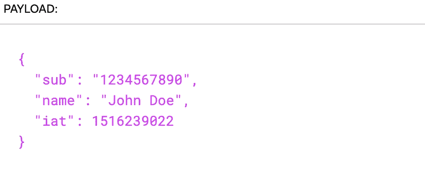
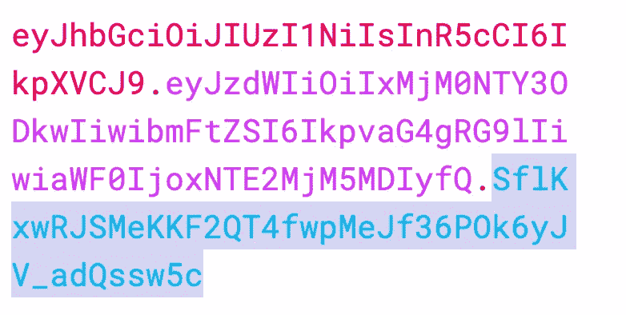
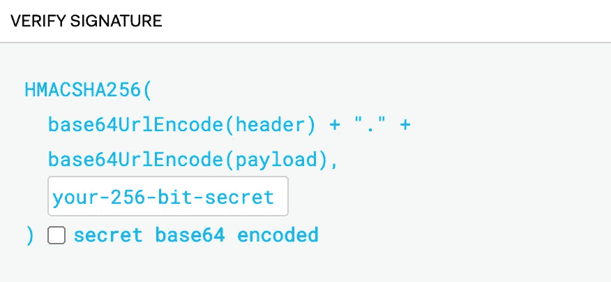

# JWT 代币:什么，如何，为什么

> 原文：<https://betterprogramming.pub/jwt-tokens-the-what-how-and-why-6ae3bad26661>

## 了解 JavaScript Web 令牌如何使您的应用程序更加安全，以及它们是如何工作的

信用:auth0.com，[https://auth0.com/blog/jwt-json-webtoken-logo/](https://auth0.com/blog/jwt-json-webtoken-logo/)

当我第一次了解加密、授权、认证、cookies、JWT 令牌等过程时。，我相当不知所措。进入这些主题的杂草是极其复杂的，可能会令人困惑，这就是为什么网络安全本身是一个完整的领域。但是，作为一名开发人员，至少对这些主题有一个初步的了解是很重要的。

在本文中，我们将了解一种非常流行的授权方法， [JSON Web 令牌](https://jwt.io/) (JWT)。

虽然本文中的主题甚至没有触及网络安全的表面，但是作为软件开发人员，理解和了解它们是非常重要的。

要点:理解安全过程是开发人员的一个重要部分。

# 认证和授权有什么区别？

简而言之，身份验证是任何安全流程的第一步。这个开始的过程验证凭证(一个例子是密码或手机上的面部识别),并确认用户就是他们所说的那个人。授权(JWT 开始发挥作用)给予用户对特定功能或资源的访问权。例如，如果用户可以执行管理操作等，则可以授权用户访问财务记录。

来自 okta.com 的一篇文章[的简单定义:](https://www.okta.com/identity-101/authentication-vs-authorization/)

> “身份验证确认用户就是他们所说的那个人。授权赋予这些用户访问资源的权限。

换句话说，身份验证就是俱乐部的保安检查你的身份证，以确保你年满 21 岁并被允许进入大楼；授权是他给你的允许进入俱乐部或确认你被允许进入贵宾区的印章。

要点:身份验证验证用户，而授权则赋予用户访问特定功能或资源的权限。

# 输入 Cookies

为了理解 JWT 为什么有用以及它有什么不同，我们需要简要了解另一种授权方法:cookies。

下面是一个使用 cookies 进行授权的会话示例:

1.  用户从他们的浏览器(称为*客户端*)登录到一个站点(被认证)。
2.  服务器将它们的会话保存在服务器内存中，并分配一个与内存中该部分相对应的唯一会话 ID。
3.  然后，服务器将这个会话 ID 作为 cookie 发送回客户机。这样，浏览器总是可以访问会话 ID，并能够在任何时候发出请求时将其发送给服务器。
4.  现在一个用户试图访问一个页面。然后，浏览器向服务器发送一个带有会话 ID cookie 的请求。
5.  服务器接收这个 ID 并检查它是否存在于内存中。一旦服务器发现 ID 存在于内存中，它就检查具有该 ID 的用户是否被授权访问页面、功能等。他们正试图进入。
6.  然后，服务器向客户机发回一个响应，告诉客户机他们是否被授权执行这个操作，浏览器就相应地采取行动。

# JWT 在哪里？

使用 JWT 进行授权的会话的开始类似，但是有一些关键的区别。

下面是一个使用 JWT 令牌而不是 cookies 进行授权的会话示例:

1.  用户从他们的浏览器(称为*客户端*)登录到一个站点(被认证)。
2.  现在，服务器不是将用户的会话存储在服务器内存中，而是创建一个 JSON Web 令牌，对其进行编码、序列化，并用一个惟一的密钥对其进行签名。这个密钥允许服务器知道令牌是否被篡改。
3.  然后，服务器获取 JWT，并将其发送回浏览器。这里的主要区别是:服务器上没有存储任何东西。JWT 内置了关于用户的所有必要信息。
4.  然后，浏览器存储 JWT 令牌(一种常见的方式是使用浏览器的本地存储)。
5.  然后，用户试图访问一个页面，浏览器向服务器发送一个带有 JWT 的请求(类似于上面示例中使用会话 ID cookie 所做的事情),这样服务器就知道是哪个用户在请求授权。
6.  然后，浏览器检查它在最开始时给 JWT 的密钥，以确保它没有被更改。这样，如果用户更改了 JWT 令牌中的用户，服务器会知道并说这是无效的。
7.  一旦确认 JWT 是有效的，服务器就向客户端发回一个响应，告诉他们是否被授权执行所请求的操作(与上面类似)。

这里要注意的主要区别是，对于 cookies，信息存储在服务器端，而对于 JWT，由于信息存储在实际的令牌中，所以信息存储在客户端。由于服务器不需要记住任何东西，这就简化了很多事情，特别是在使用多个服务器和有不同会话的时候。

要点:cookie 和 JWT 令牌之间的一个关键区别是，cookie 存储在服务器上，而 JWT 令牌存储在客户端。

# JWT 代币是如何工作的？

让我们去 [jwt.io](https://jwt.io/) 走一趟，分解一下我们看到的。

在左边，我们有 JWT 的编码版本，这是发送到客户端和从客户端接收的内容。

在右边，我们有解码版本，它有三个不同的部分:

1.  头，它决定了用于编码和解码令牌的算法(不同的算法超出了本文的范围，老实说，很少需要更改)。
2.  有效负载，即存储在令牌中的所有信息。
3.  签名，这是服务器在发送回令牌之前验证令牌未被客户端更改的方式。

您会注意到 JWT 用句点分隔这三个部分，使它们易于识别。

# 标题

标题编码

标题已解码

如上所述，讨论可以在头中使用的不同类型的算法超出了本文的范围。这里需要知道的重要一点是，这是用来决定如何编码和解码令牌的。

# 有效载荷

有效载荷编码

有效载荷解码

有效负载是存储用户所有数据的地方，也是应用程序负责的大部分内容。任何键/值对都可以放在这个组件中，但是您将看到一些公共字段:

*   `sub`(或主题)通常是被授权用户的 ID。
*   `name`。这可能让人感到震惊，但这个名字通常是用户的名字。
*   `iat`，代表“发布于”这表示令牌是何时创建的。如果您想让令牌过期(通常保存为`exp`或`eat`，代表“过期时间”)，这可能会很有用。

# 签名

签名编码

签名解码

该签名验证用户在令牌被发送回服务器之前没有改变令牌。

这是它创建签名的方式:

1.  它接受标题并添加一个句点。
2.  它获取有效载荷，并将其与报头组合在一起(在句点之后)。
3.  它使用标题中定义的算法，使用您定义的密钥(允许您在上图中键入的区域)对以上组合的数据进行编码。
4.  这意味着，如果客户端改变了数据中的一个字符，当数据被发送回服务器时，签名将不再匹配。

# 为什么用 JWT？

假设一家公司拥有两台服务器(应用、网站等。)，针对他们业务的两个不同方面(或者可能是一个巨大的业务，无法将他们的所有用户存储在一个服务器上，所以它在不同的服务器之间平衡流量)。该公司希望登录一个应用程序/服务器的用户在切换到另一个应用程序/服务器时，能够自动登录到另一个应用程序/服务器(这通常是无缝完成的，用户甚至不会注意到)。他们不希望用户在切换到另一台服务器时必须重新登录。

在基于会话的服务器(基于 cookie)中，由于会话数据存储在服务器的内存中，而不是浏览器中，因此用户需要分别登录每台服务器，因为会话存储在一台服务器中，而不是另一台服务器中。

使用 JWT 时，由于令牌存储在浏览器中而不是服务器上，如果您在两台服务器上共享相同的密钥，那么您需要做的就是向每台服务器发送相同的 JWT。这意味着客户端可以保持登录，即使在服务器之间切换。

使用 JWT 令牌允许用户在服务器之间切换，而不需要每次切换时都登录。

# 摘要

*   **认证**就是验证用户是他们所说的那个人。
*   **授权**给予用户访问某些功能和资源的权限。这就是 JWT 代币发挥作用的地方。
*   **cookie**是一种使用存储在服务器上的会话 ID 的授权方法。
*   JWT 令牌不同于 cookies 的最重要的原因是它们**存储客户端**的信息。服务器不需要存储任何东西。
*   JWT 令牌有**三个不同的部分**:头部**头部**，存储用于编码和解码令牌的算法；**有效载荷**，存储所有用户信息；以及**签名**，这是服务器验证令牌未被更改的方式。
*   因为 JWT 令牌存储在客户端，所以当您想要**使用多个服务器**而客户端不需要在它们之间切换时单独登录时，它们特别有用。

关于 JSON Web 令牌、认证或授权，还有什么要补充的吗？欢迎在评论中分享！