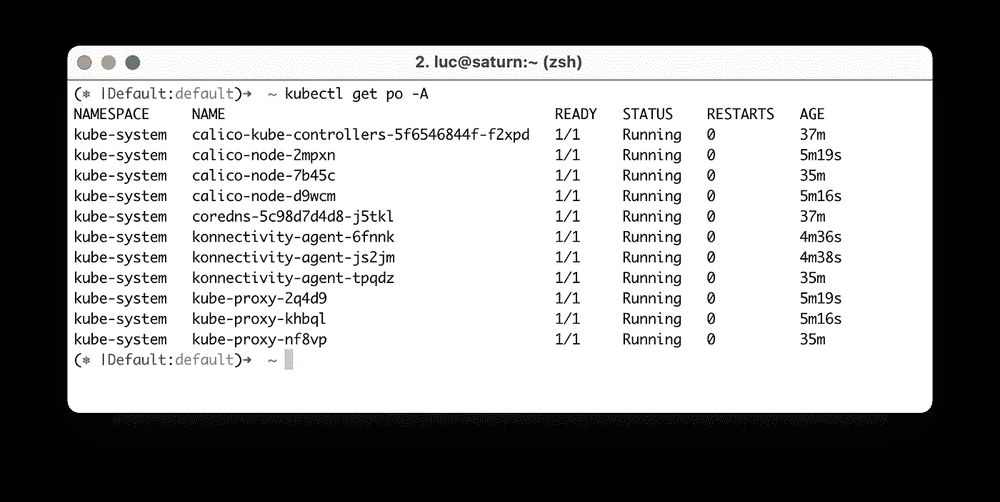

# k0s:单个二进制中的 Kubernetes

> 原文：<https://betterprogramming.pub/k0s-kubernetes-in-a-single-binary-224bb43f4520>

## 这种新的 Kubernetes 分布的初步研究


安妮·斯普拉特在 [Unsplash](https://unsplash.com?utm_source=medium&utm_medium=referral) 上的照片

🔥更新:自从撰写本文以来，k0s 已经增加了许多附加特性。请查看[这篇新文章](https://itnext.io/k0s-multi-node-cluster-with-k0sctl-922fc2cb4dc8)，它详细介绍了单节点或多节点 k0s 集群的简单设置。

几天前，一个朋友告诉我关于$ multipass exec node1 cat /var/lib/k0s/pki/admin.conf > k0s.cfg

接下来，我们用`node1`的外部 IP 地址替换内部 IP 地址:

```
# Replace IP address
$ NODE1_IP=$(multipass info node1 | grep IP | awk '{print $2}')
sed -i '' "s/localhost/$NODE1_IP/" k0s.cfg
```

然后，我们配置本地 kubectl 客户机与 k0s API 服务器通信:

```
export KUBECONFIG=$PWD/k0s.cfg
```

我们在访问新集群时运行的第一个命令可能是列出所有可用节点的命令，让我们试试:

```
**$ kubectl get no**
NAME    STATUS   ROLES    AGE   VERSION
node1   Ready    <none>   78s   v1.19.4
```

这并不奇怪。`node1`是我们的第一个集群的主节点，但是由于我们在启动命令中指定的`--enable-worker`标志，它也是一个工作者节点。如果没有那个标志，`node1`将只是一个工人，不会出现在这里的节点列表中。

# 添加工作节点

为了将`node2`和`node3`添加到我们的集群中，我们首先需要从`node1`创建一个 join 令牌(这一步很常见，因为它用在用 kubeadm 创建的 Docker Swarm 和 Kubernetes 集群中)。

```
$ TOKEN=$(k0s token create --role=worker)
```

上面的命令生成一个长(非常长)的令牌。使用它，我们可以将`node2`和`node3`加入我们的集群:

```
ubuntu@node2:~$ k0s worker $TOKENubuntu@node3:~$ k0s worker $TOKEN
```

**注意:**在一个真实的集群中，我们将使用 systemd(或另一个 supervisor)来管理工作节点的 k0s 进程，就像我们对主节点所做的那样。

我们的三节点集群现在已经启动并运行，我们可以通过再次列出节点来看到这一点:

```
**$ kubectl get no** NAME    STATUS  ROLES    AGE   VERSION
node1   Ready   <none>   30m   v1.19.4
node2   Ready   <none>   35s   v1.19.4
node3   Ready   <none>   32s   v1.19.4
```

我们还可以检查跨所有名称空间运行的 pod:



跨所有命名空间在集群中运行的 pod 列表

这里需要注意一些事情:

*   像往常一样，我们可以看到`kube-proxy`豆荚，网络插件(基于 Calico)，以及一个核心域名豆荚
*   `api-server`、`scheduler`和`controller-manager`窗格没有出现在此列表中，因为它们作为常规进程运行，不在窗格内

# 添加用户

k0s 0 . 8 . 0 版本带来了`user`子命令。它允许我们为额外的用户/组创建一个`kubeconfig`。例如，下面的命令创建名为`demo`的新用户的`kubeconfig`文件，该文件位于名为`development`的虚拟组中。

**注意:**在 Kubernetes 中，用户和组由集群外的管理员管理，这意味着 K8s 中没有用户-非组资源。

```
$ sudo k0s user create demo --groups development > demo.kubeconfig
```

为了更好地理解，我们将从这个`kubeconfig`文件中提取客户端的证书，并从其 base64 表示中对其进行解码:

```
$ cat demo.kubeconfig | grep client-certificate-data | awk '{print $2}' | base64 --decode > demo.crt
```

然后，我们使用一个`openssl`命令来获取该证书的内容:

```
**ubuntu@node1:~$ openssl x509 -in demo.crt -noout -text** Certificate:
    Data:
        Version: 3 (0x2)
        Serial Number:
            71:8b:a4:4d:be:76:70:8a:...:07:60:67:c1:2d:51:94
        Signature Algorithm: sha256WithRSAEncryption
        **Issuer: CN = kubernetes-ca**
        Validity
            Not Before: Dec  2 13:50:00 2020 GMT
            Not After : Dec  2 13:50:00 2021 GMT
        **Subject: O = development, CN = demo**
        Subject Public Key Info:
            Public Key Algorithm: rsaEncryption
                RSA Public-Key: (2048 bit)
                Modulus:
                    00:be:87:dd:15:46:91:98:eb:b8:38:34:77:a4:99:
                    da:4b:d6:ca:09:92:f3:29:28:2d:db:7a:0b:9f:91:
                    65:f3:11:bb:6c:88:b1:8f:46:6e:38:71:97:b7:b5:
                    9b:8d:32:86:1f:0b:f8:4e:57:4f:1c:5f:9f:c5:ee:
                    40:23:80:99:a1:77:30:a3:46:c1:5b:3e:1c:fa:5c:
```

*   `issuer`属性是`kubernetes-ca`，是我们 k0s 集群的认证机构
*   `Subject`是`O = development, CN = demo`；这一部分很重要，因为这是用户名和用户组出现的地方。因为证书是由集群的 CA 签署的，`api-server`中的一个插件能够根据证书主题中的通用名称(CN)和组织(O)来认证用户/组。

首先，我们告诉 kubectl 使用这个新的`kubeconfig`文件中定义的上下文:

```
$ export KUBECONFIG=$PWD/demo.kubeconfig
```

然后，我们再次列出集群的节点:

```
**$ kubectl get no** Error from server (Forbidden): nodes is forbidden: User “demo” cannot list resource “nodes” in API group “” at the cluster scope
```

此错误消息是意料之中的。即使用户已经通过了`api-server`的认证(与用户请求一起发送的证书已经由集群证书颁发机构签名)，他们也无权在集群中执行任何操作。

通过创建`Role` / `ClusterRole`可以很容易地添加额外的权限，并通过`RoleBinding` / `ClusterRoleBinding`绑定到用户，但我将此作为读者的练习。

# 结论

k0s 绝对值得一看。用一个二进制文件来管理所有的进程是一个非常有趣的方法。

在本文中，我们只是快速浏览了一下 k0s，但是我会确保跟踪它的发展，并在以后的文章中专门介绍这个新的、有前途的 Kubernetes 发行版。一些未来的功能看起来很有前途，我真的很期待测试它们。