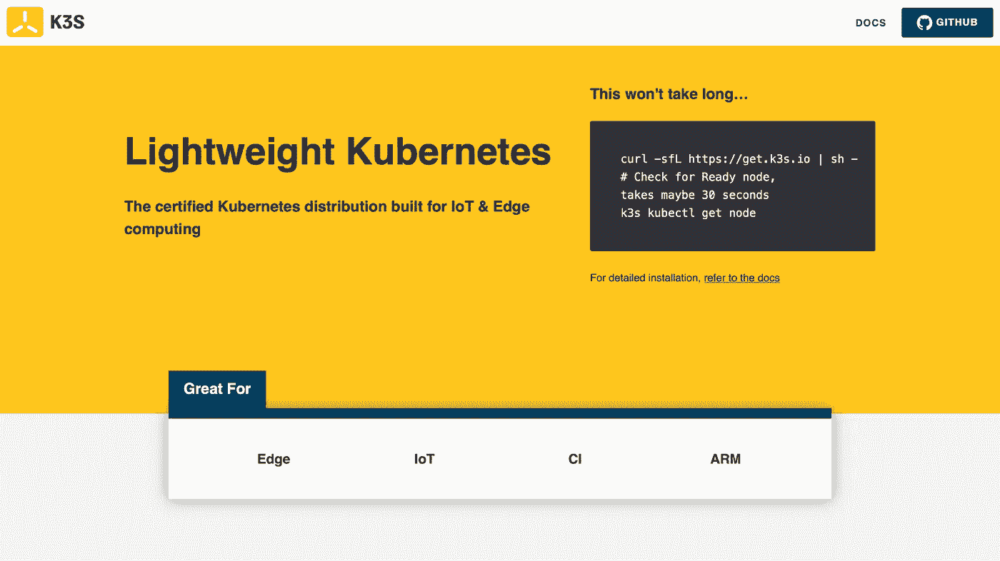
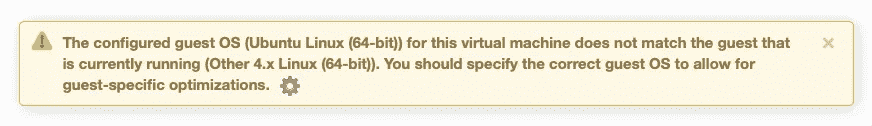
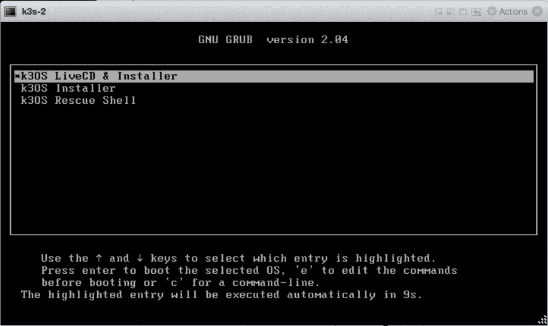
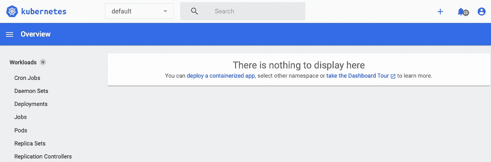
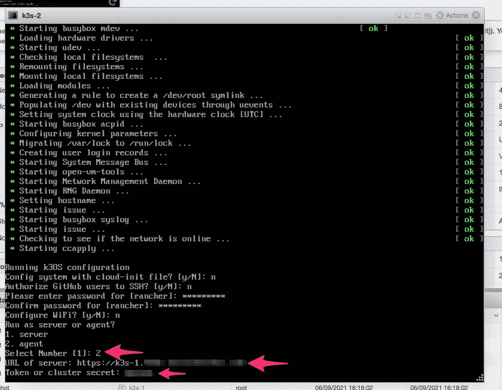

# 使用 k3OS 安装 Kubernetes 五分钟

> 原文：<https://betterprogramming.pub/k3s-k3os-kubernetes-docker-containers-installation-setup-cluster-ee9ccfd51a4d>

## 使用 Rancher 以 Kubernetes 为中心的操作系统快速启动和运行



K3S Kubernetes 分布图(图片由 Rancher Labs 提供)

# k3OS:Kubernetes 的 Linux 发行版

k [3OS](https://k3os.io) 是一个精简的、易于维护的操作系统，用于运行 Kubernetes 节点。它由 [Rancher Labs](https://rancher.com/about) (现在是 [SUSE](https://www.suse.com/products/suse-rancher) 的一部分)积极开发和维护，顾名思义，它运行 [K3s](https://rancher.com/products/k3s/) Kubernetes 发行版(也是 Rancher 所有)。

> K3s 是 CNCF 官方沙盒项目，提供轻量级但功能强大的认证 Kubernetes 分发版，专为资源受限的远程位置或物联网设备上的生产工作负载而设计。它被打包成一个 ISO 版本，您可以将其安装在您最喜欢的虚拟化基础设施上，也可以安装在裸机上。如果您像我一样使用 VMWare 的 ESXi，请确保为初始安装指定虚拟机的操作系统“Ubuntu Linux (64 位)”。虚拟机启动并运行后，您将看到以下消息:

# k3OS 的 VMware ESXi 操作系统类型选择(图片由作者提供)

然后可以切换到“其他 4.x Linux (64 位)”。



一旦你打开虚拟机，你会看到一个典型的引导程序屏幕，你可以直接在你连接的存储器上安装 k3OS。

k3OS 开机画面(图片由作者提供)

选择第二个选项，自动安装不会超过五分钟。



*注意:如果您计划创建一个多节点集群(见下文)，请为“集群令牌”输入一个您能记住的值，因为您以后会需要它。*

网络设置

由于 k3OS 不是普通的 Linux 发行版，某些网络配置任务可能并不简单，除非你确切地知道去哪里看。以下部分描述了定制您的环境的一些基本配置。

# 主机名更改

在 k3OS 中，对`/etc`的更改不会在重启后持续。因此，您需要更改 k3OS 配置文件，这些文件会在每次引导时生成`/etc`。要保持对主机名的更改，您可以使用以下命令发出更改:

## 要真正看到您的主机名被更改，您需要使用以下命令重新启动:

或者，您可以用这个条目创建`/var/lib/rancher/k3os/config.yaml`:

```
sudo vi /var/lib/rancher/k3os/hostname
```

识别和更改网络

```
sudo reboot
```

k3OS 使用 [ConnMan](https://en.wikipedia.org/wiki/ConnMan) ，因此网络管理应该通过`connmanctl`命令进行:

```
hostname: myhostname
```

## `sudo connmanctl services`:为您提供所有可用网络的列表。

`sudo connmanctl config NETWORK --ipv4 manual IP NETMASK GATEWAY --nameservers DNS:` 允许您定义一个静态 IPv4 地址。

`sudo connmanctl config NETWORK — ipv6 off`:允许您关闭 IPv6。

`sudo service connman restart`:重启 ConnMan 使你的修改生效。

SSH 访问

要对 k3OS 安装启用 SSH 访问，您需要将您的公共 SSH RSA 密钥添加到您的安装中。为此，创建`/var/lib/rancher/k3os/config.yaml`并将您的键设置为:

## 可以用用户`rancher`SSH 进入 k3OS。

通过 kubectl 远程访问

```
ssh_authorized_keys:
- ssh-rsa AAAAB3Nza...
```

要远程连接到在 k3OS 中运行的 K3s，您可以从`/etc/rancher/k3s/k3s.yaml`下载集群配置。将 YAML 文件复制到您的`kubectl`的主机上，并可选地更改集群名称，以便您可以正确地识别它(如果您使用 kubens/kubectx 工具，就像我之前在 [4 Kubernetes CLI Gems](/4-kubernetes-cli-gems-c47a72e6fab0) 中所写的那样，这将非常有用)。

# Kubernetes 仪表板

K3s 没有附带仪表板应用程序，因此您可以安装 Kubernetes 附带的标准仪表板应用程序。

# 首先，确定您想要使用的 Kubernetes 仪表板版本:
[https://github.com/kubernetes/dashboard/releases](https://github.com/kubernetes/dashboard/releases)

然后安装它，例如

在远程访问控制面板之前，您需要一个具有适当权限的用户以及该用户的令牌。您可以通过创建一个包含以下内容的`dashboard-admin.yaml` YAML 文件来创建用户并提供必要的权限:

接下来，使用以下内容导入它:

```
sudo k3s kubectl create -f [https://raw.githubusercontent.com/kubernetes/dashboard/v2.2.0/aio/deploy/recommended.yaml](https://raw.githubusercontent.com/kubernetes/dashboard/v2.2.0/aio/deploy/recommended.yaml)
```

`sudo k3s kubectl create -f dashboard-admin.yaml`

```
apiVersion: v1
kind: ServiceAccount
metadata:
  name: admin-user
  namespace: kubernetes-dashboard
---
apiVersion: rbac.authorization.k8s.io/v1
kind: ClusterRoleBinding
metadata:
  name: admin-user
roleRef:
  apiGroup: rbac.authorization.k8s.io
  kind: ClusterRole
  name: cluster-admin
subjects:
- kind: ServiceAccount
  name: admin-user
  namespace: kubernetes-dashboard
```

在您可以远程访问控制面板之前，您需要找到您刚刚创建的用户的令牌:

要从您的`kubectl`主机访问仪表板，通过发出以下命令启动 K3s 的代理:

然后，您可以在此处使用上述令牌访问仪表板:

```
sudo k3s kubectl -n kubernetes-dashboard describe secret admin-user-token | grep '^token'| awk -F ' ' '{print $2}'
```

在 K3s 上运行的 Kubernetes 仪表盘(图片由作者提供)

```
kubectl proxy
```

使用额外的代理节点扩展集群

```
[http://localhost:8001/api/v1/namespaces/kubernetes-dashboard/services/https:kubernetes-dashboard:/proxy/](http://localhost:8001/api/v1/namespaces/kubernetes-dashboard/services/https:kubernetes-dashboard:/proxy/)
```



向 k3OS 集群添加额外的代理节点非常简单。用 k3OS 的 ISO 引导一个新的虚拟机，而不是选择`server`，选择`agent`安装:

# 将代理节点添加到集群中(图片由作者提供)

您需要提供创建第一个节点时记录的集群密码，以及 Kubernetes API 监听的 URL。



摘要

k3OS 是由 Rancher Labs 创建的最小操作系统，它允许您基于 K3s 创建生产级 Kubernetes 集群。在虚拟化环境或裸机中安装集群只需几分钟。本指南为您提供了一些基本设置的快速参考，您可能希望在集群启动后进行调整。

# Summary

k3OS is a minimal operating system, created by Rancher Labs, that allows you to create a production-grade Kubernetes cluster based on K3s. Installing the cluster in a virtualised environment or bare metal takes just a few minutes. This guide provided you a quick reference into some of the basic settings you might want to tune once your cluster is up.