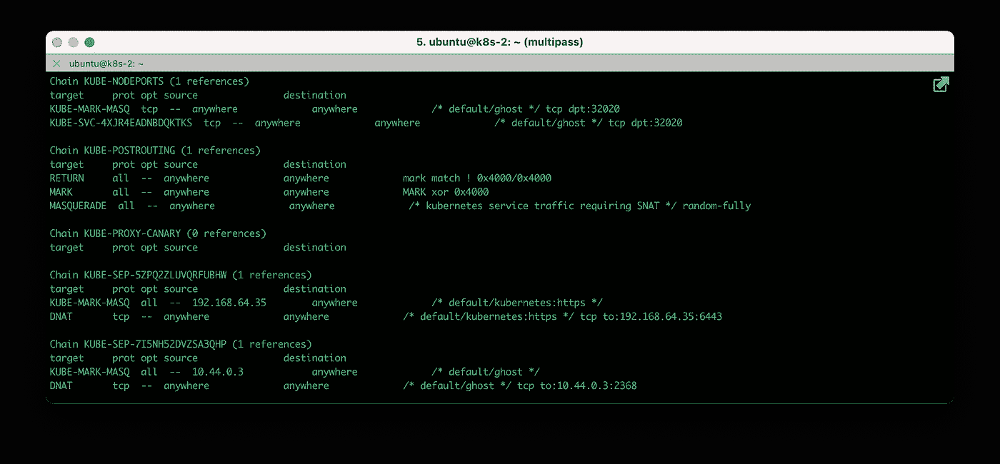
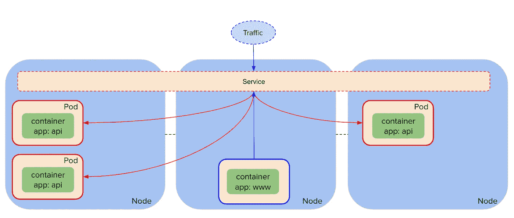
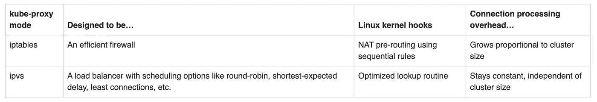
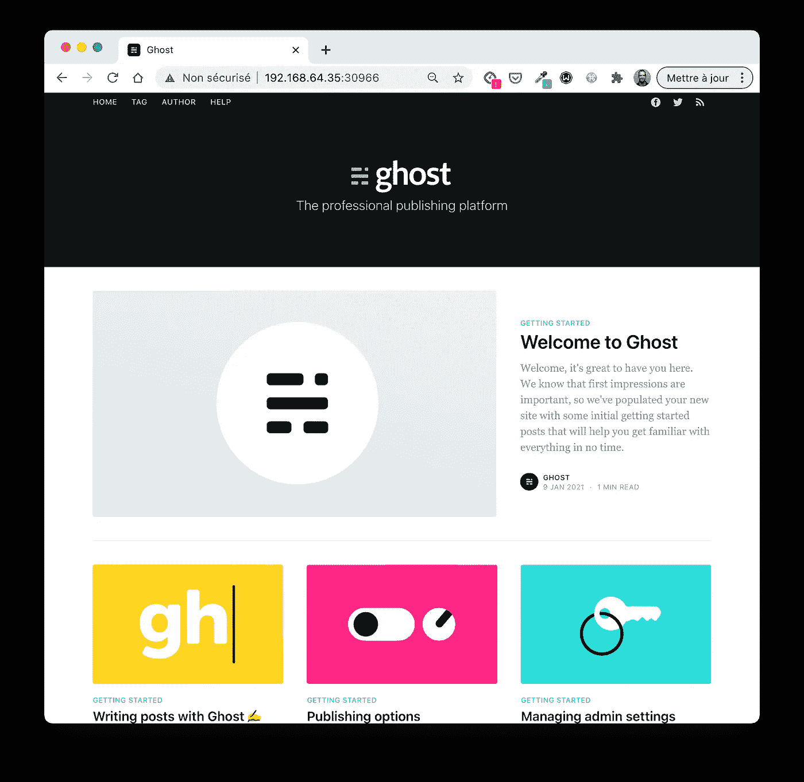
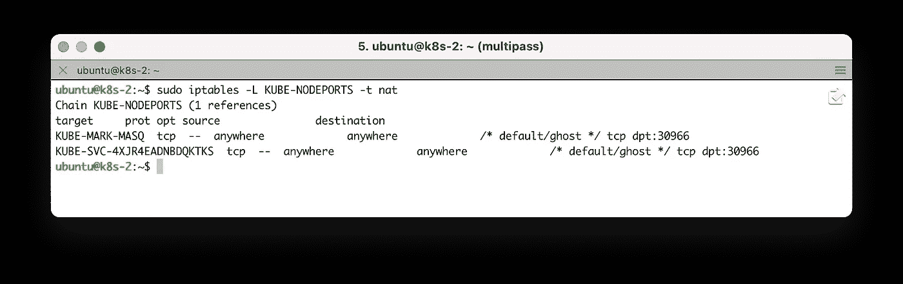
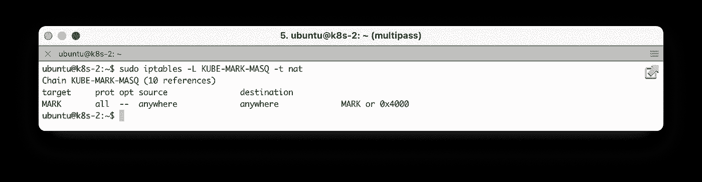
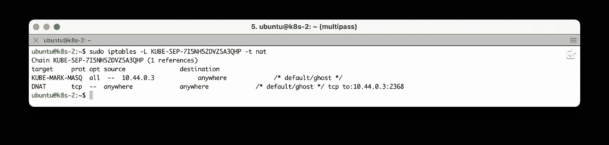
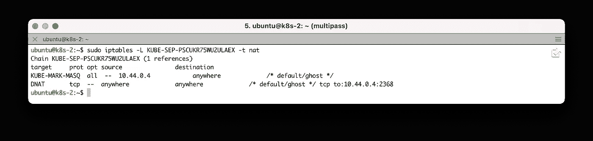

# K8s:近距离观察 Kube-Proxy

> 原文：<https://betterprogramming.pub/k8s-a-closer-look-at-kube-proxy-372c4e8b090>

## 一个展示 kube-proxy 如何使用 iptables 的例子



iptables 规则的示例。作者照片。

Kubernetes 网络代理(又名 kube-proxy)是运行在每个节点上的守护进程。它基本上反映了集群中定义的服务，并管理规则以对服务后端单元的请求进行负载平衡。



服务在后端 pod 之间对传入的请求进行负载平衡。作者照片。

举个简单的例子:假设我们有几个 API 微服务在集群中运行，这些副本由一个服务公开。当一个请求到达服务虚拟 IP 时，该请求是如何被转发到一个底层 pod 的？嗯……简单地使用 kube-proxy 创建的规则。好吧，这并不那么简单，但我们在这里得到了大局。

kube-proxy 可以在三种不同的模式下运行:

*   iptables(默认模式)
*   ipv
*   用户空间(“遗留”模式，不再推荐)

虽然 iptables 模式对于许多集群和工作负载来说完全没问题，但是当服务数量很重要(超过 1，000)时，ipv 可能会很有用。事实上，由于 iptables 规则是按顺序读取的，如果集群中存在许多服务，它的使用会影响路由性能。

[Tigera](https://medium.com/u/f88429157bbf?source=post_page-----372c4e8b090--------------------------------)([Calico](https://projectcalico.org)网络解决方案的创造者和维护者)在[这篇伟大的文章](https://www.tigera.io/blog/comparing-kube-proxy-modes-iptables-or-ipvs/)中详细介绍了 iptables 和 ipvs 模式的区别。它还提供了这两种模式之间的高级比较。



iptables 和 ipvs 模式之间的高级比较。信用:Tigera。

在本文中，我们将关注 iptables 模式(下一篇文章将专门讨论 ipvs 模式),从而说明 kube-proxy 如何定义 iptables 规则。

为此，我们将使用我刚刚使用`kubeadm`创建的双节点集群:

```
**$ kubectl get nodes** NAME    STATUS   ROLES                  AGE   VERSION
k8s-1   Ready    control-plane,master   57s   v1.20.0
k8s-2   Ready    <none>                 41s   v1.20.0
```

在下一部分中，我们将使用部署资源部署一个简单的应用程序，并通过类型为`NodePort`的服务公开它。

# 部署示例应用程序

首先，我们基于 [ghost 映像](https://hub.docker.com/_/ghost) (ghost 是一个免费的开源博客平台)创建一个部署，并指定两个副本:

```
$ kubectl create deploy ghost --image=ghost --replicas=2
```

接下来，我们使用`NodePort`类型的服务来公开 pod:

```
$ kubectl expose deploy/ghost \
  --port 80 \
  --target-port 2368 \
  --type NodePort
```

然后，我们获得与这个新创建的服务相关的信息:

```
**$ kubectl describe svc ghost** Name:                     ghost
Namespace:                default
Labels:                   app=ghost
Annotations:              <none>
Selector:                 app=ghost
Type:                     NodePort
IP:                       **10.98.141.188**
Port:                     <unset>  80/TCP
TargetPort:               2368/TCP
NodePort:                 <unset>  **30966**/TCP
Endpoints:                **10.44.0.3:2368,10.44.0.4:2368**
Session Affinity:         None
External Traffic Policy:  Cluster
Events:                   <none>
```

这里需要注意的重要事项是:

*   分配给服务的虚拟 IP 地址(VIP ): 10 . 98 . 141 . 188。
*   `NodePort` 30966 已分配给该服务。通过此端口，我们可以从群集的任何节点访问 ghost web 界面(此示例中使用的群集节点的 IP 地址为 192.168.64.35 和 192.168.64.36):



从群集的一个节点访问 Ghost 界面。

*   `Endpoints`属性显示服务公开的 pod 的 IP 地址。换句话说，到达端口 80 上的服务的虚拟 IP (10.98.141.188)的每个请求将以循环方式被转发到端口 2368 上的一个底层 pods 的 IP (10.44.0.3 或 10.44.0.4)。

注意:也可以使用标准的`kubectl get`命令检索端点:

```
**$ kubectl get endpoints** NAME         ENDPOINTS                       AGE
ghost        10.44.0.3:2368,10.44.0.4:2368   4m
kubernetes   192.168.64.35:6443              6m
```

接下来，我们将仔细研究 kube-proxy 创建的 iptables 规则，它将请求路由到后端 pod。

# iptables 的进一步研究

每次创建/删除服务或修改端点时(例如，如果底层 pod 的数量由于相关部署的扩展而发生变化)，kube-proxy 负责更新集群每个节点上的 iptables 规则。让我们看看如何使用我们之前定义的服务来实现这一点。

由于有很多 iptables 链，我们将只考虑路由请求所涉及的主要链，该请求在`NodePort`上被发送到底层的一个 pods:

首先，`KUBE-NODEPORTS`链考虑了进入`NodePort`类型服务的数据包。



KUBE-诺波特连锁酒店

因此，来自端口 30966 的每个数据包首先由`KUBE-MARK-MASQ`处理，它用 0x4000 标记数据包。

*注意:只有当负载平衡使用 IPVS 模式时，才会考虑此标记(因此 iptables 不会这样做)。*



KUBE-马克-MASQ 链

接下来，数据包由`KUBE-SVC-4XJR4EADNBDQKTKS`链处理(参考上面的`KUBE-NODEPORTS`链)。如果我们仔细看看这个，我们可以看到另外两个 iptables 链:

*   `KUBE-SEP-7I5NH52DVZSA3QHP`
*   `KUBE-SEP-PSCUKR75MU2ULAEX`


服务 iptables 链接负载平衡请求。

因为有了`statistic mode random probability 0.5`语句，进入`KUBE-SVC-4XJR4EADNBDQKTKS`链的每个数据包都是:

*   50%的时间由`KUBE-SEP-7I5NH52DVZSA3QHP`处理，因此 50%的时间被忽略。
*   由`KUBE-SEP-PSCUKR75MU2ULAEX`处理 50%的时间(当被第一个链忽略时)。

如果我们检查这两个链，我们可以看到它们定义了到运行 ghost 应用程序的底层 pod 之一的路由:



朝向 pod 10.44.0.3 的链路线。



朝向 pod 10.44.0.4 的链路线。

使用几个 iptables 链，我们就能够理解请求从到达节点端口到到达底层 pod 的过程。很酷，对吧？

# 结论

在这篇简短的文章中，我希望我能够阐明 kube-proxy 在使用 iptables 模式(默认模式)时的工作方式。在接下来的一篇文章中，我们将会看到在 ipvs 模式下完成负载平衡时，路由是如何完成的。