# K8s:使用 Cilium 编辑器简化网络策略

> 原文：<https://betterprogramming.pub/k8s-network-policy-made-simple-with-cilium-editor-a5b55781291c>

## 定义复杂网络策略的直观图形工具


安德里亚斯·威尔格尼在 [Unsplash](https://unsplash.com/s/photos/hard-thing-made-simple?utm_source=unsplash&utm_medium=referral&utm_content=creditCopyText) 上拍摄的照片。

[基于 eBPF 的网络解决方案 Cilium](http://cilium.io) 刚刚发布了[一个网页编辑器](https://editor.cilium.io/?id=u80foQhTPt4OB9Je)来帮助创建 Kubernetes 网络策略。在本文中，我们将演示该工具，并使用它来定义一个样本网络策略。

# 纤毛和 eBPF 的快速介绍

> “Cilium 是一个开源项目，它是在 eBPF 之上设计的，旨在解决容器工作负载的网络、安全性和可见性要求。它在 eBPF 之上提供了一个高层次的抽象。”— [纤毛博客](https://cilium.io/blog/2020/11/10/ebpf-future-of-networking/)

Cilium 具有广泛的应用领域，通常用作 Kubernetes 中的 CNI 插件，如下图所示:

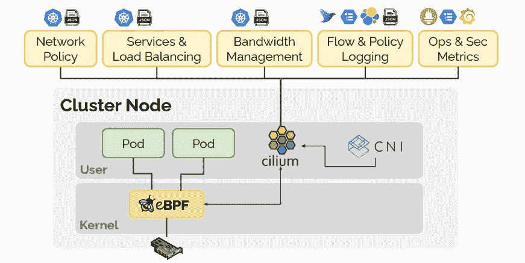

在 Kubernetes 中用作 CNI 插件的纤毛网络解决方案。作者照片。

Cilium 基于 eBPF(Extended Berkeley Packet Filter ),这是一项几年前合并到 Linux 内核中的技术，从那时起，它已经得到了令人印象深刻的发展和采用。eBPF 是一种通用技术，可用于网络、跟踪、安全、分析和可观察性等领域。它允许用户将代码注入 Linux 内核，并由不同种类的事件触发。

以下是网飞的 Brendan D. Gregg 对 eBPF 的评论:

> “超级大国终于来到了 Linux。”— [Gregg 在 linux.conf.au](https://www.youtube.com/watch?v=JRFNIKUROPE)
> 
> " eBPF 对 Linux 的作用就像 JavaScript 对 HTML 的作用一样."— [格雷格的博客](http://www.brendangregg.com/blog/2019-01-01/learn-ebpf-tracing.html)

eBPF 通常被视为一项革命性的技术，已经在多个 Kubernetes 管理的解决方案中用作网络数据层，从而确保了 pods 之间的通信和负载平衡。例如，在 Kubernetes 集群中，可以使用纤毛 eBPF 方法代替 kube-proxy。

如果你想了解关于 eBPF 的一切(以及许多其他事情)，Gregg 的网站是一个非常好的资源。

# 关于 Kubernetes 网络政策

在部署工作负载和 Kubernetes 时，默认情况下它们不是孤立的。例如:

*   部署在不同名称空间中的 pod 仍然可以互相访问。
*   pod 可以调用另一个名称空间上现有的服务。
*   pod 的入口和出口流量不受限制。

`NetworkPolicy`资源的作用是控制 pod 内的传入和传出流量。只有在安装的 CNI 插件允许的情况下，才会考虑一个`NetworkPolicy`。幸运的是，当时许多 Kubernetes CNI 插件知道如何管理`NetworkPolicy`资源:

*   纤毛
*   白棉布
*   编织网

下面是一个`NetworkPolicy`规范的例子(摘自 Kubernetes 官方文档):

```
apiVersion: networking.k8s.io/v1
kind: NetworkPolicy
metadata:
  name: test-network-policy
  namespace: default
spec:
  podSelector:
    matchLabels:
      role: db
  policyTypes:
  - Ingress
  - Egress
  ingress:
  - from:
    - ipBlock:
        cidr: 172.17.0.0/16
        except:
        - 172.17.1.0/24
    - namespaceSelector:
        matchLabels:
          project: myproject
    - podSelector:
        matchLabels:
          role: frontend
    ports:
    - protocol: TCP
      port: 6379
  egress:
  - to:
    - ipBlock:
        cidr: 10.0.0.0/24
    ports:
    - protocol: TCP
      port: 5978
```

尽管乍一看这似乎很复杂，但理解起来并不难。让我们把它分成几个主要部分:

*   `podSelector`属性定义了将应用`NetworkPolicy`的窗格。在这个例子中，所有带有`roll: db`标签的单元都是相关的。一个`NetworkPolicy`是一个命名空间资源。在本例中，它仅限于`default`名称空间。

```
podSelector:
  matchLabels:
    role: db
```

*   `ingress`属性定义了哪些实体能够到达所选的窗格。

```
ingress:
  - from:
    - ipBlock:
        cidr: 172.17.0.0/16
        except:
        - 172.17.1.0/24
    - namespaceSelector:
        matchLabels:
          project: myproject
    - podSelector:
        matchLabels:
          role: frontend
    ports:
    - protocol: TCP
      port: 6379
```

IP 属于 CIDR `172.17.0.0/16`的所有实体(除了`172.17.1.0/24)`中的实体、命名空间`myproject`中的 pod 或带有`role: frontend`标签的 pod)将只能读取端口 6379 上的所选 pod。

*   `egress`属性定义了所选 pod 可以启动的通信。

```
- to:
    - ipBlock:
        cidr: 10.0.0.0/24
    ports:
    - protocol: TCP
      port: 5978
```

在本例中，它们只能到达端口 5978 上的`10.0.0.0/24`中的 IP 地址。

在下一节中，我们将部署一个示例应用程序，并注意到在默认情况下对应用程序窗格的访问是完全开放的。

# 运行演示应用程序

让我们考虑由 MongoDB 数据库和 web 前端组成的样本留言簿应用程序。

*   以下内容定义了 mongo 部署和服务:

```
apiVersion: apps/v1
kind: Deployment
metadata:
  name: mongo
  labels:
    app: guestbook
    tier: backend
spec:
  selector:
    matchLabels:
      app: guestbook
      tier: backend
  template:
    metadata:
      labels:
        app: guestbook
        tier: backend
    spec:
      containers:
      - name: mongo
        image: mongo:4.2
        ports:
        - containerPort: 27017
---
apiVersion: v1
kind: Service
metadata:
  name: mongo
  labels:
    app: guestbook
    tier: backend
spec:
  ports:
  - port: 27017
    targetPort: 27017
  selector:
    app: guestbook
    tier: backend
```

*   以下内容定义了 web 前端的部署和服务:

```
apiVersion: apps/v1
kind: Deployment
metadata:
  name: www
  labels:
    app: guestbook
    tier: frontend
spec:
  selector:
    matchLabels:
      app: guestbook
      tier: frontend
  template:
    metadata:
      labels:
        app: guestbook
        tier: frontend
    spec:
      containers:
      - name: guestbook
        image: paulczar/gb-frontend:v5
        ports:
        - containerPort: 80
---
apiVersion: v1
kind: Service
metadata:
  name: www
  labels:
    app: guestbook
    tier: frontend
spec:
  type: NodePort
  ports:
  - port: 80
    nodePort: 31000
  selector:
    app: guestbook
    tier: frontend
```

我们复制了`guestbook.yml`中的整个规范，创建了一个名为`guestbook`的名称空间，并在该名称空间中部署应用程序:

```
$ kubectl create ns guestbook
$ kubectl apply -f guestbook.yaml -n guestbook
```

像往常一样，我们首先要确保所有的资源都已部署，并且 pod 已经启动并运行。

*注意:不要在* `*kubectl apply*` *之后马上去喝咖啡。始终确保您的 pod 正在运行。只有这样，你才能得到你最喜欢的饮料。*

```
**$ kubectl get deploy,po,svc -n guestbook** NAME                    READY   UP-TO-DATE   AVAILABLE   AGE
deployment.apps/mongo   1/1     1            1           15s
deployment.apps/www     1/1     1            1           15sNAME                         READY   STATUS    RESTARTS   AGE
pod/mongo-567d64884f-qbbnc   1/1     Running   0          15s
pod/www-6cf4495b7c-pbmfn     1/1     Running   0          15sNAME          TYPE      CLUSTER-IP    EXTERNAL-IP PORT(S)        AGE
service/mongo ClusterIP 10.245.211.49 <none>      27017/TCP      15s
service/www   NodePort  10.245.21.238 <none>      80:31000/TCP   15s
```

由于`NodePort`服务公开了前端，因此可以从集群的任何节点通过端口 31000 访问应用程序:

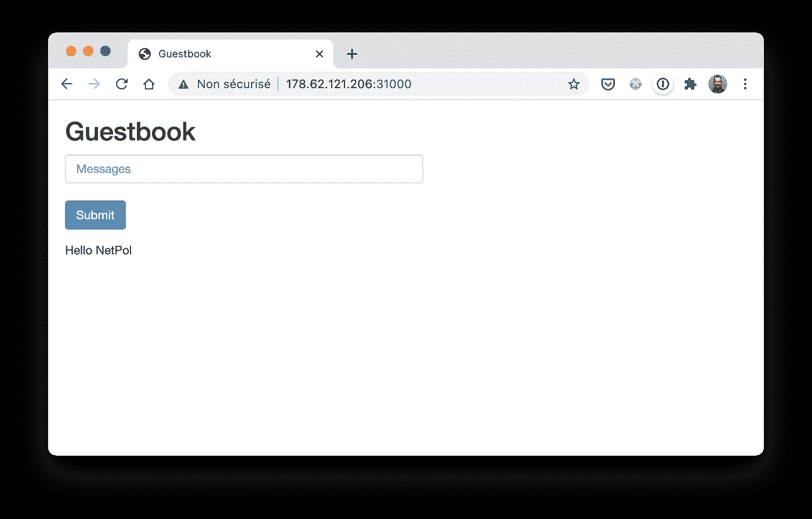

留言簿应用程序的前端公开为节点端口服务

## 对访问数据库没有限制

上面的应用程序运行在`guestbook`名称空间中，但是由于我们没有指定任何`NetworkPolicy`，集群中的任何 pod 都可以访问底层数据库。让我们在`default`名称空间的 Mongo pod 中运行一个 shell:

```
$ kubectl run test -ti --image=mongo --command bash
```

从这个 pod 中，我们可以使用完全限定名(`service.namespace`)轻松地连接到 mongo 数据库:

```
root@test:/# mongo mongodb://mongo.guestbook
MongoDB shell version v4.4.3
...
> show dbs
admin      0.000GB
config     0.000GB
guestbook  0.000GB
local      0.000GB
```

在下一节中，我们将使用 Cilium 的 web 编辑器创建一个`NetworkPolicy`,它将数据库访问权限限制在留言簿的前端窗格。

# 使用 Cilium 的编辑器构建网络策略

Cilium 的编辑器让`NetworkPolicy`的不同部分非常清晰:

*   中心块允许您选择`NetworkPolicy`应该应用的 pod。
*   左侧的块允许您控制入口流量(哪些实体可以访问 pod)。
*   右侧的块允许您定义出口流量(pod 可以访问哪些实体)。

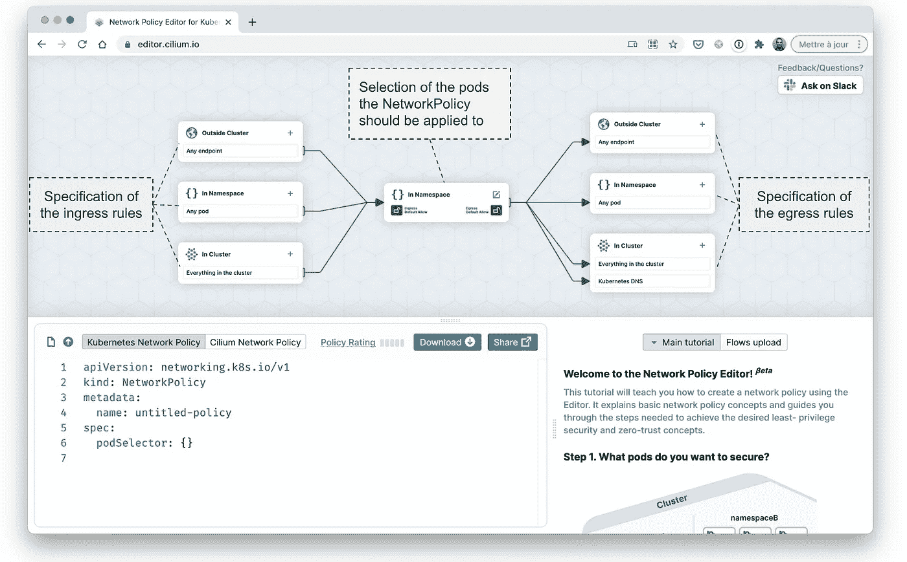

左下方的面板显示了`NetworkPolicy`的规格，反映了使用顶部面板的构建模块所做的选择。

右下角的面板提供了几个教程。主页面非常好，详细列出了定义`NetworkPolicy`所需的所有建议:

*   第一步。你想保护什么样的吊舱？
*   步骤 2:引入入口和出口默认`deny`状态。
*   第三步。允许到 Kubernetes DNS 的流量。
*   第四步。允许同一命名空间中的流量。
*   第五步。允许来自群集外部的传入流量。
*   第六步。允许来自群集的传出流量。
*   第七步。允许跨命名空间流量。
*   第八步。允许基于网络的活性/就绪性探测。

使用编辑器，我们将定义一个简单的`NetworkPolicy`来确保应用程序的数据库只能从运行在相同名称空间中的特定 pods 访问。由于这个例子非常简单，我们不会使用上面列出的所有步骤。

## 选择我们想要保护的 pod

首先，我们需要定义`NetworkPolicy`的元数据，并选择将应用`NetworkPolicy`的窗格。为此，我们单击中心块并提供以下信息:

*   政策名称:`db-guestbook`
*   将在其中创建`NetworkPolicy`的名称空间:`guestbook`
*   要选择的 pod 标签(`**app:** guestbook`、`**tier:** backend`)

完成后，我们可以看到我们的选择被考虑在内，现在在左下方的面板中是规范的一部分:包含我们标签的`podSelector`属性现在出现在`spec`属性下:

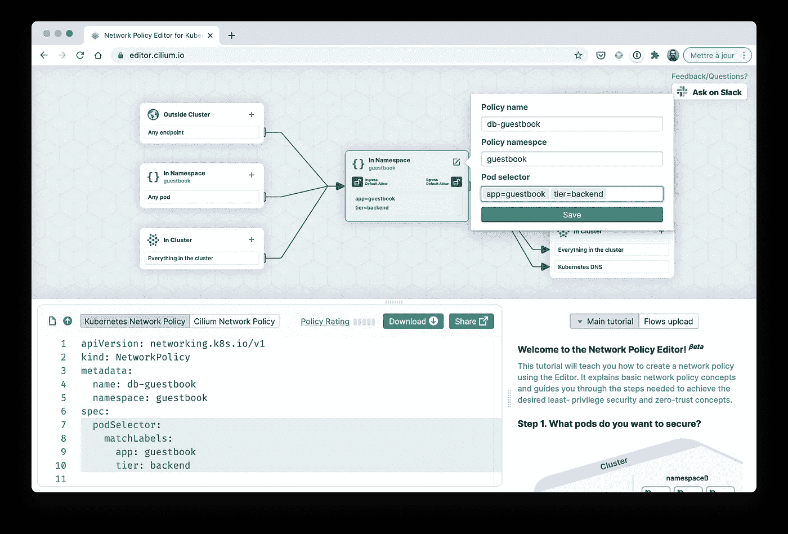

数据库窗格的选择

## 阻止所有传入和传出流量

当定义一个`NetworkPolicy`时，通常一个好的做法是从阻塞所有的入站和出站流量开始，然后打开真正需要的流量。中间块中的复选框允许您只需点击两次即可阻止所有流量:

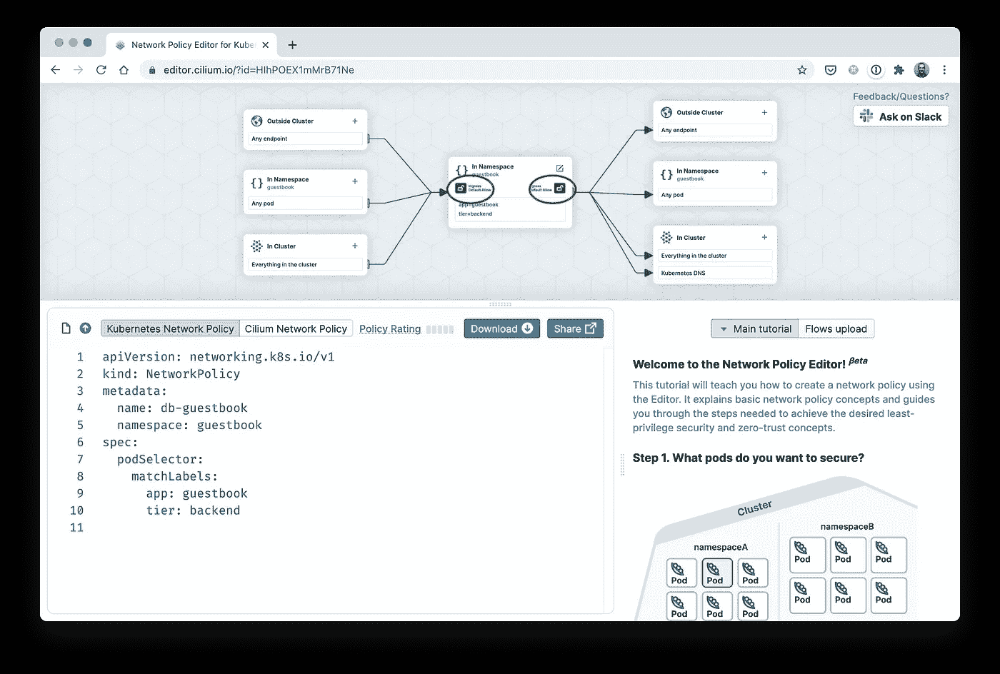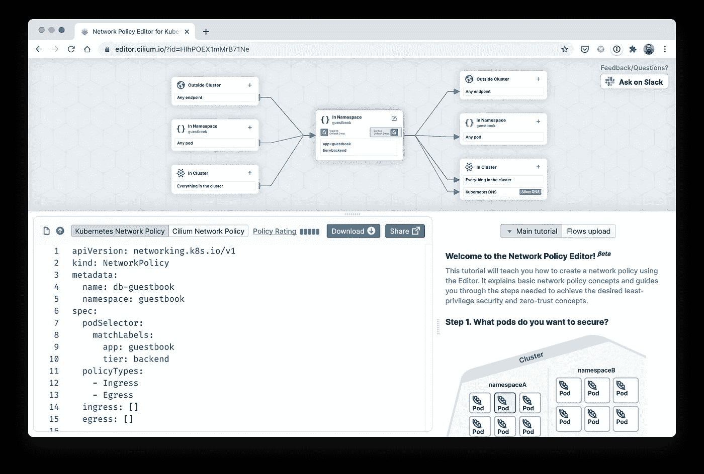

如果我们应用当前的`NetworkPolicy`，我们应该看到留言簿应用程序不再工作了。让我们检查一下！

```
$ **cat <<EOF | kubectl apply -f -**
apiVersion: networking.k8s.io/v1
kind: NetworkPolicy
metadata:
  name: db-guestbook
  namespace: guestbook
spec:
  podSelector:
    matchLabels:
      app: guestbook
      tier: backend
  policyTypes:
    - Ingress
    - Egress
  ingress: []
  egress: []
**EOF**
```

一旦创建了策略，我们使用留言簿前端添加一个新条目…然后我们得到一个预期的错误消息。

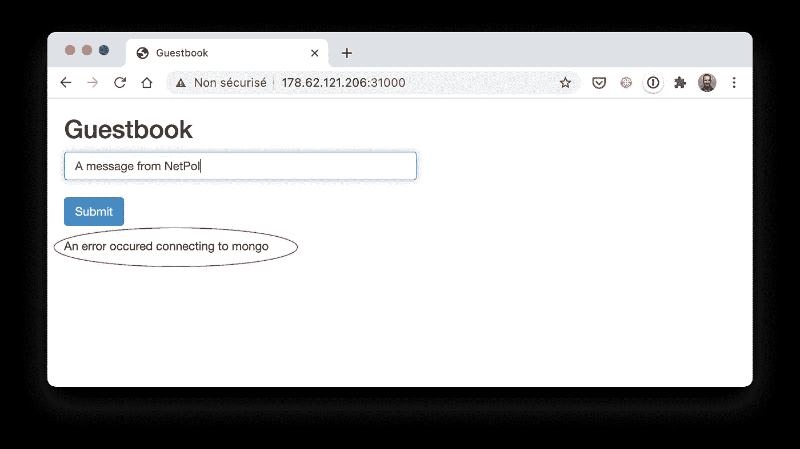

任何 pod(甚至是应用程序前端的 pod)都不能访问 mongo 数据库。

## 定义入口流量

接下来，使用左侧的构建块，我们定义允许访问 pod 的实体。目前，由于我们在上一步中采取的操作，所有流量都被阻止。我们现在将创建额外的规则，只允许需要的流量。该编辑器使用三个主要模块来轻松定义不同类型的规则:

*   “外部集群”允许您限制可以访问 pod 的 IP 地址。
*   “在名称空间中”允许您选择能够访问数据库窗格的`guestbook`名称空间中的其他窗格。
*   **“In Cluster”允许您选择其他名称空间内的 pod。**

**对于每个选项，我们可以指定为传入流量打开的端口。**

**在我们的示例中，我们将使用“In Namespace”块，因为我们只需要允许与 DB pod 相同的名称空间中的流量。我们在`guestbook`名称空间中选择带有`**app:** guestbook`和`**tier:** frontend`标签的 pod。我们还指定流量只允许在端口 27017 上传输(默认的 MongoDB 端口):**

**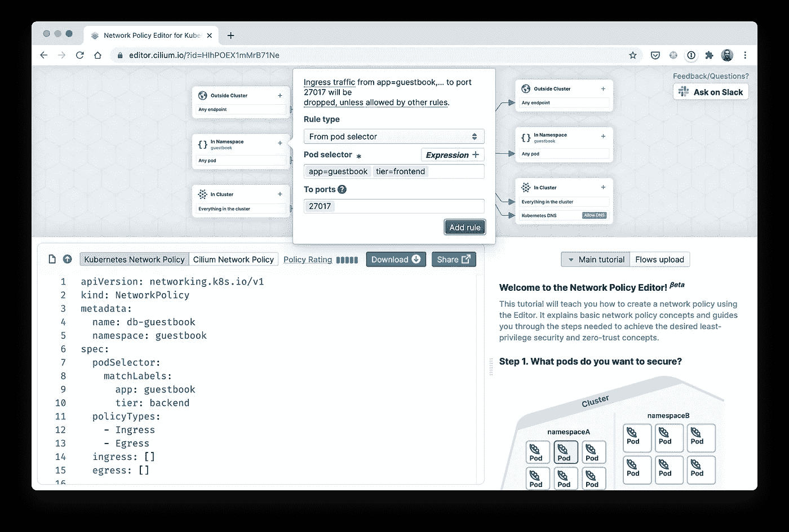**

**入口流量的规格**

**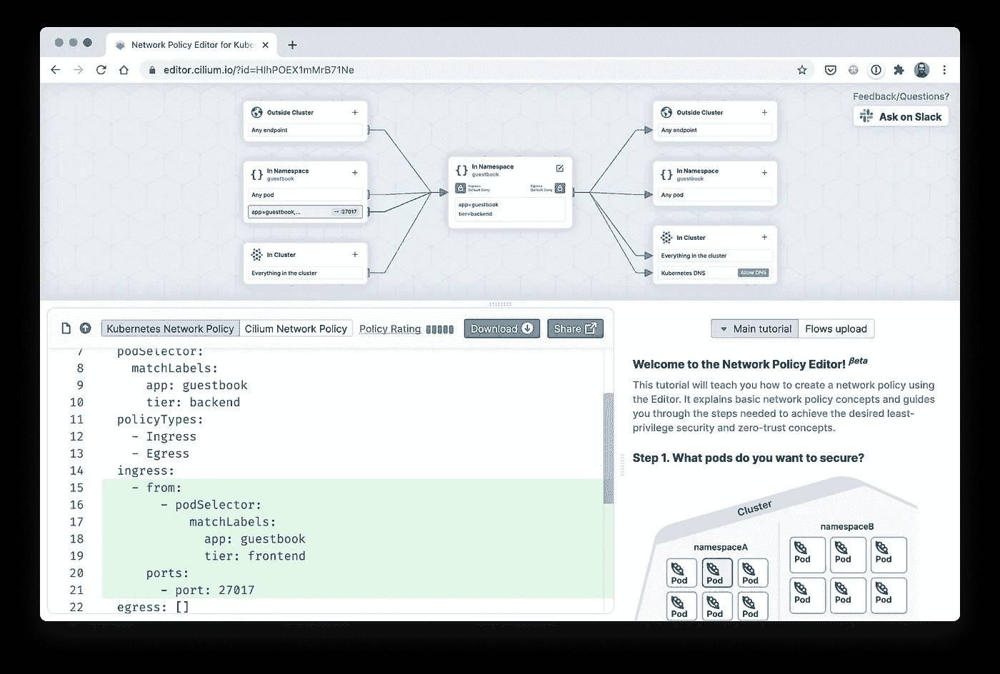**

## **定义出口流量**

**至于出口流量，可以通过使用“外部集群”、“在名称空间中”和“在集群中”块来进行细粒度的定义。在当前示例中，我们不需要来自 DB pod 的任何出站流量，因此当前配置很好，因为在前面的步骤中已经拒绝了出站流量。**

**通常情况下，pod 需要与 DNS 服务器通信，以便解析服务名称。该编辑器通过一个专用按钮使得只允许这种传出通信变得非常简单:**

**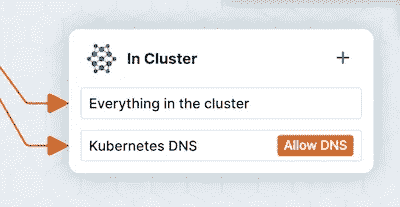**

**在我们的例子中，我们不需要打开这个 DNS 流量，因为 mongo pod 不调用任何实体，因此不需要查询 DNS。**

## **测试网络策略**

**现在让我们创建生成的`NetworkPolicy`,并确保它只允许来自应用程序前端 pod 的流量进入 DB pod。**

```
**$ cat <<EOF | kubectl apply -f -**
apiVersion: networking.k8s.io/v1
kind: NetworkPolicy
metadata:
  name: db-guestbook
  namespace: guestbook
spec:
  podSelector:
    matchLabels:
      app: guestbook
      tier: backend
  policyTypes:
    - Ingress
    - Egress
  ingress:
    - from:
        - podSelector:
            matchLabels:
              app: guestbook
              tier: frontend
      ports:
        - port: 27017
  egress: []
**EOF**
```

**让我们检查从一个名称空间而不是从`guestbook`的 pod 的访问:**

```
**$ kubectl run test -ti --rm --image=mongo \
  --command mongo mongodb://mongo.guestbook**If you don't see a command prompt, try pressing enter.
**Error: couldn't connect to server mongo.guestbook:27017**, connection attempt failed: SocketException: Error connecting to mongo.guestbook:27017 (10.245.211.49:27017) :: caused by :: Connection timed out :
connect@src/mongo/shell/mongo.js:374:17
@(connect):2:6
exception: connect failed
exiting with code 1
Session ended, resume using 'kubectl attach test -c test -i -t' command when the pod is running
pod "test" deleted
```

**不出所料，连接是不可能的。现在让我们检查来自`guestbook`名称空间内的非前端 pod 的访问:**

```
**$ kubectl run test -ti --rm --image=mongo \
  -n guestbook \
  --command mongo mongodb://mongo.guestbook**If you don't see a command prompt, try pressing enter.
**Error: couldn't connect to server mongo.guestbook:27017**, connection attempt failed: SocketException: Error connecting to mongo.guestbook:27017 (10.245.211.49:27017) :: caused by :: Connection timed out :
connect@src/mongo/shell/mongo.js:374:17
@(connect):2:6
exception: connect failed
exiting with code 1
Session ended, resume using 'kubectl attach test -c test -i -t' command when the pod is running
pod "test" deleted
```

**再次，连接失败是意料之中的。现在让我们检查来自`guestbook`名称空间内的前端 pod 的访问:**

```
**$ kubectl run test -ti --rm --image=mongo \
  -n guestbook \
  --labels="app=guestbook,tier=frontend" \
  --command mongo mongodb://mongo.guestbook**If you don't see a command prompt, try pressing enter.
> show dbs
admin      0.000GB
config     0.000GB
guestbook  0.000GB
local      0.000GB
>
```

**这一次，连接成功，因为它是从允许访问后端 pod 的 pod 发起的。网络前端现在工作正常。**

**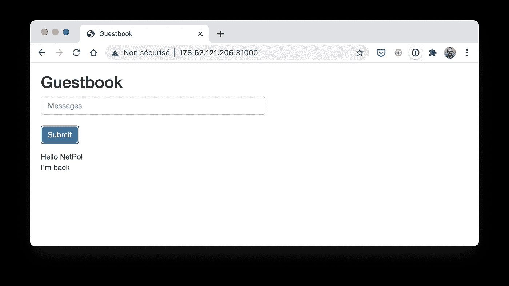**

**留言簿前端回到正轨**

# **外卖食品**

**`NetworkPolicy`在 Kubernetes 中是一个非常重要的资源，因为它在集群中提供了工作负载隔离。乍一看，这个资源似乎很复杂，但是如果我们使用正确的工作流来定义它，它并不那么难。**

**Cilium 的这个新编辑器确实有助于定义一个`NetworkPolicy`规范，并且提供了最佳实践。如果你需要创建`NetworkPolicy`或者只是想了解更多关于资源的信息，一定要仔细看看这个在线编辑器。**