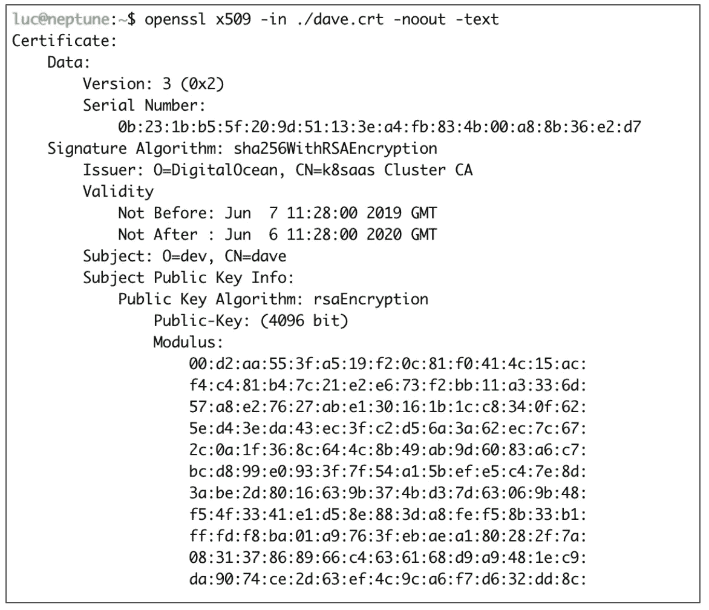
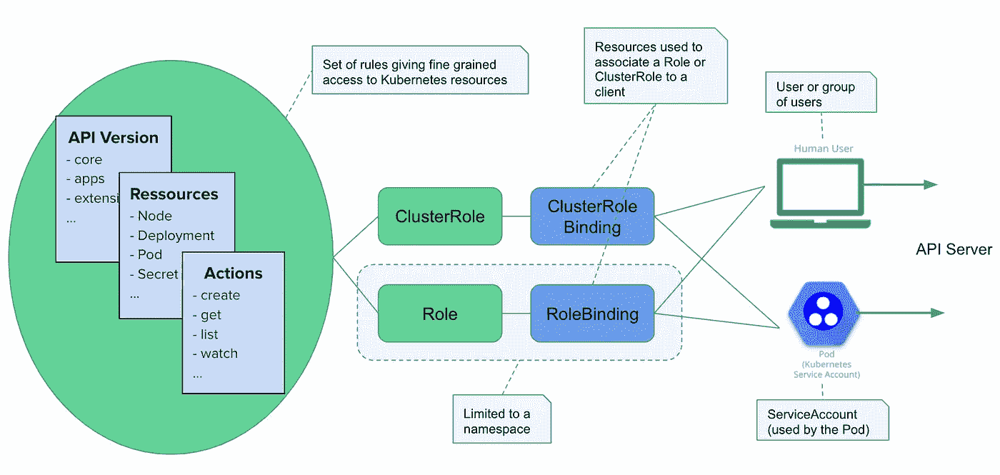

# Kubernetes 提示:使用客户端证书访问您的集群

> 原文：<https://betterprogramming.pub/k8s-tips-give-access-to-your-clusterwith-a-client-certificate-dfb3b71a76fe>

## 让用户访问新的 Kubernetes 集群的简单指南，包括身份验证设置和角色绑定



我们刚刚建立了一个全新的 Kubernetes 集群(恭喜！🎉).它将很快在整个公司范围内使用，我们已经有了一位同事，来自*开发*团队的 Dave，他想开始使用 beast，并在其上部署和测试他的全新微服务应用。我们能做些什么简单的步骤让他进入？这就是这篇文章的内容(提示:我们将使用 x509 客户端证书)。

# Kubernetes 中的用户管理

为了管理 Kubernetes 集群和其上运行的应用程序，通常使用 [kubectl](https://kubernetes.io/docs/tasks/tools/install-kubectl/) 二进制文件或 [Web UI](https://kubernetes.io/docs/tasks/access-application-cluster/web-ui-dashboard/) 。在幕后，这些工具调用 API 服务器:HTTP Rest API 公开集群控制平面的所有端点。

(这个 HTTP API 的文档很棒，随便看看:[https://kubernetes . io/docs/reference/generated/kubernetes-API/v 1.14](https://kubernetes.io/docs/reference/generated/kubernetes-api/v1.14))

当一个请求被发送到 API 服务器时，在它被授权(确保请求者被允许执行所请求的动作)之前，首先需要对它进行认证(确保请求者被系统识别)。

认证步骤是通过使用认证插件来完成的。有几个插件可以使用不同的认证机制:

*   客户端证书(我们将在本文中讨论)
*   不记名代币
*   认证代理
*   HTTP 基本身份验证

根据所使用的认证机制，相应的插件期望在特定位置找到用户信息。例如，对于客户端证书认证，应该在证书的*通用名称* (CN)字段中提供用户的标识(他们的 id、姓名、电子邮件等)，并且应该在*组织* (O)字段中提供组信息(如果有)。我们很快会在一个例子中看到这一点。

Kubernetes 集群中既没有用户资源，也没有组资源。这应该在集群之外处理，并随发送到 API 服务器的每个请求一起提供。

如果事情还不太清楚，请不要担心，我们将在下面举例说明。

# 一些考虑和假设

*   集群将由几个团队/客户端使用(多租户方法)，因为每个租户的工作负载需要隔离。我们将首先创建一个名为 *development* 的名称空间，专门用于开发团队(Dave 所属的团队)。
*   Dave 需要部署标准的 Kubernetes 资源。然后，他将被授予仅创建、列出、更新、获取和删除部署和服务资源的权限。如果需要，以后可以提供额外的权利。我们将确保这些权利仅限于*开发*命名空间。
*   Dave 团队的其他成员以后可能需要拥有相同级别的访问权限。因此，我们将考虑一个名为 *dev* 的组，并提供组级别的权限。
*   Dave 需要安装 *kubectl* (这可能已经发生了，因为他可能已经在这台本地机器上玩了 [*Minikube*](https://kubernetes.io/docs/setup/minikube/) )，他还需要 [*openssl*](https://www.openssl.org/) ，因为他将生成一个私钥和一个证书登录请求。

# 创建私钥和证书签名请求(CSR)

Dave 首先需要生成一个私有 rsa 密钥和一个 CSR。使用以下命令可以很容易地创建私钥:

```
**$ openssl genrsa -out dave.key 4096**
```

企业社会责任有点复杂。戴夫需要确保他:

*   在 Common Name (CN)字段中使用他的名字:这将用于在 API 服务器中识别他。
*   使用 organization(O)字段中的组名:这将用于根据 API 服务器识别组。

下面是 Dave 将用来生成 CSR 的配置文件:

```
[ req ]
default_bits = 2048
prompt = no
default_md = sha256
distinguished_name = dn[ dn ]
CN = dave
O = dev[ v3_ext ]
authorityKeyIdentifier=keyid,issuer:always
basicConstraints=CA:FALSE
keyUsage=keyEncipherment,dataEncipherment
extendedKeyUsage=serverAuth,**clientAuth**
```

**注意**:extendedkey usage 字段中的 clientAuth 条目很重要，因为证书将用于识别客户端。

使用上面的配置文件(保存在 csr.cnf 中)，可以使用以下命令创建 csr:

```
$ openssl req -config ./csr.cnf -new -key dave.key -nodes -out dave.csr
```

一旦。csr 文件已创建，Dave 需要将其发送给我们(管理员),这样我们就可以使用群集证书颁发机构对其进行签名。这是我们下一步要讨论的。

# CSR 的签名

的签名。csr 文件将导致证书的创建。这个将用于验证 Dave 发送给 API 服务器的每个请求。

我们将首先创建一个 Kubernetes CertificateSigninRequest 资源。

**注意**:我们可能已经建立了一个托管集群(有很多这样的集群:[数字海洋](https://digitalocean.com)、[谷歌的 GKE](https://cloud.google.com/kubernetes-engine/) 、[微软的 Azure AKS](https://azure.microsoft.com/fr-fr/services/kubernetes-service/) 、…)，或者创建了我们自己的集群(使用 [kubeadm](https://kubernetes.io/fr/docs/setup/independent/install-kubeadm/) 、 [kubespray](https://github.com/kubernetes-sigs/kubespray) 、…)。过程是一样的。

我们将使用下面的规范，并将其保存在 *csr.yaml* 中。

```
apiVersion: certificates.k8s.io/v1beta1
kind: CertificateSigningRequest
metadata:
  name: mycsr
spec:
  groups:
  - system:authenticated
  request: ${BASE64_CSR}
  usages:
  - digital signature
  - key encipherment
  - server auth
  - client auth
```

正如我们所见，*请求*键的值是 *BASE64_CSR* 环境变量的内容。第一步是获取。csr 文件，然后在创建资源之前使用 [*envsubst*](https://www.gnu.org/software/gettext/manual/html_node/envsubst-Invocation.html) 二进制来替换该变量的值。

```
# Encoding the .csr file in base64
**$ export BASE64_CSR=$(cat ./dave.csr | base64 | tr -d '\n')**# Substitution of the BASE64_CSR env variable and creation of the CertificateSigninRequest resource **$ cat csr.yaml | envsubst | kubectl apply -f -**
```

检查新创建的 CSR 的状态，我们可以看到它处于 *Pending* 状态。

```
# Checking the status of the newly created CSR
**$ kubectl get csr** NAME        AGE   REQUESTOR            CONDITION
mycsr       9s    28b93...d73801ee46   Pending
```

然后，我们可以使用以下命令批准该 CSR:

```
$ kubectl certificate approve mycsr
```

再次检查 CSR 的状态，我们可以看到它现在已被批准。

```
**$ kubectl get csr** NAME        AGE   REQUESTOR            CONDITION
mycsr       9s    28b93...d73801ee46   Approved,Issued
```

证书已创建。让我们将它从 CSR 资源中提取出来，并保存在一个名为 *dave.crt* 的文件中，以检查里面有什么。

```
$ kubectl get csr mycsr -o jsonpath='{.status.certificate}' \
  | base64 --decode > dave.crt
```

下面的 [openssl](https://www.openssl.org/) 命令显示证书已经由 DigitalOcean 的集群 CA(发行者部分)签名，主题包含 CN (CommonName)字段中的 *dave* 和 O(organization)字段中的 *dev* ，如 dave 在创建。csr 文件。

```
**$ openssl x509 -in ./dave.crt -noout -text** Certificate:
    Data:
        Version: 3 (0x2)
        Serial Number:
            48:29:cf:ae:d6:...:09:33:ef:14:58
    Signature Algorithm: sha256WithRSAEncryption
        Issuer: O=DigitalOcean, CN=k8saas Cluster CA
        Validity
            Not Before: Jun  3 07:56:00 2019 GMT
            Not After : Jun  2 07:56:00 2020 GMT
        **Subject: O=dev, CN=dave**
        Subject Public Key Info:
            Public Key Algorithm: rsaEncryption
                Public-Key: (4096 bit)
                Modulus:
...
```

**注**:本例中使用的集群是在 [DigitalOcean](https://digitalocean.com) 上创建的托管 Kubernetes 集群。我们可以从群集证书颁发机构看到它。

# 命名空间的创建

我们首先创建一个名为 *development* 的名称空间，这样 Dave 和他的团队将部署的所有资源都与集群的其他工作负载隔离开来。它可以用一个简单的命令创建:

```
$ kubectl create ns development
```

或者用这个 *dev-ns.yaml* 文件:

```
apiVersion: v1
kind: Namespace
metadata:
  name: development
```

接着是通常的:

```
$ kubectl apply -f dev-ns.yaml
```

**注意**:最佳实践是创建一个 ResourceQuota 资源并将其链接到名称空间，以便限制名称空间中可以使用的 cpu 和 RAM 的数量，但这是另一篇文章的内容。

# 设置 RBAC 规则

通过创建一个证书，我们允许 Dave 针对 API 服务器进行身份验证，但是我们没有指定任何权限，因此他将不能做很多事情……我们将改变这一点，并授予他在 *dev* 名称空间中创建、获取、更新、列出和删除部署和服务资源的权限。

下图显示了 Kubernetes 角色库访问控制(RBAC)中涉及的资源。



所涉及资源的概述

简而言之:角色(同样适用于集群角色)包含一系列规则。每个规则都定义了一些可以针对 apiGroups(例如:core，apps/v1，…)内的资源列表(例如:Pod，Service，Secret)执行的操作(例如:list，get，watch，…)。角色定义特定命名空间的权限，而集群角色的范围是整个集群

# **角色的创建**

让我们首先使用以下规范创建一个角色资源:

```
kind: Role
apiVersion: rbac.authorization.k8s.io/v1
metadata:
 namespace: development
 name: dev
rules:
- apiGroups: [""]
  resources: ["pods", "services"]
  verbs: ["create", "get", "update", "list", "delete"]
- apiGroups: ["apps"]
  resources: ["deployments"]
  verbs: ["create", "get", "update", "list", "delete"]
```

Pods 和服务资源属于*核心* API 组(apiGroups 键的值是空字符串)，而部署资源属于*应用* API 组。对于这两个 apiGroups，我们定义了资源列表和应该在这些资源上授权的操作。

假设上面的内容在 *role.yaml* 中，使用以下命令创建角色:

```
$ kubectl apply -f role.yaml
```

# **创建角色绑定**

角色绑定的目的是链接角色(授权操作列表)和用户或组。为了让 Dave 拥有上述角色中指定的权限，我们需要将他绑定到这个角色。为此，我们将使用以下角色绑定资源:

```
kind: RoleBinding
apiVersion: rbac.authorization.k8s.io/v1
metadata:
 name: dev
 namespace: development
subjects:
- kind: User
  name: dave
  apiGroup: rbac.authorization.k8s.io
roleRef:
 kind: Role
 name: dev
 apiGroup: rbac.authorization.k8s.io
```

此角色绑定链接:

*   一个主题:我们的用户戴夫。
*   角色:名为 *dev* 的角色，它允许创建/获取/更新/列出/删除我们上面定义的部署和服务资源。

**注意**:由于 Dave 属于 *dev* 组，我们可以使用下面的 RoleBinding 将之前的角色与组绑定，而不是与单个用户绑定。请记住:组信息在随每个请求一起发送的证书的组织(O)字段中提供。

```
kind: RoleBinding
apiVersion: rbac.authorization.k8s.io/v1
metadata:
 name: dev
 namespace: development
subjects:
- kind: Group
  name: dev
  apiGroup: rbac.authorization.k8s.io
roleRef:
 kind: Role
 name: dev
 apiGroup: rbac.authorization.k8s.io
```

假设我们已经在 *role-binding.yaml* 文件中保存了 RoleBinding 资源的规范，我们可以用下面的命令创建它:

```
$ kubectl apply -f role-binding.yaml
```

# 为 Dave 构建 Kube 配置

一切都准备好了。我们现在必须向 Dave 发送他需要的信息，以配置他的本地 kubectl 客户机与我们的集群通信。

我们将首先创建一个 *kubeconfig.tpl* 文件，它包含以下内容，我们将把它用作模板。

```
apiVersion: v1
kind: Config
clusters:
- cluster:
    certificate-authority-data: ${CLUSTER_CA}
    server: ${CLUSTER_ENDPOINT}
  name: ${CLUSTER_NAME}
users:
- name: ${USER}
  user:
    client-certificate-data: ${CLIENT_CERTIFICATE_DATA}
contexts:
- context:
    cluster: ${CLUSTER_NAME}
    user: dave
  name: ${USER}-${CLUSTER_NAME}
current-context: ${USER}-${CLUSTER_NAME}
```

为了从这个模板构建一个基本的 kube 配置，我们首先需要设置所有需要的环境变量:

```
# User identifier
**$ export USER="dave"**# Cluster Name (get it from the current context)
**$ export CLUSTER_NAME=$(kubectl config view --minify -o jsonpath={.current-context})**# Client certificate
**$ export CLIENT_CERTIFICATE_DATA=$(kubectl get csr mycsr -o jsonpath='{.status.certificate}')**# Cluster Certificate Authority
**$ export CLUSTER_CA=$(kubectl config view --raw -o json | jq -r '.clusters[] | select(.name == "'$(kubectl config current-context)'") | .cluster."certificate-authority-data"')**# API Server endpoint
**$ export CLUSTER_ENDPOINT=$(kubectl config view --raw -o json | jq -r '.clusters[] | select(.name == "'$(kubectl config current-context)'") | .cluster."server"')**
```

并再次使用方便的 [envsubst](https://www.gnu.org/software/gettext/manual/html_node/envsubst-Invocation.html) 实用程序替换它们:

```
$ cat kubeconfig.tpl | envsubst > kubeconfig
```

我们现在可以将这个 *kubeconfig* 文件发送给戴夫，他只需在其中添加自己的私钥，就可以与集群通信了。

# 上下文的使用

为了使用 *kubeconfig，* Dave 可以用指向文件的路径设置 kubeconfig 环境变量。

```
$ export KUBECONFIG=$PWD/kubeconfig
```

**注意**:使用 Kubernetes 配置有不同的方法:设置 *KUBECONFIG* 环境变量，在默认的 *$HOME/中添加一个新条目。kube/config* 文件，或者在每个 *kubectl* 命令上使用- *kubeconfig* 标志。

要添加他的私有密钥，dave.key 在流程开始时生成，dave 可以使用以下命令:

```
$ kubectl config set-credentials dave \
  --client-key=$PWD/dave.key \
  --embed-certs=true
```

它将在 *kubeconfig* 文件的用户条目中创建密钥 *client-key-data* ，并将 *dave.key* 的 base64 编码设置为值。

如果一切正常，Dave 应该能够使用以下命令检查服务器(和客户机)的版本:

```
$ kubectl version
Client Version: version.Info{Major:"1", Minor:"14", GitVersion:"v1.14.2", GitCommit:"66049e3b21efe110454d67df4fa62b08ea79a19b", GitTreeState:"clean", BuildDate:"2019-05-16T16:23:09Z", GoVersion:"go1.12.5", Compiler:"gc", Platform:"darwin/amd64"}
**Server Version: version.Info{Major:"1", Minor:"14", GitVersion:"v1.14.2", GitCommit:"66049e3b21efe110454d67df4fa62b08ea79a19b", GitTreeState:"clean", BuildDate:"2019-05-16T16:14:56Z", GoVersion:"go1.12.5", Compiler:"gc", Platform:"linux/amd64"}**
```

让我们更进一步，检查与 Dave 关联的当前角色是否允许他列出集群的节点。

```
**$ kubectl get nodes** Error from server (Forbidden): nodes is forbidden: User "dave" cannot list resource "nodes" in API group "" at the cluster scope
```

当然不是！但是 Dave 现在应该能够在集群上部署东西了——至少在名为 *development* 的名称空间中。让我们用这个示例 yml 文件来检查一下，它定义了一个基于 nginx 映像的部署和一个公开它的服务。

```
# www.yamlapiVersion: apps/v1
kind: Deployment
metadata:
  name: www
  namespace: development
spec:
  replicas: 3
  selector:
    matchLabels:
      app: www
  template:
    metadata:
      labels:
        app: www
    spec:
      containers:
      - name: nginx
        image: nginx:1.14-alpine
        ports:
        - containerPort: 80
---
apiVersion: v1
kind: Service
metadata:
  name: www
  namespace: development
spec:
  selector:
    app: vote
  type: ClusterIP
  ports:
  - port: 80
    targetPort: 80
```

我们可以从下面的命令中看到，Dave 可以在集群中创建这些资源:

```
**$ kubectl apply -f** [**www.yaml**](http://www.yaml)
deployment.apps/www created
service/www created
```

Dave 受限于*开发*名称空间。我们可以从他在试图列出默认名称空间中的所有窗格时得到的错误消息中确认这一点:

```
**$ kubectl get pods**
Error from server (Forbidden): pods is forbidden: User “dave” cannot list resource “pods” in API group “” in the namespace “default”
```

此外，除了我们授予他访问权限的资源之外，他将无法创建其他资源。例如，我们可以考虑以下 Secret 类型资源的规范:

```
# credentials.yaml
apiVersion: v1
kind: Secret
metadata:
  name: mysecret
  namespace: development
data:
  username: YWRtaW4=
  password: MWYyZDFlMmU2N2Rm
```

让我们看看戴夫是如何创造它的:

```
**$ kubectl apply -f credentials.yaml**
Error from server (Forbidden): error when retrieving current configuration of:
Resource: “/v1, Resource=secrets”, GroupVersionKind: “/v1, Kind=Secret”
Name: “mysecret”, Namespace: “development”
Object: &{map[“apiVersion”:”v1" “data”:map[“password”:”MWYyZDFlMmU2N2Rm” “username”:”YWRtaW4=”] “kind”:”Secret” “metadata”:map[“annotations”:map[“kubectl.kubernetes.io/last-applied-configuration”:””] “name”:”mysecret” “namespace”:”development”]]}
from server for: “credentials.yaml”: secrets “mysecret” is forbidden: User “dave” cannot get resource “secrets” in API group “” in the namespace “development”
```

# 摘要

在本文中，我们展示了如何使用客户端证书授权用户进入我们的 Kubernetes 集群。我们可以使用其他方法来设置这种身份验证，但这种方法非常简单(在另一篇文章中，我们将看到如何使用外部身份提供者)。

一旦建立了身份验证，我们就使用角色来定义一些仅限于名称空间的权限，并用 RoleBinding 将它绑定到用户。如果我们需要提供集群范围的权限，我们可以使用 ClusterRole 和 ClusterRoleBinding 资源。

祝你好运！如果你尝试过，我很乐意在下面的评论中听到你的想法。