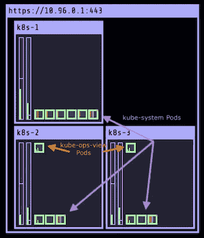
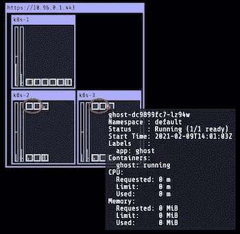
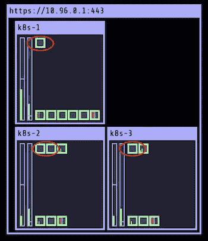
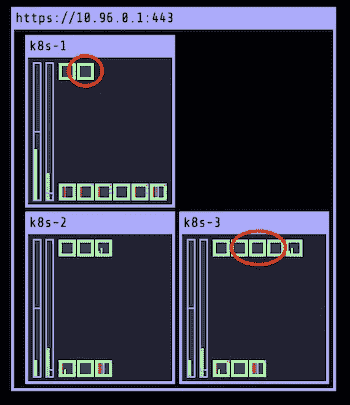
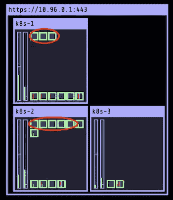
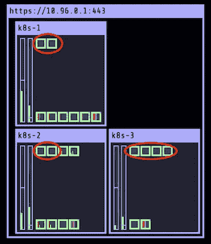

# K8s 提示:使用节点

> 原文：<https://betterprogramming.pub/k8s-tips-playing-with-nodes-e6645af13a27>

## 熟悉集群管理的一些关键概念


迪米特里·豪特曼在 [Unsplash](https://unsplash.com/s/photos/kitten-playing?utm_source=unsplash&utm_medium=referral&utm_content=creditCopyText) 上的照片。

本文提供了一种回归基础的方法来帮助您理解可以在集群节点上完成的几种操作。

# 我们的测试集群

让我们考虑一个新创建的包含一个主节点和两个工作节点的`kubeadm`集群:

```
**$ kubectl get nodes** NAME    STATUS   ROLES                  AGE   VERSION
k8s-1   Ready    control-plane,master   18m   v1.20.0
k8s-2   Ready    <none>                 18m   v1.20.0
k8s-3   Ready    <none>                 18m   v1.20.0
```

首先，我们将安装 [Kubernetes 操作视图](https://codeberg.org/hjacobs/kube-ops-view)(又名 kube-ops-view)。这个应用程序非常方便地查看集群中运行的所有 pods。目前有 14 个 pod 在运行:

*   其中两个位于默认名称空间中，并与 kube-obs-view 相关。它们在下面截图中 k8s-2 和 k8s-3 的左上角
*   其他 12 个位于 kube-system 名称空间中:kube-api-server、etcd、kube-controller-manager、kube-scheduler、kube-proxy (x3)、weave-net (x3)、core-dns (x2)。



让我们使用 ghost 映像创建一个有四个副本的部署( [ghost](https://github.com/TryGhost/Ghost) 是一个开源博客平台):

```
$ kubectl create deploy ghost --image=ghost --replicas 4
```

从 kube-ops-view 中，我们可以看到四个新的 pod(在下面的红色圆圈中)部署在 k8s-2 和 k8s-3 上(每个节点上有两个 ghost pods):



Ghost pods 只安排在 k8s-2 和 k8s-3 上。

这也可以通过使用以下命令来确认:

```
**$ k get po -l app=ghost \
  -o custom-columns=NAME:.metadata.name,NODE:.spec.nodeName** NAME                                   NODE
ghost-dc9899fc7-9254f                  k8s-3
ghost-dc9899fc7-946ck                  k8s-2
ghost-dc9899fc7-lz94w                  k8s-3
ghost-dc9899fc7-vsnqn                  k8s-2
```

k8s-1(主节点)上没有部署我们的幽灵舱。这是为什么呢？

# **污点**

默认情况下，k8s-1 有一个污点，是由`kubeadm`在集群设置期间添加的。污点基本上是一个键值对(该值称为效果)。以下命令显示了 k8s-1 上存在的污点:

```
**$ kubectl describe node k8s-1 | grep Taints** Taints:             node-role.kubernetes.io/master:NoSchedule
```

*   关键是`node-role.kubernetes.io/master`。
*   效果是`NoSchedule`。

当在节点上设置污点时，它会阻止在该节点上调度 pod。把污点想象成一种不好的气味:一个 pod 不会去那里，除非它容忍这个污点，在 pod 的规范中定义一个与污点相同的键/效果的容忍。我们定义的幽灵舱不能容忍污染，所以它们不能被安排在 k8s-1 上。

*注意:为了容忍前面的污点，一个 pod 需要在其规范中有下面的* `*tolerations*` *条目:*

```
...
spec:
  **tolerations:
  - key: node-role.kubernetes.io/master
    effect: NoSchedule**
```

让我们去除污点，使 k8s-1 能够接收应用程序的一些 pod。对于我们的例子来说，去掉这个污点是好的，但是在一个真实的集群中，我们可能不去管它，而在 pods 的规范中使用`tolerations`属性，这些 pods 也明确地需要部署在主节点上。

```
$ kubectl taint node k8s-1 node-role.kubernetes.io/master-
```

清除污点不会触发现有吊舱的重新部署。我们需要强迫它:

```
$ kubectl rollout restart deploy/ghost
```

我们现在可以看到，这四个 pod 已被重新安排。这一次，调度器考虑了三个节点，因为主节点没有任何污点。



k8s-1 现在可以预定一个分离舱，因为污染被移除了。

```
**$ kubectl get po -l app=ghost \
  -o custom-columns=NAME:.metadata.name,NODE:.spec.nodeName** NAME                     NODE
ghost-7564b56ff4-26nth   k8s-3
ghost-7564b56ff4-h2pm4   k8s-2
ghost-7564b56ff4-m72c5   k8s-2
**ghost-7564b56ff4-vd6nv   k8s-1**
```

# 警戒线/非警戒线

有时，我们可能需要停止在一个节点上安排额外的 pod，而不删除在该节点上运行的当前 pod。为此，我们可以封锁节点。以下命令连接 k8s-2 节点:

```
$ kubectl cordon k8s-2
```

在此阶段，在该节点上运行的 pod 仍在运行，但不能添加额外的 pod。通过列出集群的节点，我们可以看到 k8s-2 现在被标记为`SchedulingDisabled`:

```
**$ kubectl get node** NAME    STATUS                    ROLES                AGE   VERSION
k8s-1   Ready                     control-plane,master 25m   v1.20.0
k8s-2   Ready,**SchedulingDisabled**  <none>               25m   v1.20.0
k8s-3   Ready                     <none>               25m   v1.20.0
```

让我们增加复制副本的数量，看看新的单元安排在哪里:

```
$ kubectl scale deploy/ghost --replicas=8
```



四个额外的幽灵吊舱仅部署在 k8s-1 和 k8s-3 上。

正如我们所料，k8s-2 上的吊舱数量保持不变。我们可以使用以下命令将节点恢复到之前的状态:

```
$ kubectl uncordon k8s-2
```

k8s-2 现在将能够接收额外的吊舱，因为该节点上的调度不再被禁用。

# 流干

我们有时需要删除在特定节点上运行的现有 pod，并在集群中的其他节点上对它们进行重新调度。当我们想要在节点上执行维护操作时，通常需要这样做。

为此，我们可以使用`drain`命令，如下图 k8s-3 节点所示:

```
$ kubectl drain --ignore-daemonsets k8s-3
```

*注意:当一个节点被排空时，穿过* `*DaemonSet*` *的 pod 不能被移除(例如 kube-proxy、weave-net 等)。).当运行* `*drain*` *命令时，我们需要使用* `*--ignore-daemonsets*` *标志明确指出* `*DaemonSet*` *的 pod 被忽略。*



k8s-3 上不再有豆荚(除了 DaemonSet 的豆荚)在运行，因为它已经被吸干了。

正如我们在下面看到的，排空一个节点也阻止了新的吊舱被安排在那个节点上:k8s-3 现在也被封锁了。

```
**$ kubectl get node** NAME    STATUS                    ROLES                AGE   VERSION
k8s-1   Ready                     control-plane,master 30m   v1.20.0
k8s-2   Ready                     <none>               30m   v1.20.0
k8s-3   Ready,**SchedulingDisabled**  <none>               30m   v1.20.0
```

我们需要解除节点的锁定，以使调度再次可用:

```
$ kubectl uncordon k8s-3$ kubectl get node
NAME    STATUS   ROLES                  AGE   VERSION
k8s-1   Ready    control-plane,master   22h   v1.20.0
k8s-2   Ready    <none>                 22h   v1.20.0
k8s-3   Ready    <none>                 22h   v1.20.0
```

正如我们之前所做的那样，我们需要根据命令强制重启部署，以便在集群的节点上重新创建和重新分布 pod:

```
$ kubectl rollout restart deploy/ghost
```



现在已在三个节点上安排了 pod。

# 结论

本文展示了在处理节点和准备维护节点时常用的一些命令。我们还简要介绍了污点，这是一个添加了调度约束的属性。

pod 规范中可用的其他几个属性可以用来改进调度阶段的粒度(`nodeSelector`、`nodeAffinity`、`podAffinity`和`podAntiAffinity`)。