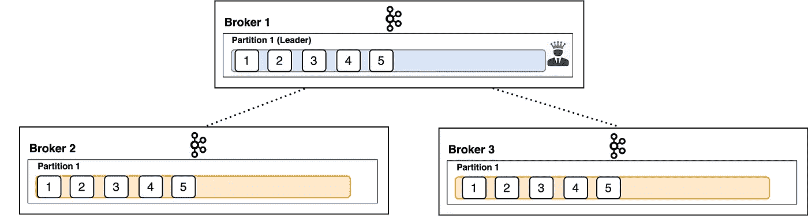
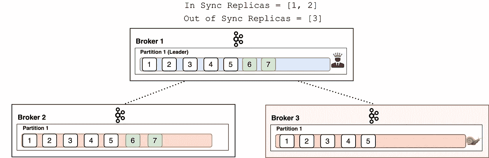
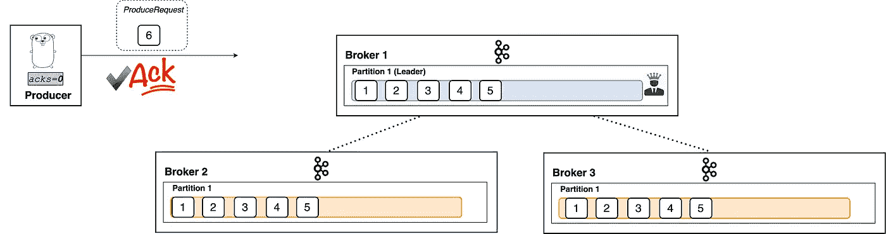
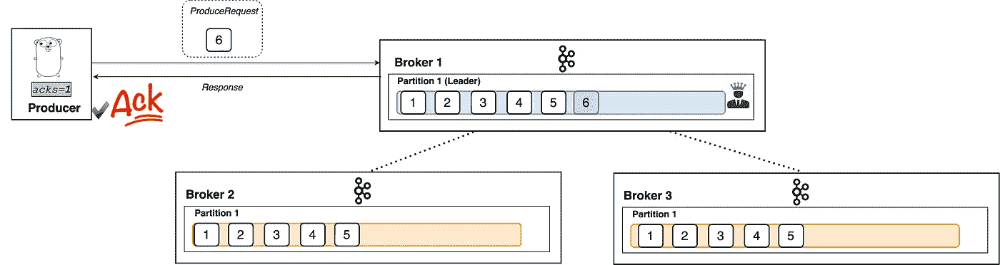
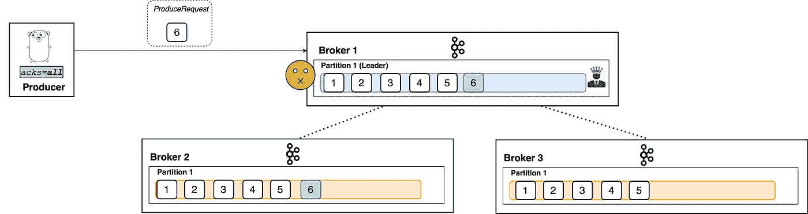
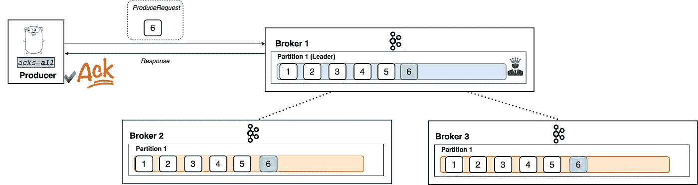
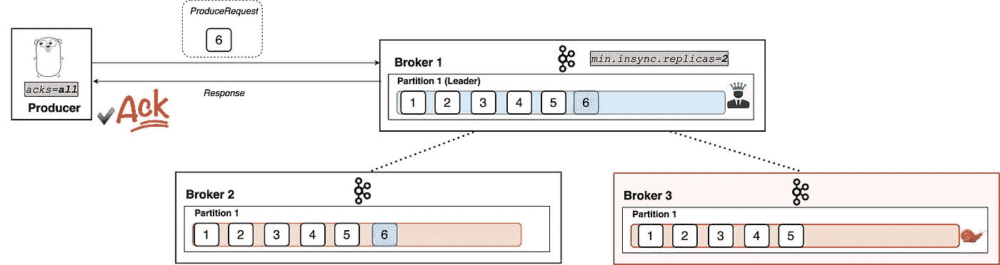
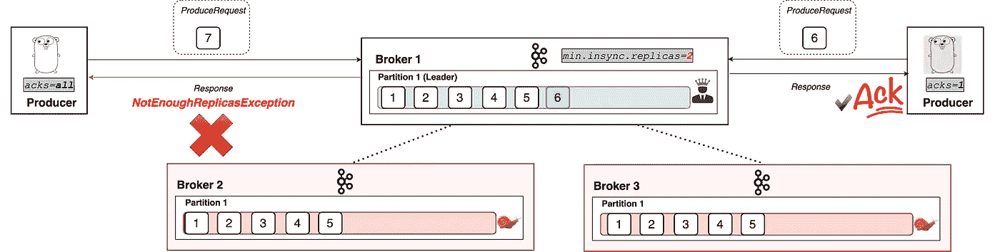
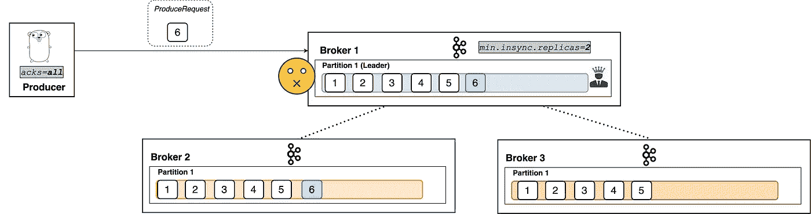

# 卡夫卡·阿克斯解释说

> 原文：<https://betterprogramming.pub/kafka-acks-explained-c0515b3b707e>

## 可视化卡夫卡最被误解的配置设置

在与卡夫卡共事近两年后，我发现有两种配置的相互作用普遍令人困惑。

这两种配置是`acks`和`min.insync.replicas`——以及它们如何相互作用。

这篇文章旨在通过一些插图的帮助，成为消除混乱的方便参考。

# 分身术

为了更好地理解这些配置，提醒我们自己卡夫卡的复制协议是有用的。

我假设您已经熟悉 Kafka——如果您不熟悉，请随意查看我的“[Apache Kafka](https://medium.com/hackernoon/thorough-introduction-to-apache-kafka-6fbf2989bbc1)全面介绍”文章。

对于每个分区，存在一个领导者代理和 *n* 个跟随者代理。
控制有多少这样的经纪人 *(1 + N)* 存在的配置是`replication.factor`。这是单个分区内的数据跨集群复制的总次数。

默认和典型的建议是三。

*复制*

生产者客户端只向领导者代理写入数据，从者异步复制数据。现在，由于分布式系统的混乱世界，我们需要一种方法来判断这些追随者是否设法跟上领导者——他们是否有写给领导者的最新数据？

## 同步副本

*同步副本* (ISR)是一个代理，它拥有给定分区的最新数据。一个*领导者*总是一个同步的复制品。只有当一个*跟随器*完全赶上它所跟随的分区时，它才是同步副本。换句话说，它不能落后于给定分区的最新记录。

如果一个跟随者代理落后于一个分区的最新数据，我们不再把它算作一个同步副本。

经纪人 3 落后(不同步)

请注意，我们确定副本是否同步的方式稍微有点微妙——它不像“代理有最新的记录吗？”讨论这个问题超出了本文的范围。目前，相信我，上面有蜗牛的红色经纪人是不同步的。

# 承认

`acks`设置是客户端(生产者)配置。它表示在我们认为写入成功之前必须收到记录的代理数量。它支持三个值— `0`、`1`和`all`。

## acks = 0 '

值为`0`，生产者甚至不会等待代理的响应。记录发出后，它立即认为写入成功。

制片人甚至不等待回应。消息已确认！

## acks = 1 '

通过设置`1`，当领导者收到记录时，生产者将认为写入成功。主经纪人将知道在接收到记录时立即响应，而不再等待。

生产者等待响应。一旦它接收到该消息，该消息就被确认。代理收到记录后会立即做出响应。跟随者异步复制新记录。

## acks =全部'

当设置为`all`时，当所有同步副本接收到记录时，生产者将认为写入成功。这是通过主代理智能地响应请求来实现的——一旦所有同步副本自己接收到记录，它将发送回一个响应。

没那么快！经纪人 3 还没有收到记录。

就像我说的，首席经纪人知道什么时候回应使用`acks=all`的制作人。

啊，我们走吧！

## ack 的效用

正如您所知，`acks`设置是一种在耐用性保证和性能之间进行权衡的好方法。

如果你想确保你的记录是好的和安全的——配置你的 ack 到`all`。

如果您重视延迟和吞吐量，而不是晚上睡得好，请设置一个低阈值`0`。您可能有更大的机会丢失消息，但是您天生就有更好的延迟和吞吐量。

# 最小同步副本

孤立的`acks=all`配置缺少一样东西。
如果当所有同步复制副本都收到写操作时，领导者做出响应，当领导者是唯一的同步复制副本时，会发生什么情况？那岂不是相当于设置了`acks=1`？

这就是`min.insync.replicas`大放异彩的地方！

`min.insync.replicas`是代理上的一个配置，表示代理允许`acks=all`请求所需的同步副本的最小数量。也就是说，如果同步副本的数量低于配置的最小数量，所有带有`acks=all`的请求将不会被处理并收到错误响应。它充当了一种看门人的角色，确保上面描述的场景不会发生。

代理 3 不同步

如图所示，当分区的至少 *x* 个副本同步时，`min.insync.replicas=X`允许`acks=all`请求继续工作。这里，我们看到了一个有两个副本的示例。

但是如果我们低于同步副本的值，生产者将开始接收异常。

代理 2 和代理 3 不同步

如您所见，在这种情况下，带有`acks=all`的生产者无法成功地写入分区。然而，请注意，带有`acks=0`或`acks=1`的生产者继续工作得很好。

## 警告

一个常见的误解是`min.insync.replicas`表示需要多少复制品来接收记录，以便领导者对生产者做出响应。这不是真的——配置是处理请求所需的同步副本的最小数量。

也就是说，如果有三个同步副本和`min.insync.replicas=2`，只有当三个副本都有记录时，领导者才会响应。

代理 3 是一个同步副本。领导者还不能响应，因为经纪人 3 还没有收到写。

# 摘要

这就是全部了！简单一旦可视化—不是吗？

概括来说，`acks`和`min.insync.replicas`设置允许您配置 Kafka 集群中写入的首选持久性要求。

*   `acks=0`—请求发出时，写入被视为成功。不需要等待回应。
*   `acks=1` —领导必须收到记录并做出回应，才能认为书写成功。
*   `acks=all` —所有在线同步复制副本必须接收写入。如果少于`min.insync.replicas`在线，那么写将不会被处理。

# 进一步阅读

Kafka 是一个复杂的分布式系统，所以还有很多东西需要学习！
以下是我可以推荐的一些后续资源:

*   [Kafka 消费者数据访问语义学](https://www.confluent.io/blog/apache-kafka-data-access-semantics-consumers-and-membership/)——我的一个更深入的博客，讲述了消费者如何实现持久性、一致性和可用性。
*   [Kafka controller](https://medium.com/@stanislavkozlovski/apache-kafkas-distributed-system-firefighter-the-controller-broker-1afca1eae302)——我的另一篇深度文章，我们将深入探讨经纪人之间的协调是如何工作的。它解释了是什么使一个复制品不同步(我前面提到的细微差别)。
*   [“Apache Kafka 的 99%规模延迟](https://www.confluent.io/blog/configure-kafka-to-minimize-latency/)”—一篇关于 Kafka 性能的精彩文章—关于如何配置低延迟和高吞吐量的绝佳技巧和解释。
*   [卡夫卡峰会 SF 2019 视频](https://www.confluent.io/resources/kafka-summit-san-francisco-2019/)
*   [汇流博客](https://www.confluent.io/blog/)——关于阿帕奇卡夫卡的丰富信息
*   [卡夫卡文献](https://kafka.apache.org/documentation/) —伟大、广泛、高质量的文献

Kafka 是积极开发的——由于其健康的社区，它的功能和可靠性都在增长。为了更好地跟踪它的发展，我推荐加入[邮件列表](https://kafka.apache.org/contact)。

感谢您花时间阅读本文。

如果你喜欢它，测试你能击中多少次👏五秒钟后。这对你的手指来说是很好的有氧运动，并且会帮助其他人看到这个故事。
你可以在 Twitter 上关注我，地址是 [@StanKozlovski](https://twitter.com/StanKozlovski) ，谈论编程、技术、初创企业、健康、投资，还可以看看什么时候有新文章发布！