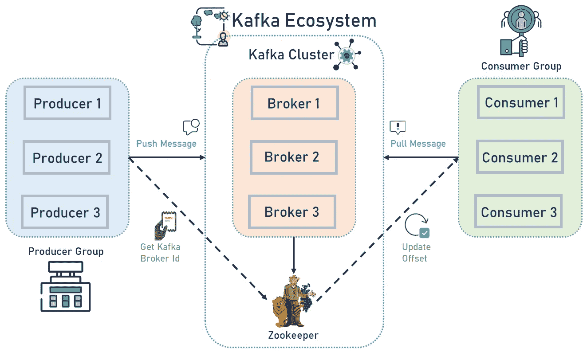

# Kafka Docker:在 Docker 中运行多个 Kafka Brokers 和 ZooKeeper 服务

> 原文：<https://betterprogramming.pub/kafka-docker-run-multiple-kafka-brokers-and-zookeeper-services-in-docker-3ab287056fd5>

## 为了更容易地处理负载，在 Docker 上设置一个多节点 Kafka 集群


照片由 [JJ 英](https://unsplash.com/@jjying?utm_source=unsplash&utm_medium=referral&utm_content=creditCopyText)在 [Unsplash](https://unsplash.com/s/photos/pipelines?utm_source=unsplash&utm_medium=referral&utm_content=creditCopyText) 上拍摄

Apache Kafka 是一个分布式流平台，能够发布和订阅记录流，存储记录流以进行容错处理，以及处理记录流。

总的来说，卡夫卡有两种广泛的用途:

*   构建实时流数据管道，在系统或应用程序之间可靠地获取数据
*   构建实时流应用程序，对数据流进行转换或做出反应。

在这篇文章中，我们在 Docker 上设置了一个多节点 Kafka 集群，因为多节点 Kafka 集群非常容易处理负载。对于那些想要处理大量数据的用户来说，这篇文章应该非常有帮助。

想了解更多关于卡夫卡的知识，请点击链接:[http://kafka.apache.org/](http://kafka.apache.org/)

请看下图。它展示了卡夫卡的聚类图。



图片来源:DLT 实验室

# 先决条件

1.  安装码头工人:[https://www.docker.com/get-started#h_installation](https://www.docker.com/get-started#h_installation)
2.  安装 Docker 撰写:[https://docs.docker.com/compose/install/](https://docs.docker.com/compose/install/)

## 设置一个三节点 Kafka 集群

在一个三节点 Kafka 集群中，我们将使用三个 Apache ZooKeeper 服务运行三个 Kafka 代理，并在多个步骤中测试我们的设置。

## docker-撰写文件内容

下面的代码负责建立一个包含三个 Kafka 代理和三个 ZooKeeper 服务的 Kafka 集群。将此代码保存在用户可以从 CLI 访问的`.yml`文件中。然后按照这些进一步的步骤:

```
version: ‘2.1’
services:
 zookeeper-1:
   image: confluentinc/cp-zookeeper:latest
   environment:
     ZOOKEEPER_SERVER_ID: 1
     ZOOKEEPER_CLIENT_PORT: 22181
     ZOOKEEPER_TICK_TIME: 2000
     ZOOKEEPER_INIT_LIMIT: 5
     ZOOKEEPER_SYNC_LIMIT: 2
     ZOOKEEPER_SERVERS: localhost:22888:23888;localhost:32888:33888;localhost:42888:43888
   network_mode: host
   extra_hosts:
     — “moby:127.0.0.1”

 zookeeper-2:
   image: confluentinc/cp-zookeeper:latest
   environment:
     ZOOKEEPER_SERVER_ID: 2
     ZOOKEEPER_CLIENT_PORT: 32181
     ZOOKEEPER_TICK_TIME: 2000
     ZOOKEEPER_INIT_LIMIT: 5
     ZOOKEEPER_SYNC_LIMIT: 2
     ZOOKEEPER_SERVERS: localhost:22888:23888;localhost:32888:33888;localhost:42888:43888
   network_mode: host
   extra_hosts:
     — “moby:127.0.0.1”

 zookeeper-3:
   image: confluentinc/cp-zookeeper:latest
   environment:
     ZOOKEEPER_SERVER_ID: 3
     ZOOKEEPER_CLIENT_PORT: 42181
     ZOOKEEPER_TICK_TIME: 2000
     ZOOKEEPER_INIT_LIMIT: 5
     ZOOKEEPER_SYNC_LIMIT: 2
     ZOOKEEPER_SERVERS: localhost:22888:23888;localhost:32888:33888;localhost:42888:43888
   network_mode: host
   extra_hosts:
     — “moby:127.0.0.1”  kafka-1:
   image: confluentinc/cp-kafka:latest
   network_mode: host
   depends_on:
     — zookeeper-1
     — zookeeper-2
     — zookeeper-3
   environment:
     KAFKA_BROKER_ID: 1
     KAFKA_ZOOKEEPER_CONNECT: localhost:22181,localhost:32181,localhost:42181
     KAFKA_ADVERTISED_LISTENERS: PLAINTEXT://localhost:19092
   ports:
     — “19092:19092”
   extra_hosts:
     — “moby:127.0.0.1”

 kafka-2:
   image: confluentinc/cp-kafka:latest
   network_mode: host
   depends_on:
     — zookeeper-1
     — zookeeper-2
     — zookeeper-3
   environment:
     KAFKA_BROKER_ID: 2
     KAFKA_ZOOKEEPER_CONNECT: localhost:22181,localhost:32181,localhost:42181
     KAFKA_ADVERTISED_LISTENERS: PLAINTEXT://localhost:29092
   ports:
     — “29092:29092”
   extra_hosts:
     — “moby:127.0.0.1”

 kafka-3:
   image: confluentinc/cp-kafka:latest
   network_mode: host
   depends_on:
     — zookeeper-1
     — zookeeper-2
     — zookeeper-3
   environment:
     KAFKA_BROKER_ID: 3
     KAFKA_ZOOKEEPER_CONNECT: localhost:22181,localhost:32181,localhost:42181
     KAFKA_ADVERTISED_LISTENERS: PLAINTEXT://localhost:39092
   ports:
     — “39092:39092” 
   extra_hosts:
     — “moby:127.0.0.1”
```

在上面的`docker-compose`文件中，我们有三个 ZooKeeper 服务和三个 Kafka 代理，它们有不同的 id 和环境设置。在 ZooKeeper 中，我们使用了以下几种环境:

*   `ZOOKEEPER_SERVER_ID` —所有 ZooKeeper 服务的唯一服务器 ID
*   `ZOOKEEPER_CLIENT_PORT` —监听客户端连接的端口
*   `ZOOKEEPER_TICK_TIME`—ZooKeeper 使用的以毫秒为单位的基本时间单位。这是用来做心跳的，最小会话超时将是`tickTime`的两倍。
*   `ZOOKEEPER_INIT_LIMIT` — `InitLimit`是 ZooKeeper 用来限制 quorum 中的 ZooKeeper 服务器必须连接到领导者的时间长度的超时持续时间。条目`syncLimit`限制了一个服务器与领导者的差距。

对于这两种超时，您可以使用`tickTime`来指定时间单位。在这个例子中，`initLimit`的超时是 5 个节拍，每节拍 2000 毫秒，即 10 秒。

在多节点 Kafka 集群设置中，当有消息进来时，ZooKeeper 会决定哪个 Kafka broker 处理消息***；*** 正因为如此，每个 Kafka 经纪人都依赖于 ZooKeeper 服务，这是一个包含九个步骤的过程:

## 第一步。

使用 Docker Compose Up 命令以分离模式启动 ZooKeeper 和 Kafka。

```
docker-compose -f <docker-compose_file_name> up -d
```

## 第二步。

在另一个终端窗口中，转到同一目录。在我们继续之前，让我们确保服务已经启动并运行:

```
docker ps
```

## 第三步。

检查 ZooKeeper 日志以验证 ZooKeeper 是否健康。例如，对于服务`zookeeper-1`:

```
docker logs <zookeeper-1_containerId>
```

重复此步骤来验证其余的 ZooKeeper 容器。

## 第四步。

确认动物园管理员合奏准备就绪:

```
docker run --net=host --rm confluentinc/cp-zookeeper:latest bash -c “echo stat | nc localhost <ZOOKEEPER_CLIENT_PORT> | grep Mode”
```

重复此步骤来验证其余的 ZooKeeper 容器。

输出:您应该看到一个领导者和两个追随者:

```
Mode: followerMode: leaderMode: follower
```

## 第五步。

检查日志以查看 Kafka 代理是否已成功启动。

```
docker logs <kafka-1_containerId>docker logs <kafka-2_containerId>docker logs <kafka-3_containerId>
```

## 第六步。

测试代理是否按预期工作。现在代理已经启动，我们将通过创建一个主题来测试它们是否按预期工作。并确保最小分区是 1，复制因子不超过 ZooKeeper 服务的数量。

```
docker run --net=host --rm confluentinc/cp-kafka:latest kafka-topics --create --topic <topic_name> --partitions <Number_of_partitions> --replication-factor <number_of_replication_factor> --if-not-exists --zookeeper localhost:32181
```

您应该会看到以下输出:

```
Created topic “testTopic”
```

## 第七步。

现在，通过描述主题来验证主题是否创建成功。

```
docker run --net=host --rm confluentinc/cp-kafka:latest kafka-topics --describe --topic testTopic --zookeeper localhost:32181
```

## 第八步。

接下来，我们将尝试为我们刚刚创建的`testTopic`生成一些数据。

```
docker run --net=host --rm confluentinc/cp-kafka:latest bash -c “seq 42 | kafka-console-producer --broker-list localhost:29092 --topic testTopic && echo ‘Producer 42 message.’”
```

上面的命令将使用 Kafka 附带的控制台生成器传递 42 个整数。

因此，您应该在终端中看到类似这样的内容:

```
Producer 42 message.
```

## 第九步。

看起来事情写得很成功，但是让我们尝试使用控制台消费者读回消息，并确保它们都被考虑在内。

```
docker run --net=host --rm confluentinc/cp-kafka:latest kafka-console-consumer --bootstrap-server localhost:29092 --topic testTopic --new-consumer --from-beginning --max-message 42
```

此命令返回数据可能需要一些时间。卡夫卡要在你第一次消费数据的时候，在幕后创造消费抵消话题。

现在 Kafka 集群设置已经可以使用了，我们可以使用下面的主机访问所有 Kafka 代理:

```
Kafka_host = “0.0.0.0:19092,0.0.0.0:29092,0.0.0.0:39092”
```

要使用 Node.js 访问 Kafka 集群，您可以在 Kafka-node npm[https://www.npmjs.com/package/kafka-node](https://www.npmjs.com/package/kafka-node)了解如何启用 NPM 包

感谢您的阅读！希望这对你有帮助。

想了解更多关于 ZooKeeper 的知识？[点击此处了解更多信息](https://medium.com/@dltlabs/an-in-depth-look-at-zookeeper-ced6d6695d79):

[](https://medium.com/@dltlabs/an-in-depth-look-at-zookeeper-ced6d6695d79) [## 深入了解动物园管理员

### 我们研究是什么让《动物园管理员》在引擎盖下滴答作响，看看是什么让它如此有效。

medium.com 的 DLT 实验室](https://medium.com/@dltlabs/an-in-depth-look-at-zookeeper-ced6d6695d79)