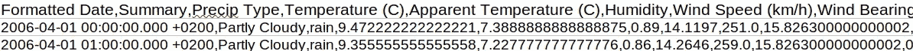

# Kafka Streams:如何处理 CSV 文件以执行计算

> 原文：<https://betterprogramming.pub/kafka-streams-how-to-process-a-csv-file-to-perform-calculations-173758da117d>

## 处理一个大的 CSV 文件，并根据历史天气记录计算日平均温度


照片由[媒体修改器](https://unsplash.com/@mediamodifier?utm_source=medium&utm_medium=referral)在 [Unsplash](https://unsplash.com?utm_source=medium&utm_medium=referral) 上拍摄

Kafka Streams 是一个用于构建流媒体应用程序的流行库。它为必须快速实时处理数据的应用和微服务提供了强大的解决方案。

在本教程中，您将学习如何处理包含历史天气记录的大型 CSV 文件。目标是计算日平均温度。为此，我们将消费一个 Kafka 主题，转换数据，并将其发送到另一个主题。此外，您将熟悉常用的流操作，比如聚合。

我们开始吧！

# 创建项目

## 安装并启动 Kafka

卡夫卡有多种启动方式。例如，您可以使用 Docker 图像。在这里，我选择安装在本地。

1.  从[这里](https://www.apache.org/dyn/closer.cgi?path=/kafka/2.8.0/kafka_2.13-2.8.0.tgz)下载最新的 Kafka 版本。
2.  提取包并导航到 Kafka 文件夹

```
$ tar -xzf kafka_2.13-2.8.0.tgz
$ cd kafka_2.13-2.8.0
```

3.使用以下命令在终端窗口中启动 Zookeeper:

```
$ bin/zookeeper-server-start.sh config/zookeeper.properties
```

4.使用以下命令从另一个终端启动 Kafka broker 服务:

```
$ bin/kafka-server-start.sh config/server.properties
```

## 创造卡夫卡主题

在另一个终端选项卡中，创建输入和输出主题，如下所示:

```
$ bin/kafka-topics.sh — create — topic weather-tmp-input — bootstrap-server localhost:9092bin/kafka-topics.sh — create — topic weather-tmp-output — bootstrap-server localhost:9092
```

## 获取数据集

下载包含[天气记录](https://www.kaggle.com/budincsevity/szeged-weather)的 CSV 文件。我从 kaggle.com 得到了这个数据集。您也可以在我的 GitHub 资源库中找到该文件，链接在“参考资料”部分。

为了让您有个概念，记录看起来像这样:



天气记录样本

## 编写 Java 代码

1.  在您最喜欢的 IDE 中创建一个新的 Maven 项目，并将以下依赖项放在`pom.xml` 文件中:

```
<dependency>
    <groupId>org.apache.kafka</groupId>
    <artifactId>kafka-streams</artifactId>
    <version>2.8.0</version>
</dependency>
<dependency>
    <groupId>com.fasterxml.jackson.core</groupId>
    <artifactId>jackson-databind</artifactId>
    <version>2.12.4</version>
</dependency>
```

2.创建`Weather.java`类，如下所示:

*   我们只需要 CSV 记录中的日期和温度。
*   我们使用正则表达式模式`“\\s”`，从日期中提取日期。

3.创建一个名为`KafkaStreamsDemo.java`的新 Java 文件，并复制以下代码:

下面显示了一步一步的代码解释:

*   `createAvgTempCalcStream()`方法定义了基于 CSV 记录计算日平均温度的流。
*   首先，我们使用`inputStream`将文件记录映射到自定义的`Weather`对象。Kafka [map](https://kafka.apache.org/11/javadoc/org/apache/kafka/streams/kstream/KStream.html#map-org.apache.kafka.streams.kstream.KeyValueMapper-) 操作将输入记录转换为输出流中的新记录。它还提供了更改键/值类型的能力。
*   `mapLineToWeather()`方法构造了一个新的`Weather`对象。我们用逗号分隔每个记录行。我们使用第一个和第四个值来提取日期和温度。
*   `[groupByKey](https://kafka.apache.org/11/javadoc/org/apache/kafka/streams/kstream/KStream.html#groupByKey--)`操作符通过一个现有的键将流中的记录分组。在执行聚合之前，需要执行此操作。这导致了一个`KGroupStream`。注意`null` 记录不包括在结果中。
*   由于默认的 Serdes 与键/值类型不匹配，我们必须显式指定新的 Serdes。在这种情况下——`(with(Serdes.String(), Serdes.Double())`。日期是字符串，平均温度是双精度。
*   `[aggregate](https://kafka.apache.org/11/javadoc/org/apache/kafka/streams/kstream/SessionWindowedKStream.html#aggregate-org.apache.kafka.streams.kstream.Initializer-org.apache.kafka.streams.kstream.Aggregator-org.apache.kafka.streams.kstream.Merger-org.apache.kafka.streams.kstream.Materialized-)`操作允许输出值具有不同于输入值的类型。它按分组键聚合值。
*   `TempCalculator`类帮助我们计算日平均温度。我们计算同一天的每项记录，并对温度求和。然后我们用`sum`除以`count`得到平均值。
*   该流被具体化为一个`KTable`。我们需要为我们的`TempCalculator`对象定制一个 Serdes。这就是为什么我们必须创建一个`JsonSerializer`和`JsonDeserializer`来构造`CustomSerdes`类。
*   最后，我们使用`[mapValues](https://kafka.apache.org/11/javadoc/org/apache/kafka/streams/kstream/KStream.html#mapValues-org.apache.kafka.streams.kstream.ValueMapper-)`操作将记录转换成一个新的键值对。它保留原始记录的键。白天是一串，平均温度是一倍。我们将结果发送到我们之前创建的输出 Kafka 主题。
*   因为我们想让应用程序运行并监听输入主题，所以我们使用了`CountDownLatch`对象。它允许更多的线程等待，直到其他线程中正在执行的一组操作完成。

## 运行应用程序

1.  从 IDE 中运行 Kafka 程序。
2.  从您的终端，将 CSV 文件记录发送到输入主题。

```
cat /home/{user}/kafka-playground/weatherHistory.csv | bin/kafka-console-producer.sh — broker-list localhost:9092 — topic **weather-tmp-input**
```

3.在另一个窗口中，呼叫消费者，如下所示:

```
./bin/kafka-console-consumer.sh --bootstrap-server localhost:9092 \
        --topic **weather-tmp-output** \
        --from-beginning \
        --formatter kafka.tools.DefaultMessageFormatter \
        --property print.key=true \
        --property key.deserializer=org.apache.kafka.common.serialization.StringDeserializer \
        --property value.deserializer=org.apache.kafka.common.serialization.DoubleDeserializer
```

这将触发我们的 Java 代码。您应该会看到如下所示的输出。注意，为了简洁起见，我已经截断了结果。

```
......
2016–09–30 17.090740740740742
2016–09–04 22.15300925925926
2016–09–05 16.838657407407407
2016–09–06 17.289583333333336
2016–09–07 21.448379629629628
2016–09–08 22.427314814814817
2016–09–09 22.702546296296294
......
```

太好了！Kafka 程序处理了输入的主题，并按预期计算出了日平均温度。

# 结论

在本教程中，您学习了如何使用 Kafka Streams 操作，如`aggregate`、`groupByKey`。此外，您还知道如何创建定制的 Serdes 来转换输出主题的数据。

我希望你从这篇文章中学到了有用的信息。

如果您对更多的 Java/消息处理主题感兴趣，您可能会喜欢我的相关文章:

[](/java-process-messages-from-rabbitmq-and-upload-data-to-minio-cloud-b70ecd2e82be) [## Java:处理来自 RabbitMQ 的消息并将数据上传到 MinIO Cloud

### 消费来自 RabbitMQ 的消息并将 epub 文件上传到 MinIO 云存储

better 编程. pub](/java-process-messages-from-rabbitmq-and-upload-data-to-minio-cloud-b70ecd2e82be) 

感谢您的阅读，祝您编码愉快！

# 参考

*   [GitHub 回购](https://github.com/kirshiyin89/kafka-streams-demo)
*   [https://kafka.apache.org/quickstart](https://kafka.apache.org/quickstart)
*   [https://Kafka . Apache . org/20/documentation/streams/developer-guide/DSL-API . html # aggregating](https://kafka.apache.org/20/documentation/streams/developer-guide/dsl-api.html#aggregating)