# Kafka 与 Java、Spring 和 Docker——微服务之间的异步通信

> 原文：<https://betterprogramming.pub/kafka-with-java-spring-and-docker-asynchronous-communication-between-microservices-e1d00e120831>

## 深入解释如何使用 Kafka 实现 java 微服务之间的消息传递

杰佛森·桑多斯在 [Unsplash](https://unsplash.com/s/photos/programming?utm_source=unsplash&utm_medium=referral&utm_content=creditCopyText) 上拍摄的照片

# 目录

1.  我们将要建造的东西
2.  《果壳中的卡夫卡》
3.  主题
4.  划分
5.  设置项目
6.  卡夫卡的 Docker 环境
7.  生产者微服务
8.  消费者微服务
9.  高级功能
10.  结论

在本文中，我们将通过开发两个 spring 微服务来讨论 Kafka 作为消息代理是如何工作的，以及如何使用它在微服务之间进行通信。

# 1.我们将要建造的东西

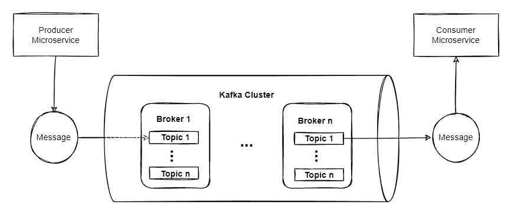

这个想法是创建一个生产者微服务，它接收要创建的食品订单，并通过 Kafka 将它们传递给消费者微服务，以保存在数据库中。

# 2.《果壳中的卡夫卡》

Kafka 集群具有高度的可伸缩性和容错性，这意味着如果它的任何一台服务器出现故障，其他服务器将接管它们的工作，以确保连续运行而不会丢失任何数据。

事件记录了某件事情发生的事实，携带着一条消息，这条消息可以是任何东西，例如，一个字符串、一个数组或一个 JSON 对象。当你向 Kafka 读取或写入数据时，你是以那些事件的形式完成的。

生产者是向卡夫卡发布(写)事件的人，消费者是订阅(读和处理)这些事件的人。

# 3.主题

事件被组织并持久地存储在主题中。主题类似于一个文件夹，这些事件就是该文件夹中的文件。主题是多生产者和多订户的，这意味着我们可以拥有零个、一个或多个。

事件可以根据需要多次读取，与传统的消息传递系统不同，事件在使用后不会被删除。相反，你可以定义卡夫卡应该保留这些事件多长时间。

# 4.划分

主题是分区的，这意味着一个主题分布在多个桶中。当一个新事件发布到一个主题时，它实际上被附加到主题的一个分区中。具有相同事件键的事件被写入同一个分区。Kafka 保证给定主题分区的任何消费者将总是以与事件被写入时完全相同的顺序读取该分区的事件。

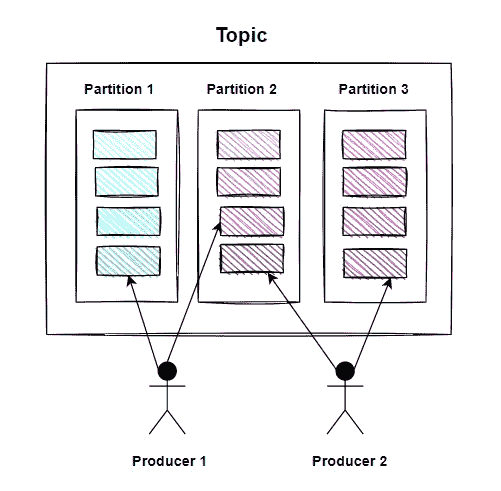

为了使您的数据具有容错性和高可用性，每个主题都可以被复制，甚至可以跨区域或数据中心复制，这样，总是有多个代理拥有数据的副本，以防出现问题(它们会出现)。

# 5.设置项目

转到 [start.spring.io](https://start.spring.io/) 并创建具有以下依赖项的项目

生产者微服务:

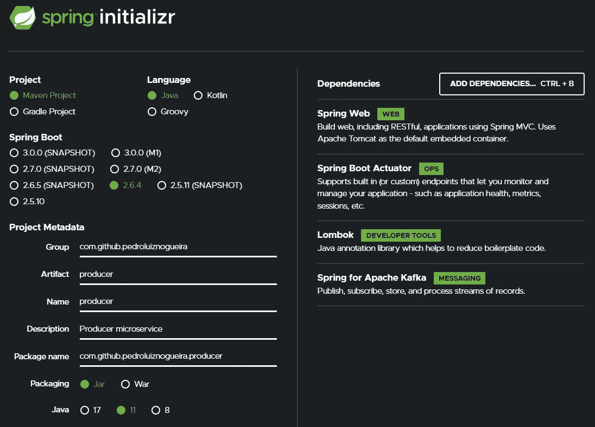

*消费者微服务*

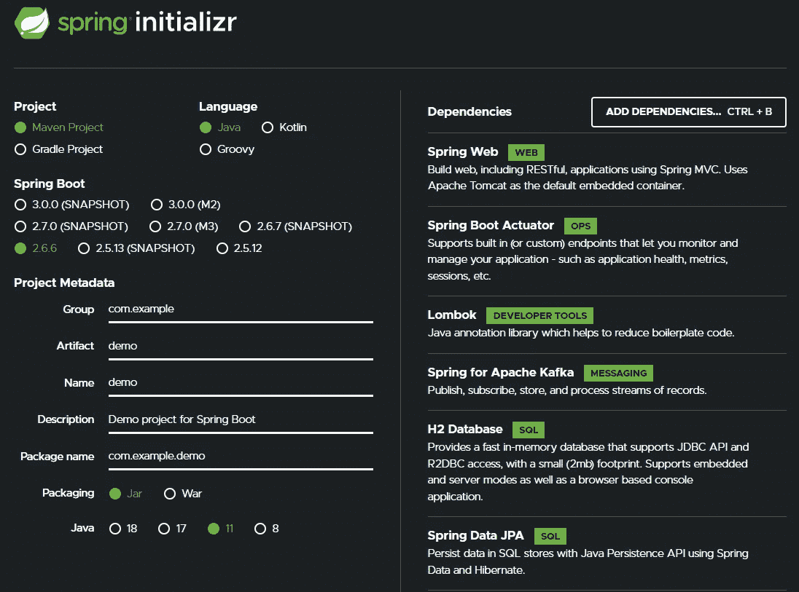

# *6。卡夫卡的 Docker 环境*

在其中一个项目的根目录下，创建一个`docker-compose.yml`文件，包含在 Docker 容器中运行 Kafka、Kafdrop 和 Zookeeper 所需的配置，这并不重要。

在其中一个项目的根文件夹中，您可以在终端 docker-compose up 中运行。可以在 [http://localhost:9000 中访问 Kafdrop，这是一个管理 Kafka 的 web 界面。](http://localhost:9000.)

在那里你可以看到你的主题，创建它们，删除它们，等等。

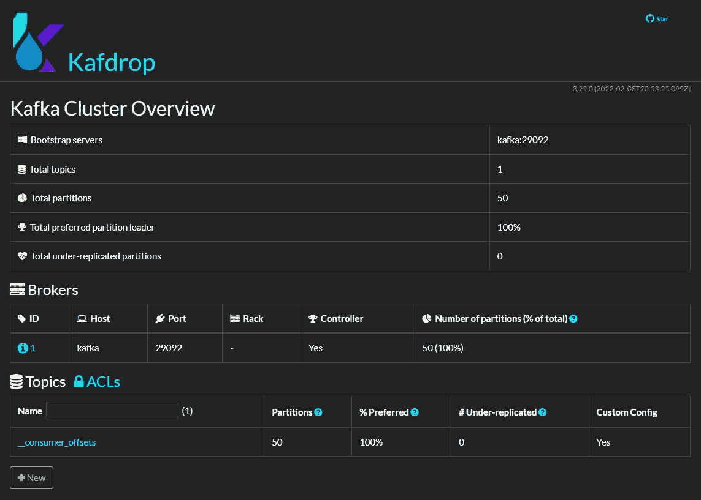

# 7.生产者微服务

建筑:

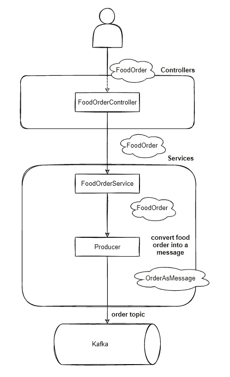

*步骤*

*   创建配置 beans
*   创建一个食品订单主题
*   创建食品订单控制器、服务和生产者
*   将订单转换成字符串格式的消息发送给代理

要运行的 API 的环境变量和端口:

`Config` *—* 负责创建用于发送消息的`KafkaTemplate` bean，并创建食品订单主题。

这里是`FoodOrder`的模型类:

`FoodOrderController` *—* 负责接收食品订单请求，并将其传递给服务层。

`FoodOrderService` *—* 负责接收食品订单并将其传递给生产商。

`Producer`*——*负责接收食品订单，并作为消息发布给卡夫卡。

在第 18 行中，我们将`FoodOrder`对象转换成 JSON 格式的字符串，这样它就可以作为一个字符串在消费者微服务中被接收。

在第 19 行中，我们实际上发送了消息，将发布的主题(在第 6 行中称为环境变量)和订单作为消息传递。

运行应用程序时，我们应该能够看到在 Kafdrop 中创建的主题。当发送食品订单时，我们应该能够在日志中看到消息已被发送。

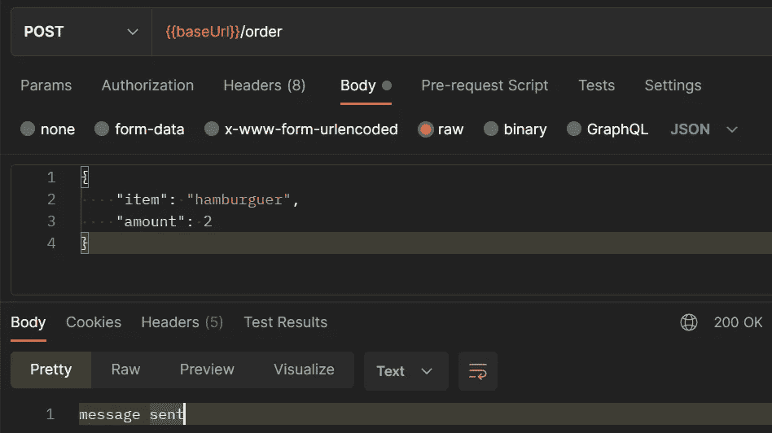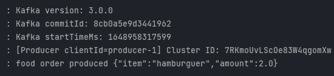

现在，如果我们在 Kafdrop 中的`Topics` 部分下访问创建的 t.food.order 主题，我们应该能够看到该消息。

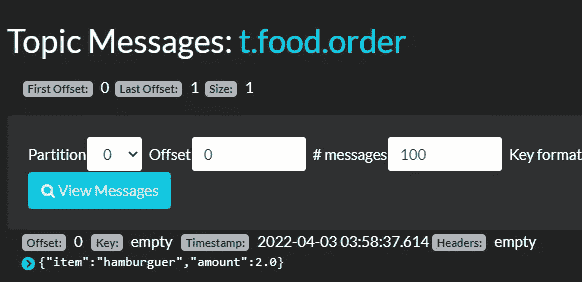

# 8.消费者微服务

建筑:

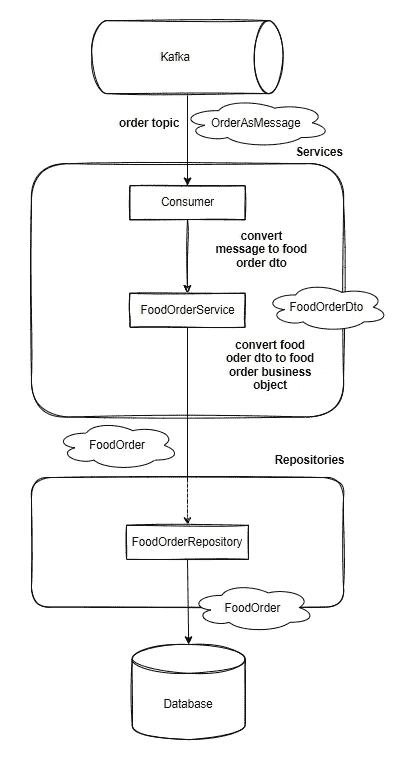

*步骤*

*   为 beans 和组 id 创建配置
*   创建数据库访问
*   创建食品订单消费者和服务
*   创建一个食物存取库

我们将开始配置 API 运行的端口、要监听的主题、消费者的组 id 以及数据库配置

`Config` *—* 负责配置`ModelMapper` bean，这是一个库，用于将一个对象映射到另一个对象，例如，当使用 DTO 模式时，我们将在这里使用它

以下是模型类:

`Consumer` *—* 负责监听点餐话题，当有消息发布给它时，就消费它。我们将把监听到的消息转换成一个`**FoodOrderDto**` 对象，该对象不包含与将被持久化的实体相关的所有内容，比如 ID。

`FoodOrderService` *—* 负责将消费后的订单接收到`FoodOrder` 对象中，并传递给持久层进行持久化。

`FoodOrderRepository`的代码是:

现在只需运行消费者微服务，就可以从订单主题中消费已经发布的消息

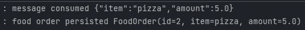

这里需要注意的一个重要细节是，如果我们去 Kafdrop 并检查我们刚刚消费的消息，它仍然会在那里。举例来说，这是 RabbitMQ 不会发生的事情。

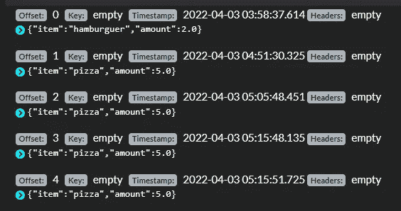

# 9.高级功能

我们可以通过使用调度来发送预定的消息。

通过在生产者微服务的配置类中添加`@EnableScheduling`注释来启用它。

`Scheduler` *是*负责以一定的速率发送消息，我们将以 1000 毫秒的固定速率发送它们。

主题将被自动创建，但是我们可以像前面定义的那样定义 bean。

输出将是

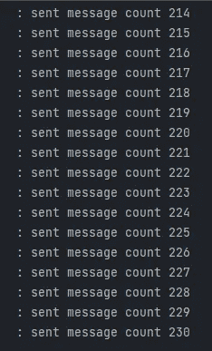

# 10.结论

这里的主要思想是介绍如何将 Kafka 与 Java 和 Spring 结合使用，这样您就可以在更复杂的系统中实现这个解决方案。

如果这篇文章对你有所帮助，可以考虑为它鼓掌，关注我并分享它。

GitHub 上的项目可以在这里找到[。](https://github.com/pedroluiznogueira/medium-microservices-kafka)

## **参考文献**

1.  [阿帕奇卡夫卡文档](https://kafka.apache.org/documentation)
2.  [卡夫卡权威指南](https://www.confluent.io/resources/kafka-the-definitive-guide/)，奥赖利
3.  [阿帕奇卡夫卡](https://link.springer.com/referenceworkentry/10.1007/978-3-319-63962-8_196-1)，马蒂亚斯萨克斯