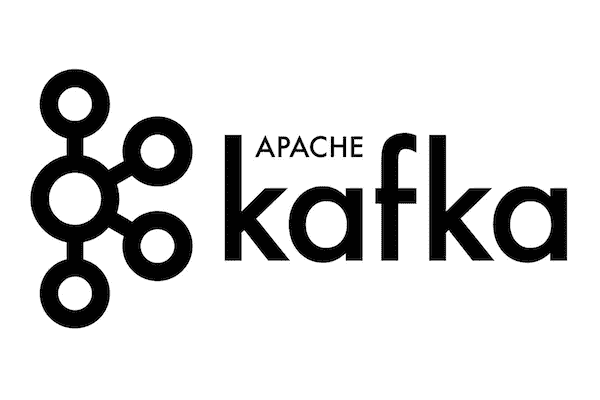
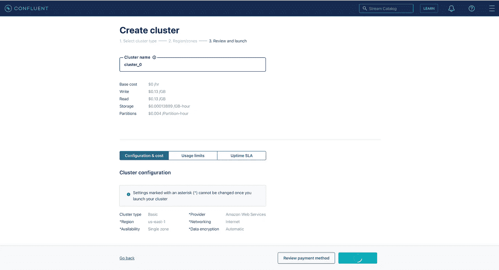
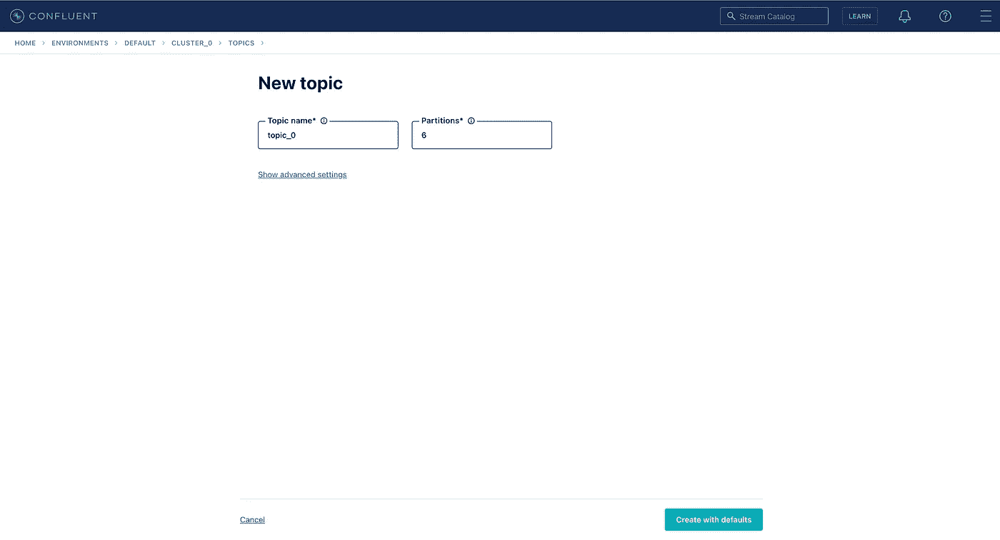
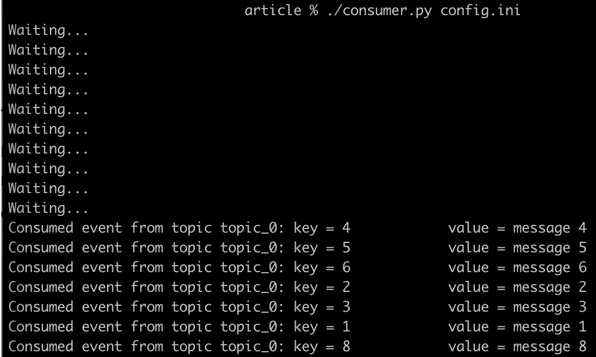
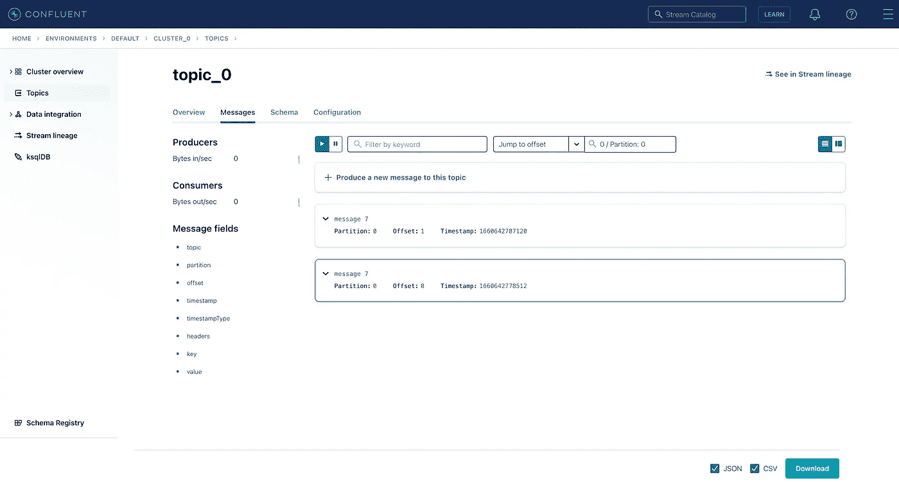

# 使用 Python 的 Kafka:如何启动和运行您的项目

> 原文：<https://betterprogramming.pub/kafka-with-python-how-to-get-your-projects-up-and-running-34bc58c46652>

## 使用 Kafka 运行流式作业



来源:https://www.confluent.io/blog/author/martin-kleppmann/

在本文中，我们将讨论什么是 Apache Kafka 及其用例。我们还将使用 Python 和融合云构建一个 Kafka 消费者的演示示例。

Apache Kafka 是一个开源的流媒体平台。尽管它的代码库是用 Java 编写的，但一些 API 允许它使用 Python、Scala 等。您可以将 Kafka 视为实时处理传入提交日志并按顺序存储它们的工具。这些日志的用户可以根据自己的需求访问和使用它们。

在本文中，我们将讨论以下几点:

*   卡夫卡应用的基本术语定义
*   卡夫卡用例
*   Python 中的 Kafka 消费者示例

# 卡夫卡应用的基本术语定义

在与卡夫卡合作之前，我们需要定义几个关键术语:

*   主题
*   消息
*   划分
*   经纪人
*   生产者
*   消费者


卡夫卡集群，消费者，生产者(来源:【https://kafka.apache.org/081/documentation.html】T2)

## 主题

它是数据的单一实体，也是事件的命名容器。您的应用程序可以包含许多不同的主题。我们也可以把主题想象成持久的、不可变的、只能附加的事件日志。我们还可以设置日志保留期，以便随着时间的推移保留存储空间。

## 消息

消息是主题的内容。它们被表示为(键，值)对。在主题中，键应该是唯一的，并且通常是基本类型。它们可以用作应用程序中某个实体(用户、设备、交易等)的标识符。).值可以由任何类型的对象表示，并且可以复制。一个主题中的消息可以在多个实例中进行划分。

## 划分

分区是将 Kafka 集群的多个实例中的单个主题中的日志分开。划分逻辑是根据消息的关键字定义的。如果该项为空，则分区被均匀填充。否则，通过哈希函数运行键，属性分区的数量就是哈希值。具有相同密钥的消息位于相同的分区中。

## 经纪人

代理是运行 Kafka 流程的实际机器和实例。每个代理可以托管一组分区，并处理向这些分区写入和读取事件的请求。代理还可以处理彼此之间的分区复制。

## 生产者

与 Kafka 交互的应用程序可以在两种模式下运行:生产者或消费者。制片人在卡夫卡的主题上写消息。在编写消息时，他们提供代理的地址、安全配置和消息的内容。

## 消费者

消费者代表客户端应用程序。他们阅读来自卡夫卡主题的信息。消费者像生产者一样管理连接池和网络协议。对于 Kafka 来说，许多消费者实例阅读一个主题也是正常的，因为在阅读一个消息后，它不会被破坏，它会被任何其他感兴趣的消费者阅读。

## 卡夫卡用例

Kafka 过程可以应用于数据科学项目，主要是在我们需要处理数据流和实时进行预测的时候。

让我们以电子商务中的实时推荐为例。我们可以离线训练一个模型，看看用户是否喜欢我们的推荐。用户加载页面的事件可以用 Kafka Producer 写入我们系统的主题中。然后提取和丰富特征并做出预测，我们可以阅读来自卡夫卡消费者的信息。

我们还可以使用 Kafka brokers 跨不同的服务发送消息。该系统可以实现为微服务架构，其中一些微服务可以是生产者，而其他微服务可以是消费者。例如，一个人可以在主题上创建新的用户帐户，另一个人可以使用关于帐户的信息并向用户发送电子邮件。

## Python 中的 Kafka 消费者示例

这里我们将演示一个如何产生和消费消息的小例子。我们将在合流云中建立一个集群，并创建一个卡夫卡主题。然后，我们将使用`confluent_kafka`库用 Python 编写一个消费者，并运行它来观察输出消息。

首先，我们需要在[融合云](https://confluent.cloud/)上创建一个帐户。然后我们建立了卡夫卡集群。在这里，我们可以选择它运行的服务(AWS、Google Cloud 或 Azure ),并选择区域和可用性区域。我们将我们的集群命名为`cluster_0`。



当集群启动并运行时，我们可以转到 topics 选项卡并创建 Kafka 主题。我们将它命名为`topic_0`。



现在，我们需要安装 Confluent CLI，并通过登录 Confluent Cloud 帐户连接到我们的集群。命令如下:

```
brew install --cask confluent-cli
confluent login
```

连接完成后，我们可以检查我们的环境 ID 并选择使用它。

```
confluent environment list
confluent environment use <env-ID>
```

因为我们已经创建了 Kafka 集群，所以我们也应该能够列出它并选择它来使用。

```
confluent kafka cluster list
confluent kafka cluster use <cluster-ID>
```

为了与集群通信，我们需要定义 API 密钥和秘密密钥。

```
confluent api-key create --resource <cluster-ID>
confluent api-key use <API-Key> --resource <cluster-ID>
```

现在，当与集群的通信建立后，我们应该能够看到创建的主题`topic_0`。

```
confluent kafka topic list
```

现在我们应该用 Python 来定义消费者。首先，我们创建配置文件，定义 Kafka 集群运行的服务器、安全协议和凭证。

为了能够看到引导服务器地址，运行以下命令并复制字段`Endpoint SASL_SSL`的内容。

```
confluent kafka cluster describe
```

然后我们定义`consumer.py`来解析配置文件，创建一个`Consumer`实例，然后从 Kafka 主题中提取现有的消息并打印它们的内容。

我们让`Consumer`脚本可执行并运行它。

```
chmod u+x consumer.py
./consumer.py config.ini
```

运行`Consumer`之后，我们需要用数据填充主题。为此，我们在第二个终端中运行了`Producer`,并编写了以下消息。这里的索引是一个键，`:`右边的字符串是消息的值。

```
confluent kafka topic produce topic_0 --parse-key1:message 1
2:message 2
3:message 3
4:message 4
5:message 5
6:message 6
7:message 7
8:message 8
```

当我们切换回第一个终端时，我们应该看到消息正在被使用和打印。



卡夫卡的主题所传达的信息被成功地消费了。我们还可以使用融合云 UI 来可视化这些消息。例如，消息 7 的偏移量为 0，分区为 0。



# 最后的想法

在本文中，我们看到了 Kafka 的基本功能和术语，建立了一个融合云集群，并构建了一个 Kafka 消费者的示例。

在接下来的文章中，我们将把 Kafka 过程引入机器学习管道。

感谢您在评论区的反馈！请继续关注。

干杯！

# 链接

*   [https://developer . confluent . io/learn-Kafka/Apache-Kafka/events/](https://developer.confluent.io/learn-kafka/apache-kafka/events/)
*   [https://github.com/confluentinc/confluent-kafka-python](https://github.com/confluentinc/confluent-kafka-python)
*   [https://kafka.apache.org/081/documentation.html](https://kafka.apache.org/081/documentation.html)

[](/build-production-ready-ml-workflow-with-dvc-and-s3-cdd9c95bf19) [## 与 DVC 和 S3 一起构建生产就绪的 ML 工作流

### DVC:和 Git 一样，只是数据不同

better 编程. pub](/build-production-ready-ml-workflow-with-dvc-and-s3-cdd9c95bf19) [](/run-s3-locally-with-minio-for-dvc-machine-learning-pipeline-7fa3d240d3ab) [## 使用 MinIO 在本地运行 DVC 机器学习管道的 S3

### 开始使用对象存储的最便宜和最快的方法。

better 编程. pub](/run-s3-locally-with-minio-for-dvc-machine-learning-pipeline-7fa3d240d3ab)