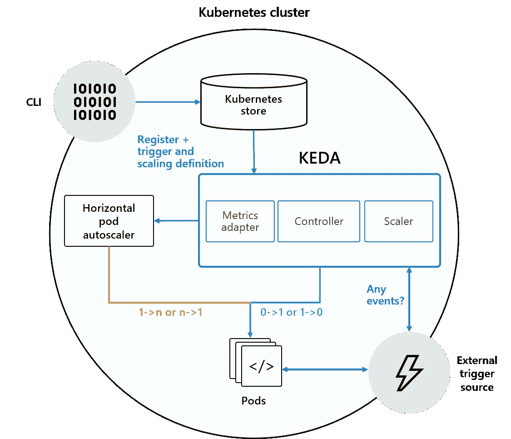
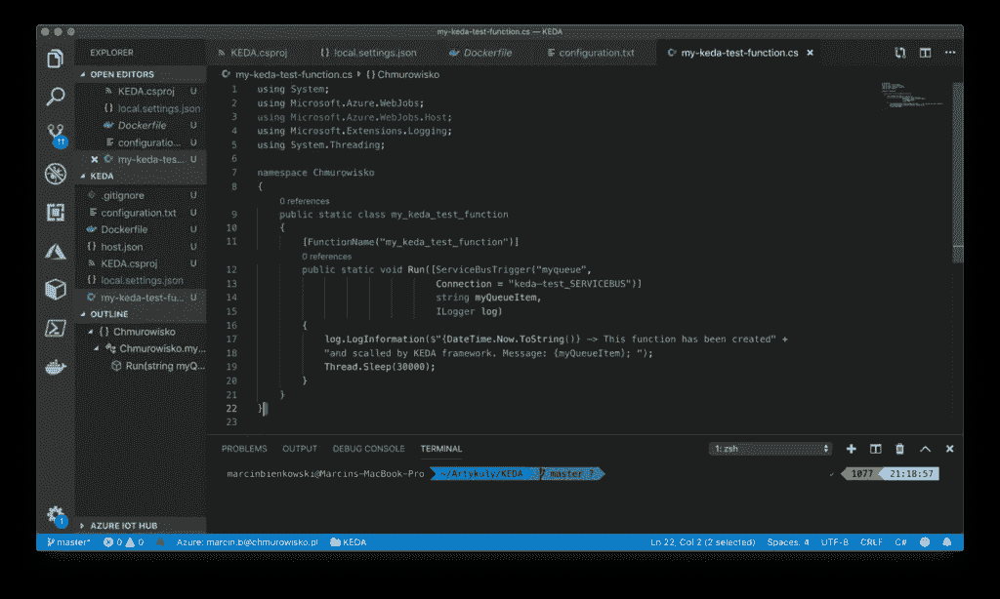
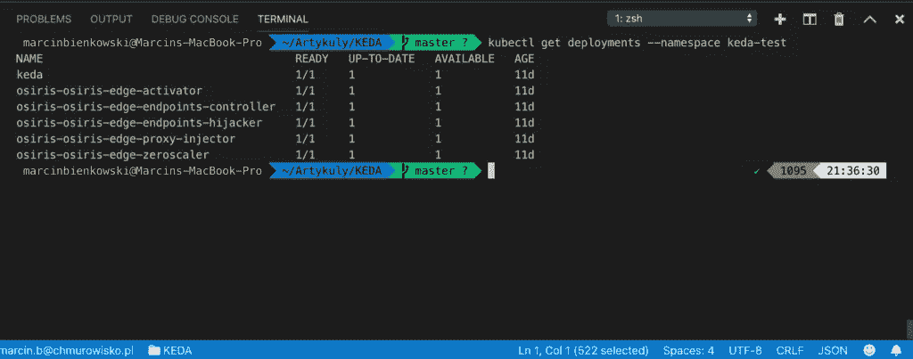
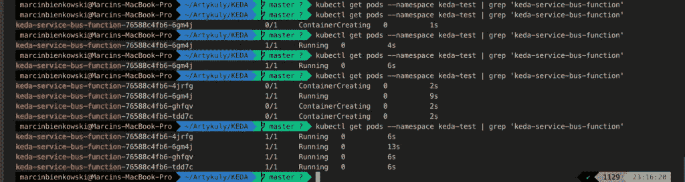

# KEDA 特写:基于 Kubernetes 的事件驱动自动缩放

> 原文：<https://betterprogramming.pub/keda-kubernetes-up-close-f47cdf43920b>

距离上次微软 Build 2019 大会已经有一段时间了。从那时起，吸引我们注意力的新闻是基于 Kubernetes 的事件驱动自动缩放(KEDA)的发布。我们想更深入地了解一下这个解决方案。

# **什么是 KEDA？**

KEDA 是红帽和微软工程团队合作的结果。它通常被定义为一个开源组件，我们可以将其安装在 Kubernetes 集群中，以实现基于事件的容器伸缩。它扩展了 Kubernetes 的功能，利用 CPU 指标和内存来扩展容器。由于该项目仍在开发中，你可以在 GitHub 上跟踪其进展[。](https://github.com/kedacore/keda)

KEDA 包括一组特殊的适配器(连接到数据源以获取指标的组件)。这些指标进一步用于确定是否以及如何扩展环境。目前，有七个这样的连接器:RabbitMQ、Redis DB、Azure Service Bus、Azure IoT Hub 和 Cosmos DB。

正如我们所见，KEDA 允许 Kubernetes 集群成为事件驱动架构的有效基础设施，而无需基于事件队列创建其扩展组件。



*KEDA 图由其创建者开发，可在 GitHub 上获得*

# **KEDA 建筑**

根据上图，KEDA 为每个集群提供了三个基本要素:

*   **Scaler** —连接到所选源(例如 RabbitMQ)并读取其指标(队列大小)的组件
*   **指标适配器** —将缩放器读取的指标转发给水平 Pod 自动缩放器(HPA)以启用水平 app 自动缩放的元素
*   **控制器** —为容器的消费者提供从 0 到 1(或从 1 到 0)的缩放的最后一个，也可能是最重要的元素。为什么只有 1 和 0？因为整个解决方案旨在扩展 Kubernetes 的功能，而不是从头开始提供任何功能。控制器扩展到第一个实例，HPA 使用指标适配器转发的指标执行进一步的克隆。控制器还负责持续监控是否出现新的`ScaledObject` 部署。

# **如何创建 ScaledObject 部署**

要在我们的容器中使用 KEDA，我们首先必须创建一个`ScaledObject` 部署。例如，在 YAML 中，我们可以指定缩放规则并选择要复制的容器。

这里有一个例子:

```
apiVersion: keda.k8s.io/v1alpha1kind: ScaledObjectmetadata: name: keda-service-bus-function labels: deploymentName: keda-service-bus-functionspec: scaleTargetRef: deploymentName: keda-service-bus-function containerName: azure-functions-container pollingInterval: 30 cooldownPeriod: 300 minReplicaCount: 1 maxReplicaCount: 500triggers: type: azure-servicebus metadata: queueName: my-queue connection: SB_CONN_STRING queueLength: ‘10’
```

对于创建具有有效扩展机制的环境来说,`ScaledObject`配置知识是必不可少的。比如设置为`‘1’`的时候看一下`*minReplicaCount*;`；它会保护我们免受冷启动。

# **KEDA — Azure 功能集成**

您可能想知道如何在您的架构中利用 KEDA。微软 Azure 的 KEDA 的基本应用是将 Azure 功能迁移到 Kubernetes。

是的，这在以前确实是可能的。我们已经可以在 Docker 容器中运行 Azure 函数，然后在 Kubernetes 中运行。KEDA 没有带来任何新的东西。

然而，到目前为止，我们完全负责创建一个合适的 orchestrator 来扩展我们函数的实例。现在，KEDA 作为我们的规模控制者正在为我们做这件事。

# **KEDA 和 Azure 功能核心工具**

当 KEDA 第一次出现时，微软紧接着修改了它的 Azure Functions 核心工具。Azure Functions 与 KEDA 的集成特别适用于这些获得额外代码行的工具:

```
func kubernetes
```

让我们看看如何使用它。

## **KEDA 在练习**

我们将进行一个快速演示，其中我们将创建一个 Azure 函数，该函数应该由 KEDA 在我们的集群中进行扩展。

1.先从强制工具和组件说起。

*   Azure Functions 核心工具(最低版本 2.7)——此处[可用](https://docs.microsoft.com/pl-pl/azure/azure-functions/functions-run-local#windows-npm)
*   Visual Studio 代码(带有 Azure 函数)
*   Kubectl 连接到我们的集群
*   码头工人

我在 Azure (AKS)中配置了我的集群，并创建了以下服务:

*   Azure 服务总线(带队列)
*   Azure 存储帐户(用于我们的功能)
*   Azure Container Registry(这里是我们的函数 Docker image 在 Kubernetes 中运行之前出现的地方)

2.接下来，我们转到 Visual Studio 代码并创建一个新函数，使用我之前提到的扩展:[https://Code . Visual Studio . com/tutorials/functions-extension/create-function](https://code.visualstudio.com/tutorials/functions-extension/create-function%20)



*新 KEDA 功能*

请注意，在第 19 行，我暂停了线程执行 30 秒。我这样做只是为了更明确地证明这种缩放方法是可行的。

3.我们继续吧。在`local.settings.json`中，我们应该为两种设置提供配置:

*   `AzureWebJobStorage` —这里，我们陈述了之前创建的 Azure 存储的连接字符串的值
*   这是我们服务总线的连接字符串

```
 “IsEncrypted”: false, “Values”: { “AzureWebJobsStorage”: “DefaultEndpointsProtocol=……”, “FUNCTIONS_WORKER_RUNTIME”: “dotnet”, “keda-test_SERVICEBUS”: “Endpoint=sb://….. }}
```

## **集群中的 KEDA 安装**

4.现在，我们将重点关注集群中的 KEDA 安装。这里，我们将使用我前面提到的集成。从终端级别留给我们的唯一事情是调用以下请求:

```
func kubernetes install — namespace keda-test
```

在 KEDA 的 GitHub 上，你还会发现其他的安装方式(比如 Helm)。然而，我们对 Azure 功能核心工具感兴趣。

让我们来看看我们环境中的新特性:



KEDA 装置

你可以立即在这里发现一个新元素。除了 KEDA，我们还安装了奥西里斯。

它是一个独立的组件，负责扩展用`HTTP`请求调用的函数。KEDA 对除`HTTP`以外的所有其余请求做出答复。

5.下一步，我们必须准备在容器中工作的函数。同样，对于 KEDA 来说，这是一个微不足道的任务，简化为一行代码:

```
func init –docker
```

因此，项目中会出现一个新的 Dockerfile 文件。

6.现在，我建议您编译整个项目，并在 Visual Studio 代码中分析错误列表窗口。如果没有错误，我们可以进入最后一个阶段:运行我们的函数。

7.要部署该功能，请运行以下命令:

```
func kubernetes deploy \ --name keda-service-bus-function \ --namespace keda-test \ --registry kedatest.azurecr.io/keda-service-bus-function --pull-secret regcred
```

我们来分析一下它的参数:

*   `name` —我们功能的名称
*   `namespace` —我们函数的名称空间
*   `registry` —存储函数的图像的地址/名称(我使用的是 Azure 容器注册表)
*   `pull-secret`—我定义的秘密，允许我们的集群从存储库中下载图像。点击[这里](https://kubernetes.io/docs/tasks/configure-pod-container/pull-image-private-registry/#create-a-secret-by-providing-credentials-on-the-command-line)了解如何定义它。

记住，在执行这个命令之前，您必须登录到[远程 Docker 注册表的终端](https://docs.docker.com/engine/reference/commandline/login/)。

## **集群中的 KEDA 配置**

让我们看看集群中的 KEDA 配置是否正确。

我的函数有一个触发队列— `service-bus`。因此，我必须使用一种在我的队列中生成消息的机制。在这里，我可以建议以下三种解决方案中的一种(我选择了最后一种):

*   在门户中创建 Azure 功能
*   中为服务总线队列编写一个简单的消息生成器。使用 Visual Studio 代码或 Visual Studio . NET 项目
*   使用服务总线浏览器([https://github.com/paolosalvatori/ServiceBusExplorer](https://github.com/paolosalvatori/ServiceBusExplorer))

在我的例子中，我想尽可能快地测试解决方案，所以我使用了一个现成的应用程序，只需要安装并连接到服务总线。

当我将消息添加到队列中时，我运行了几次以下命令:

```
kubectl get pods — namespace keda-test | grep ‘keda-service-bus-function’
```

正如你在下图中看到的，我们的解决方案非常有效。该函数首先由 KEDA 缩放(从 0 到 1)，然后 HPA 负责进一步的 POD 缩放。



# **KEDA 总结**

KEDA 目前处于早期开发阶段，不应该在生产中部署。尽管如此，我还是建议关注这个项目，了解它是如何工作的，尤其是基于事件的架构在 Azure 中非常流行。

如果您使用 AKS，还需要记住虚拟节点功能。它将允许您将功能扩展到 Azure 容器实例，以扩展整个基础架构的功能。

毫无疑问，KEDA 的少量定标器使得它的使用目前非常有限。然而，正在开展工作以增加对 CosmosDB 和 Azure IoT Hub 等的支持，这将大大增加该项目的应用数量。