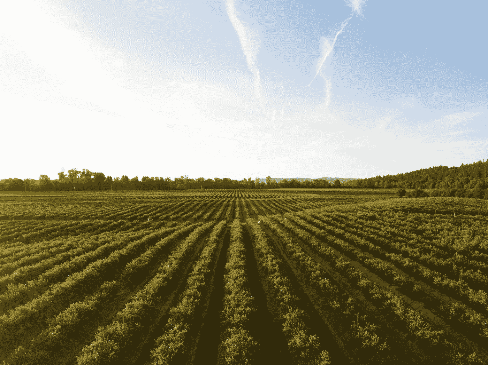

# 保持你的文档整洁

> 原文：<https://betterprogramming.pub/keep-your-dockerfile-clean-5e4df1c7d909>

## 当你的 docker 文件变得太大而无法维护时该怎么办


照片由[大卫·皮斯诺伊](https://unsplash.com/@davidpisnoy?utm_source=medium&utm_medium=referral)在 [Unsplash](https://unsplash.com?utm_source=medium&utm_medium=referral) 上拍摄

当 Dockerfile 文件增长超过合理限制时，会出现几个问题:

*   这很难理解和维护——我们需要阅读数百行来理解所有的依赖关系
*   在这么多行之间，一个明显的安全问题可能会被忽略
*   Git 会引发更多的冲突，因为每个人都在修改同一个文件
*   如果我们不清理每一个依赖，它会导致一个沉重的形象

最好的解决方案是将我们的 docker 文件分成几个 docker 文件，这样我们的 docker 文件就更小，更容易理解和维护。

这里有一些减小 docker 文件大小的技巧。

# 重构 1:从其官方映像中提取一个依赖项

避免创建从官方图像复制的工件。

## 例子

原件:

```
FROM golang:1.12**RUN apt-get update && \
    apt-get upgrade -y && \
    apt-get install -y git openssh-client zip
WORKDIR $GOPATH/src/github.com/hashicorp/terraform
RUN git clone** [**https://github.com/hashicorp/terraform.git**](https://github.com/hashicorp/terraform.git) **./ && \
    git checkout v0.12.9 && \
    ./scripts/build.sh**WORKDIR /my-config
COPY . /my-config/
CMD ["terraform init"]
```

重构:

```
**FROM hashicorp/terraform:0.12.9 AS terraform**FROM golang:1.12**COPY --from=terraform /go/bin/terraform /usr/bin/terraform**WORKDIR /my-config
COPY . /my-config/
CMD ["terraform init"]
```

# 重构 2:将依赖项提取到另一个 Dockefile 中

当没有您可以从中提取工件的官方映像时，您应该将它的构建分离到另一个 docker 文件中。

然后将工件复制到原始 Dockerfile 文件中。

## 例子

原件:

```
FROM golang:1.12**RUN apt-get update && \
    apt-get upgrade -y && \
    apt-get install -y git openssh-client
WORKDIR /go/src/gitlab.com/sahilm/
RUN git clone** [**https://github.com/sahilm/yamldiff.git**](https://github.com/sahilm/yamldiff.git) **RUN cd yamldiff && \
    go get -u github.com/golang/dep/cmd/dep && \
    dep ensure && \
    GOOS=linux go build -o /usr/local/yamldiff**WORKDIR /my-app
COPY . /my-app/
CMD ["./run.sh"]
```

重构:

`yamldiff`的文档:

```
**FROM golang:1.12****RUN apt-get update && \
    apt-get upgrade -y && \
    apt-get install -y git openssh-client
WORKDIR /go/src/gitlab.com/sahilm/
RUN git clone** [**https://github.com/sahilm/yamldiff.git**](https://github.com/sahilm/yamldiff.git) **RUN cd yamldiff && \
    go get -u github.com/golang/dep/cmd/dep && \
    dep ensure && \
    GOOS=linux go build -o /usr/local/yamldiff****CMD ["bash"]**
```

我的应用程序的 Dockerfile:

```
**FROM Marvalero/yamldiff:latest AS yamldiff**FROM golang:1.12**COPY --from=yamldiff /usr/bin/yamldiff /usr/bin/yamldiff**WORKDIR /my-app
COPY . /my-app/
CMD ["./run.sh"]
```

# 重构 3:将你的图片分成几个阶段

Docker 有一个多阶段特性，当你的 docker 文件有不同的部分时，这个特性就派上用场了。

最常见的用例是有一个构建步骤，然后复制主图像中的工件。拥有不同的阶段使你的 docker 文件更加清晰和安全。

## 例子

原件:

```
**FROM golang:1.12**RUN apt-get update && \
    apt-get upgrade -y && \
    apt-get install -y git openssh-client
WORKDIR /go/src/gitlab.com/sahilm/
RUN git clone [https://github.com/sahilm/yamldiff.git](https://github.com/sahilm/yamldiff.git)
RUN cd yamldiff && \
    go get -u github.com/golang/dep/cmd/dep && \
    dep ensure && \
    GOOS=linux go build -o /usr/local/yamldiffCMD ["bash"]
```

重构:

```
**FROM golang:1.12 as Builder**RUN apt-get update && \
    apt-get upgrade -y && \
    apt-get install -y git openssh-client
WORKDIR /go/src/gitlab.com/sahilm/
RUN git clone [https://github.com/sahilm/yamldiff.git](https://github.com/sahilm/yamldiff.git)
RUN cd yamldiff && \
    go get -u github.com/golang/dep/cmd/dep && \
    dep ensure && \
    GOOS=linux go build -o /usr/local/yamldiff**FROM ubuntu:18.04****COPY --from=Builder /usr/local/yamldiff /usr/local/yamldiff**CMD ["bash"]
```

# 重构 4:对多行参数排序

尽可能对多行参数进行排序。这有助于再次检查没有重复的包。



丹·迈耶斯在 [Unsplash](https://unsplash.com?utm_source=medium&utm_medium=referral) 上拍摄的照片

## 例子

原件:

```
FROM ubuntu:18.04**RUN apt-get -yqq install \
    ca-certificates \
    bash \
    jq \
    wget \
    curl \
    openssh-client \
    build-essential \
    libpng-dev \
    python \
    zip**CDM ["bash"]
```

重构:

```
FROM ubuntu:18.04**RUN apt-get -yqq install \
    bash \
    build-essential \
    ca-certificates \
    curl \
    jq \
    libpng-dev \
    openssh-client \
    python \
    wget \
    zip**CDM ["bash"]
```

# 重构 5:标签

使用 Docker 图像时，保持标签整洁也很重要。我总是发现有三种类型的标签非常有用:

*   **分支名称**:标识特定分支的我的图像的最新版本

**注:**为什么不用`latest`？当使用`latest`时，我从来不知道它是指最新的稳定版本还是整个库中的最新版本。使用分公司名称(如`master`、`feature/new-class`等)。)指向分支最新版本的方式更加直观。

*   **版本**:需要区分修复和重大变更。我推荐使用语义版本化(`major.minor.patch`)。
*   提交:我总是想知道一个标签指向哪个提交。现在，您可以通过在您的存储库上创建版本标签来做到这一点。但是当这不可能的时候，就用它的提交 SHA 来标记你的图像。

# 享受你漂亮的文件吧

感谢阅读。我希望你能更容易地维护 Dockerfiles。

如果你想了解更多关于 Docker 和容器的知识，你可以看看我之前的两篇文章:

*   [为什么需要容器](https://medium.com/hacking-talent/containers-part1-why-you-need-containers-6fc895477068)
*   码头工人:你需要知道的一切