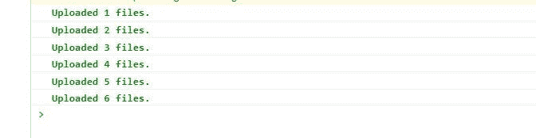

# Good quality, quality assurance

> 原文：<https://betterprogramming.pub/keep-your-users-constantly-occupied-ff8ba0b0e673>

## 现在，当它完成时，进入目录:

## 我们要做的第一件事是打开`App.js`，用我们自己的实现替换默认代码:


`*src/App.js*`

这里我们定义了一个`form`元素，并传入了一个`onSubmit`处理程序，这样一旦用户点击提交，我们就可以访问用户选择的所有文件。

在表单内部，我们定义了文件输入组件，它将允许用户选择他们的任何文件。输入接受一个`onChange`处理程序，所以我们也把它传入。onChange 处理程序将能够通过访问第一个参数中的`e.target.files`来接收文件。

我在`App.css`里面应用了一些基本的样式。您可以选择使用它们或跳过这一步:

`*App.css*`

因此，我们已经建立了一个基本组件，并在适当的位置设置了处理程序。我们现在要创建一个自定义的 react 挂钩，这样我们就可以将所有脏状态逻辑放在里面——远离 UI 组件。

# 我要把这个叫做`useFileHandlers.js`:

`*src/useFileHandlers.js*`

整篇文章中最重要的部分可能是上面显示的`initialState`。这将允许用户界面进入文件上传过程的每一个瞬间。

`files`是用户最初通过从文件输入中选择文件来加载一个*数组*的地方。

`pending`将用于让 UI 知道*当前正在处理什么*文件，以及还有多少*文件剩余。*

```
npx create-react-app file-upload-with-ux
```

当代码检测到准备就绪时，`next`将被分配给*待定*数组中的下一项。

```
cd file-upload-with-ux
```

`uploading`将用于代码，以了解文件仍在上传。

> `uploaded`将是文件上传完成后我们插入的对象。

最后，`status`是作为额外的便利提供的，主要供*用户* `interface`利用其优势。

我们将使用 react 的`useReducer` hook api，因为它非常适合我们的使用。

但是首先，让我们在`useFileHandlers`钩子上定义一些常量，这样我们可以确保以后在应用状态更新时不会输入错误:

> `*src/useFileHandlers.js*`

这些将进入作为第一个参数传递给`useReducer`的*缩减器*。

现在定义减速器:

> `*src/useFileHandlers.js*`

我们也许不应该忘记从 react now 进口`useReducer`，嗯？

`*src/useFileHandlers.js*`

现在将状态/调度 API 定义到钩子中:

`*src/useFileHandlers.js*`

现在我们将回到我们之前设置的`onChange`实现，并进一步增强它。

在此之前，让我们在减速器中添加一个新的开关盒:

`*src/useFileHandlers.js*`

这将允许`onChange`处理程序一调用就将文件传递到状态:

`*src/useFileHandlers.js*`

> 这里需要注意的是，当我们从事件对象中检索时，`e.target.files`不是一个数组，而是一个[文件列表](https://developer.mozilla.org/en-US/docs/Web/API/FileList)。

```
const LOADED = 'LOADED'
const INIT = 'INIT'
const PENDING = 'PENDING'
const FILES_UPLOADED = 'FILES_UPLOADED'
const UPLOAD_ERROR = 'UPLOAD_ERROR'
```

我们将它转换为数组的原因是为了让 UI 组件可以映射到数组上，并显示有用的信息，如文件大小和文件类型。否则，组件会使试图映射到`*FileLists*`的应用崩溃。

到目前为止，这里是我们的定制钩子的完整实现:

> `*src/useFileHandlers.js*`

```
const reducer = (state, action) => {
  switch (action.type) {
    default:
      return state
  }
}
```

现在我们将关注另一个处理程序— `onSubmit`。这在用户提交表单时调用(很明显)。在`onSubmit`处理程序中，我们用一个`[useCallback](https://reactjs.org/docs/hooks-reference.html#usecallback)`包装它，这样它将总是获得最新的状态值。

> `*src/useFileHandlers.js*`

```
import { useReducer } from 'react'
```

`*src/useFileHandlers.js*`

> 这个 onSubmit 处理程序在 `onChange`之后调用*，所以它可以从刚刚由`onChange`设置的`state.files`中拉入文件，以实例化上传过程。*

```
const useFileHandlers = () => {
  const [state, dispatch] = useReducer(reducer, initialState) return {}
}export default useFileHandlers
```

为了实例化上传过程，我们需要另一个开关案例:

`*src/useFileHandlers.js*`

> 好吧，现在事情是这样的:

```
const reducer = (state, action) => {
  switch (action.type) {
    case 'load':
      return { ...state, files: action.files, status: LOADED }
    default:
      return state
  }
}
```

它将`state.uploading`变为`true`。当您将`state.uploading`改为`true`时，您可以开始破坏 UI 组件，并向用户显示您想要的任何内容，只要他们明白您试图向他们传达文件正在上传的信息。

> 它用用户选择的所有文件启动`state.pending`。您也可以用它来破坏 UI 组件。使用这部分状态的方法非常多。但是现在，我将跳过这一部分，因为我想先和你一起完成整个教程。

```
const onChange = (e) => {
  if (e.target.files.length) {
    const arrFiles = Array.from(e.target.files)
    const files = arrFiles.map((file, index) => {
      const src = window.URL.createObjectURL(file)
      return { file, id: index, src }
    })
    dispatch({ type: 'load', files })
  }
}
```

它将状态的便利部分`status`设置为`“INIT”`。您也可以在钩子或 UI 中的某个地方使用它来触发一些`onStart` 逻辑，或者您想要的任何东西——因为它不会返回到这个值，直到一个新的上传过程开始。

现在我们将返回状态以及`onSubmit`和`onChange`处理程序，以便 UI 可以愉快地访问它们:

`*src/useFileHandlers.js*`

> `*src/useFileHandlers.js*`

接下来我们要解决的是`useEffect`部分。我们需要`useEffect`来促进“运行到完成”的功能。

> 这些 useEffects 在本教程中是一个非常重要的实现，因为它们在 UI 和定制钩子之间创建了一个完美的、一致的同步流— *无处不在*,稍后您将会看到。

```
import { useCallback, useReducer } from 'react'
```

> `*src/useFileHandlers.js*`

```
const onSubmit = useCallback(
  (e) => {
    e.preventDefault()
    if (state.files.length) {
      dispatch({ type: 'submit' })
    } else {
      window.alert("You don't have any files loaded.")
    }
  },
  [state.files.length],
)
```

我们将定义我们的第一个`useEffect`，它将负责在检测到准备好上传下一个文件时(只要`state.pending`中仍有项目)促进该文件的上传:

`*src/useFileHandlers.js*`

> 它抓取`state.pending`数组中的下一个可用文件，并使用`dispatch`创建一个信号，将该文件作为下一个`state.next`对象发送:

```
const reducer = (state, action) => {
  switch (action.type) {
    case 'load':
      return { ...state, files: action.files, status: LOADED }
    case 'submit':
      return { ...state, uploading: true, pending: state.files, status: INIT }
    default:
      return state
  }
}
```

`*src/useFileHandlers.js*`

1.  我们在这里又加了一个`status: PENDING`作为方便。然而，你选择处理上传过程的这一部分完全取决于你！
2.  下一个代码片段将展示一个实用函数，我提供这个函数只是为了帮助你登录到控制台，只是为了这个教程。
3.  `*src/useFileHandlers.js*`

我们接下来要应用的第二个`useEffect`将负责*上传*刚刚设置好状态的`next`文件:

> `*src/useFileHandlers.js*`

```
return {
  ...state,
  onSubmit,
  onChange,
}
```

> 在`.then()`处理程序中，我创建了一个新变量`prev`，并赋予它完成上传的`next`对象。这只是为了可读性，因为我们不想在开关的情况下混淆，我们将看到一点。

你可能已经注意到有一个`useRef`偷偷溜进去了。是的，我承认。我做到了。但我这样做的原因是因为我们将使用它并对它进行修改，用于我提供的`logUploadedFile`实用函数。

`*src/useFileHandlers.js*`

> 哦，如果您需要一些模拟函数来模拟“上传”承诺处理程序，如代码片段所示，您可以使用:

```
import { useCallback, useEffect, useReducer } from 'react'
```

现在，通过应用`file-uploaded`和`set-upload-error`开关盒来更新您的减速器:

> `*src/useFileHandlers.js*`

```
*// Sets the next file when it detects that state.next can be set again*
useEffect(() => {
  if (state.pending.length && state.next == null) {
    const next = state.pending[0]
    dispatch({ type: 'next', next })
  }
}, [state.next, state.pending])
```

对于*文件上传的*案例，我们将`next`重置回`null`，以便第一个`useEffect`可以再次响应。当它这样做时，它将拉入`state.pending`队列中的下一个文件，并将其分配给下一个`state.next`值。您已经可以开始看到这是如何成为一个自运行过程的了——一个从*运行到完成*的实现！

> 总之，我们应用刚刚上传到`state.uploaded`对象的文件，这样用户界面也可以利用这一点。这在本教程中也是一个非常有用的功能，因为如果你正在渲染一堆缩略图，你可以在上传后对每一行进行着色。:)本文末尾截图。

第三个`useEffect`将负责通过向减速器发送`files-uploaded`信号来关闭上传过程；

`*src/useFileHandlers.js*`

> 将它添加到缩减器看起来像这样:

```
const logUploadedFile = (num, color = 'green') => {
  const msg = `%cUploaded ${num} files.`
  const style = `color:${color};font-weight:bold;`
  console.log(msg, style)
}
```

`*src/useFileHandlers.js*`

> 我们已经完成了定制挂钩！万岁！

下面是自定义挂钩的最终代码:

`*src/useFileHandlers.js*`

> 但是等等，还没有结束。我们仍然需要将这种逻辑应用到用户界面中。啊，呸！

```
import { useCallback, useEffect, useReducer, useRef } from 'react'
```

我们将导入`useFileHandlers`钩子并在组件中使用它。我们还将在每个文件上创建 UI 映射，并将它们呈现为缩略图:

```
const api = {
  uploadFile({ timeout = 550 ) {
    return new Promise((resolve) => {
      setTimeout(() => {
        resolve()
      }, timeout)
    })
  },
}
```

`*src/App.js*`

> 这个基本组件只是在加载时呈现一堆缩略图。我不太喜欢这种风格，因为我会让你尽情享受。

但是如果你想使用这里的基本风格，它们是:

`*src/App.css*`

当所有文件上传完毕后会发生什么？嗯，还没什么。但是我们至少可以向用户展示一些东西，让他们知道已经完成了:

> `*src/App.js*`

```
*// Ends the upload process*
useEffect(() => {
  if (!state.pending.length && state.uploading) {
    dispatch({ type: 'files-uploaded' })
  }
}, [state.pending.length, state.uploading])
```

`*src/App.css*`

> 这一次，这里使用的是`status`。看，这很有用，不是吗？当与`state.pending`和其他值结合使用时，你可以用其他的`status`值制作一些看起来非常复杂的 UI。如果你在本教程中做了一些惊人的事情，请给我发一封电子邮件，附上几张截图。

最终输出:

`*src/App.js*`

> `*src/App.css*`

(包括对移动设备的媒体查询)

截屏

> 我使用本教程中的代码提供了一些基本 UX 实现的截图:

**onChange**

logUploadedFile()

> 状态.待定

结论

> 这篇文章到此结束。我希望你喜欢它。感谢您的阅读，如果您有任何问题，请告诉我！

> `*src/App.css*`

This time, `status` is being used here. See, it’s pretty useful, isn’t it? You can make some pretty amazing complex looking UI with the other `status` values as well when combined with `state.pending` and others. Send me an email with a couple of screenshots if you did something amazin with this tutorial!

Final output:

> `*src/App.js*`

> `*src/App.css*`

(Media queries for mobile devices included)

# Screenshots

I provided some screenshots of a basic UX implementation using the code in this tutorial:

## **onChange**


## logUploadedFile()



## state.pending


# Conclusion

That concludes the end of this post. I hope you liked it. Thanks for reading and let me know if you had any questions implementing this on your own!