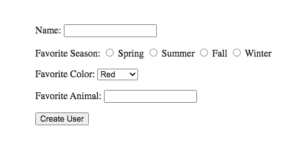
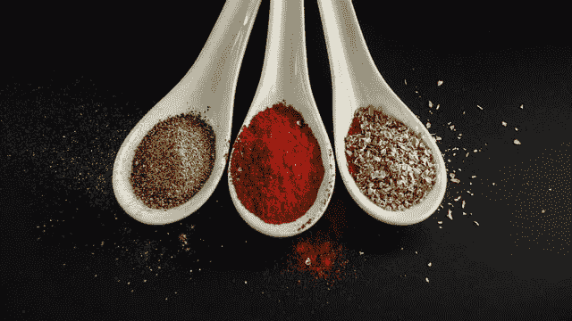
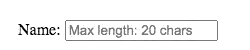
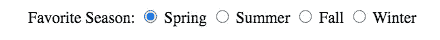
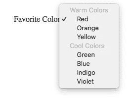
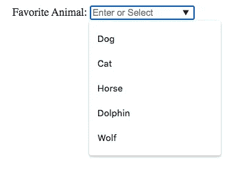
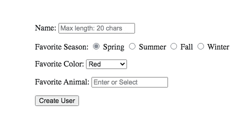

# 让你的 HTML 表单保持最佳状态

> 原文：<https://betterprogramming.pub/keeping-your-form-in-top-form-26e42fd973b2>

## 丰富你的表格


照片由[马腾·范·登·霍维尔](https://unsplash.com/@mvdheuvel?utm_source=unsplash&utm_medium=referral&utm_content=creditCopyText)在 [Unsplash](https://unsplash.com/s/photos/files?utm_source=unsplash&utm_medium=referral&utm_content=creditCopyText) 上拍摄

想象一下今天不用登录任何网站就能使用互联网——这意味着没有社交媒体、没有电子邮件、没有网上银行。现在，用户在互联网上做的几乎所有事情都需要创建一个帐户并与一个表单进行交互，这使它们成为现代互联网最重要的元素之一。如果你的看起来不那么陈旧不是很好吗？

如果您熟悉表单，请随意跳到页面底部，看看如何为表单增添趣味。

# 基本形式

```
<form action = "/signup" method = "post">
  <p>Name: <input type = "text" name = "name"></p>
  <p>Favorite Season:
  <input type = "radio" name = "season" value = "spring">
      <label for = "spring">Spring</label>
      <input type = "radio" name = "season" value = "summer">
      <label for = "summer">Summer</label>
      <input type = "radio" name = "season" value = "fall">
      <label for = "fall">Fall</label>
      <input type = "radio" name = "season" value = "winter">
      <label for = "winter">Winter</label>
  </p>
  <p>Favorite Color:
      <select name = "color">
        <option value = "red">Red</option>
        <option value = "orange">Orange</option>
        <option value = "yellow">Yellow</option>
        <option value = "green">Green</option>
        <option value = "blue">Blue</option>
        <option value = "indigo">Indigo</option>
        <option value = "violet">Violet</option>
      </select>
  </p>
  <p>Favorite Animal:
      <input type = "text" name = "animal">
  </p>
  <p><input type = "submit" value = "Create User"></p>
</form>
```



## 简要回顾这些形式元素

```
<form action = "/signup" method = "post">
</form>
```

`<form>`标签创建表单，并且必须在表单的其余内容之后有一个结束标签。`action`属性指向您希望将表单信息发送到哪里进行处理，而`method`描述您希望对表单做什么。`post`是最常见的表单，可让您将信息发送到数据库或电子邮件中。

```
<p>Name: <input type = "text" name = "name"></p>
```

在这里，以及在我们使用`<p>`标签的所有情况下，这主要是为了格式化和可读性。一些开发人员会选择将他们的元素嵌套在另一个元素中，例如`<li>` 。

`type` 指定您想要使用哪种输入，例如`text`、`password`、`email`。[更多的](https://developer.mozilla.org/en-US/docs/Web/HTML/Element/input)可供使用，各有特色。

提交表单时，`name` 将与输入值配对传递。

```
<input type = "radio" name = "season" value = "spring">
```

`type = “radio”` 允许用户一次仅选择一个选项。`value`指定要传入的值。如果用户选择该选项，将发送参数`season: “spring”` 。

```
<select name = "color">
        <option value = "red">Red</option>
        <option value = "orange">Orange</option>
</select>
```

`<select>` 标签在此表单中是唯一的。它是一个嵌套的 HTML 元素，包含两个或更多的`<option>` 标签和需要一个结束标签。它只用于下拉菜单。如果用户选择了`orange`，参数`color: “orange”`将被发送。

`color` 键来自`<select>`中的`name` 属性，`orange`值来自选中的`<option>`中的`value`属性。

```
<input type = "submit" value = "Create User">
```

`type = "submit"`指定这应该是一个提交按钮，而`value = "Create User"`将默认的“提交”更改为“创建用户”(或您在中输入的任何内容)。

# 添加一些味道

让我们一步一步地完成这个表格，添加更多的个性



照片由[维多利亚·扎哈尔丘克](https://unsplash.com/@zakharchukvictoria?utm_source=unsplash&utm_medium=referral&utm_content=creditCopyText)在 [Unsplash](https://unsplash.com/s/photos/spice?utm_source=unsplash&utm_medium=referral&utm_content=creditCopyText) 上拍摄

## 占位符

`placeholder`属性对于在输入元素本身中向用户提供指令或示例文本非常有用。该文本将被替换。您只需要在`<input>`标签中添加一个属性`placeholder="Max length: 20 chars"`。

## Maxlength

现在，我们希望确保最大长度确实是 20 个字符。我们可以通过在`<input>`中添加`maxlength = "20"`作为属性来做到这一点。如果您稍后要显示或操作数据，这种限制用户输入的能力可能非常重要。

```
<p>Name: <input type = "text" name = "name" maxlength = "20" placeholder = "Max length: 20 chars"></p>
```



## 检查

使用单选按钮时，最好先选中一个。这向用户演示了功能，并确保输入始终具有选定的值。只需将`checked`添加到您希望默认选择的`<input>`中。

```
<p>Favorite Season:
  <input type = "radio" name = "season" value = "spring" checked>
      <label for = "spring">Spring</label>
      <input type = "radio" name = "season" value = "summer">
      <label for = "summer">Summer</label>
      <input type = "radio" name = "season" value = "fall">
      <label for = "fall">Fall</label>
      <input type = "radio" name = "season" value = "winter">
      <label for = "winter">Winter</label>
  </p>
```



## Optgroup

有时下拉菜单可以有许多不同的选项，按类别分组可以提高可读性。添加`<optgroup label="Warm Colors"></optgroup>`将让你的用户更容易找到他们的选项。

```
<p>Favorite Color:
      <select name = "color">
        <optgroup label="Warm Colors">
          <option value = "red">Red</option>
          <option value = "orange">Orange</option>
          <option value = "yellow">Yellow</option>
        </optgroup>
        <optgroup label="Cool Colors">
          <option value = "green">Green</option>
          <option value = "blue">Blue</option>
          <option value = "indigo">Indigo</option>
          <option value = "violet">Violet</option>
        </optgroup>
      </select>
    </p>
```



## 数据列表

当场想出答案总是很难的。有时候你甚至会忘记自己的名字！当要求用户回答开放式问题时，提供一些建议选项会非常有帮助。这就是`<datalist>`大放异彩的地方。

要实现它，您需要给`<input>`标签添加一个`list = "animals"`属性，并添加用多个`<option>`元素创建和填充`<datalist>`的功能。

**注意:**`<input list>`和`<datalist id>`属性必须匹配。

```
<p>Favorite Animal:
    <input type = "text" name = "animal" list = "animals" placeholder = "Enter or Select">
      <datalist id = "animals">
        <option value="Dog">Dog</option>
        <option value="Cat">Cat</option>
        <option value="Horse">Horse</option>
        <option value="Dolphin">Dolphin</option>
        <option value="Wolf">Wolf</option>
      </datalist>
</p>
```



# 包装它


戴维·埃弗雷特·斯特里克勒在 [Unsplash](https://unsplash.com/s/photos/present?utm_source=unsplash&utm_medium=referral&utm_content=creditCopyText) 上拍摄的照片

让我们来看看我们完成的表格！

```
<form action = "/signup" method = "post">
    <p>Name: <input type = "text" name = "name" maxlength = "20" placeholder = "Max length: 20 chars"></p>
  <p>Favorite Season:
      <input type = "radio" name = "season" value = "spring" checked>
      <label for = "spring">Spring</label>
      <input type = "radio" name = "season" value = "summer">
      <label for = "summer">Summer</label>
      <input type = "radio" name = "season" value = "fall">
      <label for = "fall">Fall</label>
      <input type = "radio" name = "season" value = "winter">
      <label for = "winter">Winter</label>
  </p>
    <p>Favorite Color:
      <select name = "color">
        <optgroup label="Warm Colors">
          <option value = "red">Red</option>
          <option value = "orange">Orange</option>
          <option value = "yellow">Yellow</option>
        </optgroup>
        <optgroup label="Cool Colors">
          <option value = "green">Green</option>
          <option value = "blue">Blue</option>
          <option value = "indigo">Indigo</option>
          <option value = "violet">Violet</option>
        </optgroup>
      </select>
    </p>
    <p>Favorite Animal:
    <input type = "text" name = "animal" list = "animals" placeholder = "Enter or Select">
      <datalist id = "animals">
        <option value="Dog">Dog</option>
        <option value="Cat">Cat</option>
        <option value="Horse">Horse</option>
        <option value="Dolphin">Dolphin</option>
        <option value="Wolf">Wolf</option>
      </datalist>
    </p>
    <p><input type = "submit" value = "Create User"></p>
  </form>
```



表单的美学是相当相似的(我们有 CSS！)，但是内码功能性强很多。

希望这对你的编码之旅有所帮助。在构建 Sinatra MVC 应用程序时，我遇到了许多这样的表单元素。如果你想看这样的表单，你可以在 GitHub 上查看 [Cowboy Up](https://github.com/rebeccahickson/cowboy-up) 。