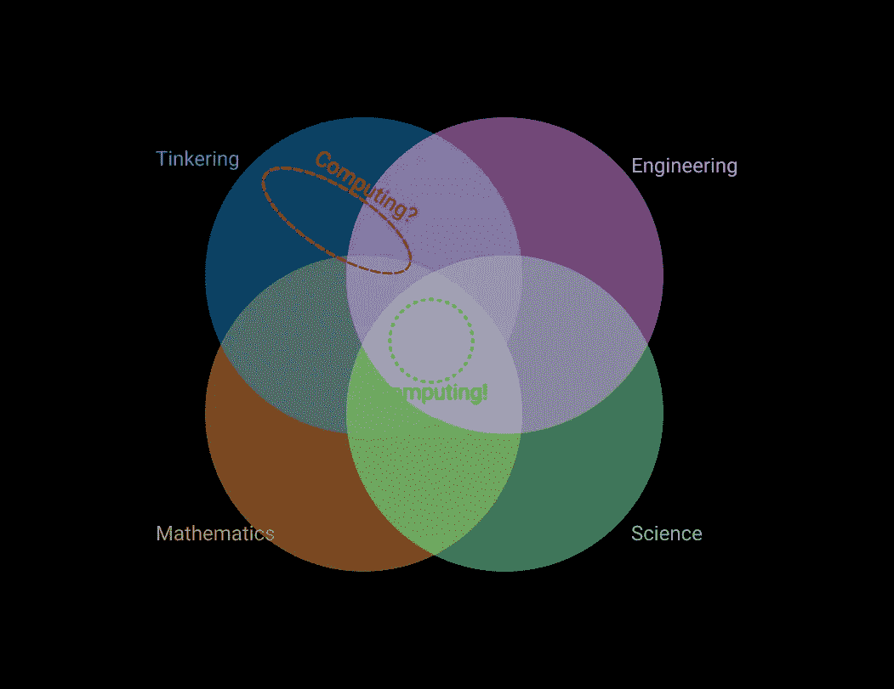
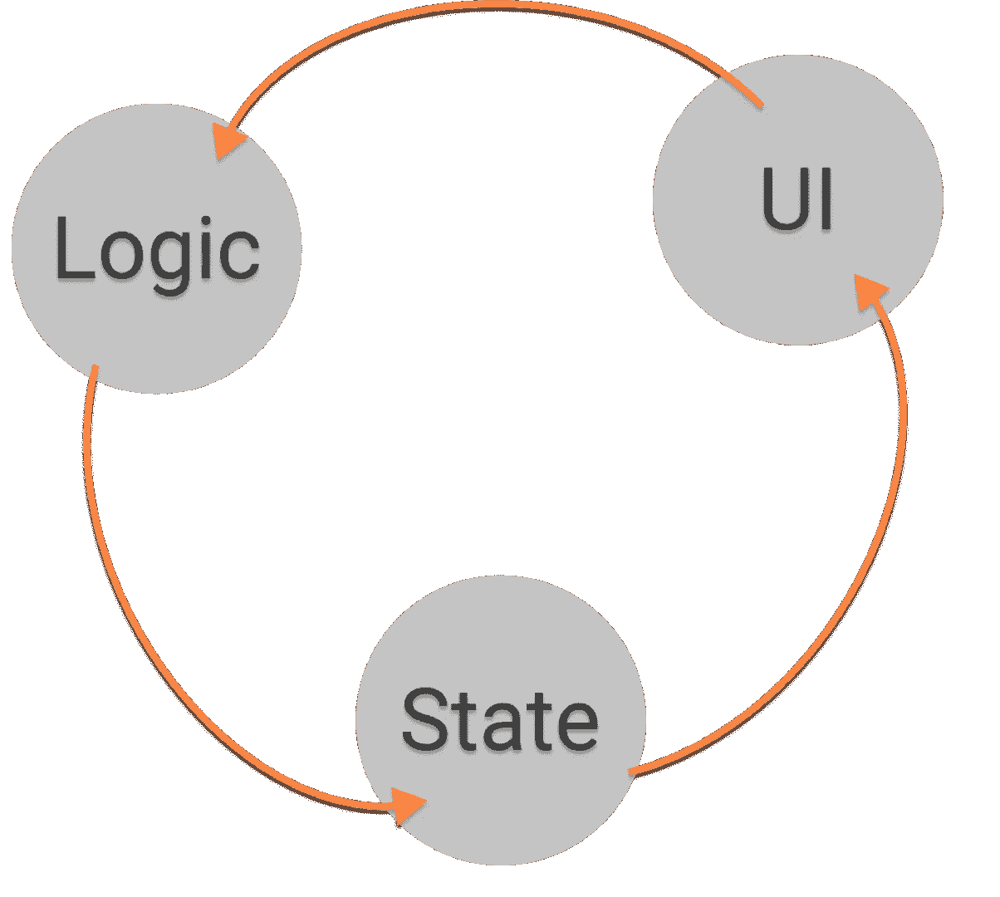
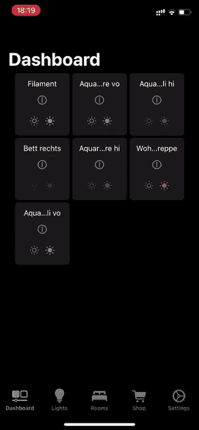
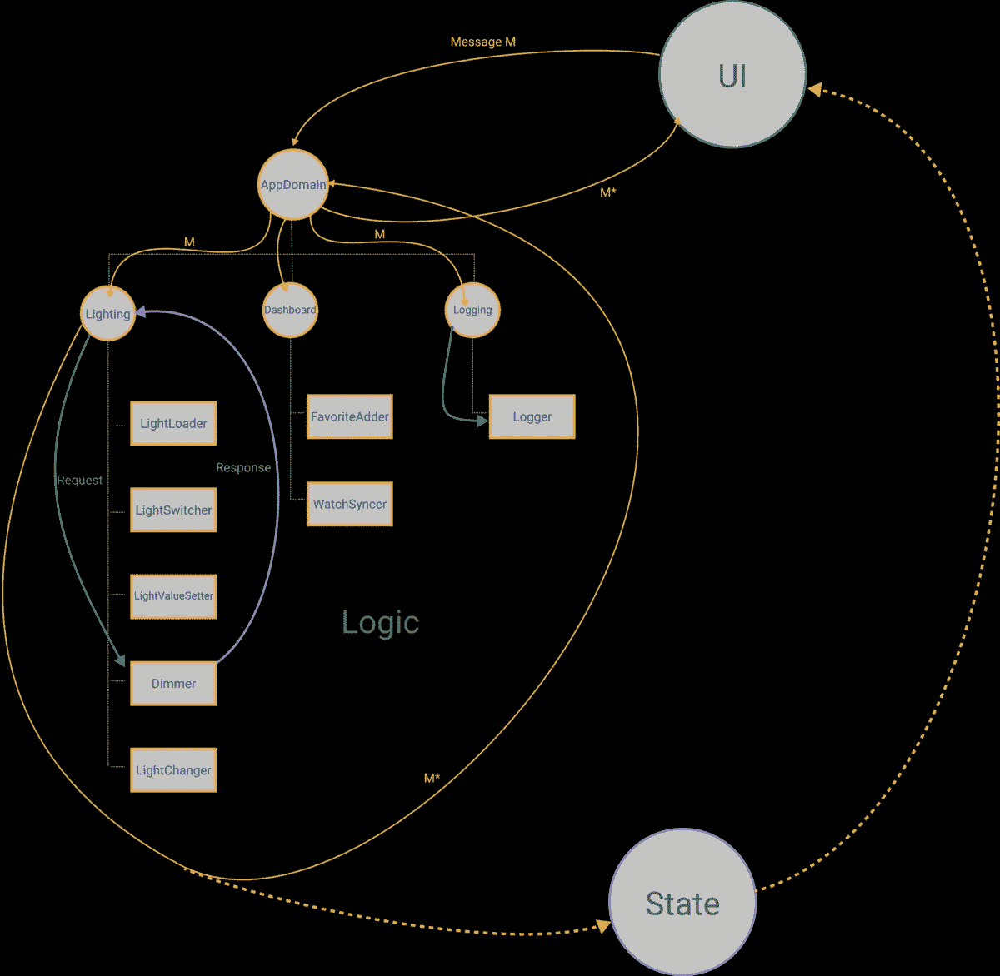

# Khipu:通过声明性领域范例在 Swift 中快速和可持续地创建软件

> 原文：<https://betterprogramming.pub/khipu-rapid-and-sustainable-software-creation-in-swift-using-engineering-and-science-principles-312a933cce57>

## 运用工程和科学原理

肖恩·朗斯在 [Unsplash](https://unsplash.com?utm_source=medium&utm_medium=referral) 上拍摄的照片

现实世界的物体受制于“生产问题”:虽然设计这些物体可能是一项有趣且具有挑战性的任务，但真正的挑战在于扩大生产规模以创建成千上万的副本，同时随着时间的推移保持一致的质量。这种生产模式的无处不在已经产生了一种假设，即它通常是正确的。
但软件不是这样:部署或复制代码或字节几乎没有挑战和成本。难点只在*设计*、*探索、*和*发现*。我想展示我们如何通过使用科学工具和思维方式来更快地编写更好的软件。

但是为什么这是必要的呢？我赞同 Alan Kays 的观察，他在他的演讲“[生物不能在自己的废物中生存](https://www.youtube.com/watch?v=kgmAwnNxdgw&list=PLY5suVncE-vfIoYDOLWggSOk0VtVcF7Tl&index=1)”中提出，最熟练的开发发生在修补、工程、数学和科学重叠的最佳点。但事实是，到目前为止，大多数开发都是在大量修补的基础上进行的，而很少用到工程学，甚至更少用到数学。我也同意 Kay 的观点，许多软件团队甚至完全忽略了工程和科学。

正如我们现在所知，我们的工作是探索和学习，让我们看看科学(包括数学)和工程为我们提供的一些工具，因为这些学科都是围绕探索和发现展开的:

*   **迭代和反馈**:以小步骤工作来收集反馈，不管我们是否正在取得进展。这是迄今为止最有效的进步方式。设置和评估可测量的目标，为下一次迭代收集反馈和数据。这是学习的基础。
*   **增量工作:**不要一步一步地创建复杂的系统，而是要一步一步来。假设，你错了，限制错误决策的半径。设计和编码你能想到的最好的下一步，但是要以这样的方式，即使它是错的，你也能纠正它。
*   **实验性工作**:按照科学的方法将测试设计成微型实验——一次观察对一个变量变化的反应。检验你的预测。通过正确键入来限制变量范围。
*   **经验主义**:在工程上，我们的模型不需要完美——只要足够好就行。随着时间的推移，通过了解我们应用程序的更多领域，我们应该能够用新收集的知识轻松地改进我们的模型。

对于可持续的软件工程(能够在项目的整个生命周期中保持相同的质量和开发速度)，我们的设计目标必须是最大限度的简单，因为正是这种简单允许我们使用科学的工具集，对我们的代码进行实验，并做出有意义的预测。

简单*或复杂*的事物是对一种结构的描述，而简单*和困难*和困难*与每个人的独特视角相关，因为它是经验、知识和好奇心的函数。为了进一步澄清*简单*和*容易*之间的区别，我强烈推荐 Rich Hickey 的《简单变得容易》，这是每个开发人员必看的一本书。*

我们希望实现的简单性由以下因素保证:

*   **一切都是模块**:在这个上下文中，模块是一个最多有一个`Input`和一个`Output`的数据结构，并使用一个数据结构与系统的其他部分进行通信——即*领域特定语言，*简称:`DSL`。由于一切都是一个模块，您可以将这个架构描述为一个*可组合的命令解释器*，由松散耦合的特性组成，并且具有绝对的信息隐藏，因为只有`Input`函数和消息类型贡献于任何表面区域。

从机器上看，每个程序都有内在的设计

*   **单向流动**:所有信息总是单向流动。这与每个应用程序都具有的“内在设计”相一致——至少从机器的角度来看，这意味着 UI 事件触发应用程序的逻辑来处理新的状态，然后在 UI 中表现出来。代码越偏离这种内在设计，它就变得越复杂——这是不必要的。如今，作为面向对象的大量类中杂乱无章的命令式结构化代码回避了这样一个事实，即增加复杂性是对已经存在的复杂性的适当反应。通过在系统的中心使用类，这种影响被极大地放大了。它们太强大了，因为它们提供了几种交互方式并且是可变的——然而它们作为模块构建类型实际上是不好的，因为它们不允许真正的黑盒(事实证明，子类化通常需要类签名之外的额外信息),并且没有数据流方向的概念。这些缺点导致了 Clutter-OO 所依赖的大量模式。
*   **不可变/静态**:所有的模型和状态都是不可变的，每次发生变化都会递归地重新生成，而应用程序的框架是静态的，在应用程序的生命周期内不会改变。这是两个有意的设计选择，因为两者都降低了复杂性:一个根本不能改变的类型也不能无意中改变，并且在运行时应用程序的结构中没有任何东西会突然出现或消失——一整类的错误和崩溃根本不可能。
*   以一种 [**声明式**方式](https://en.wikipedia.org/wiki/Declarative_programming)(告诉计算机“做什么”，而不是“怎么做”)使用 Swift 的类型系统，我们几乎 100%符合机器的视角。只有少数语句不在这一序列中，但是非常简单，我想把它们描述为“公理”。这仅在声明性代码中是可能的，因为在命令性代码中，编码器和编译器之间共享的知识被减少到语句级别。

我把我这里要用的架构叫做“ ***Khipu*** ”(之前的项目名称:“Core|UI”)。最初，我着手创建罗伯特·c·马丁的“干净架构”的实现。将它与使用 DSL 接口的模块和不可变数据类型等想法结合起来，它已经变得独一无二，但是关于 Clean Architecture 的所有事实对于这个设计仍然是正确的。

*   `UseCases`通过`Requests`和`Responses`进行通信
*   `UseCases`只做一件事(或者两件事，如果这两件事是相互补充的，比如打开或关闭某些东西)，提高系统的内聚性。
*   "`Gateways`"-与更广阔的世界通信的对象-作为依赖项被传入，并且通常包含相当[常规的代码](https://gitlab.com/vikingosegundo/brighter-hue/-/blob/master/BrighterHue/Gateways/HueClient.swift)。

因此，让我向大家展示一下，使用 Khipu 架构实现一个应用程序来控制 Phillips Hue 智能照明系统意味着什么。科学方法将由

*   遵循科学方法的测试粒度
*   执行路径和状态的可预测性
*   仅仅通过几个公理化的陈述就可以改变状态

如果您没有 hue 桥，但想运行代码，您会发现一个测试模拟。

Khipu 的顶层是`AppDomain`，它只是一个接受类型为`Message`的参数并将其转发给每个`feature`的函数。
A `feature`是一个以`output`函数为参数的函数，返回的函数是特征的`input`。通过保存对这个`input`的引用，我们可以在任何给定的时间将`messages`转发给它。这种技术被称为“部分应用”,我们将它与一种`Message`类型结合起来，这种类型允许我们创建有限数量的值来编码行为——一种理想的模块类型:

*   一个`input`，
*   一个`output`
*   一种模块接口类型，作为少量值(词汇表)的`DSL`

每一个都对系统的简单性做出了巨大的贡献。稍后将详细介绍局部应用。

让我们检查一下代码的结构，以及信息是如何在其中流动的。

我们的功能由不同的`UseCases`组成

**照明**

*   `LightLoader`:从桥上加载灯光信息
*   `LightSwitcher`:开关灯
*   `LightValueSetter`:将光线设置为 HSB、色温或简单的亮度值。
*   `Dimmer` : in-或按一定百分比降低光线的亮度、饱和度、色调和色温值。
*   `LightChanger`:改变灯光的元信息，如名称。

**仪表盘**

*   `FavoriteAdder`:将灯光作为收藏添加到仪表板。或者移除它。
*   `WatchSyncer`:将任何选定的收藏夹与 apple watch 应用程序同步。

**测井**

*   `Logger`:会监听某些消息并记录下来。

*   用户交互生成`Message M`，并将其传递给`AppDomain`
*   `AppDomain`简单的转发给每一个`feature`
*   如果需要的话，`features`将把`M`翻译成一个或多个`UseCase` `Request`并相应地传递它们。这种到`requests`和从`responses`的转换确保了*关注点的最高分离。*
*   一个`UseCase`可能会对它的`Feature`做出一次或几次同步或异步的响应
*   `Feature`收到一个响应并创建一个新消息`M*`，该消息将被传递到应用程序域——循环再次开始。
*   在每一步中,`state`都被更新，这将触发 UI 重新构建

现在，我假设大多数读者希望这些特性被编码成类，因为对于大多数编码者来说，它们是模块构建的 goto 类型。但是班级提供了大量的互动。它们允许任何数量的方法，它们是可子类化的和可变的。虽然这些都是模块不需要的东西，但我需要它们能够做的一件事，类做得很差:几十年来，它们一直被宣传为黑盒的完美工具，尽管它们最多提供灰盒，这一点被一个事实所证明，即除了类的签名之外，通常还需要额外的子类化信息。班级辜负了他们的核心承诺。此外，它们实际上无法提供模块所期望的流通——实现这一点需要模式魔法。实际上，我同意伊利亚·苏兹达尔尼茨基的观点，并认为到目前为止，大多数模式只在处理面向对象(和类)的缺点时才是必要的。

> 没有客观公开的证据表明 OOP 比简单的过程化编程更好。
> 
> *痛苦的事实是 OOP 在它唯一想要解决的任务上失败了。理论上看起来不错——我们对动物、狗、人类等有清晰的等级划分。然而，一旦应用程序的复杂性开始增加，它就变得平淡无奇了。它不但没有降低复杂性，反而鼓励混杂的* *共享* [*可变状态*](https://suzdalnitski.com/terrible-coding-mistake-aa1fbebd83b4)**，并以其众多的* [*设计模式*](https://suzdalnitski.com/oop-design-patterns-bd2c4fb3014c) *引入额外的复杂性。OOP 使得常见的开发实践，如重构和测试，变得不必要的困难。**

*具有许多不同形式的交互和操作的类会导致比需要的更高的复杂性。这将不可避免地导致更快的代码恶化，并将任何团队的开发速度减慢到零。*

*因此，我不是在我的系统中心使用类，而是一种比 OOP 早几十年的技术，但在 OOP 中并不常用:*部分应用*。*

*部分应用的函数是这样的函数，当被执行时，返回另一个函数，然后该函数可以被写入引用并被随意地反复调用。*

*`createAdder`将状态保存在变量`value`中，并返回函数，该函数将添加值并返回该值。请注意，我们将以同样的方式处理依赖关系。*

*我们也可以使用局部应用返回一个函数元组，即创建一个`Stack<T>`:*

*在 Khipu 中，使用部分应用程序的一个`feature`可能看起来像*

*我们看到创建函数返回了一个`input`函数(第 24 行)，该函数检查`feature`是否是这个`message`的接收者，并将这些`messages`转发给`execute(command:)`，其中模式匹配用于将`requesst`发送给适当的`UseCases`。`UseCases`被赋予一个函数来处理它的响应，并在`process(response:)`函数中回调`output` (= `AppDomain`)。`Store`和`LightStack`作为依赖项传递。并完成`Gateways`在清洁架构中的角色。*

*一个`UseCase`被类型化符合一个[协议和相关类型，PAT](/swift-pat-or-generics-f2f01d788de9)*

*这里由`Dimmer`实现，允许`hue`、`saturation`、`brightness`、&、`colortemp`的增减。*

*`Dimmer` `Requests`和`Responses`可能长得像*

*读起来像带有时髦标点的英语*

*为了了解如何使用`Dimmer`，我们来看看我为这个`UseCase`编写的测试*

*我使用[快速](https://github.com/Quick/Quick)和[灵活](https://github.com/Quick/Nimble)进行测试。如果您从未使用过这些工具，它可能看起来很奇怪，尤其是当我编写非常紧凑的测试代码时。*

*   *规格(=规格)在级联闭包中定义，`contexts`*
*   *`it/expect`对评估测试，测试本质上是由在`it/expect`对之前定义的所有`beforeEach`闭包组合而成，按升序执行。*
*   *在执行每个闭包之后，所有先前的`afterEach`闭包都被调用，以降序排列。*

*这允许测试在级联中被定义，但是每个测试将被单独执行。*

*由于`UseCase`只允许通过传递`requests`进行交互，所以所有测试的结构都相同:*

*   *打个`request`*
*   *倾听`responses`*
*   *检查，如果`responses`是预期的*

*下面的文件包含 16 个测试，等于所有可能的`requests`、`success`和`failure`案例的组合——`Dimmer`通过它提供的唯一接口`request`方法进行了全面测试(这里还隐藏了一个`request`函数，以允许创建尽可能类似英语口语的代码)。*

*到目前为止，我们已经看到了作为部分应用功能的`features`的结构，以及它们如何与`UseCases`交互。为了允许不同的`features`交换信息，它们共享相同的`DSL`类型— `Message` —并组合成一个`AppDomain`，如:*

*再次使用部分应用。`createAppDomain`服用*

*   *一个`store`，它跟踪`state`，*
*   *`receivers`，它也能理解`messages`，并可用于将`AppDomain`与 UI 挂钩*
*   *加载一个工作色调堆栈或一个模拟*
*   *而`roothandler`作为回调使用。我们将会看到`AppDomain`通过它自己*

*`Store`和`LightStack`是`gateways`，可以包含常规代码，允许我们连接到预先存在的代码和库。*

*然后*

*   *创建三个特征:`Lighting`、`Dashboard`和`Logging`*
*   *并且返回一个`Input`函数，该函数将只迭代整个`receivers`和`features`，转发每个接收到的消息。*

*这就是`AppDomain`的全部代码:它接收`messages`并将它们转发给任何`receiver`(即 UI)和每个`feature`。*

*现在的`Message`:*

*以及一些可以用这个枚举来表达的例子*

*这些可以作为英文命令读给`feature`。试试看:*

> *“照明:加载灯光”
> “照明:打开灯光”
> “照明:关闭灯光”
> “照明:在灯光上应用值 HSB(0.5，0.5，0.5)”
> “照明:在灯光上增加 10 点亮度”
> ……你明白了吗*

*根据上下文*照明*要么被寻址，要么向更早的命令报告，如:*

> *灯光:“开灯成功”*

*现在我们已经看到了`AppDomain`及其`features`的结构，让我们把注意力转向不可变的模型和状态，以及我们如何存储它。*

*我确信你从未见过这样的模型结构，但是如果你仔细观察，你会发现它只是我们以前见过的一个想法的另一个化身:行为被编码在一个`Light.Change` DSL 中，非常类似于特征连接`Message`类型，而`Request`和`Response`类型在`UseCases`中可以看到*

*因为没有一个属性是 var 属性，所以这个`Light`模型是不可变的。通过递归应用 alter 函数来反映变化，每次返回一个新的`Light`值。`Light.Change`枚举允许 10 种不同的命令:*

*   *`.renaming(.it(to:"new Name"))`*
*   *`.turning(.it(.on))`*
*   *`.turning(.it(.off))`*
*   *`.setting(.brightness(to:newValue))`*
*   *`.setting(.saturation(to:newValue))`*
*   *`.setting(.hue(to:newValue))`*
*   *`.setting(.temperature(to:newValue))`*
*   *`.toggling(.display(to:.slider))`*
*   *`.toggling(.display(to:.scrubbing))`*
*   *`.adding(.mode(to:newMode))`*

*这些都是我们可以应用的更改，例如:*

*`Light`类型规格(又名测试):*

*由于`Light`是完全不可变的，`beforeEach`和`afterEach`是不需要的，所有的测试实际上是一次实例化的。这个大约 50 行代码的规范包含 30 个测试。*

*`state`的管理非常类似，`AppState.Change`值被递归应用，并且在每一步中生成一个新的`state`值。*

*`AppState`和`Light`之类的型号在结构上完全相同，所以我不会展示`[AppState’s](https://gitlab.com/vikingosegundo/brighter-hue/-/blob/master/BrighterHueTests/State%20Specs/AppStateSpec.swift)`和[的规格](https://gitlab.com/vikingosegundo/brighter-hue/-/blob/master/BrighterHueTests/State%20Specs/AppStateSpec.swift)。*

*由于`AppState`是不可变的，我们必须有一个地方来保存状态的当前版本——T10。*

*现在，`store`实际上是使用一个类的很好的候选对象(完成它！)，但我想再次重用部分应用程序方法，这次让创建函数返回一个函数元组，如`Stack<T>`示例所示。这个元组将为我的需求量身定制，而一个类提供了我不需要的复杂性。*

*`Store`是一个元组，其中*

*   *`store.state()`将返回当前状态，*
*   *`store.change(…)`将在当前版本上应用一个更改值，产生一个新版本*
*   *`store.reset()`删除所有数据并用默认数据重置状态。*
*   *`store.updated({…})`采用一个回调函数，将为每个新的状态版本调用，实现一个简单的通知模式*

*我们实现这些要求:*

*我想指出，第 12、13 和 14 行中的赋值是整个应用程序中唯一使用可变性的地方。由于这些变量是在本地私有函数作用域中定义的，所以它们无法从应用程序的其他部分访问，只能通过传入`AppState.Change`值来更改——相当可靠。*

*`Store`用法举例:*

*既然我们已经看到了如何设置结构，模型在这个结构中是如何处理的，以及如何保持状态，那么只剩下一个任务要做:连接 UI。*

*一个`store`被创建并传递到一个新的`viewstate`中，该新的`viewstate`连接到 swiftui 并将自己注册为`store`和 appDomain 的观察者，appDomain 将传递它以便可以在`UseCases`中使用它。*

*所有的视图都通过一个`roothandler`，一个`input`函数，实际上是`AppDomain`。对于任何用户交互，类似于*

*执行`rootHandler( .lighting(.turn(light,onOrOff)) )`或`rootHandler( .lighting(.increase(value,by:inc,on:light)) )`。关于完整的 SwiftUI 代码，请参考[库。](https://gitlab.com/vikingosegundo/brighter-hue/-/tree/master/BrighterUI)*

*对于 UIKit，我建议让`viewState`广播一个`Notification`，让一个基本视图控制器监听它并从中读取最新状态。*

*现在我们已经看到了如何连接 UI，让我们讨论一下为什么这个架构支持代码创建的科学方法*

*   ***作为实验的测试**:我在这里展示的测试遵循了科学的方法——在任何给定的时间改变一个变量，然后观察结果。测试相当容易，不可变的模型和状态很容易被完全测试。`usecases`和`features`通常会包含一些`default`case 或`error`case，这些 case 实际上在语义上无法执行，但在语法上是必需的。因此，实现 98%的代码覆盖率应该是容易实现的。*
*   *所有的状态改变动作都会产生一个代码执行路径，其中所有的路径都要经过**几个“公理”语句**。如果您查看模型或状态上的 alter 方法，您会注意到，左边的 case 声明准确地描述了右边实现的内容；
    `.renaming(.it(to:*newname* ))`产生`Light(id, *newname*, isOn, brightness, saturation, hue, ct, display, modes, selectedMode)`，旧值用于创建新的灯光，新名称覆盖任何先前的名称。
    `.by(.adding (.light(*light*)))`导致`AppState(sort(lights + [*light*]), rooms, favorites)`。它们如此简单，其正确性很容易证明，就像数学中的公理一样。
    这些公理化的陈述可以组合起来，就像我们在`newLight`函数中看到的那样。
    由于所有状态改变动作都将通过这些语句中的一个或几个来路由，因此测试也是如此。最后:在撰写本文时，175 个单元测试中只有不到 20 个是公理化的。*
*   ***增量工作**:这里显示的风格允许增量设计和发现。DSL 可以逐渐改变，复杂的行为是通过递归地应用公理化的改变而逐渐产生的。*
*   ***临时工作**:通过将代码组织在由 DSL 类型(通常是嵌套枚举)连接的模块中，可以推断和测试所有可能的输入类型值。预测可以作为单元测试来制定和测试。*
*   *通过应用和商店的单向流动允许**在任何时刻系统状态**的可预测性。*

*科学和工程中另一件重要的事情是记录你的工作。通过将行为编码为 DSL 值，我们可以将它们作为模块的文档，这里是`Lighting feature`。使用代码来记录代码有一个好处，如果文档过时了，编译器会检测到——代码不会编译。文档也可以被测试，它的内容可以作为其他测试的输入值。*

*这个*是面向对象的*吗？还是*功能性*？虽然它是作为一个真正的面向对象的干净架构的实现开始的，但是它分享了通常从 FP 中得知的思想，比如不可变状态，但是它也使用了面向对象的概念来隐藏状态和依赖注入。*

*事实上，我相信这是一个新的范例。*

*在这个上下文中，一个范例是一个用于创建不同架构的系统。一个范例是由它引入到代码中的约束来定义的，而代码又是作为编码者的指导线。*

*   *结构化编程引入了执行路径需要明确定义的概念(“goto 被认为是有害的”)*
*   *FP 和 OO 都试图解决同一个问题:可变的全局状态——FP 通过移除可变性，OO 通过隐藏可变状态*

*我在这里使用的约束条件是:*

*   *系统中心的模块构建类型是部分应用功能*
*   *行为在基于类型的 DSL(通常是嵌套枚举)中编码，通过模式匹配解码*
*   *可变性仅限于一个或很少几个地方，特别是在局部函数范围内*

*由于这个系统是由那些约束定义的，我认为这是一个范例，**声明域范例**。*

*Khipu 只是应用这一范例的一个架构。事实上，你可以通过跳过`feature`和`UseCase`层，直接写入商店来简化琐碎的应用程序。
我在文章“[声明式 Swift 中的外交](https://medium.com/codex/declarative-diplomacy-in-swift-c32a07101c9f)”和“[使用声明式域范例](/build-a-swift-snake-game-using-declarative-domain-paradigm-7eb34a139017)在 Swift 中构建一个贪吃蛇游戏”中展示了这一点。
Swift 语言的这个子集允许图灵完全编码，这一点通过[实现图灵机](https://medium.com/devgauge/declarative-immutable-and-brain-sized-swift-did-i-discover-a-new-paradigm-1514c1614ea8)得到了证明。*

*最后是本文中显示的[代码](https://gitlab.com/vikingosegundo/brighter-hue)。*

*仅仅通过使用两个想法——部分应用程序和行为编码的 DSL 类型——我们已经创建了一个基于模块的声明性架构，它具有非常小的复杂性。使用相同的 DSL 方法允许我们的模型和状态完全不可变，进一步降低了复杂性。由于系统的唯一接口是`AppDomain`函数，UI——或者任何其他客户端，比如测试——尽可能地松散耦合。
模块 DSL 可以被设计成类似于口语，这可以导致公理陈述，其中匹配大小写值的模式匹配右侧编码的变化。这些公理化的陈述可以递归地组合，允许新的行为出现。这类似于数学，更复杂的知识来自更简单的知识，最终来自公理。这种简单性使我们能够在工作中引入更多的科学严谨性。*

*但是一旦你尝试一下，你会注意到最重要的事情:编写这样的软件很快，这并不奇怪，因为简单导致效率。但那是一种我无法描述的体验——你必须自己去感受。*

*对于软件开发中的科学和工程的更一般的观点，我强烈推荐戴夫·法利的视频:“成为一名软件工程师需要什么”。
不包括代码。*