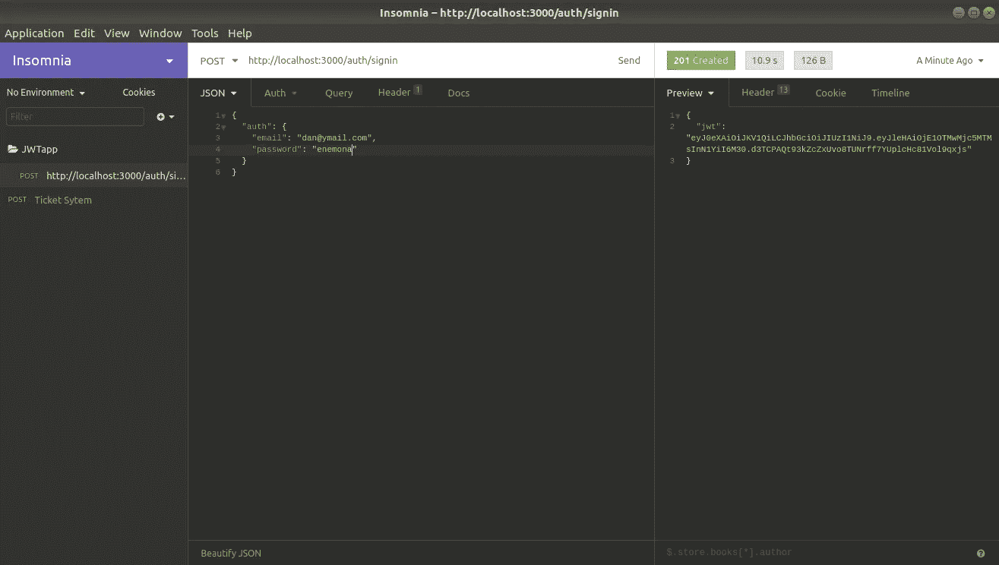
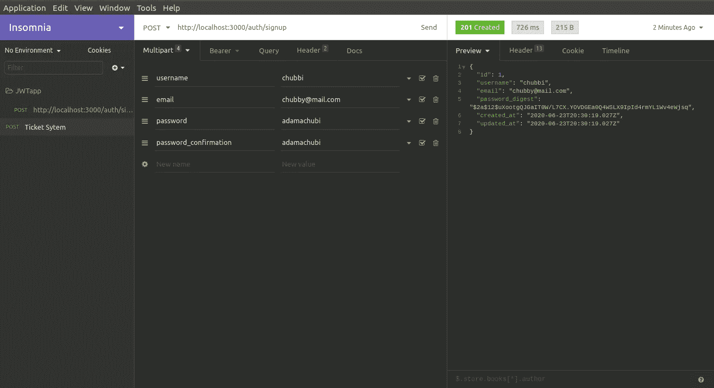

# Knock 作为 Rails API 的认证解决方案

> 原文：<https://betterprogramming.pub/knock-as-an-authentication-solution-for-rails-api-acfaef5b25>

## Rails 令牌认证实现指南


迈克·科诺诺夫在 [Unsplash](https://unsplash.com?utm_source=medium&utm_medium=referral) 上拍摄的照片

# **背景**

我将向您介绍如何在您的 Rails 应用程序中安装和运行 knock gem 的详细步骤。本文的想法源于这样一个事实，即我找不到关于如何实现 Rails API 令牌认证的定义良好的最新资源。对于本教程，我将使用最新版本(6.0)的 Ruby on Rails。

# **设置**

首先，让我们生成一个新的 Rails 应用程序:

```
$ rails new JWTapp --api -d=postgresql -T
$ cd JWTapp
$ rails db:create
$ rails db:migrate
```

## **CORS**

让我们取消对 Cors gem 的注释，以允许访问 API:

```
gem ‘rack-cors’
$ bundle install
```

在 cors.rb 中编写以下内容:

```
# config/initializers/cors.rb
Rails.application.config.middleware.insert_before 0, Rack::Cors do
 allow do
    origins ‘[http://localhost:3000'](http://localhost:3000') resource ‘*’,
    headers: :any,
    methods: [:get, :post, :put, :patch, :delete, :options, :head]
 end
end
```

## **Bcrypt &敲宝石**

Bcrypt 是一种用于密码哈希和 Knock 的哈希算法，主要用于 JWT 认证。

```
gem ‘bcrypt’
gem ‘knock’
```

我们跑吧:

```
$ bundle install
```

## **用户模型和控制器**

现在，我们将使用脚手架生成器创建一个用户。

```
$ rails generate scaffold User username:string email:string password_digest:string
```

在你的用户模型中包括这一点。

```
# app/models/user.rb class User < ApplicationRecord
   has_secure_password
   validates :username, presence: true
   VALID_EMAIL_REGEX = /\A[\w+\-.]+@[a-z\d\-]+(\.[a-z\d\-]+)*\.[a-z]+\z/i.freeze
   validates :email, presence: true,uniqueness: true, format: { with: VALID_EMAIL_REGEX }
end
```

脚手架生成的用户控制器给了我们一个名为 *password_digest* 的字段。但是 Bcrypt 除了哈希密码之外，还把 *password_digest* 变成了两个字段， *password* 和 *password_confirmation* 。所以我们需要将允许的参数从 *password_digest* 改为这两个字段。

```
# app/controllers/users_controller.rb def user_params
 params.permit(:username, :email, :password, :password_confirmation)
end
```

我们先去掉 create 方法中的' ***位置:@user'*** 。

```
# app/controllers/users_controller.rbdef create
   [@user](http://twitter.com/user) = User.new(user_params)if [@user](http://twitter.com/user).save
     render json: [@user](http://twitter.com/user), status: :created
   else
     render json: [@user](http://twitter.com/user).errors, status: :unprocessable_entity
   end
 end
```

通过运行迁移数据。

```
$ rails db:migrate
```

让我们使用 rails 控制台创建一个用户。

```
$ rails cUser.create(username: “Danny”, email: “[dan@ymail.com](mailto:dan@ymail.com)”, password: “enemona”, password_confirmation: “enemona”)
```

# **爆震配置**

现在，让我们配置敲门宝石:

```
$ rails g knock:install
```

这将在*config/initializer/knock . Rb*中创建一个包含默认配置的初始化文件。

您可能会收到这样的错误:*无法加载生成器“generators/knock/install _ generator”。*跳到下一步(默认敲门信号)。这是 Rails 6 自动加载器 Zeitwerk 造成的。我们可以通过切换自动装弹机来避免这个错误。点击阅读更多关于 Zeitwerk [的信息。](https://medium.com/cedarcode/understanding-zeitwerk-in-rails-6-f168a9f09a1f)

现在我们将退化敲门信号并再次生成它——一旦我们将下面的代码行包含到 *application.rb* 中。

```
$ rails d knock:install
```

让我们将它包含在 *application.rb* 文件中:

```
# config/application.rb 
config.load_defaults 6.0 and config.autoloader = :classic$ rails g knock:install
```

默认情况下，敲门信号设置为 24 小时后过期。如果我们取消下面这行的注释，我们就可以调整它，并按照我们想要的方式调整它。

```
# config/initializers/knock.rb 
config.token_lifetime = 1.day
```

生成一个供用户登录的控制器:

```
$ rails generate knock:token_controller user
```

这会生成一个名为`*user_token_controller*`的控制器。它从`*Knock::AuthTokenController*`继承而来，后者带有一个默认的创建动作，在登录时会创建一个 JWT。

**注意** : `*user_token_controller*`是签到的意思，与`*users_controller*`不同。

```
# app/controllers/user_token_controller.rb
class UserTokenController < Knock::AuthTokenController
end
```

生成器还在`routes.rb`文件中插入一条路线，作为登录的 API 端点。

```
# app/config/routes.rb
post ‘user_token’ => ‘user_token#create’
```

现在让我们在你的`*application_controller*` 文件中插入`*include Knock::Authenticable*`模块。

```
# app/controllers/application_controller.rb 
class ApplicationController < ActionController::API
 include Knock::Authenticable
end
```

你就快到了，朋友。在过滤要保护的控制器之前添加一个`*authenticate_user*`。在这里，我打算首先将它添加到`*users_controller*` 中，并免除`*create*`方法，以便使用户能够注册。

```
# app/controllers/users_controller.rb 
before_action :authenticate_user,except: [:create]
```

如果您使用的是 Rails 5.2 或更高版本，您需要再执行两个步骤。

*   首先，由于默认情况下`*protect_from_forgery*`包含在`*ActionController::Base*`中，现在您需要在我们为从前端登录而生成的敲门控制器中跳过它。因为我们将后端视为一个 API，所以我们应该禁用标准的 Rails 真实性令牌。

```
# app/controllers/user_token_controller.rb
class UserTokenController < Knock::AuthTokenController
 skip_before_action :verify_authenticity_token, raise: false
end
```

*   Rails 不再使用`*config/secrets.yml*`来保存用于各种安全特性的`secret_key_base`，包括使用 Knock gem 生成 jwt。Rails 现在使用一个名为`*config/credentials.yml.enc*`的编码文件。将下面一行添加到 Knock 配置文件中。

```
# config/initializers/knock.rb 
config.token_secret_signature_key = -> { Rails.application.credentials.secret_key_base }
```

## **当前用户**

您也可以直接访问`*current_user*`。

```
def index
 if current_user
  # do something
 else
  # do something else
 end
end
```

## **路线**

使用范围添加 API 命名空间。这一次，让我们为所有 API 路由添加一个“auth/”范围。这会将“auth”添加到路径中，但不会添加到控制器或模型中。我把默认路线编辑到了``user_token controller``。

```
# config/routes.rb 
scope ‘/auth’ do
 post ‘/signin’, to: ‘user_token#create’
 post ‘/signup’, to: ‘users#create’
end
```

## **测试**

现在，让我们用失眠来测试 API。您也可以使用 Postman 或 Curl 命令行工具。

运行服务器。愿机会永远对你有利。

```
$ rails s
```

登录详细信息应包含在`*auth*`中，因为它包含登录表单字段名称和值:

```
{
 “auth”: {
 “email”: “[dan@ymail.com](mailto:dan@ymail.com)”,
 “password”: “enemona”
 }
}
```



## **奖金**

让我们通过注册端点创建一个用户。



请访问我的 GitHub 库获取源代码:

https://github.com/kobiyoyo/RailsJWTToken

感谢您的阅读。有关本指南中实现的资源的更多信息，请参考 [GitHub](https://github.com/nsarno/knock) 。