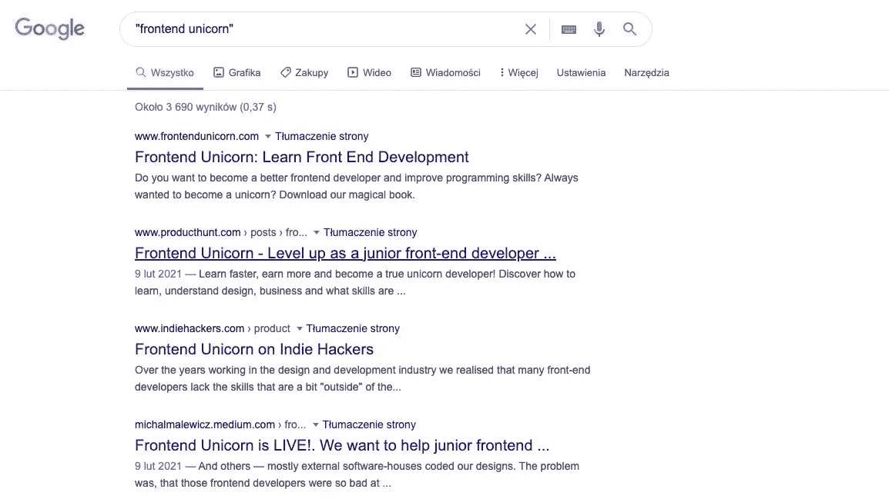
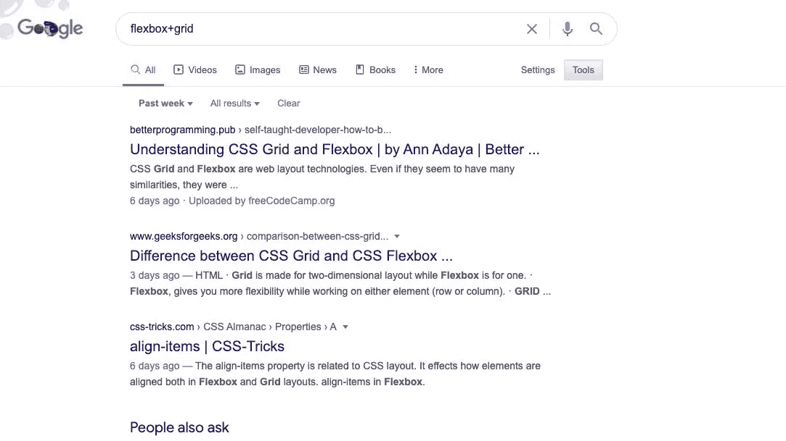
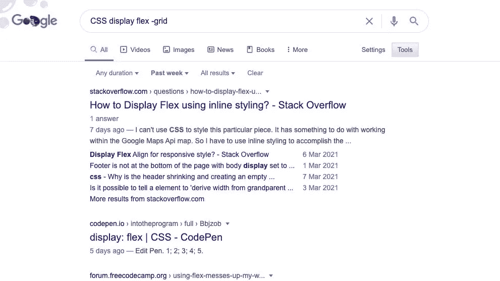
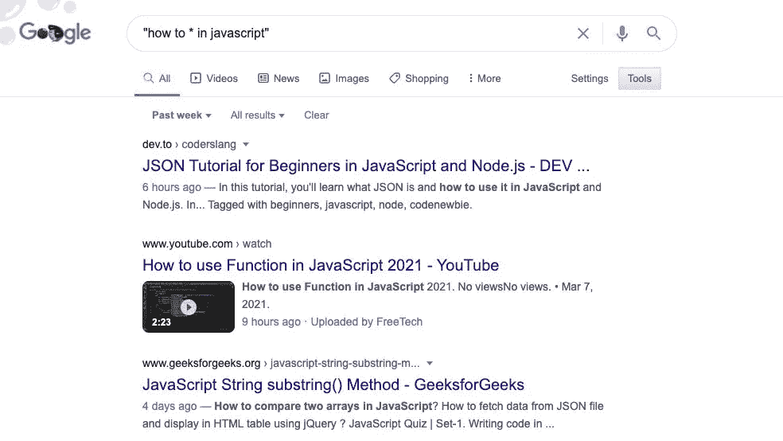
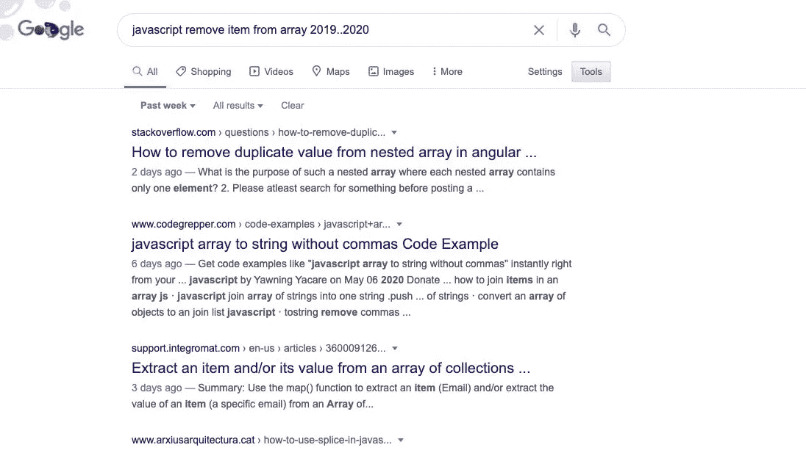
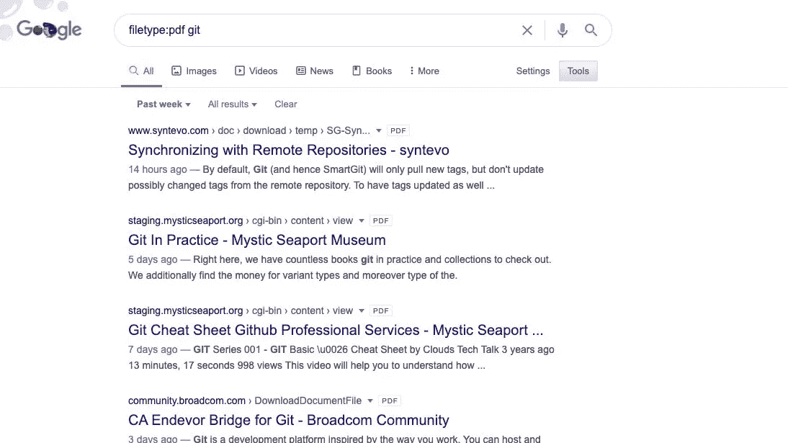

# 知道如何谷歌很重要。你知道怎么做吗？

> 原文：<https://betterprogramming.pub/knowing-how-to-google-is-important-do-you-know-how-to-do-it-68c0659801ba>

## 谷歌是每个开发者最好的朋友。让我们用它来提高生产力

[凯文泽尔](https://unsplash.com/@kai_wenzel?utm_source=medium&utm_medium=referral)在 [Unsplash](https://unsplash.com?utm_source=medium&utm_medium=referral) 上拍照

知道如何谷歌是一个开发者最重要的技能。每个人都使用 Google——初级开发人员、中级开发人员或高级开发人员。谷歌什么都不算出轨！但你真的知道如何高效地谷歌吗？让我给你看一些谷歌黑客。

# 明确短语

通过用引号将短语括起来来搜索显式短语。

# 网站搜索

使用 site:命令将搜索范围缩小到特定站点。例如，键入“site:stackoverflow.com”将只搜索堆栈溢出。

# 多个单词

使用加号搜索多个单词。

# 排除一个词

减号允许你指定不应该出现在结果中的单词。

# 相关词语

波浪号运算符(~)搜索相关单词，而不仅仅是您键入的单词。

# 通配符

星号(*)是通配符。这意味着它可以匹配任何单词！将它与显式搜索结合起来，以获得令人惊叹的结果。

# 时间范围

网上很多回答都过时了。使用时间范围运算符缩小范围。

# 文件类型

将搜索范围缩小到特定的文件类型。如果您使用操作符 filetype:pdf，您将只得到 pdf 结果！

# 高级搜索

你可以在[谷歌高级搜索](https://www.google.com/advanced_search)中结合以上所有方法。

*原载于*[*https://www.albertwalicki.com*](https://www.albertwalicki.com/know-how-to-google-is-important-do-you-know-how-do-it)*。*